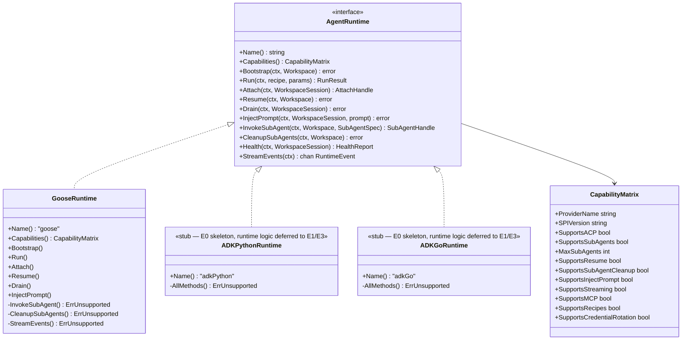
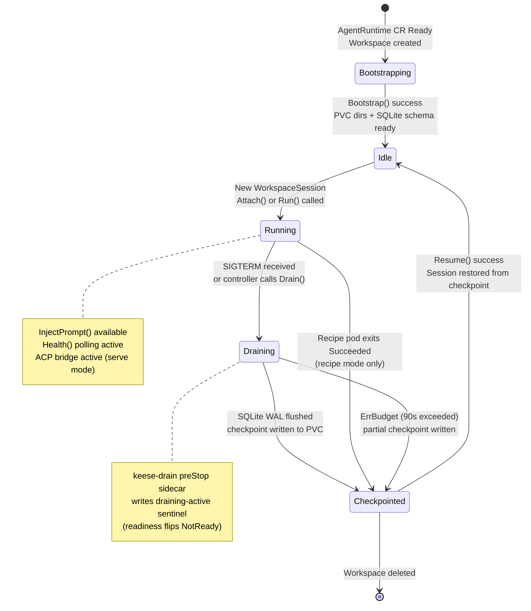

<!-- SPDX-License-Identifier: Apache-2.0 -->
<!-- Copyright (c) 2026 keese-ai -->

# Agent runtimes (SPI)

The `AgentRuntime` CRD is a cluster-scoped catalog entry that binds a named provider implementation to a workspace; the Go SPI defines the lifecycle contract every provider must satisfy.

!!! info "Audience"
    Agent developers integrating a new runtime, and platform operators tuning goose deployment. **Prerequisites:** familiarity with [Workspaces & sessions](workspaces.md) and [Identity & zero-trust](identity-zero-trust.md).

---

## Overview

Keese needs a pluggable runtime surface so different agent frameworks — goose, aider, future ADK-based agents — can all be driven by one operator without per-provider controller forks. The solution is a two-layer design:

1. **`AgentRuntime` CR** — a cluster-scoped Kubernetes object that selects a provider and carries provider-specific configuration (image, migration policy, optional sidecars).
2. **Go SPI** (`internal/runtime/spi/v1alpha1`) — a compile-time interface that every provider implements. Providers register themselves via `init()` at process start; no runtime binary probing or JSON capability emission.

The workspace controller resolves the `AgentRuntime` name, looks up the in-process registry, reads the provider's `CapabilityMatrix`, and then drives the session lifecycle through the SPI methods.

---

## The `AgentRuntime` CRD

`AgentRuntime` is cluster-scoped (`scope=Cluster`). One object per provider configuration — typically one per environment (dev, staging, prod).

```yaml
apiVersion: keese.ai/v1alpha1
kind: AgentRuntime
metadata:
  name: goose-stable
spec:
  implementation:
    # Exactly one of: goose | claudeCode | aider | adkPython | adkGo
    goose:
      image: ghcr.io/keese-ai/goose-runtime@sha256:<digest>
      imageTag: "1.0.5"                  # informational; validated by admission
      migrationPolicy:
        severity: high                   # critical | high | medium | low
        maxDeferral: 6h
      sidecars:
        acpBridge:
          image: ""                      # empty = operator-embedded default digest
status:
  phase: Ready                           # Pending | Ready | Degraded | Incompatible
  provider: goose
  observedGeneration: 3
  conditions:
    - type: Ready
      status: "True"
```

The `spec.implementation` field is a **discriminated one-of** enforced by a CEL `XValidation`: exactly one sub-field must be set. Attempting to set two providers is rejected at admission.

### Lifecycle phases

| Phase | Meaning |
|---|---|
| `Pending` | CR created; controller has not yet reconciled |
| `Ready` | Provider registered and image version validated |
| `Degraded` | Provider registered but at least one condition is unhealthy |
| `Incompatible` | Image tag falls outside `SupportedImageVersions` semver ranges |

### Migration deferral

Running agent pods do not hot-swap mid-session. When `spec.implementation.goose.image` is updated, the controller:

- Immediately applies the new image to **Idle** workspaces on next `Resume`.
- Emits `RuntimeMigrationDeferred` for **Running** workspaces and defers until their next `Drain` + `Resume` cycle.
- Force-drains at the severity cap ceiling and emits `RuntimeMigrationForceDrained`.

Deferral caps (from `ConfigMap keese-system/keese-runtime-migration-defaults`):

| Severity | Default cap | Use case |
|---|---|---|
| `critical` | 1h (hard ceiling) | CVE / security patch |
| `high` | 6h | Breaking bug |
| `medium` | 24h | Feature / regression |
| `low` | 168h | Cosmetic / minor |

A tenant administrator may extend non-critical caps via `Tenant.spec.migrationPolicy.maxDeferralExtension`; `critical` is hard-capped at 1h in the controller.

---

## The Go SPI

All provider implementations satisfy the `AgentRuntime` interface defined in [`internal/runtime/spi/v1alpha1/spi.go`](https://github.com/keese-ai/keese/blob/main/internal/runtime/spi/v1alpha1/spi.go).



### SPI methods

| Method | Budget | Notes |
|---|---|---|
| `Bootstrap` | ≤ 30s | Idempotent; creates keese checkpoint dirs on PVC |
| `Run` | unbounded (recipe) | Executes a bounded recipe inside an already-running pod |
| `Attach` | — | Returns an ACP endpoint for interactive `serve`-mode sessions |
| `Resume` | 60s | Restores session from `Workspace.LastCheckpoint`; returns `ErrAgentUnresponsive` on timeout |
| `Drain` | 90s | SIGTERM-driven SQLite checkpoint; returns `ErrBudget` if exceeded |
| `InjectPrompt` | — | Writes a synthetic user turn to the session FIFO (supervision ladder step 2) |
| `InvokeSubAgent` | — | Spawns a sub-agent; returns `ErrSubAgentLimitExceeded` at cap |
| `CleanupSubAgents` | — | Graceful drain of sub-agents before parent delete |
| `Health` | — | Returns liveness phase (`Idle`/`Running`/`Draining`/`Down`) |
| `StreamEvents` | — | Typed event channel; controller emits `StreamEventsBlocked` if stalled > 5s |

The controller **always checks the `CapabilityMatrix` before calling optional methods** — `ErrUnsupported` is a backstop for the contract, not the primary gating mechanism.

### Sentinel errors

| Error | Meaning |
|---|---|
| `ErrUnsupported` | Method not yet implemented by this provider |
| `ErrAttachUnsupported` | Session is in recipe mode; no attach handle |
| `ErrAgentUnresponsive` | `Resume` timed out after 60s |
| `ErrBudget` | `Drain` exceeded 90s budget |
| `ErrSubAgentLimitExceeded` | `InvokeSubAgent` at the per-provider cap |
| `ErrPermanent` | Retry budget exhausted (typically from `Bootstrap`) |
| `ErrTransient` | Retryable failure; controller will backoff and retry |

---

## Session lifecycle



### Two operating modes

`Workspace.spec.runtimeMode` is **immutable after creation**. A mode switch requires a new `Workspace` with `spec.resumeFrom` pointing to the prior checkpoint.

| Mode | Goose command | Session ends when | `Drain` | `Health` |
|---|---|---|---|---|
| `recipe` | `goose run --recipe <pvc-path>` | Pod exits `Succeeded` | no-op | polls `status` file on PVC |
| `serve` | `goose serve --stdio` | Controller calls `Drain()` | flush + close ACP | polls `/tmp/health` sentinel |

`InjectPrompt` is `serve`-mode only.

---

## The goose provider

Goose is the only fully-implemented provider. Its capability matrix is declared at compile time in [`internal/runtime/providers/goose/goose.go`](https://github.com/keese-ai/keese/blob/main/internal/runtime/providers/goose/goose.go):

| Capability | Value | Notes |
|---|---|---|
| `SupportsACP` | `true` | ACP stdio bridge in interactive `serve` mode |
| `SupportsRecipes` | `true` | `goose run --recipe` in recipe mode |
| `SupportsMCP` | `true` | MCP tool routing via Envoy AI Gateway |
| `SupportsResume` | `true` | SQLite checkpoint + restore within 60s budget |
| `SupportsInjectPrompt` | `true` | FIFO-based synthetic user turn injection |
| `SupportsSubAgents` | `false` | Deferred — see TD-P3-05 epic |
| `SupportsSubAgentCleanup` | `false` | Deferred — see TD-P3-05 epic |
| `SupportsStreaming` | `false` | Deferred |
| `SupportsCredentialRotation` | `false` | Deferred |

!!! warning "Sub-agents and streaming are not yet implemented"
    `InvokeSubAgent`, `CleanupSubAgents`, and `StreamEvents` all return `ErrUnsupported` in the current goose provider. The `SupportsSubAgents` and `SupportsStreaming` capability flags are `false`. These methods are deferred to the TD-P3-05 epic.

### Interactive pod topology (`serve` mode)

When `Workspace.spec.interactive: true`, the workspace controller injects two containers into the session pod:

- **`agent`** — runs `goose serve --stdio`, exposes ACP on the Unix socket `/var/run/keese/acp/goose.sock`.
- **`keese-acp-bridge`** — ACP frame multiplexer; bridges the socket to the external client. Image is independently versioned and overridable via `AgentRuntime.spec.implementation.goose.sidecars.acpBridge.image`.

Both containers share an `emptyDir` volume at `/var/run/keese/acp`. The bridge drains on SIGTERM and exits 0 when goose exits.

For non-interactive (recipe/workflow) sessions only the `agent` container is present — no bridge, no shared IPC.

### Drain implementation

On `Drain(ctx, session)` the goose provider executes these steps inside the agent container via `PodExecutor.Exec`:

1. Touch `/tmp/draining` — the kubelet liveness probe sees this and flips readiness to `NotReady`, stopping new traffic.
2. `kill -TERM 1` — SIGTERM to the goose process group; goose handles this natively and checkpoints its SQLite WAL.
3. Poll `sessions.db` mtime until stable (≤ drain budget − 5s).
4. Copy `sessions.db` + WAL + SHM to the keese-owned checkpoint dir at `/var/run/keese/session/keese-checkpoints/<workspace-uid>/`.

If any step exceeds the 90s wall-clock budget, `ErrBudget` is returned and the kubelet proceeds with SIGKILL. The checkpoint from step 4 (even if partial) is left on the PVC for `Resume` to validate.

### Resume implementation

`Resume(ctx, workspace)` restores from `Workspace.LastCheckpoint.SQLiteRef` within a 60s budget. It validates the SQLite file is non-empty (`test -s`), then copies it back into goose's expected sessions directory so a fresh container picks it up on start. An empty `LastCheckpoint.SQLiteRef` means a fresh session — no restore needed.

### InjectPrompt

`InjectPrompt` writes a synthetic user turn to the named FIFO at `/var/run/keese/session/home/.local/state/goose/inject-fifo` via `PodExecutor.Exec`. The prompt is sanitised (embedded newlines collapsed to spaces) and written with a 5s timeout to avoid blocking when goose is not yet reading the FIFO. This implements step 2 of the supervision ladder (design 23).

---

## The `keese-drain` preStop sidecar

[`cmd/keese-drain/main.go`](https://github.com/keese-ai/keese/blob/main/cmd/keese-drain/main.go) is a small binary bundled into the goose runtime image. The kubelet invokes it via the agent container's `preStop` lifecycle hook:

```yaml
lifecycle:
  preStop:
    exec:
      command: [/usr/local/bin/keese-drain, --pvc-root=/var/run/keese/session, --timeout=25s]
```

On invocation it:

1. Installs a `SIGTERM` handler (rule 06-signal-handling §1) and wraps the drain in an absolute timeout context.
2. Writes the `draining-active` sentinel at `<pvc-root>/draining-active` (readiness flip).
3. Atomically writes a JSON checkpoint marker to `<pvc-root>/sessions/<workspace-uid>/draining`.
4. Logs a structured `{"event":"shutdown","reason":"preStop","drain_duration_ms":...,"checkpoint_location":"..."}` to stdout.

The binary exits 0 unconditionally — the kubelet ignores `preStop` exit codes and proceeds with SIGTERM to all containers regardless. The actual SQLite WAL checkpoint is delegated to the goose process (it handles SIGTERM natively). The workspace session ID is read from the `KEESE_SESSION_ID` environment variable.

!!! note "preStop vs. manager-driven Drain"
    `keese-drain` is the kubelet-side path: it fires before the pod receives SIGTERM and handles the checkpoint marker. The SPI `Drain()` method is the controller-driven path: it fires when the workspace controller explicitly decides to drain a session (e.g., before migration or workspace deletion). Both paths converge on the same PVC checkpoint location.

---

## ADK Python and ADK Go providers

The `AgentRuntimeImplementation` one-of includes `adkPython` and `adkGo` sub-fields with full `ADKPythonSpec` / `ADKGoSpec` type definitions in the API.

!!! warning "Planned — not yet implemented"
    Both ADK Python and ADK Go providers are **E0 stubs**. Provider packages exist at `internal/runtime/providers/adkpython/` and `internal/runtime/providers/adkgo/` (added in commit 9373db9), but every SPI method returns `ErrUnsupported`. There is no pod-template or runtime logic yet.

    Additionally, the `AgentRuntime` controller's `detectProvider` function does not yet handle `adkPython` or `adkGo`. Selecting either provider drives the `AgentRuntime` CR to a permanent `Degraded` phase immediately. Do not use these providers in any environment until the TD-P3-05 epic lands (E1/E3).

The `ClaudeCode` and `Aider` types are also present in the API (`ClaudeCodeSpec`, `AiderSpec`) but are stubs with no sub-fields.

---

## Provider registry

Providers register themselves at process start via `init()`:

```go
// internal/runtime/providers/goose/register.go
func init() {
    spi.Register("goose", capabilities, Factory)
}
```

`cmd/operator/main.go` blank-imports each built-in provider to trigger `init()`:

```go
import _ "github.com/keese-ai/keese/internal/runtime/providers/goose"
```

No runtime binary probe, no `<binary> capabilities` JSON emission. The registry is populated before the controller manager starts its reconcile loops. Adding a new provider requires: implementing the `AgentRuntime` interface, declaring a `CapabilityMatrix`, registering via `init()`, and adding the blank import to `cmd/operator/main.go`.

**SPI versioning policy:** a new required method triggers a major package bump (`spi/v2alpha1`); a new optional method (gated by a capability flag) is a minor semver bump. `apidiff` is enforced in CI to prevent silent interface breakage.

---

## Security

Agent runtime pods operate under strict zero-trust constraints (rule 05):

- **No kubeconfig** — agent pods never mount a Kubernetes API kubeconfig.
- **No upstream API keys** — Anthropic keys, database DSNs, and similar credentials never appear in agent pod env vars or mounted files.
- **Identity = projected SA token** with audience `keese-egress-<tenant>` and TTL ≤ 10m.
- **Fail-closed egress** — NetworkPolicy allows only outbound traffic to the Envoy AI Gateway service on port 443.
- **`readOnlyRootFilesystem: true`** on all agent containers; writes go to the session PVC.
- **Images pinned by digest** in production CSVs; cosign keyless-OIDC signatures on OLM bundle images are verified at `InstallPlan` admission by `keese-cosign-webhook` (not at pod scheduling time).

See [Identity & zero-trust](identity-zero-trust.md) and [Egress & the AI Gateway](egress-ai-gateway.md) for details.

---

## Observability

The controller emits structured Kubernetes events from a finite const table in `internal/controller/runtime/agentruntime/events.go`:

| Event reason | Trigger |
|---|---|
| `RuntimeStarted` | Provider session pod became Running |
| `RuntimeStopped` | Drain completed, pod deleted |
| `SubAgentCleanupTimeout` | `CleanupSubAgents` returned `ErrTransient`; fell back to pod-delete-by-label |
| `ProviderUnknown` | `detectProvider` returned an unregistered name |
| `ImageVersionUnsupported` | Image tag outside `SupportedImageVersions` semver range |
| `CredentialExpired` | Projected SA token neared expiry |
| `RuntimeMigrationDeferred` | Image update deferred for a Running workspace |
| `RuntimeMigrationForceDrained` | Deferral ceiling reached; force drain initiated |

OTEL spans are emitted per `Bootstrap`, `Drain`, `Resume`, and `CleanupSubAgents`, carrying attributes `provider.name`, `workspace.name`, `tenant.name`, and `session.id`. See [Token budgets & observability](observability.md).

---

## Next steps

- [Workspaces & sessions](workspaces.md) — how the workspace controller resolves and drives an `AgentRuntime`
- [Egress & the AI Gateway](egress-ai-gateway.md) — how agent pods reach upstream model APIs without holding credentials
- [Recipes](recipes.md) — structured, re-runnable work units executed by the goose `Run()` SPI path
- [Process lifecycle & supervision](lifecycle-supervision.md) — SIGTERM drain, SIGKILL idempotency, and the supervision ladder
