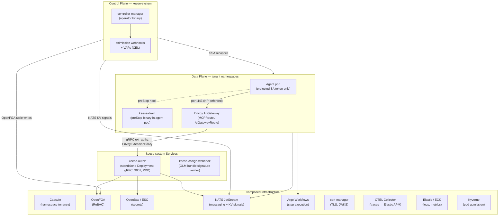
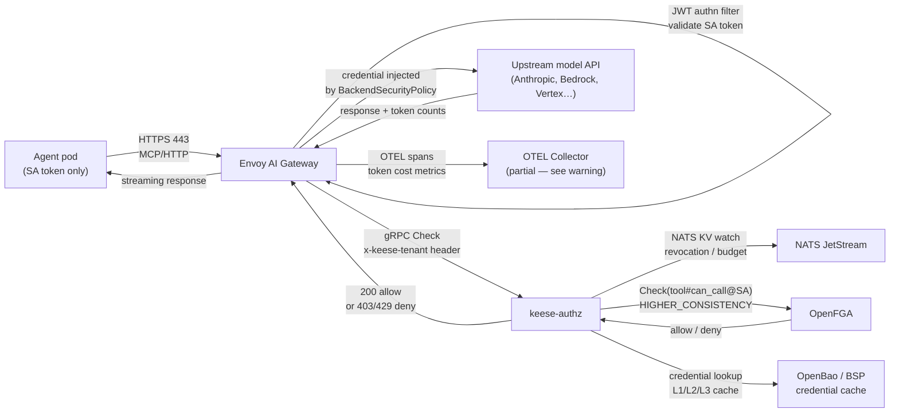

<!-- SPDX-License-Identifier: Apache-2.0 -->
<!-- Copyright (c) 2026 keese-ai -->

# Architecture overview

keese is a Kubernetes operator that runs AI agents securely inside your cluster — every agent
call is authorized, every credential stays server-side, and every egress path is audited.

!!! info "Audience"
    All roles — platform engineers, application developers, and security reviewers.
    **Prerequisites:** Familiarity with Kubernetes controllers and namespaces. No prior keese
    experience required.

---

## System layers

keese is built from three cooperating layers: a **control plane** that reconciles the desired
state declared in CRDs, a **data plane** that handles live agent traffic, and a set of
**composed infrastructure** components that keese wires together but does not run itself.

---

## Control plane

### controller-manager

The `controller-manager` binary (`cmd/main.go`) runs all 18 reconcilers inside a single
`controller-runtime` manager. It holds the leader-election lease, starts admission webhooks,
and registers health endpoints on `:8081`. On SIGTERM it drains the reconcile queue, releases
the lease, and flushes OTEL exporters within a 60-second grace period — sized as
lease-release (5 s) + queue drain (30 s) + OTEL flush (15 s) + buffer (10 s) = 60 s, leaving
headroom above the liveness probe window.

**API groups and CRD kinds implemented:**

| Group | Kinds |
|---|---|
| `keese.ai/v1alpha1` | `AgentRuntime`, `Memory`, `SharedMemory`, `Recipe`, `RecipeSource`, `RuntimeExtension`, `Tenant`, `Transport`, `Workflow`, `WorkflowRun`, `Workspace`, `WorkspaceSession`, `WorkspaceShare` |
| `authz.keese.ai/v1alpha1` | `CrossTenantAgreement`, `GuardrailBinding`, `OIDCProvider`, `ToolBinding`, `WorkspaceTool` |
| `policy.keese.ai/v1alpha1` | `FeatureGate`, `TokenBudget` |

All kinds are `v1alpha1`. Every CRD carries a `status` subresource, `observedGeneration`,
printer columns (`Age`, `Ready`, `Phase`, plus domain columns), and is written by
reconcilers using Server-Side Apply with a typed field owner — for example
`keese-workspace-controller` for workspace resources.

### Admission webhooks and VAPs

Static invariants are enforced by `ValidatingAdmissionPolicy` (CEL, K8s 1.30 GA).
Webhooks handle the cases CEL cannot cover — cross-resource lookups and dynamic
external checks. Examples:

- Workspace quota must not exceed the tenant ceiling (CEL `XValidation` on CRD).
- The `keese.ai/tenant` namespace label is immutable after first set (controller-side enforcement, design 01).
- `dedicatedGateway` toggle is blocked while the Tenant phase is `Ready` or `Degraded`
  (CEL `XValidation` on CRD, design 05a).
- Force-revoke on a workspace checks `can_revoke` in OpenFGA before the patch is persisted
  (admission webhook, design 04a).

### Ancillary binaries

| Binary | Purpose |
|---|---|
| `keese-authz` | Standalone gRPC ext_authz service; runs as a Deployment in `keese-system` (1 replica dev; 3 prod). Wired to Envoy via `EnvoyExtensionPolicy`. |
| `keese-drain` | SIGTERM drain helper for agent runtimes |
| `keese-cosign-webhook` | Admission webhook; verifies Sigstore cosign keyless-OIDC signatures on OLM bundle images at `InstallPlan`/`ClusterServiceVersion` admission (gated by `cosign-installplan-verify` / `cosign-installplan-failclosed`) |
| `keese-wf-launcher` | Launcher stub for Argo Workflow step pods |

---

## Data plane

### Agent pods

An agent pod carries exactly one credential: a Kubernetes projected ServiceAccount token
with audience `keese-egress-<tenant>` and TTL ≤ 10 minutes. It holds no API keys,
no kubeconfig, no upstream secrets. All state that must survive a pod restart is written
to a workspace PVC (SQLite session state) or to NATS JetStream.

Each workspace namespace receives two `NetworkPolicy` objects applied by the Workspace
controller via SSA:

- **NP-1** — fail-closed default-deny for all ingress and egress.
- **NP-2** — explicit egress allow to the Envoy AI Gateway (port 443), NATS JetStream
  (port 4222), and kube-dns (port 53). No CIDR blocks; selectors name exact services.

!!! warning "CNI enforcement required"
    `NetworkPolicy` enforcement requires a CNI plugin that supports it (Calico, Cilium).
    `kindnet` (the default kind CNI) does not enforce NetworkPolicy. The keese CI matrix
    uses Calico on kind; isolation tests are skipped under kindnet.

### Envoy AI Gateway

The real Envoy AI Gateway proxy Deployment runs in `envoy-gateway-system` (minimum 2
replicas, HPA on token cost) — this is the namespace the Workspace controller's
egress `NetworkPolicy` targets via `namespaceSelector: kubernetes.io/metadata.name:
envoy-gateway-system` and `podSelector: app.kubernetes.io/managed-by: envoy-gateway`
(see `internal/controller/keese/workspace_controller.go`). A `keese-system`-local
`envoy-ai-gateway` Service name is used for in-cluster DNS resolution by agent pods,
but the proxy pods themselves live in `envoy-gateway-system`.
Tenants can opt into a dedicated gateway instance via `Tenant.spec.dedicatedGateway:
true`, which gives them an independent failure domain, per-tenant rate limits, and
per-tenant metrics.

The gateway is the only egress path from agent pods. It provides:

- **JWT authn filter** — validates the agent's SA token, extracts the `keese-egress-<tenant>`
  audience, and projects it to dynamic metadata and the `x-keese-tenant` header.
- **`ext_authz` filter** — calls `keese-authz` over gRPC before forwarding any request.
- **`MCPRoute` / `AIGatewayRoute`** — routes requests to upstream model backends after
  authorization succeeds.
- **Token-cost rate limiting** — `BackendTrafficPolicy` enforces short-window token-rate
  limits (per-second / per-minute). Long-window budget enforcement comes from
  `TokenBudget` CRs via NATS KV signals.

### keese-authz

`keese-authz` is the credential trust boundary. Three replicas run in `keese-system`
in production (one in dev) under a PDB (`minAvailable: 2`). On every agent request it performs a 7-step decision in
under 50 ms (p99):

1. Read the JWT `aud` claim from Envoy dynamic metadata → stamp `x-keese-tenant`.
2. Derive the OpenFGA subject `user:ksa-<workspace-uid>`.
3. Check NATS KV `keese-revocation-version/workspace/<uid>` for active revocations. *(designed; not yet wired — see [`concepts/identity-zero-trust.md`](identity-zero-trust.md))*
4. Check NATS KV `keese-budget-exceeded/workspace/<uid>`; set `x-keese-budget-exceeded`
   on match (Envoy converts this to HTTP 429). *(gateway-side KV reader not yet implemented — see [`concepts/observability.md`](observability.md))*
5. Call OpenFGA `Check(tool:<name>#can_call@<subject>)` at `HIGHER_CONSISTENCY` (≤ 50 ms p99).
6. Look up the `BackendSecurityPolicy` and inject the upstream credential from the
   three-tier credential cache (L1 per-request, L2 per-pod, L3 NATS KV opt-in).
7. Return 200 (allow) or 403 (deny); timeout or OpenFGA unreachable → 403 (fail-closed).

---

## Composed infrastructure

keese does not implement the following components — it installs and wires them via Helmfile
and Kustomize overlays.

| Component | Role in keese |
|---|---|
| **Capsule** | Namespace-level multi-tenancy (Mode B). Provides tenant quota, LimitRange, and RBAC projections across namespaces. Mode A (single namespace) does not require Capsule. |
| **OpenFGA** | ReBAC authorization store. keese reconcilers write tuples; `keese-authz` issues `Check` calls. The `Tenant`, `Workspace`, `Tool`, `Memory`, and `Credential` types plus their relations are defined in `dev/bootstrap/openfga/model.fga`. |
| **OpenBao / ESO** | Source of truth for upstream API keys. ExternalSecrets Operator bridges OpenBao secrets to Kubernetes Secrets referenced by `BackendSecurityPolicy`. Secrets mount as projected files; `envFrom.secretRef` is forbidden on keese-managed pods. |
| **NATS JetStream** | Dual role: (1) messaging transport for agent-to-agent communication and Workflow step coordination; (2) KV bucket carrier for revocation signals (`keese-revocation-version`) and budget-exceeded signals (`keese-budget-exceeded`). |
| **Argo Workflows** | Executes `WorkflowRun` step graphs. Argo step pods run inside the Workspace namespace and inherit workspace NetworkPolicies automatically. |
| **cert-manager** | Issues TLS certificates for webhooks, JWKS endpoints, and internal services. |
| **Kyverno** | Enforces agent-specific pod admission rules that Pod Security Standards cannot cover: deny `hostNetwork/PID/IPC`, require `readOnlyRootFilesystem` for agent pods, require the `keese.ai/workspace` label. |
| **OTEL Collector → Elastic APM / ECK** | Receives traces and metrics from the operator, `keese-authz`, and agent runtimes. Fans out to Elastic APM (traces) and ECK-managed Elasticsearch (logs, metrics). |

!!! warning "Observability pipeline is partial"
    The OTEL Collector is currently disabled in the local bootstrap (Helmfile `enabled: false`
    in `dev/bootstrap/values/`). Traces and metrics are emitted by the operator and
    `keese-authz` but are not collected in a local development cluster. Enable the
    collector manually or wait for a later bootstrap iteration. See
    [`guides/observability-setup.md`](../guides/observability-setup.md) for instructions.

---

## Request lifecycle

The following diagram traces a single agent tool call from the agent pod to an upstream
model API and back.

---

## Tenancy model

A **Tenant** is an organizational identity backed by the `keese.ai/v1alpha1/Tenant` CRD.
It does not map 1:1 to a namespace. A tenant owns one or more namespaces; a **Workspace**
is a CR living inside any tenant-owned namespace.

Two deployment modes coexist:

- **Mode A** (single namespace) — no Capsule required. Tenant membership expressed by the
  `keese.ai/tenant=<name>` label on the namespace (immutable after first set, enforced by the Tenant controller).
- **Mode B** (multi-namespace) — Capsule present. The `capsule.clastix.io/tenant` label
  links namespaces into the Capsule Tenant tree; keese's Tenant CR reads
  `status.namespaces[]` via label selector.

The operator detects the mode at startup via `--capsule-integration=auto|on|off`.

---

## Security invariants

The threat model assumes an agent pod may be compromised. The key invariants are:

1. **No upstream credentials in agent pods** — keys live in OpenBao; the gateway injects
   them via `BackendSecurityPolicy` after authorization succeeds.
2. **Fail-closed egress** — `failure_mode_allow: false` on the ext_authz filter; OpenFGA
   unreachable → 403, not 200.
3. **No wildcard NetworkPolicies** — every egress allow names an exact service via
   `namespaceSelector + podSelector` conjunction.
4. **No kubeconfig in agent pods** — only the projected SA token.
5. **ReBAC on every tool call** — `Check(tool:<name>#can_call@<subject>)` at
   `HIGHER_CONSISTENCY` with a ≤ 50 ms p99 budget.

See [`concepts/identity-zero-trust.md`](identity-zero-trust.md) for the full threat model
and [`concepts/egress-ai-gateway.md`](egress-ai-gateway.md) for gateway topology detail.

---

## Next steps

- [`concepts/identity-zero-trust.md`](identity-zero-trust.md) — projected SA token identity,
  OIDC trust, and revocation.
- [`concepts/egress-ai-gateway.md`](egress-ai-gateway.md) — gateway topology, rate limiting,
  and dedicated vs shared modes.
- [`concepts/authorization-rebac.md`](authorization-rebac.md) — OpenFGA model, tuple shapes,
  and check semantics.
- [`getting-started/install-kind.md`](../getting-started/install-kind.md) — stand up keese
  locally in under 20 minutes.
