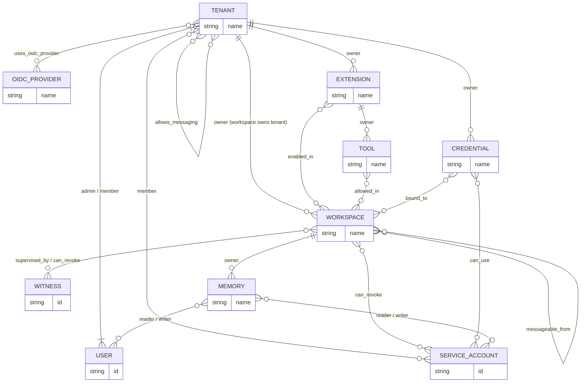
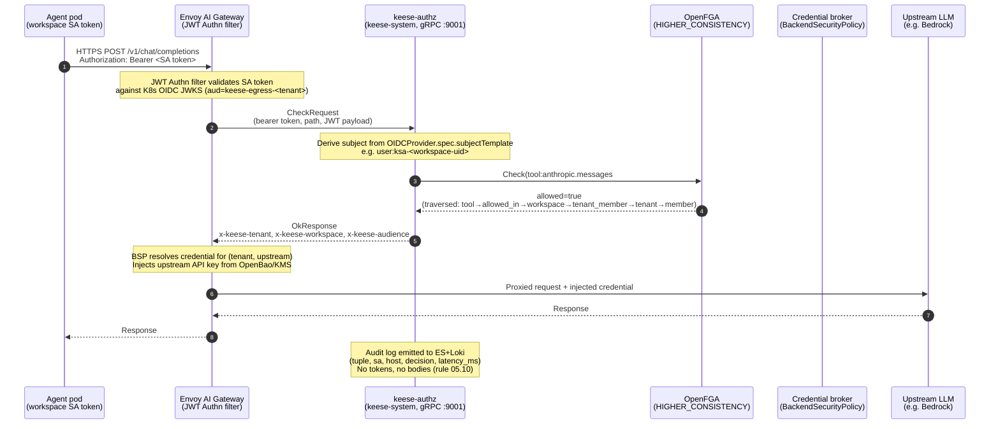

<!-- SPDX-License-Identifier: Apache-2.0 -->
<!-- Copyright (c) 2026 keese-ai -->

# Authorization (ReBAC / OpenFGA)

Every agent tool call in keese is authorized at the Envoy AI Gateway by an OpenFGA `Check` — before any credential reaches the agent pod.

!!! info "Audience"
    Platform operators and security engineers who need to understand how keese authorizes agent egress. **Prerequisites:** [Identity & zero-trust](./identity-zero-trust.md) · [Egress & the AI Gateway](./egress-ai-gateway.md)

---

## Why ReBAC over RBAC

Kubernetes RBAC answers "can this ServiceAccount call this Kubernetes API verb on this resource kind?"
That question space is too coarse for agent workloads:

- A single namespace may host dozens of workspaces belonging to different tenants sharing one cluster.
- Whether a tool is callable depends on the combination of *who the agent is*, *which workspace it runs in*, *which tenant owns that workspace*, and *which tools that workspace's GuardrailBinding exposes*.
- Cross-tenant messaging adds directional bilateral grants that RBAC has no primitive to express.

Relationship-Based Access Control (ReBAC) lets you model those multi-hop relationships directly and answer them in a single `Check` call. keese uses [OpenFGA](https://openfga.dev/) as its ReBAC engine. The full authorization model DSL lives at [`dev/bootstrap/openfga/model.fga`](https://github.com/keese-ai/keese/blob/main/dev/bootstrap/openfga/model.fga) and is described in [design 04a](https://github.com/keese-ai/keese/blob/main/docs/designs/04a-openfga-authz-model.md).

---

## The OpenFGA type graph

OpenFGA represents authorization as a directed graph of **types** (entities) connected by **relations** (edges). A `Check` query walks this graph from the subject to the object.



### Types and their keese counterparts

| OpenFGA type | keese entity | CRD / primitive |
|---|---|---|
| `tenant` | Tenant isolation boundary | `keese.ai/v1alpha1/Tenant` (name-stable key, not UID) |
| `workspace` | Agent execution scope | `keese.ai/v1alpha1/Workspace` |
| `extension` | RuntimeExtension provider | `keese.ai/v1alpha1/RuntimeExtension` |
| `tool` | Callable function exposed to an agent | ConfigMap-backed `ToolAllowList` via GuardrailBinding |
| `credential` | BackendSecurityPolicy-referenced secret | OpenBao / KMS via ExternalSecrets |
| `memory` | Memory / SharedMemory backend | `keese.ai/v1alpha1/{Memory,SharedMemory}` |
| `service_account` | Per-workspace projected SA | Kubernetes `ServiceAccount` |
| `user` | Human operator or CI identity | OIDC identity |
| `witness` | Supervision agent | Agent-supervision controller (design 23) |
| `oidc_provider` | OIDCProvider CR | `authz.keese.ai/v1alpha1/OIDCProvider` (cluster-scoped) |

---

## Key relations and computed logic

### `tool#can_call` — the critical 4–5-hop relation

The most important authz decision is whether an agent's ServiceAccount can call a given tool. Rather than writing one tuple per workspace member, the model uses a computed relation:

```
tool:X#can_call@SA
  ← tenant_member from allowed_in
      ← workspace:W#tenant_member (= member from owner)
          ← tenant:T#member@SA
```

In plain English: a ServiceAccount can call tool `X` if:

1. Tool `X` is `allowed_in` workspace `W` (written by the Workspace controller), and
2. The SA is a `member` of the tenant that `owns` workspace `W` (written by the Workspace controller).

This resolves in one `Check` call with `HIGHER_CONSISTENCY`, traversing 4–5 hops, at a p99 budget of ≤ 50 ms.

### `workspace#tenant_member` — computed propagation

`tenant_member = member from owner` propagates tenant membership down to every workspace automatically. No per-workspace member tuple needed, eliminating tuple explosion as workspaces scale.

### `workspace#can_revoke` — automation-only

The `can_revoke` relation is granted only to `witness` and `service_account` subjects, never to `user:*`. Human operators suspend workspaces via `Workspace.spec.suspended`; automated revocation flows through the supervision controller and the operator's install Job.

### Cross-tenant messaging (`allows_messaging` + `messageable_from`)

Cross-tenant agent-to-agent (a2a) messaging requires two relations:

- `tenant:T_to#allows_messaging@tenant:T_from` — directional bilateral grant written by the CrossTenantAgreement controller after both sides approve.
- `workspace:W_to#messageable_from@workspace:W_from` — workspace-pair grant expanded as the cartesian product of the agreement's `from.workspaceSelector × to.workspaceSelector`.

Intra-tenant a2a is implicit — NATS topic existence within `keese.tenant.<tenant-uid>.wf.<workflow-run-uid>.*` is the authorization; no OpenFGA tuple needed.

### Per-tenant OIDC provider gating

`tenant:T#uses_oidc_provider@oidc_provider:P` is written by the Tenant controller for each entry in `Tenant.spec.oidc.allowedProviders[]`. The `keese-authz` ext_authz service checks this before validating tokens from any issuer, so tokens from an unlisted OIDC provider are denied even if they are otherwise valid JWTs.

---

## Tuple writers — controller responsibilities

Every field that affects authorization in a CRD carries a `// +keese:rebac-tuple=<relation>` marker. Absence blocks merge (enforced by `scripts/check-rebac-markers.sh`). The table below maps each tuple shape to the controller that writes it:

| Tuple | Written by | Trigger |
|---|---|---|
| `tenant:T#admin@user:U` | Tenant controller | spec.adminSubjects[] reconciled |
| `tenant:T#member@service_account:SA` | Workspace controller | Workspace created |
| `workspace:W#owner@tenant:T` | Workspace controller | Workspace created |
| `workspace:W#editor@user:U` | Workspace controller | Editor role granted |
| `workspace:W#viewer@user:U` | Workspace controller | Viewer role granted |
| `workspace:W#supervised_by@witness:WIT` | Supervision controller | Witness dispatched |
| `workspace:W#can_revoke@service_account:keese-supervisor` | Operator install Job | Per workspace |
| `workspace:W#can_revoke@witness:WIT` | Supervision controller | Witness assigned |
| `tool:X#allowed_in@workspace:W` | Workspace controller | spec.egress.allowedTools[] reconciled |
| `extension:E#owner@tenant:T` | RuntimeExtension controller | RuntimeExtension created |
| `extension:E#enabled_in@workspace:W` | RuntimeExtension controller | Extension enabled |
| `credential:C#bound_to@workspace:W` | Credential broker reconciler | BSP bound |
| `memory:M#reader@service_account:SA` | Memory controller | SharedMemory read grant |
| `memory:M#writer@service_account:SA` | Memory controller | SharedMemory write grant |
| `tenant:T_to#allows_messaging@tenant:T_from` | CrossTenantAgreement controller | CRA reaches phase Approved |
| `workspace:W_to#messageable_from@workspace:W_from` | CrossTenantAgreement controller | Per from×to workspace pair on Approved |
| `tenant:T#uses_oidc_provider@oidc_provider:P` | Tenant controller | Per entry in `Tenant.spec.oidc.allowedProviders[]` |

The Go client wrapping the OpenFGA SDK is at [`internal/rebac/client.go`](https://github.com/keese-ai/keese/blob/main/internal/rebac/client.go). It exposes `Write`, `Delete`, `Read`, and `Check` with idempotent semantics — `Write` is a no-op if the tuple already exists; `Delete` is a no-op if it is absent.

---

## An authorization decision end to end

The following sequence traces a single LLM tool call from an agent pod through to the upstream model provider, showing every authorization step.



### Decision latency tiers

| Check type | Hops | Consistency | p99 budget |
|---|---|---|---|
| `tool#can_call` (LLM/MCP egress) | 4–5 | `HIGHER_CONSISTENCY` | ≤ 50 ms |
| `credential#can_use` | 2 | `HIGHER_CONSISTENCY` | ≤ 25 ms |
| `workspace#messageable_from` (cross-tenant NATS) | 2 | `HIGHER_CONSISTENCY` | ≤ 25 ms |
| `workspace#can_revoke` (force-revoke admission) | 1 | `HIGHER_CONSISTENCY` | ≤ 15 ms |

---

## Fail-closed guarantees

OpenFGA is in the critical path for every agent egress request. The system is designed fail-closed at every failure mode:

| Failure | Behavior |
|---|---|
| OpenFGA unreachable | Envoy returns 503; `failure_mode_allow: false` on the ext_authz filter |
| Check error | Treated as deny; `AuthzCheckFailed` event emitted; alert fires at rate > 1% |
| Check timeout (> 50% / 2 min) | Circuit breaker opens; all requests denied; `AuthzCircuitOpen` event |
| NATS KV watch lost | Falls back to direct Check per request; `AuthzKVWatchDegraded` event |
| OpenFGA + NATS both down | Deny all; `AuthzFullyDegraded`; immediate page |
| Stale tuple | `HIGHER_CONSISTENCY` mitigates; converges in ≤ 3 reconciles |

!!! danger "No break-glass for production authz failures"
    The only break-glass mechanism is labeling a namespace `keese.ai/break-glass=true`, which requires admission webhook approval and emits a `UnsafeAnnotationAllowed` event. There is no way to bypass OpenFGA for a production tenant without leaving a logged, auditable trail.

---

## Model versioning

The authorization model in `model.fga` is versioned. Rolling a new model version without a window of mixed-model behavior requires a 6-step drain-and-rollout:

1. **Stage** — seed Job applies new `model.fga`; returns new model ID without updating the ConfigMap.
2. **Enter `MODEL_MIGRATION`** — cluster-wide flag blocks new `WorkflowRun` creation.
3. **Drain** — operator polls until in-flight runs reach zero (default 10-min timeout).
4. **Atomic swap** — PATCH `keese-rebac-config` ConfigMap with the new model ID; controllers re-cache in ≤ 1 s.
5. **Readiness gate** — operator polls all controller and ext_authz pods for `status.observedModelID`; blocks until 100% report the new ID.
6. **Exit `MODEL_MIGRATION`** — clear flag; workflow scheduling resumes.

!!! warning "Planned — not yet implemented"
    The `MODEL_MIGRATION` controller (`internal/controller/rebac/modelmigration_controller.go`) and the `status.observedModelID` field on controller Deployments are scaffolded but not yet fully implemented. Manual drain-and-swap via ConfigMap patch is currently the operational procedure. See design 04a for the full runbook.

---

## Observability

Every `ext_authz` decision emits an audit log record to Elasticsearch (`keese-openfga-audit-*`, 30-day ILM) and Loki (`{job="keese-authz", tenant="<T>"}`, ≥ 1-year retention). Per rule 05.10, records contain **no token bytes and no request or response bodies**:

```
{ "tuple": "tool:anthropic.messages#can_call@user:ksa-abc123",
  "sa": "ws-abc123", "host": "bedrock.us-east-1.amazonaws.com",
  "decision": "allow", "upstream_status": 200,
  "latency_ms": 22, "model_id": "01HWXYZ..." }
```

Key Prometheus metrics:

- `keese_rebac_check_duration_seconds{check_type, consistency, result}`
- `keese_rebac_check_errors_total{check_type}`
- `keese_rebac_tuple_writes_total{type, relation}`
- `keese_extauthz_budget_429_total{tenant, workspace, budget_key}`

OTEL span: `keese.rebac.check`.

---

## See also

- [Identity & zero-trust](./identity-zero-trust.md) — how SA tokens are minted and rotated
- [Egress & the AI Gateway](./egress-ai-gateway.md) — how ext_authz plugs into Envoy
- [Credential broker](./credential-broker.md) — what happens after a Check allows the request
- [Cross-tenant collaboration](./cross-tenant.md) — the CrossTenantAgreement workflow that writes `allows_messaging` tuples
