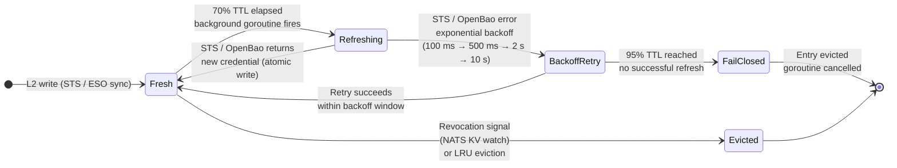

<!-- SPDX-License-Identifier: Apache-2.0 -->
<!-- Copyright (c) 2026 keese-ai -->

# Credential broker

The credential broker is the runtime component that swaps an agent pod's short-lived Kubernetes ServiceAccount token for an upstream API credential at the Envoy AI Gateway — so the agent pod itself never holds a secret.

!!! info "Audience"
    Platform operators and security engineers configuring egress to upstream AI providers. · **Prerequisites:** [Identity & zero-trust](identity-zero-trust.md) · [Egress & the AI Gateway](egress-ai-gateway.md)

## The core guarantee

Agent pods in keese carry exactly one credential: a [projected ServiceAccount token](https://kubernetes.io/docs/tasks/configure-pod-container/configure-service-account/#serviceaccount-token-projection) with audience `keese-egress-<tenant>` and TTL ≤ 10 minutes. That token is **not** an upstream API key. It is an identity assertion that the Envoy AI Gateway uses to fetch the real upstream credential on the agent's behalf.

The credential swap happens inside the `keese-authz` standalone Deployment (`keese-system`, 3 replicas in prod, reachable at `keese-authz.keese-system.svc:9001`). The agent pod never sees the Anthropic key, the AWS STS credentials, or any other upstream secret. This is enforced by:

- `NetworkPolicy` — agents can reach only the gateway on port 443.
- Admission control — `envFrom.secretRef` and `env.valueFrom.secretKeyRef` are rejected on all keese-managed pods.
- `BackendSecurityPolicy` — the Envoy AI Gateway resource that names the credential source and injects it before forwarding to the upstream.

---

## How the swap works

The following sequence covers the happy path for an agent request that reaches an upstream AI provider.

```mermaid
sequenceDiagram
    autonumber
    participant Agent as Agent pod<br/>(SA token only)
    participant Gateway as Envoy AI Gateway<br/>+ keese-authz (gRPC :9001)
    participant OpenFGA as OpenFGA<br/>(authz check)
    participant Broker as Credential broker<br/>(L1/L2/L3 cache)
    participant STS as Cloud STS / OpenBao<br/>(AWS · GCP · Azure · vault)
    participant Upstream as Upstream API<br/>(Anthropic · Bedrock · Vertex…)

    Agent->>Gateway: HTTPS request<br/>Authorization: Bearer <SA token>
    Gateway->>Gateway: Verify SA token (OIDC)<br/>Extract tenant-audience
    Gateway->>OpenFGA: Check tool#can_call + credential#can_use
    OpenFGA-->>Gateway: allow
    Gateway->>Broker: Resolve credential for<br/>(tenant-audience, upstream-role)
    alt L1 hit (same request context)
        Broker-->>Gateway: credential (in-process)
    else L2 hit (per-pod cache)
        Broker-->>Gateway: cached credential
    else L2 miss — cold path
        Broker->>STS: AssumeRoleWithWebIdentity /<br/>WIF exchange / OpenBao JWT
        STS-->>Broker: upstream credential + TTL
        Broker->>Broker: Write L2; spawn refresh goroutine
        Broker-->>Gateway: credential
    end
    Gateway->>Upstream: HTTPS request<br/>Authorization: <upstream credential>
    Upstream-->>Gateway: response
    Gateway-->>Agent: response (credential stripped)
```

Step 6 is the credential broker cache lookup. The gateway pod never forwards the upstream credential to the agent: the response is returned as-is after the upstream call completes.

---

## Credential source types

The `BackendSecurityPolicy` (BSP) names the credential type. Three families are supported:

| Type | BSP stanza | Upstream examples |
|---|---|---|
| Static API key | `spec.apiKey.secretRef` | Anthropic, OpenAI, non-OIDC SaaS |
| OIDC-STS exchange | `spec.oidc` / `spec.gcpOidc` / `spec.azureOidc` | AWS Bedrock, GCP Vertex AI, Azure OpenAI |
| Dynamic vault credential | vault-agent sidecar on gateway pod (file-based plugin) | PostgreSQL DSNs, Jira basic auth |

### Static API keys

Static keys are stored in OpenBao at `kv/keese/tenants/<tenant>/credentials/<provider>/<key-name>`. The ExternalSecrets Operator (ESO) bridges them to a Kubernetes Secret in the `keese-credentials` namespace, refreshed every 5 minutes. A `ReferenceGrant` allows the BSP in `keese-system` to reference that Secret.

```yaml
apiVersion: external-secrets.io/v1beta1
kind: ExternalSecret
metadata:
  name: keese-cred-acme-corp-anthropic
  namespace: keese-credentials
spec:
  refreshInterval: 5m
  secretStoreRef:
    name: keese-openbao
    kind: ClusterSecretStore
  target:
    name: keese-cred-acme-corp-anthropic
    creationPolicy: Owner
  data:
    - secretKey: apiKey
      remoteRef:
        key: kv/keese/tenants/acme-corp/credentials/anthropic/primary
        property: api_key
---
apiVersion: aigateway.envoyproxy.io/v1alpha1
kind: BackendSecurityPolicy
metadata:
  name: bsp-acme-corp-anthropic
  namespace: keese-system
spec:
  targetRef:
    group: aigateway.envoyproxy.io
    kind: AIGatewayRoute
    name: anthropic-route
  apiKey:
    secretRef:
      namespace: keese-credentials
      name: keese-cred-acme-corp-anthropic
      key: apiKey
```

If the `ReferenceGrant` is absent, the BSP transitions to `Ready=False` with a `MissingReferenceGrant` event.

### OIDC-STS exchange (AWS Bedrock)

No Kubernetes Secret is needed. The gateway calls `sts:AssumeRoleWithWebIdentity` using the agent's SA token. The IAM trust policy on the role constrains both the audience (`keese-egress-<tenant>`) and the exact `sub` claim for the workspace ServiceAccount.

```yaml
apiVersion: aigateway.envoyproxy.io/v1alpha1
kind: BackendSecurityPolicy
metadata:
  name: bsp-acme-corp-bedrock
  namespace: keese-system
spec:
  targetRef:
    group: aigateway.envoyproxy.io
    kind: AIGatewayRoute
    name: bedrock-route
  oidc:
    providerUrl: https://kubernetes.default.svc.cluster.local
    roleArn: arn:aws:iam::123456789012:role/keese-acme-corp-bedrock
    tokenExchangeServiceAccounts:
      - namespace: acme-corp-ws-research
        name: keese-ws-research-abc123
```

GCP Workload Identity Federation and Azure Entra federated credentials follow the same pattern with `spec.gcpOidc` and `spec.azureOidc` respectively. See the [BSP examples](https://github.com/keese-ai/keese/blob/main/docs/designs/05b-ii-bsp-examples.md) in the design docs for full YAML.

### BSP precedence (workspace → tenant → cluster)

When multiple BSPs could apply, the broker resolves in this order:

1. **Exact workspace match** — `Workspace.spec.backendPolicyRefs[]` referencing a BSP for the upstream host.
2. **Tenant default** — BSPs referenced by `Tenant.spec.credentialPoolRef`.
3. **Cluster default** — operator-managed BSPs in `keese-system`; requires namespace annotation `keese.ai/allow-cluster-credential=true`.
4. **No match → 403** — `ext_authz` returns `{"error":"NoBackendCredential","upstream":"<host>"}`. There is no implicit allow without a BSP.

---

## The credential cache

Every `keese-authz` pod runs an in-process cache. The cache has three tiers:

| Tier | Scope | Cache key | Purpose |
|---|---|---|---|
| L1 per-request | In-process request context | `(tenant, workspace, upstream)` | Deduplicates STS calls within one logical request |
| L2 per-pod | In-process map (protected by `sync.RWMutex`) | `(tenant-audience, upstream-role)` | Primary; avoids per-request STS round-trip |
| L3 distributed | NATS KV bucket `keese-credential-cache` | `(tenant, upstream-role, version)` | Pool `least-used` counter coordination — opt-in only |

L3 is enabled per tenant via `Tenant.spec.credentialBroker.sharedCache: true`. It is required only for `least-used` pool selection. `round-robin` and `spillover` need no cross-pod coordination and work with independent L2 caches.

**L2 resource ceiling:** 10,000 entries per pod (configurable via `Tenant.spec.credentialBroker.maxEntriesPerPod`). LRU eviction past the ceiling. A cold pod rebuild from live STS/vault on the first request per entry; no warm-up is required.

---

## Cache TTL and rotation

Every L2 entry has a TTL derived from the upstream credential's expiry (STS session expiry for OIDC exchanges; ESO `refreshInterval` for static keys). The broker drives state transitions through that TTL.



**Key thresholds:**

| TTL consumed | State | Action |
|---|---|---|
| 0% – 70% | `Fresh` | Serve from L2; no STS call |
| 70% | `Refreshing` | Background goroutine fires; atomic credential write on success |
| 70% – 95% (backoff) | `BackoffRetry` | Exponential backoff: 100 ms / 500 ms / 2 s / 10 s |
| 95% | `FailClosed` | Entry marked fail-closed; next request → HTTP 401 `X-Keese-Cred-Expired: true` |

The fail-closed threshold is intentional — a stale credential served past its valid window could succeed on the upstream but no longer represents a current authz decision.

### Rotation drain guarantee

When ESO rotates a static key (or a new STS session is issued), in-flight requests complete using the old credential. The broker enforces:

```
oldest_cred_usable_until = max(remaining_old_TTL, 0.70 × new_TTL)
```

Example: old credential has 120 s remaining; new credential TTL is 3600 s → `max(120, 2520) = 2520 s`. The old credential must not be revoked before this window elapses. No request is dropped across a rotation.

If both the old TTL and the refresh window expire without a successful rotation, Envoy returns 401 with `x-keese-rotation-expired: true` and the BSP reconciler emits a `CredentialRotationStale` event.

### Goroutine budget

One background goroutine runs per unique `(tenant-audience, upstream-role)` L2 entry:

- Warn at 800 goroutines/pod → metric `keese_broker_refresh_goroutine_high_water`.
- Hard cap at 1,000/pod. Above the cap: skip proactive refresh; credential refreshes on next request instead.
- Entry eviction cancels the goroutine via context cancel.

---

## Revocation

When a workspace is revoked (the OpenFGA tuple is removed), the controller bumps a NATS KV key: `keese-revocation-version/workspace/<uid>`. Every `keese-authz` pod watches this key. On a watch event:

1. Sidecar atomically removes all L2 entries whose `(tenant, workspace, upstream)` matches.
2. If a refresh goroutine is mid-flight, it checks the revocation flag before writing; it aborts if set, so the new credential is never written.
3. The next request to the gateway hits OpenFGA → tuple is gone → deny → 403.

**SLO:** revocation propagates to all gateway pods within p95 ≤ 60 seconds (governed by design [04c](https://github.com/keese-ai/keese/blob/main/docs/designs/04c-token-revocation.md)).

**Emergency flush:** annotate a BSP with `keese.ai/flush-all-credentials=<epoch-ms>` to force eviction of all L2 entries for that BSP without a full pod restart.

---

## Credential pooling

A single BSP can reference multiple credentials using a pool. This is useful for rate limit distribution or failover.

```yaml
spec:
  pool:
    selection: spillover   # round-robin | least-used | spillover
    members:
      - apiKey:
          secretRef:
            namespace: keese-credentials
            name: keese-cred-acme-corp-anthropic-1
            key: apiKey
      - apiKey:
          secretRef:
            namespace: keese-credentials
            name: keese-cred-acme-corp-anthropic-2
            key: apiKey
```

Pool member state transitions:

- `active → cooling` on a 429 response from the upstream (`min(Retry-After header, 60 s)`, default 30 s).
- `cooling → active` when the cooling period elapses.
- `active → exhausted` on 3 consecutive 5xx responses. Reset via `kubectl annotate bsp/<name> keese.ai/reset-pool-member=<index>`.
- All members cooling → fail-closed 429 to the agent with event `PoolExhausted`.

`least-used` selection requires L3 NATS KV (opt-in). `round-robin` and `spillover` work with per-pod L2 only.

---

## Observability

### Metrics

| Metric | Type | Description |
|---|---|---|
| `keese_broker_credential_expired_seconds_remaining{tenant,upstream}` | Gauge | Time until fail-closed threshold; alert at < 5% TTL in prod namespaces |
| `keese_broker_vault_errors_total{tenant,upstream}` | Counter | OpenBao / vault-agent fetch failures |
| `keese_broker_revocation_flush_total{tenant}` | Counter | L2 entries flushed by revocation |
| `keese_broker_l2_eviction_total{reason}` | Counter | L2 evictions by reason (`rotation`, `lru`, `revocation`) |
| `keese_broker_pool_exhausted_total{tenant,bsp}` | Counter | Pool exhaustion events |
| `keese_broker_refresh_goroutine_high_water` | Gauge | Per-pod goroutine count; alert at 800 |
| `keese_bsp_exchange_total{tenant,provider,result}` | Counter | BSP credential exchanges by result |

### Events

Events are planned for the `BackendSecurityPolicy` CR once the credential broker reconciler ships. The credential broker is not yet implemented (`internal/controller/egress/` does not exist on `main`); see [design 17 — Credential broker](https://github.com/keese-ai/keese/blob/main/docs/designs/17-credential-broker.md) for the full specification. The planned event reasons are:

`VaultUnreachable` · `SecretStale` · `STSTimeout` · `STSAuthFailed` · `STSServerError` · `WIFExchangeFailed` · `EntraExchangeFailed` · `CredentialRevoked` · `CredentialExpiringFailClosed` · `PoolMemberCooling` · `PoolExhausted`

### OTEL spans

Every L2 cache miss emits an OTEL span `keese.broker.exchange` with fields:

```
tenant, upstream_role, exchange_type (sts|gcp_wif|azure_entra|static|openbao),
result (ok|timeout|auth_failed|server_error), cache_tier (l1|l2|miss)
```

Audit logs record `{tenant_audience, upstream_role, decision, ttl_remaining_seconds, exchange_type, cache_tier}`. Token bytes and request/response bodies are never logged (rule 05.10).

---

## Failure reference

| Failure | Broker action | Signal |
|---|---|---|
| OpenBao unreachable at refresh | Serve L2 past 70%; exponential backoff; fail-closed past 95% | `VaultUnreachable`; `keese_broker_vault_errors_total` |
| K8s Secret stale (ESO lag) | Serve current L2; `SecretStale` event after 5 min | `keese_broker_secret_staleness_seconds{tenant}` |
| AWS STS timeout | Retry 3× jittered (100 ms / 500 ms / 2 s); fail-closed on final | `STSTimeout` event |
| AWS STS 4xx (expired SA token) | Fetch fresh projected SA token from kubelet API; retry once | `STSAuthFailed` event |
| AWS STS / GCP WIF / Azure 5xx | Transient; backoff; mark `Degraded` after 3 consecutive | `STSServerError` / `WIFExchangeFailed` / `EntraExchangeFailed` |
| API key rotated (ESO event) | Drop L2 entry on Secret informer event; debounced refresh | `keese_broker_l2_eviction_total{reason=rotation}` |
| Revocation NATS KV push | Atomic flush of matching L2 entries | `CredentialRevoked`; `keese_broker_revocation_flush_total` |
| Revocation arrives mid-refresh | Goroutine aborts write if revocation flag set | Logged at `warn`; L2 entry never written |
| Pool member 429 | Mark member `cooling`; select next in `spillover` mode | `PoolMemberCooling`; `keese_broker_pool_cooling_count` |
| All pool members cooling | Fail-closed 429 to agent | `PoolExhausted`; `keese_broker_pool_exhausted_total` |
| No BSP match | ext_authz 403 `NoBackendCredential` | No upstream call made |
| Missing `ReferenceGrant` | BSP `Ready=False` | `MissingReferenceGrant` event |

!!! warning "Planned — not yet implemented"
    The `goroutine-drain-test.sh` and `revocation-slo-test.sh` scripts (referenced in the design) have not yet been authored. The envtest fixtures in `internal/broker/cache_test.go` and `internal/broker/revocation_test.go` and the kuttl end-to-end suite in `test/e2e/credential-broker/` are planned but not yet present on `main`.

!!! danger "OpenBao design is a stub"
    Design [11 — Secrets & pluggable vault](https://github.com/keese-ai/keese/blob/main/docs/designs/11-secrets-pluggable-vault.md) is still a stub. The OpenBao path structure (`kv/keese/tenants/…`) and the ESO bridge are referenced by this design but the implementation is not yet complete. Do not rely on OpenBao-backed static keys in production until design 11 reaches `status: current`.

---

## See also

- [Egress & the AI Gateway](egress-ai-gateway.md) — how keese-authz fits into the egress request path
- [Identity & zero-trust](identity-zero-trust.md) — projected SA tokens and the zero-trust agent identity model
- [Authorization (ReBAC / OpenFGA)](authorization-rebac.md) — the `credential#can_use` tuple that governs broker decisions
- [guides/egress-credentials.md](../guides/egress-credentials.md) — step-by-step guide: configure a `BackendSecurityPolicy` for your tenant
