<!-- SPDX-License-Identifier: Apache-2.0 -->
<!-- Copyright (c) 2026 keese-ai -->

# Cross-tenant collaboration

`CrossTenantAgreement` is the cluster-scoped CRD that gates all cross-tenant agent-to-agent (A2A) messaging behind a bilateral, cryptographically-attested approval handshake.

!!! info "Audience"
    Tenant administrators who need to authorize two tenants to exchange agent messages.
    **Prerequisites:** [Tenancy & namespaces](tenancy.md) · [Authorization (ReBAC / OpenFGA)](authorization-rebac.md) · [Transports & messaging](transports.md)

---

## Why bilateral approval?

A workspace is keese's security boundary.  A single-tenant administrator granting access
to their own tenant's workspaces is not sufficient to open a cross-tenant channel — the
receiving tenant must also consent.  This mirrors TLS mutual authentication: both sides
must present a valid credential before traffic flows.

`CrossTenantAgreement` (CRA) enforces this invariant at the control plane.  No
`tenant.allows_messaging` or `workspace.messageable_from` OpenFGA tuple is ever written
until both tenant admins have independently approved the same CRA object.  Until those
tuples exist, the Envoy AI Gateway and NATS bridge reject every cross-tenant message
attempt, fail-closed.

---

## The CrossTenantAgreement resource

`CrossTenantAgreement` lives in `authz.keese.ai/v1alpha1` and is **cluster-scoped**
(short name: `cra`).

```bash
kubectl get cra
# NAME              AGE   READY   PHASE     FROM       TO
# alpha-beta-link   3d    True    Approved  tenant-a   tenant-b
```

### Key spec fields

| Field | Type | Notes |
|---|---|---|
| `spec.from.tenantRef.name` | string | Originating tenant. **Immutable after create.** |
| `spec.to.tenantRef.name` | string | Destination tenant. **Immutable after create.** |
| `spec.from.workspaceSelector` | LabelSelector | Which workspaces on the from-side are covered. Optional; nil matches all. |
| `spec.to.workspaceSelector` | LabelSelector | Same for the to-side. |
| `spec.scope.natsSubjects` | []string | NATS subject patterns. Each **must** start with `keese.cta.`. Maximum 50. |
| `spec.scope.a2aRoles` | []string | `reader`, `writer`, or `bidirectional`. |
| `spec.expiresAt` | RFC3339 | Must be in the future on create. Immutable once set. Omit for no expiry. |

```yaml
apiVersion: authz.keese.ai/v1alpha1
kind: CrossTenantAgreement
metadata:
  name: alpha-beta-link
spec:
  from:
    tenantRef:
      name: tenant-alpha
    workspaceSelector:
      matchLabels:
        keese.ai/tier: shared
  to:
    tenantRef:
      name: tenant-beta
  scope:
    natsSubjects:
      - "keese.cta.alpha-beta-link.events.>"
    a2aRoles:
      - bidirectional
  expiresAt: "2027-01-01T00:00:00Z"
```

---

## Phases

A CRA moves through a strict finite-state machine.  Once it reaches `Rejected` or
`Expired`, the object is terminal and immutable — no tuple is ever re-written from a
terminal CRA.  To re-establish a channel, create a new CRA object.

```mermaid
stateDiagram-v2
    [*] --> Pending : object created

    Pending --> Approved : both tenant approvals valid<br/>+ expiresAt > now

    Pending --> Rejected : either admin annotates<br/>cra-reject=true<br/>OR conflict detected

    Pending --> Expired : expiresAt crossed<br/>before second approval

    Approved --> Expired : expiresAt crossed;<br/>controller deletes tuples

    Rejected --> [*] : terminal
    Expired --> [*]  : terminal
```



`status.conditions` carries a `Ready` condition that mirrors the phase: `True` only when
`Approved`.

---

## Bilateral approval handshake

The approval protocol is annotation-driven.  Each tenant admin writes
`keese.ai/cra-approve=true` on the CRA object independently.  The admission webhook
(backed by OpenFGA) verifies the annotator holds `tenant.can_approve_cra` before the
write lands; the controller then records the approval in `status.approvals[]`.

Three supporting annotations carry the identity and signature; a fourth selects the verification scheme:

| Annotation | Purpose |
|---|---|
| `keese.ai/cra-approving-tenant` | Name of the tenant on whose behalf approval is given |
| `keese.ai/cra-approver` | OIDC email or ServiceAccount identity |
| `keese.ai/cra-signature` | Scheme-dependent: `oidc-keyless` — cosign OIDC signature over `(cra-uid ‖ tenant-uid ‖ expiresAt)`; `sa-token` — hex-encoded `HMAC-SHA256(secret, audience)` where `secret` is `keese-cra-hmac[secret]` in `keese-system` and `audience` is `keese-egress-<tenant>` |
| `keese.ai/cra-signature-type` | `oidc-keyless` (human) or `sa-token` (CI / automation) |

```mermaid
sequenceDiagram
    actor AdminA as Tenant-Alpha Admin
    actor AdminB as Tenant-Beta Admin
    participant API as kube-apiserver
    participant Wh  as Admission Webhook
    participant FGA as OpenFGA
    participant Ctrl as CRA Controller
    participant NATS as NATS JetStream

    AdminA->>API: kubectl create crosstenanagreement alpha-beta-link
    API->>Ctrl: reconcile (Pending, no approvals)
    Ctrl-->>API: status.phase = Pending

    Note over AdminA: Tenant-Alpha approves first
    AdminA->>API: kubectl annotate cra/alpha-beta-link<br/>keese.ai/cra-approve=true<br/>keese.ai/cra-approving-tenant=tenant-alpha<br/>keese.ai/cra-approver=admin@alpha<br/>keese.ai/cra-signature=<sig><br/>keese.ai/cra-signature-type=oidc-keyless
    API->>Wh: AdmissionRequest (UPDATE)
    Wh->>FGA: Check tenant:tenant-alpha#can_approve_cra@admin@alpha
    FGA-->>Wh: Allow
    Wh-->>API: Admit
    API->>Ctrl: reconcile
    Ctrl->>Ctrl: validateApprovalAnnotation → verify sig (SA-token or cosign)
    Ctrl->>API: remove approval annotations (spec patch)
    Ctrl->>API: append approval to status.approvals[] (status patch)
    Ctrl-->>API: status.approvals = [tenant-alpha]

    Note over AdminB: Tenant-Beta approves second
    AdminB->>API: kubectl annotate cra/alpha-beta-link<br/>keese.ai/cra-approve=true<br/>keese.ai/cra-approving-tenant=tenant-beta<br/>keese.ai/cra-approver=admin@beta<br/>keese.ai/cra-signature=<sig><br/>keese.ai/cra-signature-type=oidc-keyless
    API->>Wh: AdmissionRequest (UPDATE)
    Wh->>FGA: Check tenant:tenant-beta#can_approve_cra@admin@beta
    FGA-->>Wh: Allow
    Wh-->>API: Admit
    API->>Ctrl: reconcile (both approvals present)
    Ctrl->>Ctrl: resolveWorkspaces (freeze snapshot — TOFU)
    Ctrl->>FGA: Write tenant.allows_messaging tuple
    Ctrl->>FGA: Write workspace.messageable_from tuples (cartesian product)
    Ctrl->>API: status.phase = Approved; status.workspaceSnapshot frozen
    Ctrl->>NATS: (Workflow controller provisions keese-cta-<uid> stream at first use)
    Ctrl-->>API: emit CRAApproved event
```

### Signature schemes

| Approver type | Scheme | Details |
|---|---|---|
| Human (OIDC-authed) | `oidc-keyless` | cosign keyless OIDC signature; OIDC token from `UserInfo.extra` used as identity binding |
| CI / automation (ServiceAccount) | `sa-token` | SHA-256 HMAC over the approval audience string, keyed by the shared cluster Secret `keese-cra-hmac` (key `"secret"`) in `keese-system`, hex-encoded, constant-time compared (`tag = HMAC-SHA256(secret, audience)`) |

### Rejection

Either tenant admin can reject a CRA at any time while it is in `Pending`:

```bash
kubectl annotate crosstenanagreement alpha-beta-link keese.ai/cra-reject=true
```

The webhook validates `can_approve_cra` permission in the same way as approval.  The
controller transitions to `Rejected` and, if the CRA was already `Approved`, deletes
all synced tuples before releasing the NATS finalizer.

---

## What the controller writes (ReBAC tuples)

At the `Pending → Approved` transition the controller writes two tuple shapes into
OpenFGA (via SSA, `fieldOwner=keese-crosstenanagreement-controller`):

| Tuple | Written when | Deleted when |
|---|---|---|
| `tenant:T_to#allows_messaging@tenant:T_from` | Both approvals valid | Rejected, Expired, or CRA deleted |
| `workspace:W_to#messageable_from@workspace:W_from` (per frozen pair) | Tuples above written; snapshot populated | Same as above |

These tuples are what the Envoy AI Gateway ext_authz filter checks before forwarding a
cross-tenant message.  No tuple → fail-closed rejection.

ReBAC markers in the source:
[`api/authz/v1alpha1/crosstenanagreement_types.go`](https://github.com/keese-ai/keese/blob/main/api/authz/v1alpha1/crosstenanagreement_types.go)

---

## Workspace snapshot (TOFU semantics)

When the CRA transitions to `Approved`, the controller enumerates workspaces on both
sides that match their respective `workspaceSelector`, then freezes the **cartesian
product** in `status.workspaceSnapshot[]`.  This is a Trust-On-First-Use (TOFU) snapshot.

!!! warning "Workspace snapshot is not yet computed from real Workspace CRs"
    `resolveWorkspaces` currently returns a synthetic placeholder name (`ws-<tenantName>`)
    because real `Workspace` CR listing is blocked by an import cycle between controller
    packages.  The snapshot and tuple logic is wired correctly, but the workspace set
    will not reflect actual Workspace CRs until the import cycle is resolved.
    Track progress in
    [`internal/controller/authz/crosstenanagreement_controller.go:478`](https://github.com/keese-ai/keese/blob/main/internal/controller/authz/crosstenanagreement_controller.go#L478).

**New workspaces do not inherit an existing CRA automatically.**  On each reconcile of an
`Approved` CRA, the controller compares the current selector results to the frozen
snapshot.  If they diverge, it emits a `WorkspaceSnapshotDrift` warning event and does
nothing else.  Humans must create a new CRA to extend coverage.

```bash
# Inspect the frozen snapshot
kubectl get cra alpha-beta-link -o jsonpath='{.status.workspaceSnapshot}'
```

---

## NATS subjects and streams

Cross-tenant NATS messaging uses a dedicated stream per CRA:

- **Stream name:** `keese-cta-<cra-uid>` (owner-referenced to the CRA)
- **Subjects:** patterns from `spec.scope.natsSubjects`; every entry must start with `keese.cta.`
- **Provisioned by:** the Workflow controller at first `transportRef` use
- **Cleaned up by:** the NATS finalizer (`finalizers.crosstenanagreement.keese.ai/nats`)
  — when the CRA is deleted the controller calls `DeleteStream` before removing the
  finalizer

```yaml
spec:
  scope:
    natsSubjects:
      - "keese.cta.alpha-beta-link.>"   # covers all sub-subjects for this CRA
    a2aRoles:
      - reader
      - writer
```

!!! danger "Stream provisioning is planned, not automatic on CRA creation"
    The NATS JetStream stream for a CRA is provisioned lazily by the Workflow controller
    on the first cross-tenant `transportRef` use, not at CRA creation time.  If a
    `Transport` referencing a CRA subject is used before the stream exists, the subscribe
    call will fail with a `StreamNotFound` error.

---

## Expiry

`spec.expiresAt` is immutable once set.  When the deadline crosses:

1. The controller deletes all `workspace.messageable_from` and `tenant.allows_messaging`
   tuples listed in `status.workspaceSnapshot`.
2. On tuple-delete failure the controller emits `TupleSyncFailed` and retries with
   exponential back-off (1 s → 2 s → … → 5 min).  The phase stays `Approved` until the
   delete fully succeeds — tuples are never silently dropped.
3. Once tuples are gone the NATS finalizer is released and `status.phase` becomes
   `Expired`.

To renew a collaboration after expiry, create a new CRA object.  The expired object is
retained for audit purposes; delete it manually when no longer needed.

---

## Conflict detection

Only one `Approved` CRA may cover a given `(from-tenant, to-tenant)` workspace pair at
a time.  The controller maintains an in-memory index keyed by
`"<from-tenant>/<to-tenant>"`.  A new CRA that would overlap an existing `Approved` CRA
on the same tenant pair is transitioned to `Rejected` immediately, with a `CRAConflict`
event on both objects.

---

## Failure modes quick reference

| # | Failure | Outcome |
|---|---|---|
| 1 | Only one tenant approves before `expiresAt` | CRA transitions to `Expired`; no tuples written |
| 2 | Approval signature invalid | Webhook rejects; `CRAApprovalInvalid` event; phase stays `Pending` |
| 3 | OpenFGA unavailable during tuple sync | `TupleSyncFailed` event; exponential retry; phase stays `Pending` |
| 4 | Controller crash mid-tuple-write | On restart the controller re-drives the snapshot; idempotent upsert |
| 5 | Conflict with existing Approved CRA | New CRA transitions to `Rejected`; `CRAConflict` event |
| 6 | Tenant deleted while CRA Approved | Tenant finalizer blocks deletion; controller first transitions CRA to `Rejected` + deletes tuples |
| 7 | Expired-CRA tuple delete fails | Phase stays `Approved` past deadline; retry backoff; manual `fga delete` + reconcile |

Full 10-row table: design doc
[`docs/designs/25-iii-approval-flow.md`](https://github.com/keese-ai/keese/blob/main/docs/designs/25-iii-approval-flow.md).

---

## Observability

| Signal | Name |
|---|---|
| OTEL span — approval phase | `keese.cta.approve` |
| OTEL span — tuple sync | `keese.cta.sync` |
| OTEL span — expiry | `keese.cta.expire` |
| Metric — phase gauge | `keese_cta_phase_total{phase}` |
| Metric — time from creation to second approval | `keese_cta_approval_latency_seconds` |
| Metric — time to sync tuples | `keese_cta_tuple_sync_duration_seconds` |
| Event reason — both approved | `CRAApproved` |
| Event reason — expired | `CRAExpired` |
| Event reason — tuple sync failure | `TupleSyncFailed` |
| Event reason — snapshot drift | `WorkspaceSnapshotDrift` |

---

## See also

- [Tenancy & namespaces](tenancy.md) — how tenant namespaces are isolated before a CRA is needed
- [Authorization (ReBAC / OpenFGA)](authorization-rebac.md) — the tuple model that CRAs write into
- [Transports & messaging](transports.md) — NATS JetStream and how cross-tenant subjects are consumed
- [guides/cross-tenant-agreements.md](../guides/cross-tenant-agreements.md) — step-by-step guide to creating and approving a CRA
