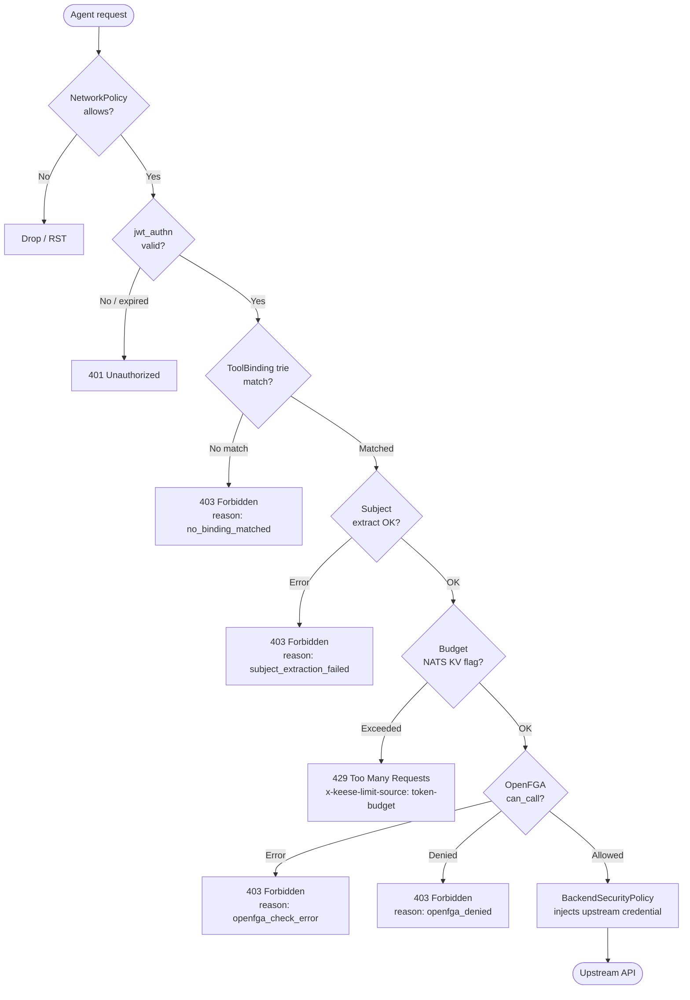

<!-- SPDX-License-Identifier: Apache-2.0 -->
<!-- Copyright (c) 2026 keese-ai -->

# Egress & the AI Gateway

Every outbound call an agent pod makes — to Anthropic, OpenAI, an MCP server, or any
internal API — flows through a single in-cluster Envoy AI Gateway on port 443, and is
authorized by the `keese-authz` ext_authz service before reaching the upstream.

!!! info "Audience"
    Platform operators and tenant administrators configuring egress for agent workloads.
    **Prerequisites:** [Concepts in 5 minutes](../getting-started/concepts-in-5-minutes.md) ·
    [Identity & zero-trust](identity-zero-trust.md) · [Authorization (ReBAC / OpenFGA)](authorization-rebac.md)

---

## Why a single gateway

Agent pods carry **no upstream API keys** (rule 05.2). Their sole credential is a
projected ServiceAccount (SA) token with audience `keese-egress-<tenant>` and a
≤ 10-minute TTL. The gateway is where that token is exchanged for a real upstream
credential via `BackendSecurityPolicy`. This design enforces three invariants
simultaneously:

| Invariant | Mechanism |
|---|---|
| No direct internet egress | `NetworkPolicy` — fail-closed deny-all; only egress to the gateway `Service` on 443 is allowed |
| No credentials in agent pods | Credential swap at the gateway via `BackendSecurityPolicy` (design 17) |
| Every call is authorized | Envoy ext_authz filter — `failure_mode_allow: false` (fail-closed) |

---

## Deployment topology

### Shared gateway (default)

One `keese-authz` Deployment in `keese-system`, **3 replicas**, PDB `minAvailable: 2`,
HPA at CPU 60 %. The Envoy AI Gateway Deployment (also in `keese-system`) points every
tenant's traffic at the shared `keese-authz.keese-system.svc.cluster.local:9001`
cluster endpoint via the `keese_ext_authz_v1` cluster name.

Failure domain: if the shared ext_authz falls below quorum, **all tenant egress is
blocked**. That is the correct behavior — fail-closed beats fail-open for an authorization
service. PDB + HPA mitigate the risk.

### Dedicated gateway (opt-in)

When `Tenant.spec.dedicatedGateway: true`, the Tenant controller provisions a
per-tenant `keese-authz-<tenant>` Deployment in the tenant namespace (minimum 2
replicas, separate PDB). Failure domain shrinks to a single tenant. Use this for
PII/PHI workloads or when per-tenant Prometheus metrics isolation is required.

!!! warning "Controller gate on toggle"
    Toggling `dedicatedGateway` while a tenant is `Ready` or `Provisioning` is rejected
    by the Tenant controller (CEL `XValidation` on the CRD). Drain procedure: suspend
    all workspaces → wait for `status.phase: Pending` → toggle → resume. See the runbook
    placeholder in `docs/plans/runbook-dedicated-gateway-toggle.md`.

---

## The trust split: Envoy vs keese-authz

The authorization pipeline is deliberately split across two components with distinct
responsibilities.

```mermaid
sequenceDiagram
    participant AP as Agent pod<br/>(SA token, no API key)
    participant NP as NetworkPolicy<br/>(fail-closed)
    participant EG as Envoy AI Gateway<br/>jwt_authn filter
    participant EA as keese-authz<br/>ext_authz (gRPC)
    participant FGA as OpenFGA<br/>Check
    participant UP as Upstream API<br/>(Anthropic / OpenAI / MCP)

    AP->>NP: HTTPS request + Bearer SA-token
    NP-->>AP: drop (if not to gateway:443)
    AP->>EG: HTTPS :443 + Bearer SA-token
    note over EG: jwt_authn validates SA-token<br/>signature via JWKS; projects<br/>aud → x-keese-tenant metadata
    EG->>EA: CheckRequest (gRPC)<br/>headers + body + sa_token metadata
    note over EA: Step 1 – resolve ToolBinding/WorkspaceTool trie<br/>Step 2 – parse SA token payload (no sig verify;<br/>Envoy already did that)<br/>Step 3 – extract subject + workspace
    EA->>FGA: Check(user, "can_call", "tool:<name>")
    FGA-->>EA: allowed / denied
    alt allowed
        EA-->>EG: OKResponse + x-keese-tool / x-keese-workspace headers
        EG->>UP: request + upstream credential<br/>(injected by BackendSecurityPolicy)
        UP-->>EG: response
        EG-->>AP: response
    else denied / no-match / FGA error
        EA-->>EG: DeniedResponse (403)
        EG-->>AP: 403 Forbidden
    end
```

**Envoy's job** (`jwt_authn` filter): cryptographically verify the SA token signature
against the cluster JWKS endpoint (cached 30–600 s; configurable via
`Tenant.spec.jwksCacheFailOpenSeconds`). If the token is invalid, Envoy returns 401
before keese-authz is ever contacted.

**keese-authz's job** (`ext_authz` gRPC service):

1. Read the token payload (not re-verify — Envoy already did that).
2. Resolve the HTTP request against the ToolBinding / WorkspaceTool routing trie to
   determine `tool:<name>`.
3. Extract the OpenFGA subject (`service_account:<sa-name>`) and workspace UID from the
   SA token `sub` claim.
4. Check NATS KV for token budget exhaustion (→ 429 via Envoy `local_reply_config`).
5. Call OpenFGA `Check(user, "can_call", "tool:<name>")` at `HIGHER_CONSISTENCY` (≤ 50 ms).
6. Return 200 (allow) with `x-keese-tool` / `x-keese-workspace` headers, or 403 (deny).

!!! note "keese-authz does not re-verify the JWT signature"
    The SA token's payload is decoded with a plain base64 decode in
    [`internal/authz/extauth/subject.go`](https://github.com/keese-ai/keese/blob/main/internal/authz/extauth/subject.go).
    Signature authority lives entirely with Envoy's `jwt_authn` filter. keese-authz
    trusts that Envoy would have returned 401 had the signature been invalid — this is
    valid because `failure_mode_allow: false` means a jwt_authn failure never reaches ext_authz.

---

## ToolBinding and WorkspaceTool CRDs

The routing trie inside keese-authz is compiled from two CRDs in `authz.keese.ai/v1alpha1`.

| Kind | Scope | Owned by | Typical use |
|---|---|---|---|
| `ToolBinding` | Cluster | Platform admin | Stable, cross-tenant tool names: `anthropic.messages`, `openai.chat` |
| `WorkspaceTool` | Namespace | Tenant admin | Per-workspace internal APIs not in the platform catalogue |

Both share the same spec shape: an `HTTPRouteMatch`-style request selector, a `toolName`,
and an optional `bodyDiscriminator` (a single JSONPath → static string map for extracting
a sub-tool from the request body).

```yaml
apiVersion: authz.keese.ai/v1alpha1
kind: ToolBinding
metadata:
  name: anthropic-messages
spec:
  match:
    paths:
      - type: Exact
        value: /anthropic/v1/messages
    methods: [POST]
    headers:
      - name: x-ai-eg-model
        type: Exact
        value: claude-sonnet-4-6
  toolName: anthropic.messages
  bodyDiscriminator:
    jsonPath: $.model
    map:
      claude-opus-4-7:   opus-4
      claude-sonnet-4-6: sonnet-4
      claude-haiku-4-5:  haiku-4
    default: ""
  subjectFrom: ServiceAccountSubject
  workspaceFrom: ServiceAccountName
```

The trie is held in an `atomic.Value` inside the Resolver
([`internal/authz/extauth/resolver.go`](https://github.com/keese-ai/keese/blob/main/internal/authz/extauth/resolver.go)).
Cluster `ToolBinding` entries are tried first (first match wins); namespace
`WorkspaceTool` entries are tried second, scoped to the workspace's namespace.
No match → immediate DENY with reason `no_binding_matched`.

!!! warning "Planned — ToolBinding / WorkspaceTool controllers not yet implemented"
    The `ToolBinding` and `WorkspaceTool` CRDs exist and keese-authz reads them, but
    the reconciler controllers that write `status.conditions[Ready]` and detect duplicate
    match conflicts are **not yet implemented**. The trie is refreshed by a 10-second
    polling loop (not informers); status conditions are not updated in the current alpha.

### Resolution algorithm

```
Resolve(req):
  1. Walk cluster ToolBindings (first match wins) → return tool name
  2. Extract workspace namespace from SA token sub claim
  3. Walk WorkspaceTools in that namespace (first match wins,
     honouring workspaceRef if set) → return "<namespace>.<toolName>"
  4. No match → DENY (reason: no_binding_matched)
```

The `bodyDiscriminator` fires inside the match step, reading the buffered request body
(Envoy's `with_request_body` passes this) to append a sub-tool suffix: e.g.,
`anthropic.messages` → `anthropic.messages.sonnet-4`.

---

## Fail-closed decision tree



Every path that is not an explicit allow produces a non-2xx response. The gateway's
`failure_mode_allow: false` means any ext_authz transport error also results in a 403 —
the trie never opens when keese-authz is unreachable.

---

## Subject and workspace extraction

keese-authz extracts the OpenFGA subject from the SA token `sub` claim
([`internal/authz/extauth/subject.go:63`](https://github.com/keese-ai/keese/blob/main/internal/authz/extauth/subject.go#L63)).

| `subjectFrom` | Input | OpenFGA user string |
|---|---|---|
| `ServiceAccountSubject` (default) | `sub: system:serviceaccount:<ns>:ksa-<uid>` | `service_account:ksa-<uid>` |
| `JWTClaim` | Custom claim named by `jwtClaimName` | `user:<claim-value>` |

Workspace extraction uses the SA name pattern `ksa-<uid>` to derive the workspace UID
and namespace, which is used to scope `WorkspaceTool` lookups and to build the OpenFGA
`workspace:<uid>` user string for the `allowed_in` relation check.

!!! note "Audience vs OpenFGA subject are separate concerns"
    The JWT `aud` claim stays `keese-egress-<tenant>` for cloud STS trust policies.
    The OpenFGA subject is derived from `sub` — these are deliberately different fields
    (design 05a §3).

---

## Credential injection

Once keese-authz returns 200, the Envoy AI Gateway selects a `Backend` via the
`AIGatewayRoute` and applies the matching `BackendSecurityPolicy`. The BSP injects the
upstream-specific credential (static API key, OIDC-STS token, or dynamic OpenBao
credential) into the outgoing request, replacing the agent's SA token.

!!! info "Anthropic upstream: x-api-key not Authorization: Bearer"
    Anthropic's API expects `x-api-key: <key>`, not a `Bearer` token. The demo stack uses
    the AI Gateway v0.4 native `AnthropicAPIKey` `BackendSecurityPolicy` type, which injects
    `x-api-key` directly without a Lua filter. See
    [guides/egress-credentials.md](../guides/egress-credentials.md) for the full wiring
    walkthrough.

Credential caching details and OpenBao / ExternalSecrets wiring are covered in
[Credential broker](credential-broker.md).

---

## Token budget enforcement

The gateway enforces two rate-limiting layers:

| Layer | Mechanism | Window | Response |
|---|---|---|---|
| Short-window | Envoy `BackendTrafficPolicy` token-cost filter | Per-second / per-minute | 429 with `x-keese-limit-source: gateway-token-rate` |
| Long-window | `TokenBudget` CR → NATS KV flag | Per-day / per-month | 429 with `x-keese-limit-source: token-budget` |

The `TokenBudget` controller writes a boolean flag to NATS JetStream KV bucket
`keese-budget-exceeded` under `tenant/<name>` or `workspace/<uid>` when consumption
reaches the limit. keese-authz watches the same bucket (reusing the NATS connection
already required for token revocation). On a flag hit, keese-authz sets response header
`x-keese-budget-exceeded: true`; Envoy's `local_reply_config` converts that to a 429
with `Retry-After`.

---

## Audit logging

Every request produces exactly one structured log line from `LogAudit`
([`internal/authz/extauth/audit.go`](https://github.com/keese-ai/keese/blob/main/internal/authz/extauth/audit.go)).

Fields logged: `request_id`, `path`, `method`, `binding`, `binding_ns`, `tool`, `user`,
`workspace`, `decision` (`allow` | `deny`), `reason`, `duration_ms`.

Fields **never** logged: the SA token value, decoded token payload, request body,
response body, or any upstream credential. This is enforced by the strict `AuditFields`
struct — no raw `*HTTPRequest` is passed to the logger.

!!! warning "No Prometheus metrics from keese-authz"
    keese-authz currently emits **audit logs only** — there are no Prometheus counters or
    histograms exported by the ext_authz process itself. Envoy exposes
    `envoy_ai_gateway_requests_total` and `keese_extauthz_budget_429_total` from its side,
    but per-decision latency and per-binding hit counts from keese-authz are only
    observable via log scraping today. Prometheus instrumentation is planned post-alpha.

---

## Failure modes reference

| Failure | Envoy behavior | Recovery |
|---|---|---|
| keese-authz pod crash | 503 → 403 (ext_authz failure, fail-closed) | PDB ensures quorum; pod restarts and resubscribes to NATS KV |
| JWKS endpoint unreachable | 401 after cache miss (30–600 s window) | Configurable `jwksCacheFailOpenSeconds`; then fail-closed |
| OpenFGA unreachable | 403 for every request | `AuthzFullyDegraded` alert; deny-all is the safe state |
| NATS KV watch lost | ext_authz skips budget check (degrades gracefully) | Reconnects on next poll; OpenFGA check still enforces authz |
| BackendTrafficPolicy exhausted | 429 with `x-keese-limit-source: gateway-token-rate` | Client back-off; HPA on gateway pods |
| Gateway pod restart | Envoy drain (`preStop: sleep 30`); new pod takes traffic | HPA ≥ 2 replicas; LB routes around draining pod |

---

## See also

- [Identity & zero-trust](identity-zero-trust.md) — SA token lifecycle, projected
  credentials, and the zero-trust invariants the gateway enforces
- [Authorization (ReBAC / OpenFGA)](authorization-rebac.md) — `can_call`, `allowed_in`,
  and how Workspace tuples are written
- [Credential broker](credential-broker.md) — BackendSecurityPolicy, OpenBao, and
  upstream credential rotation
- [Token budgets & observability](observability.md) — NATS KV signaling, TokenBudget CR,
  and the OTEL pipeline
