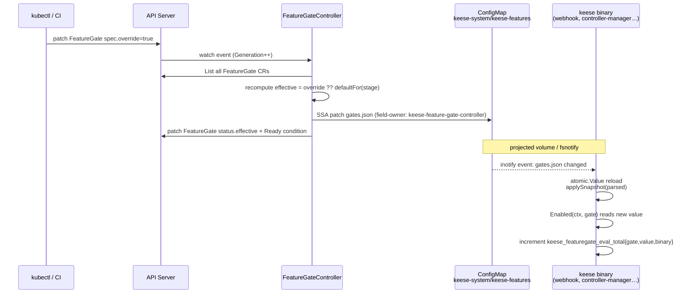

<!-- SPDX-License-Identifier: Apache-2.0 -->
<!-- Copyright (c) 2026 keese-ai -->

# Feature gates

Every keese capability that carries operational risk ships behind a named, staged feature gate — a `policy.keese.ai/v1alpha1.FeatureGate` cluster-scoped CR that the operator controller projects into a single ConfigMap consumed by every keese binary through an in-process [OpenFeature](https://openfeature.dev) evaluator.

!!! info "Audience"
    Cluster operators who need to enable, disable, or stage-promote keese capabilities without rebuilding images or restarting pods. · **Prerequisites:** [Workspaces & sessions](./workspaces.md), familiarity with `kubectl`

## Why feature gates?

keese ships opinionated runtime behaviors — cosign signature verification on OLM InstallPlans, ext_authz enforcement, OpenFGA tuple writes, OTEL export, recipe-source signing. Different environments need different combinations: an air-gapped cluster cannot reach Sigstore; an operator staging a rollout wants log-only mode before enforcing.

The pattern is borrowed from Kubernetes' own `--feature-gates=` design: each behavior has a *stage* (alpha, beta, ga, deprecated), a *default*, and an optional *override*. The CRD owns the schema and audit trail; a single ConfigMap delivers the computed values to every binary without requiring direct API server access in the hot path.

## How it works end-to-end



The full path from a `kubectl patch` to a binary observing the new value is typically under two seconds in a healthy cluster.

## Stage lifecycle

Every gate has a stage that determines its default value and upgrade guarantees.

```mermaid
stateDiagram-v2
    [*] --> alpha : gate introduced
    alpha --> beta : shape stable; backwards-compatible flips ok
    beta --> ga : code path unconditional; spec.override forbidden
    ga --> deprecated : CR stage set to deprecated for 1 minor release
    deprecated --> [*] : seed CR + const removed next minor

    alpha : alpha<br/>Default off<br/>No compat guarantee
    beta : beta<br/>Default on<br/>Backwards-compatible flips
    ga : ga<br/>Unconditional in code<br/>override field forbidden
    deprecated : deprecated<br/>Reads emit Warning event<br/>Removed next minor
```

| Stage | Default | `spec.override` allowed | Notes |
|---|---|---|---|
| `alpha` | off | yes | May change shape; no upgrade compat |
| `beta` | on | yes | Stable shape; backwards-compatible flips ok |
| `ga` | — | **no** (VAP rejects) | Code path is unconditional; CR kept as `deprecated` |
| `deprecated` | — | **no** (VAP rejects) | Reads emit a `Warning` event; removed next minor |

A CEL `XValidation` on the CRD enforces that `override` is absent on `ga` and `deprecated` gates — setting it is rejected by admission before it ever reaches the reconciler.

## The FeatureGate CR

Gates are cluster-scoped (short name `fg`). Here is the shape with all fields:

```yaml
apiVersion: policy.keese.ai/v1alpha1
kind: FeatureGate
metadata:
  name: cosign-installplan-verify   # DNS-1035; cluster-scoped
spec:
  description: "Pre-install cosign keyless OIDC signature check on OLM InstallPlans."
  stage: alpha          # alpha | beta | ga | deprecated
  override: true        # omit to use stage default; forbidden on ga/deprecated
  owners:
    - keese-cosign-webhook  # informational; binaries that consume this gate
  restartRequired: false    # true if a flip cannot take effect mid-process
```

```bash
# List all gates with their current effective values
kubectl get featuregates

# Example output:
# NAME                           AGE   STAGE   EFFECTIVE   OVERRIDE   RESTART
# cosign-installplan-failclosed  12d   alpha   false       <none>     false
# cosign-installplan-verify      12d   alpha   true        true       false
```

### Key fields

| Field | Type | Purpose |
|---|---|---|
| `spec.stage` | enum | Lifecycle stage; sets the default when no override is present |
| `spec.override` | `*bool` | Explicit flip; `null`/omit → use stage default |
| `spec.owners` | `[]string` | Binary names that consume the gate; used for drift alerts and `make featuregate-list` |
| `spec.restartRequired` | bool | When `true`, the controller emits a `RestartRequired` event on flip; keese does **not** auto-restart |
| `status.effective` | bool | The value actually projected into the ConfigMap |
| `status.consumers` | `[]string` | Intended as a rolling-window list of readers; **not populated by the current controller** (see note below) |

!!! warning "status.consumers is inert"
    `status.consumers` is defined in the CRD and appears in `kubectl describe`, but the `FeatureGateController` never writes it. The design plans to populate it from OpenFeature hook telemetry; that wiring is not yet implemented. Treat the field as always empty.

## Projection: FeatureGate CRs → ConfigMap

The `FeatureGateController` (`internal/controller/policy/featuregate_controller.go`) runs a single cluster-scoped reconciler:

1. Lists **all** `FeatureGate` CRs on every generation change (low cardinality; simpler than per-CR diffing and avoids stale entries when a CR is deleted).
2. Computes `effective = spec.override ?? defaultFor(spec.stage)` for each gate.
3. SSA-patches `keese-system/keese-features` key `gates.json` with the resulting `{name: bool}` JSON map, using field-owner `keese-feature-gate-controller`.
4. Patches `status.effective`, `status.observedGeneration`, `status.lastTransitionTime`, and the `Ready` condition on each gate.

The ConfigMap is the delivery bus, not the authority. If the ConfigMap is deleted, the next reconcile recreates it from the CRs.

## In-binary evaluation

Every keese binary instantiates a `featuregate.Gates` object at startup (`internal/featuregate/featuregate.go`):

```go
gates, err := featuregate.New(ctx, featuregate.Options{
    Defaults: map[featuregate.Gate]bool{
        featuregate.CosignInstallPlanVerify:     false,
        featuregate.CosignInstallPlanFailClosed: false,
    },
    Binary: "keese-cosign-webhook",
})
```

Call sites use a single function:

```go
if !gates.Enabled(ctx, featuregate.CosignInstallPlanVerify) {
    return admission.Allowed("cosign verify disabled")
}
```

`Enabled` is lock-free: one `atomic.Pointer` load plus a map lookup. It increments `keese_featuregate_eval_total{gate, value, binary}` on every call.

### Reload without restart

`Gates` starts an `fsnotify` watcher on `/etc/keese/features/gates.json`. When the ConfigMap volume is updated (typically within one to two seconds of the controller patching the CM), the watcher fires, the JSON is parsed, and `atomic.Value` is swapped. **Most gates therefore take effect without any pod restart.**

Gates marked `spec.restartRequired: true` cannot reload mid-process (examples: webhook TLS re-registration, listener port changes). The controller emits a Kubernetes `Event(Reason=RestartRequired)` and increments `keese_featuregate_restart_required_pending`. You must roll the affected deployment manually.

### Failure modes and fallbacks

| Failure | Detection | What happens |
|---|---|---|
| ConfigMap missing at startup | Startup probe: file open fails | Pod stays `NotReady`; all gates fall back to per-stage defaults |
| ConfigMap stale (operator down > 30s) | `keese_featuregate_drift_seconds` SLO alert | Binaries keep serving the last-good snapshot; alert fires |
| Projection file malformed / corrupt | Reload error | Previous snapshot retained; `applySnapshot` skipped |
| OpenFeature provider panic | `recover()` in eval hot path | Gate defaults returned; `keese_featuregate_provider_panics_total` incremented |
| Two controllers race on ConfigMap SSA | Field-owner conflict (SSA detects it) | Single `keese-feature-gate-controller` owner; operator HPA disabled |

## Tamper resistance

The ConfigMap `keese-system/keese-features` is the authoritative delivery bus for gate values. To prevent unauthorized writes:

- Consumer binaries hold only `get,watch` RBAC on the ConfigMap — no write access.
- The operator holds `get,create,patch` only for this specific ConfigMap.
- A Kyverno `ClusterPolicy` in `config/featuregates/policy.yaml` denies writes from any ServiceAccount other than `keese-controller-manager`.
- The operator image is cosign-signed (see [Identity & zero-trust](./identity-zero-trust.md)); unsigned images cannot install, so the SA that owns the CM write path is always from a verified image.

## Gate catalog

The current gate catalog is maintained in the design doc at
https://github.com/keese-ai/keese/blob/main/docs/designs/27b-feature-gate-catalog.md.

At time of writing, two gates ship with the system:

| Gate (CR name) | Stage | Default | Owner binary | Restart? | Description |
|---|---|---|---|---|---|
| `cosign-installplan-verify` | alpha | **off** | `keese-cosign-webhook` | no | Enables cosign keyless OIDC verification on OLM InstallPlans |
| `cosign-installplan-failclosed` | alpha | **off** | `keese-cosign-webhook` | no | With verify on: deny on failure (true) vs. warn-only (false) |

!!! tip "Two-gate rollout pattern"
    Set `cosign-installplan-verify: override: true` and leave `cosign-installplan-failclosed` at its default (off). Failures appear as Warnings and `Event(BundleUnsignedAdmittedDryRun)` events but do not block installs. Once you are confident, flip `cosign-installplan-failclosed: override: true` to enforce.

## Adding a gate

1. Pick a DNS-1035 name, prefixed by the owning binary (e.g. `authz-...`, `otel-...`).
2. Add a `Gate` const in [`internal/featuregate/featuregate.go`](https://github.com/keese-ai/keese/blob/main/internal/featuregate/featuregate.go).
3. Author a seed CR in `config/featuregates/` and add it to the kustomization.
4. Append a row in `docs/designs/27b-feature-gate-catalog.md`.
5. Wrap the entry point in the consumer binary: `if !gates.Enabled(ctx, X) { return passThrough() }`.
6. If the gate affects security or tenancy, open a tech-debt row tracking promotion to beta.

See [Toggle feature gates](../guides/feature-gates.md) for the operator's day-2 workflow.

## Observability

| Metric | Type | Labels | Description |
|---|---|---|---|
| `keese_featuregate_eval_total` | counter | `gate`, `value`, `binary` | Every call to `Enabled()` |
| `keese_featuregate_state` | gauge | `gate` | Current effective value (0=off, 1=on) |
| `keese_featuregate_drift_seconds` | gauge | `gate` | Lag between CR reconcile and binary observing the new value; alert >30s |
| `keese_featuregate_restart_required_pending` | counter | `gate` | Incremented when a restart-required gate flips |
| `keese_featuregate_provider_panics_total` | counter | — | OpenFeature provider panics recovered |

A structured log event is emitted on every transition:

```json
{
  "event": "featuregate_transition",
  "gate": "cosign-installplan-verify",
  "from": false,
  "to": true,
  "reason": "override_set"
}
```

## See also

- [Toggle feature gates](../guides/feature-gates.md) — day-2 operator guide: enable, disable, promote
- [Feature gate catalog](../reference/feature-gate-catalog.md) — full reference table
- [Identity & zero-trust](./identity-zero-trust.md) — cosign, signed images, and the trust root for the controller SA
- [Observability](./observability.md) — token budgets, OTEL, and the broader metrics landscape
