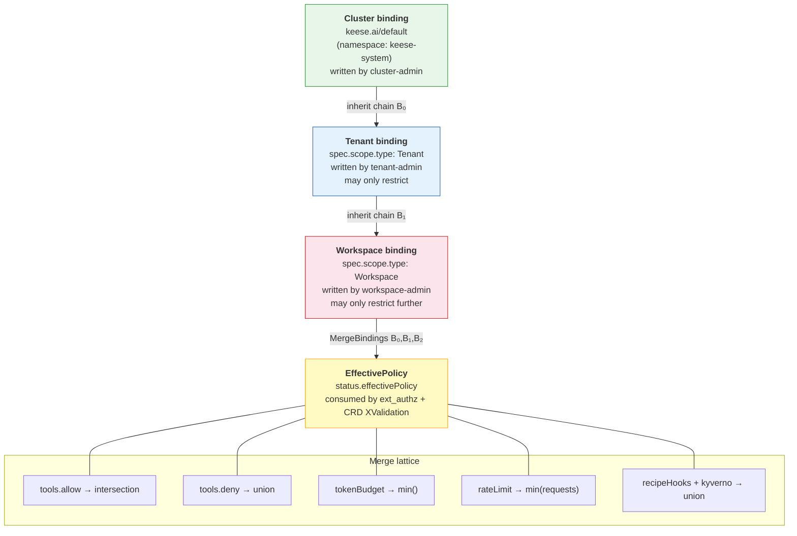
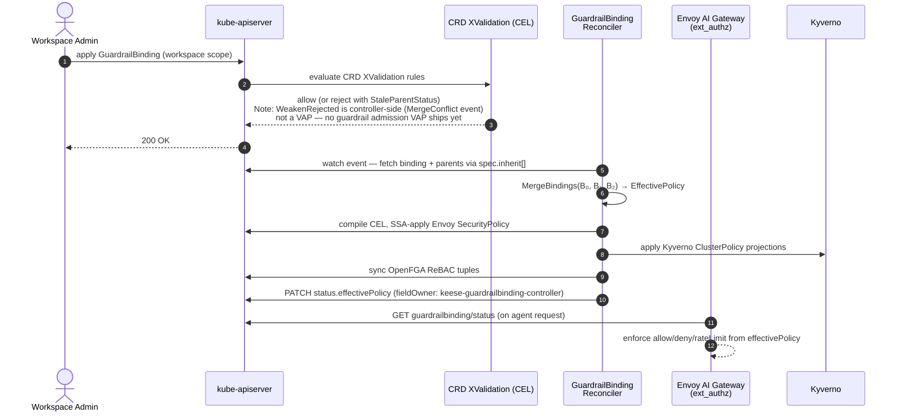

<!-- SPDX-License-Identifier: Apache-2.0 -->
<!-- Copyright (c) 2026 keese-ai -->

# Guardrails

`GuardrailBinding` enforces tool allow/deny lists, token budgets, rate limits, Kyverno policies, and recipe hooks across a three-tier scope chain using a strictest-wins merge lattice that writes a computed `EffectivePolicy` into CRD status.

!!! info "Audience"
    Tenant administrators who need to constrain what MCP tools and token budgets are available to agent workloads. · **Prerequisites:** [Tenancy & namespaces](tenancy.md), [Authorization (ReBAC / OpenFGA)](authorization-rebac.md), [Workspaces & sessions](workspaces.md)

---

## What a GuardrailBinding does

A `GuardrailBinding` (`authz.keese.ai/v1alpha1`) is the single CRD that composes all guardrail concerns for a scope tier:

| Concern | Field | Merge rule |
|---|---|---|
| MCP tool allowlist | `spec.tools.allow` | intersection across scope chain |
| MCP tool denylist | `spec.tools.deny` | union across scope chain |
| Request rate limits | `spec.tools.rateLimit` | `min(requests)` per `(window, scope)` tuple |
| Token ceilings | `spec.tokenBudget.{input,output,total}` | `min()` per field |
| Kyverno ClusterPolicies | `spec.kyverno[].policyRef` | union — all named policies apply |
| Recipe pre/post hooks | `spec.recipeHooks[]` | union — hooks from all bindings run |
| Envoy SecurityPolicy | `spec.envoy.securityPolicyRef` | SSA-applied CEL expression per binding |
| OpenFGA tuple source | `spec.openfga.configMapRef` | synced as ReBAC tuples |

The reconciler writes every merged result into `status.effectivePolicy`. The `keese-authz` ext_authz service reads **only** that status field — never raw spec fields. This ensures the policy seen at runtime is always the result of the full merge, not a stale partial read.

---

## Scope chain

Three scope tiers form a strict hierarchy. Each tier can only tighten the policy set by higher tiers — it can never relax it.



### Default binding

A cluster-scoped binding named `keese.ai/default` lives in the `keese-system` namespace and is the root of every scope chain. It defines the platform-wide floor:

- A mutating webhook injects a reference to it in `Workspace.spec.guardrails.inherit[]` on workspace create.
- A CEL `XValidation` rule on the `Workspace` CRD rejects any update that removes this reference.
- Tenant-admins have `get,list,watch` on `guardrailbindings/default` in `keese-system` but cannot write it.

!!! warning "Missing default binding"
    If `keese.ai/default` is absent, tenant and workspace bindings emit a `DefaultBindingReadForbidden` warning event and the affected workspace enters `Degraded` phase. Restore it with:
    ```bash
    kubectl apply -f config/manager/default-guardrailbinding.yaml
    ```

### Role model

| Role | Scope | Permitted actions |
|---|---|---|
| `keese-guardrail-cluster-admin` | cluster | write `keese.ai/default`; read any binding |
| `keese-tenant-admin` | tenant namespace | write bindings in tenant ns; read `keese.ai/default` |
| `keese-workspace-admin` | workspace namespace | write bindings in workspace ns; read parent bindings |

---

## Merge lattice in detail

`MergeBindings` in [`internal/controller/authz/guardrail_merge.go`](https://github.com/keese-ai/keese/blob/main/internal/controller/authz/guardrail_merge.go) iterates bindings ordered broadest-to-narrowest and applies per-field rules:

### Tool allow/deny

- `tools.allow` — **intersection**. A tool must appear in _every_ binding's allow list to remain permitted. An empty allow list means "allow all"; once any binding sets an explicit list, all subsequent bindings are constrained to its subset.
- `tools.deny` — **union**. A tool denied at _any_ level is denied everywhere. Narrower bindings may only add more denials.

Attempting to add a tool to an allow list that the parent does not permit returns a `MergeError` and the controller sets phase `Degraded` with event reason `MergeConflict`.

### Token budgets

`tokenBudget.{input, output, total}` uses `minPositive`: the value `0` means "no limit" so a positive limit always wins over a zero. The effective ceiling is the lowest non-zero value across the chain.

```
effective_input = min(non-zero values across B₀, B₁, B₂)
```

### Rate limits

Rate limits use `min(requests)` per matching `(window, scope)` tuple. The `scope` field controls the accounting unit:

| Scope value | Counted per |
|---|---|
| `sa` (default) | service account |
| `workspace` | workspace |
| `tenant` | tenant namespace |

The narrower scope (`sa` < `workspace` < `tenant`) is always chosen when two limits specify different scopes.

### Recipe hooks and Kyverno policies

Both use **union** — a hook or policy present in any binding in the chain runs. Workspace-admins cannot remove hooks added by the cluster or tenant binding.

---

## Reconciler flow and EffectivePolicy projection



### Steps in detail

1. **Admission** — CRD `XValidation` CEL rules check that every `recipeHooks[]` entry uses `serviceRef` (not a URL) and that `status.observedGeneration == metadata.generation` (TOCTOU freshness guard). Widening-prevention is controller-side: the reconciler emits `MergeConflict` and sets `Degraded` when a binding relaxes its parent (no admission VAP for this check; a guardrail admission VAP is planned but not yet shipped).
2. **Parent resolution** — the reconciler fetches all bindings listed in `spec.inherit[]`, ordered broadest to narrowest.
3. **Merge** — `MergeBindings` produces an `EffectivePolicy` struct.
4. **Envoy projection** — the effective tool allow/deny lists are compiled into a CEL expression and SSA-applied as an Envoy Gateway `SecurityPolicy`. If CEL compilation fails the binding enters `Degraded` with condition `CELCompilationFailed=True`.
5. **Kyverno projection** — each `spec.kyverno[].policyRef` is applied to the Kyverno runtime via the `KyvernoPolicyProjector` interface.
6. **ReBAC sync** — `tool#allowed_in@workspace` and `guardrail.inherits` tuples are written to OpenFGA.
7. **Status patch** — `status.effectivePolicy`, `status.phase`, `status.lastMergeTime`, and `status.observedGeneration` are written in a single status patch.

---

## TOCTOU guard

Two concurrent workspace-admin writes may race before `status.effectivePolicy` is repopulated. A CEL admission guard blocks writes when the parent's status generation is stale:

```cel
self.status.observedGeneration == self.metadata.generation ||
(size(self.spec.tools.allow) == 0 && size(self.spec.tools.deny) == 0)
```

Rejection reason: `StaleParentStatus`. The reconciler converges within one loop (~100–500 ms), after which the write succeeds on retry.

!!! tip "Runbook: StaleParentStatus spike"
    If rejections exceed 5 %, check `keese_guardrail_reconcile_duration_seconds` (P99). High latency indicates reconcile loop starvation or leader-election churn.

---

## Binding YAML examples

### Minimal cluster-default binding (platform floor)

```yaml
apiVersion: authz.keese.ai/v1alpha1
kind: GuardrailBinding
metadata:
  name: keese.ai-default
  namespace: keese-system
  labels:
    keese.ai/binding-scope: Cluster
spec:
  scope:
    type: Cluster
  tools:
    deny:
      - fs.write_outside_workspace
      - shell.exec
  tokenBudget:
    input: 500000
    output: 100000
    total: 600000
```

### Tenant binding (adds further restriction)

```yaml
apiVersion: authz.keese.ai/v1alpha1
kind: GuardrailBinding
metadata:
  name: my-tenant-guardrail
  namespace: tenant-acme
  labels:
    keese.ai/binding-scope: Tenant
spec:
  scope:
    type: Tenant
    tenantRef:
      name: acme
      namespace: tenant-acme
  inherit:
    - name: keese.ai-default
      namespace: keese-system
  tools:
    allow:
      - github.search
      - github.read_file
      - web.fetch
    deny:
      - github.push
    rateLimit:
      requests: 60
      window: "1m"
      scope: workspace
  tokenBudget:
    total: 200000
```

### Workspace binding (narrowest tier)

```yaml
apiVersion: authz.keese.ai/v1alpha1
kind: GuardrailBinding
metadata:
  name: my-workspace-guardrail
  namespace: ws-acme-review
  labels:
    keese.ai/binding-scope: Workspace
spec:
  scope:
    type: Workspace
    workspaceRef:
      name: acme-review
      namespace: ws-acme-review
  inherit:
    - name: my-tenant-guardrail
      namespace: tenant-acme
  tools:
    allow:
      - github.search    # must be subset of tenant allow list
  recipeHooks:
    - event: beforeToolCall
      serviceRef:
        name: audit-hook
        namespace: ws-acme-review
        port: 8443
        path: /before-tool-call
```

!!! note "Recipe hooks use serviceRef, not URLs"
    The `serviceRef` form is required by a CEL `XValidation` rule on the `GuardrailBinding` CRD. External webhook targets (e.g. PagerDuty) must be reached via an in-cluster proxy Service that routes through the same Envoy AI Gateway egress controls as agent pods. This is enforced by [Zero-trust security rules](../concepts/identity-zero-trust.md).

---

## Status and conditions

```bash
kubectl get guardrailbinding my-workspace-guardrail -n ws-acme-review -o yaml
```

```yaml
status:
  phase: Ready
  observedGeneration: 3
  lastMergeTime: "2026-05-29T10:00:00Z"
  rebacTupleCount: 2
  effectivePolicy:
    tools:
      allow:
        - github.search
      deny:
        - fs.write_outside_workspace
        - github.push
        - shell.exec
      rateLimit:
        requests: 60
        window: 1m
        scope: workspace
    tokenBudget:
      input: 0
      output: 0
      total: 200000
  conditions:
    - type: Ready
      status: "True"
      reason: MergeComplete
    - type: ParentReadable
      status: "True"
      reason: ParentResolved
```

The `keese-authz` ext_authz service reads `status.effectivePolicy` exclusively. Stale reads are guarded by the CRD `XValidation` TOCTOU check (`effectivePolicy.observedGeneration == metadata.generation`).

---

## Observability

| Metric | Type | Labels |
|---|---|---|
| `keese_guardrail_reconcile_duration_seconds` | histogram | `binding_scope` |
| `keese_guardrail_merge_errors_total` | counter | `reason` |
| `keese_guardrail_stale_parent_rejections_total` | counter | — |

**Events:** `DefaultBindingReadForbidden`, `MergeConflict`, `WeakenRejected`, `StaleParentStatus`, `BindingMerged`, `EffectivePolicyComputed`, `CELCompileError`, `KyvernoProjectFailed`, `TupleWriteFailed`

**OTEL traces:** `guardrail.merge` wraps each reconcile; `guardrail.cel.eval` wraps each CRD XValidation admission evaluation.

---

## Failure reference

| Condition | Binding phase | Recovery |
|---|---|---|
| Default binding absent | `Degraded` + `DefaultBindingReadForbidden` event | `kubectl apply -f config/manager/default-guardrailbinding.yaml` |
| `StaleParentStatus` rejection spike | — (CRD XValidation 422, not binding phase) | Check reconcile P99; see runbook above |
| Referenced Kyverno policy absent | `Degraded` + `PolicyRefNotFound` event | Create the missing `ClusterPolicy` |
| CEL compilation failed | `Degraded` + `CELCompilationFailed=True` | Fix `spec.envoy.securityPolicyRef` or tool names |
| Parent binding unreadable | `Degraded` + `ParentReadable=False` | Check RBAC for `get` on parent binding namespace |

---

## See also

- [Authorization (ReBAC / OpenFGA)](authorization-rebac.md) — how `tool#allowed_in@workspace` tuples are evaluated at request time
- [Egress & the AI Gateway](egress-ai-gateway.md) — how the Envoy SecurityPolicy projection controls live traffic
- [Token budgets & observability](observability.md) — per-workspace token accounting and budget enforcement
- [Guides: Define guardrails](../guides/guardrails.md) — step-by-step walkthrough for creating a binding hierarchy
