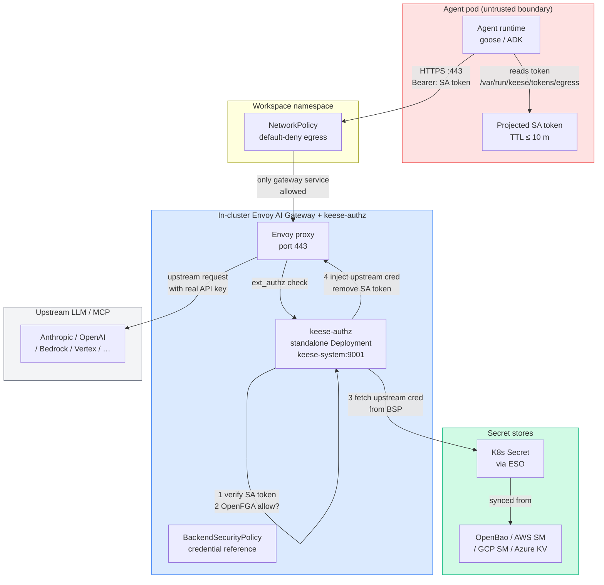

<!-- SPDX-License-Identifier: Apache-2.0 -->
<!-- Copyright (c) 2026 keese-ai -->

# Identity & zero-trust

Keese's security model assumes that any agent runtime pod may be compromised — and builds every identity and network control so that compromise still cannot exfiltrate upstream credentials, reach arbitrary internet endpoints, or escalate privileges.

!!! info "Audience"
    Platform operators and security reviewers who need to understand the runtime security posture of agent workloads. **Prerequisites:** [Concepts in 5 minutes](../getting-started/concepts-in-5-minutes.md) · [Tenancy & namespaces](tenancy.md)

---

## Threat model

The core assumption: **a running agent pod is adversary-controlled**. A supply-chain attack, a prompt-injection exploit, or a compromised recipe could give an attacker arbitrary code execution inside the pod. keese's defences hold even in that scenario:

| Attacker goal | Control preventing it |
|---|---|
| Read upstream API keys (Anthropic, OpenAI, …) | Rule 05.2 — no keys ever reach the pod |
| Call the Kubernetes API and escalate | Rule 05.1 — no kubeconfig mounted on agent pods |
| Reach arbitrary internet hosts | Rule 05.4 — fail-closed NetworkPolicy, single egress path |
| Reuse a stolen SA token after revocation | 04c NATS KV revocation flush — designed, ≤ 60 s p95 SLO when implemented; until then, bounded by SA token TTL (≤ 10 min) |
| Persist in the filesystem | Rule 05.11 — `readOnlyRootFilesystem: true`; writes go to the session PVC only |

---

## The one credential an agent carries

Every agent pod receives exactly **three projected ServiceAccount tokens** (and nothing else in the way of credentials). They are mounted under `/var/run/keese/tokens/` as projected volume files — never as environment variables:

```
/var/run/keese/tokens/
  egress        # audience: keese-egress-<tenant>      → Envoy AI Gateway
  supervisor    # audience: keese-supervisor-<ws-uid>  → ACP human-attach bridge
  workflowRun   # audience: keese-wf-<run-uid>         → NATS a2a bridge (added by Workflow controller)
```

Each token has **TTL ≤ 600 s** (10 minutes). The kubelet rotates each projection independently at 80% of its TTL. Per-tenant audiences tighten cloud-IAM trust policies: an `egress` token for tenant `acme` cannot satisfy the IAM trust policy of tenant `globex`.

The audience templates are owned by the `OIDCProvider` CRD (group `authz.keese.ai/v1alpha1`). The workspace controller renders them at pod-creation time using template variables such as `.TenantName`, `.WorkspaceUid`, and `.WorkflowRunUid`. See the design at https://github.com/keese-ai/keese/blob/main/docs/designs/04b-projected-sa-identity.md.

!!! warning "Planned — not yet implemented"
    Token revocation via 04c NATS KV watch is designed but the `keese-authz` revocation handler is not yet wired to that watch in the shipped binary. Until it is, revocation latency is bounded only by token TTL (≤ 10 m).

---

## Zero-trust boundaries



The agent pod lives in the red (untrusted) zone. It can only reach the Envoy AI Gateway — nothing else. The gateway is the sole trust boundary where the SA token is terminated and the real upstream credential is injected.

---

## Token → upstream credential: the request flow

```mermaid
sequenceDiagram
    participant A as Agent pod
    participant NP as NetworkPolicy
    participant E as Envoy proxy
    participant EA as keese-authz
    participant FGA as OpenFGA
    participant V as OpenBao / KMS
    participant U as Upstream LLM

    A->>NP: HTTPS request (Bearer: SA token)
    NP-->>E: pass (only gateway egress allowed)
    E->>EA: ext_authz Check(SA token, host, path)
    EA->>EA: Verify token signature (JWKS)
    EA->>EA: Decode audience (keese-egress-<tenant>)
    EA->>FGA: ReBAC check (workspace, upstream, relation)
    FGA-->>EA: allow / deny
    alt denied
        EA-->>E: 403 Forbidden
        E-->>A: 403
    else allowed
        EA->>EA: lookup L2 cache (tenant-audience, upstream-role)
        alt cache miss
            EA->>V: exchange SA token → upstream credential<br/>(STS AssumeRoleWithWebIdentity /<br/>GCP WIF / static key from ESO)
            V-->>EA: upstream API key / OIDC access token
            EA->>EA: store in L2 cache; spawn 70% TTL refresh goroutine
        end
        EA-->>E: inject upstream cred header<br/>strip SA token header
        E->>U: upstream request (real API key / OIDC token)
        U-->>E: response
        E-->>A: response (SA token never forwarded)
    end
```

The SA token is **terminated at the gateway** — it never leaves the cluster. The upstream credential is injected by `keese-authz` and is also never visible to the agent.

---

## The credential broker

The `keese-authz` standalone Deployment (in `keese-system`, 3 replicas in prod) implements a three-tier credential cache to avoid a per-request round-trip to the cloud secret store:

| Tier | Scope | Key | Lifetime |
|---|---|---|---|
| L1 | Single request context | `(tenant, workspace, upstream)` | Request lifetime |
| L2 | Per gateway pod, in-process | `(tenant-audience, upstream-role)` | Refresh at 70% TTL; fail-closed past 95% TTL |
| L3 (opt-in) | NATS KV across pods | `(tenant, upstream-role, version)` | ≤ 5 min; needed for `least-used` pool coordination |

**Fail-closed past 95% TTL** means that if the background refresh goroutine cannot obtain a fresh credential before 95% of the TTL has elapsed, all new requests for that `(tenant, upstream-role)` receive HTTP 401 with header `X-Keese-Cred-Expired: true`. The agent runtime pod is drained and replaced. It is never served a stale credential silently.

Each L2 entry has a background goroutine that wakes at 70% of the credential's TTL and fetches a fresh one — proactively, so requests never block on a credential exchange under normal operation. The per-pod goroutine limit is 1,000; an alert fires at 800.

See the full design at https://github.com/keese-ai/keese/blob/main/docs/designs/17-credential-broker.md.

---

## Secret material rules

Two rules govern how secret material reaches pods:

**Rule 05.7 — projected files, never env vars.** Any Kubernetes Secret that reaches a pod is mounted at `/var/run/keese/secrets/<name>` via `projected.sources[].secret`. `envFrom.secretRef` and `env.valueFrom.secretKeyRef` are forbidden on keese-managed pods. This limits blast radius: a secret exposed through an env var leaks to every process; a projected file is only readable by the process that opens it.

**Rule 05.8 — OpenBao (or cloud KMS) is source of truth.** Upstream credentials live in OpenBao, AWS Secrets Manager, GCP Secret Manager, or Azure Key Vault. The ExternalSecrets Operator bridges them into Kubernetes Secrets that are referenced by `BackendSecurityPolicy`. The agent pod never sees these Secrets directly.

---

## Network isolation

Every workspace namespace gets a **fail-closed default-deny NetworkPolicy** on creation (NP-1), plus an egress allowlist (NP-2). NP-2 permits three and only three egress paths:

```yaml
# NP-2 — egress allowlist applied by WorkspaceReconciler (SSA, field owner keese-workspace-controller)
apiVersion: networking.k8s.io/v1
kind: NetworkPolicy
metadata:
  name: keese-workspace-<uid>-egress
  namespace: <workspace-namespace>
spec:
  podSelector:
    matchLabels:
      keese.ai/workspace: <workspace-name>
  policyTypes: [Egress]
  egress:
  # Rule 1: kube-dns — required for in-cluster Service name resolution
  - ports:
    - protocol: UDP
      port: 53
    - protocol: TCP
      port: 53
    to:
    - namespaceSelector:
        matchLabels:
          kubernetes.io/metadata.name: kube-system
      podSelector:
        matchLabels:
          k8s-app: kube-dns

  # Rule 2: Envoy AI Gateway proxy — namespace+pod selector only (no port pin; see caveat)
  - to:
    - namespaceSelector:
        matchLabels:
          kubernetes.io/metadata.name: envoy-gateway-system
      podSelector:
        matchLabels:
          app.kubernetes.io/managed-by: envoy-gateway

  # Rule 3: NATS JetStream :4222 — namespace = KEESE_GATEWAY_NS (default keese-system)
  - ports:
    - protocol: TCP
      port: 4222
    to:
    - namespaceSelector:
        matchLabels:
          kubernetes.io/metadata.name: keese-system   # <KEESE_GATEWAY_NS>
      podSelector:
        matchLabels:
          app.kubernetes.io/name: nats
```

The gateway egress rule deliberately omits a `ports` entry because Kubernetes `NetworkPolicy` port matching applies to the destination pod's container port (after kube-proxy DNAT), not the Service port the client dials. The Envoy Gateway proxy pod's listener port is set by the upstream Helm chart (e.g. `10443` in chart v1.4.x) and is not under keese's control. The security boundary is the `namespaceSelector + podSelector` conjunction. See [Network isolation](network-isolation.md) for details.

!!! danger "No wildcard policies"
    `podSelector: {}` with an empty `to:` list, or any egress rule that does not enumerate specific endpoints, is forbidden. A misconfigured NetworkPolicy that opens broad egress defeats the entire zero-trust model. Admission validation rejects such policies.

---

## Pod security constraints

Agent pods are created with an explicit `securityContext` that enforces:

- `readOnlyRootFilesystem: true` — writes go only to the session PVC
- `allowPrivilegeEscalation: false`
- No `hostNetwork`, `hostPID`, or `hostIPC`
- No `privileged: true`
- No `capabilities.add` beyond the runtime's minimum

Container images in production overlays and OLM CSVs are **pinned by digest**, not tag. They carry Sigstore cosign keyless OIDC signatures verifiable with:

```bash
cosign verify \
  --certificate-identity-regexp 'https://github.com/keese-ai/keese/.github/workflows/.*' \
  --certificate-oidc-issuer 'https://token.actions.githubusercontent.com' \
  <image-digest>
```

---

## ReBAC: every authz decision is tuple-backed

The `keese-authz` service calls OpenFGA for every request. The OpenFGA store holds relationship tuples that express which workspaces may reach which upstreams. Every CRD field that affects an authorization decision carries a `// +keese:rebac-tuple=<relation>` marker; absence of the marker blocks merge. The `ext_authz` audit log captures `(tuple, SA, host, decision, upstream_status)` — never tokens, never request or response bodies.

See [Authorization (ReBAC / OpenFGA)](authorization-rebac.md) for the full tuple model.

---

## Break-glass

Annotations matching `keese.ai/unsafe-*` are rejected by admission unless the namespace carries label `keese.ai/break-glass=true`. When break-glass is active:

- Every unsafe annotation allowed generates a Kubernetes event with reason `UnsafeAnnotationAllowed`.
- The event is logged to the OTEL pipeline.
- The incident is recorded in `MEMORY.md`.

Break-glass is a deliberate, audited escape hatch — not a bypass.

---

## Observability and alerting

Key signals for monitoring the zero-trust layer:

| Signal | Type | Meaning |
|---|---|---|
| `keese_broker_credential_expired_seconds_remaining{tenant,upstream}` | Gauge | Seconds until fail-closed; alert when < 5% TTL |
| `keese_broker_vault_errors_total{tenant,upstream}` | Counter | OpenBao/KMS unreachable during refresh |
| `keese_broker_revocation_flush_total{tenant}` | Counter | 04c revocation flushes processed **(planned — revocation broker not yet implemented; `internal/broker/` does not exist)** |
| `keese_broker_pool_exhausted_total{tenant,bsp}` | Counter | All upstream pool members cooling **(planned — revocation broker not yet implemented)** |
| `keese_broker_refresh_goroutine_high_water` | Gauge | Per-pod goroutine count; alert at 800 |
| `keese_oidc_audience_template_eval_total{template,result}` | Counter | Token mint successes and failures |

Events emitted by the credential broker on the `BackendSecurityPolicy` CR: `VaultUnreachable`, `SecretStale`, `STSTimeout`, `STSAuthFailed`, `CredentialRevoked`, `CredentialExpiringFailClosed`, `PoolMemberCooling`, `PoolExhausted`.

---

## See also

- [Egress & the AI Gateway](egress-ai-gateway.md) — Envoy AI Gateway topology and `BackendSecurityPolicy` wiring
- [Authorization (ReBAC / OpenFGA)](authorization-rebac.md) — relationship tuple model powering `ext_authz`
- [Credential broker](credential-broker.md) — deep dive on cache tiers, refresh goroutines, and failure modes
- [Network isolation](network-isolation.md) — NetworkPolicy patterns for workspace namespaces
