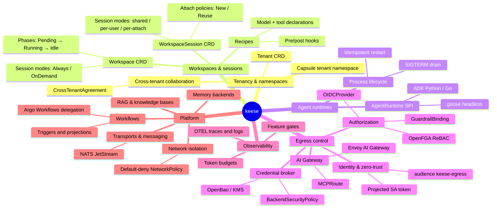
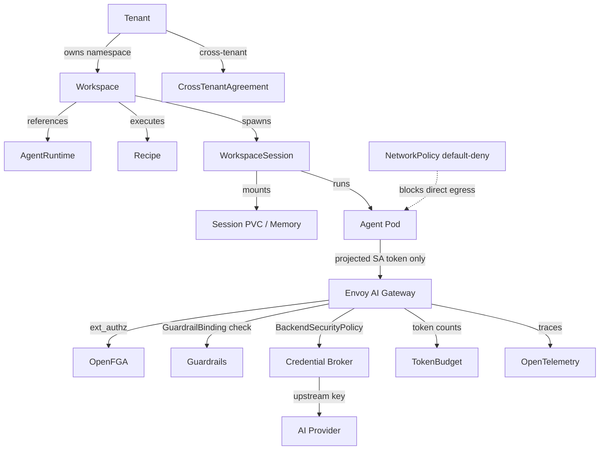

<!-- SPDX-License-Identifier: Apache-2.0 -->
<!-- Copyright (c) 2026 keese-ai -->

# Concepts

keese secures and orchestrates AI agents on Kubernetes through a set of composable primitives that span identity, tenancy, egress control, and workload execution.

!!! info "Audience"
    Platform operators, developers, and architects evaluating or deploying keese. **Prerequisites:** familiarity with Kubernetes objects and basic understanding of LLM agent architectures. New to keese? Start with [Concepts in 5 minutes](../getting-started/concepts-in-5-minutes.md).

The concepts in this section form a deliberate dependency graph: every agent workload sits inside a tenant boundary, every tenant owns workspaces, every workspace runs a session backed by a runtime, and every session's egress is gated by identity, authorization, and guardrails before a credential is ever exchanged with an upstream AI provider. Understanding that chain — from tenant to runtime to egress — is the fastest path to understanding keese as a whole.

## Tenancy and namespaces

keese is a multi-tenant platform. A **Tenant** is the top-level administrative boundary — it maps to one or more Kubernetes namespaces managed by [Capsule](https://capsule.clastix.io/). Every workspace, session, secret, and policy object lives inside the namespace of its owning tenant.

Tenants are isolated by default: NetworkPolicy blocks cross-tenant traffic and OpenFGA enforces authorization boundaries. When two tenants need to collaborate they negotiate a **CrossTenantAgreement**, a CRD that requires bilateral acceptance and that governs exactly which resources are shared and under what conditions.

- [Tenancy & namespaces](tenancy.md)
- [Cross-tenant collaboration](cross-tenant.md)

## Workspaces and sessions

A **Workspace** is the durable unit of agent work — a named, tenant-owned slot that tracks lifecycle (`Pending → Provisioning → Running → Idle → Terminating`), holds the persistent session PVC, and wires together a runtime reference, an optional recipe, and a token-budget reference.

A **WorkspaceSession** is the ephemeral attach point for human or automated interaction with that workspace. Sessions carry their own lifecycle (`Pending → Attaching → Active → Draining → Completed`), a pod-sharing policy (`shared`, `per-user`, or `per-attach`), and a `sessionMode` that controls whether the agent pod is always running or spun up on demand.

**Recipes** are the declarative description of what an agent should do: which model and provider to use, which tools are allowed, and what pre/post hooks must pass. Recipes are versioned, OCI-distributable, and reference-able from any workspace.

- [Workspaces & sessions](workspaces.md)
- [Recipes](recipes.md)

## Agent runtimes

An **AgentRuntime** implements the Runtime SPI — an interface the workspace controller calls to produce a fully populated pod spec for the agent process. keese ships one fully-implemented runtime today — **goose** (headless ACP-over-stdio, backed by a session SQLite file on the workspace PVC). Two additional runtime stubs — **ADK Python** and **ADK Go** — are registered but return `ErrUnsupported` for all SPI methods and are not yet usable in production (E0 skeleton; see [Agent runtimes (SPI)](agent-runtimes.md) for details). Additional runtimes are added by implementing the SPI without changing the core controller.

Agent pods carry only a projected ServiceAccount token with a short TTL (≤ 10 minutes). They never hold upstream API keys or kubeconfigs.

Process lifecycle — SIGTERM draining, checkpoint-to-PVC, idempotent restart — is enforced uniformly across all runtimes by the workspace controller and the rules in [`.claude/rules/06-signal-handling.md`](https://github.com/keese-ai/keese/blob/main/.claude/rules/06-signal-handling.md).

- [Agent runtimes (SPI)](agent-runtimes.md)
- [Process lifecycle & supervision](lifecycle-supervision.md)

## Identity and zero-trust

keese's threat model assumes an agent pod may be compromised. The response is a strict zero-trust chain:

1. The agent pod carries only a projected ServiceAccount token (audience `keese-egress-<tenant>`, TTL ≤ 10 min). No upstream keys, no kubeconfig.
2. All egress goes through the in-cluster **Envoy AI Gateway** on port 443 — direct internet egress is blocked by a fail-closed NetworkPolicy.
3. At the gateway, the SA token is terminated, OpenFGA is consulted via ext_authz, and the upstream credential is injected by `BackendSecurityPolicy`. Credentials never transit agent pods.

The **OIDCProvider** CRD (`authz.keese.ai/v1alpha1`) configures the OIDC issuer that issues projected tokens and the audience templates used to scope them per tenant.

- [Identity & zero-trust](identity-zero-trust.md)
- [Egress & the AI Gateway](egress-ai-gateway.md)
- [Credential broker](credential-broker.md)
- [Network isolation](network-isolation.md)

## Authorization (ReBAC)

keese uses **Relationship-Based Access Control** via [OpenFGA](https://openfga.dev/). Every CRD field that affects authorization carries a `// +keese:rebac-tuple=<relation>` marker; the reconciler writes the corresponding OpenFGA tuple when the resource is reconciled.

The **GuardrailBinding** CRD (`authz.keese.ai/v1alpha1`) attaches content and tool-access policies to workspaces and sessions. Guardrails are evaluated at the gateway before a request reaches the upstream model.

- [Authorization (ReBAC / OpenFGA)](authorization-rebac.md)
- [Guardrails](guardrails.md)

## Egress and the AI Gateway

The **Envoy AI Gateway** is the single exit point for all LLM traffic. It handles:

- SA token validation and OpenFGA ext_authz checks
- Provider routing (`MCPRoute` selects the upstream `Backend`)
- Credential injection via `BackendSecurityPolicy`
- Token counting for budget enforcement
- Trace emission to OpenTelemetry

This design means agents communicate through a single well-audited path: the gateway logs `(tuple, SA, host, decision, upstream_status)` for every request without ever logging a token or a response body.

- [Egress & the AI Gateway](egress-ai-gateway.md)
- [Credential broker](credential-broker.md)

## Memory and RAG

A **Memory** CRD (`keese.ai/v1alpha1`) provides pluggable durable memory for agents. Backends include SQLite (default, on the session PVC), Redis, Qdrant, pgvector, Neo4j, Mem0, and Zep. The workspace controller reconciles the Memory object and injects connection details into the agent pod at start-up.

**RAG ingestion** runs as a separate pipeline that embeds documents into a vector store (Qdrant, Elasticsearch, or pgvector) and surfaces retrieval as a tool call the agent can invoke through the gateway.

- [Memory](memory.md)
- [RAG & knowledge bases](rag.md)

## Workflows

A **Workflow** CRD (`keese.ai/v1alpha1`) wraps an Argo Workflow, adding tenant scoping, trigger projections, and NATS JetStream messaging integration. Triggers fire from HTTP webhooks, schedule, or message-queue events. The workflow controller delegates execution to Argo but retains ownership of RBAC and resource quota enforcement.

- [Workflows & triggers](workflows.md)
- [Transports & messaging](transports.md)

## Observability, token budgets, and feature gates

**Token budgets** (`policy.keese.ai/v1alpha1`) set per-workspace or per-tenant limits on token consumption. The gateway counts tokens on every response and increments a counter in the TokenBudget status; the workspace controller can evict or pause sessions that exceed limits.

OpenTelemetry traces flow from agent pods through the gateway to an Elastic APM endpoint. Logs go to ECK. The Observability concept page covers the full pipeline.

**Feature gates** (backed by OpenFeature) let operators gradually roll out or roll back experimental capabilities without redeploying the operator.

- [Token budgets & observability](observability.md)
- [Feature gates](feature-gates.md)
- [Reference: Feature gate catalog](../reference/feature-gate-catalog.md)

## How the concepts fit together

## Next steps

- [Architecture overview](architecture.md) — how the controller manager, binaries, and infrastructure components are laid out.
- [Getting Started: Install locally on kind](../getting-started/install-kind.md) — bring up a working cluster and deploy keese in under 20 minutes.
- [API reference](../reference/api/index.md) — full CRD field tables for all three API groups.
- [Glossary](../reference/glossary.md) — definitions for every term used across the docs.
