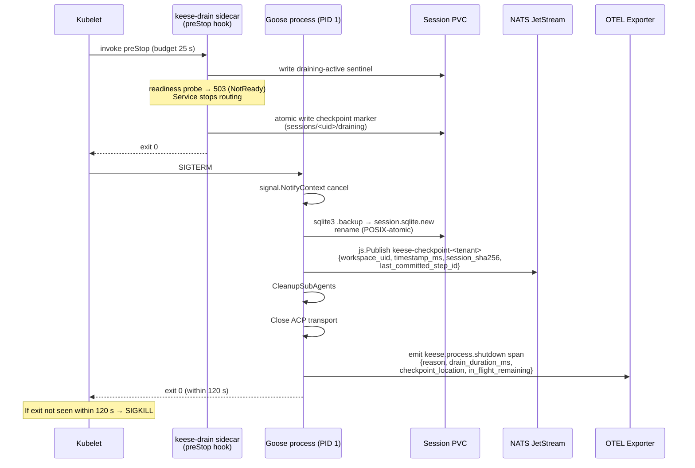
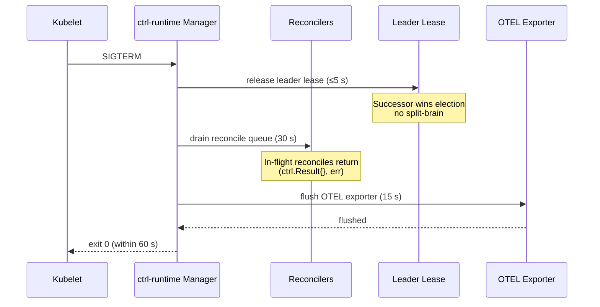
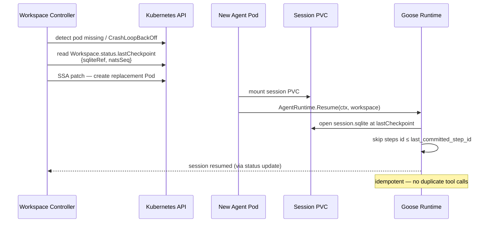
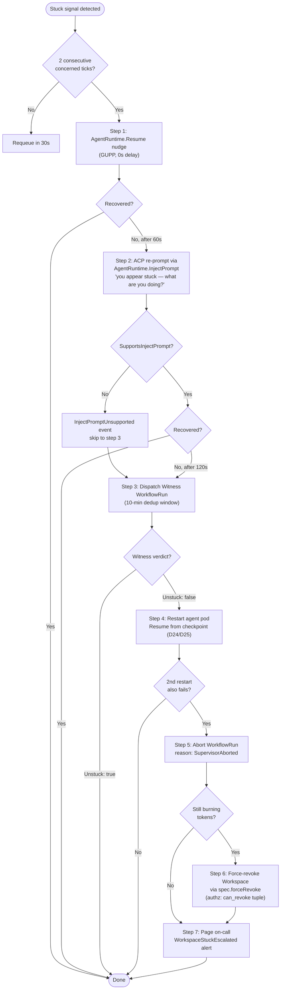

<!-- SPDX-License-Identifier: Apache-2.0 -->
<!-- Copyright (c) 2026 keese-ai -->

# Process lifecycle & supervision

Keese's reliability contract defines exactly how every binary shuts down, checkpoints its state, and recovers after an unexpected kill — and how the supervisor detects and corrects a stuck agent before it burns budget.

!!! info "Audience"
    Platform operators and contributors tuning drain windows or extending the supervision ladder.
    **Prerequisites:** [Architecture overview](architecture.md) · [Workspaces & sessions](workspaces.md) · [Agent runtimes (SPI)](agent-runtimes.md)

---

## Binary classes and drain windows

Keese runs three classes of long-lived process, each with its own
`terminationGracePeriodSeconds` and ordered drain phases:

| Binary class | Grace period | Drain phases |
|---|---|---|
| **Controllers** (operator + projectors) | 60 s | Release leader lease (≤5 s) → drain reconcile queue (30 s) → flush OTEL exporter (15 s) → exit (10 s buffer) |
| **Agent runtime pods** (goose) | 120 s | `preStop` → `keese-drain` sidecar (25 s) + `Drain(ctx, session, 90s)` SPI call → SQLite checkpoint → NATS publish → flush OTEL span → exit (10 s buffer) |
| **Gateway services** (keese-authz ext_authz, ext_proc) | 30 s | `preStop: sleep 25` + `/healthcheck/fail` → complete in-flight authz checks → exit |

Every `cmd/` binary calls
[`signal.NotifyContext(ctx, syscall.SIGTERM, syscall.SIGINT)`](https://github.com/keese-ai/keese/blob/main/cmd/keese-drain/main.go#L50)
before starting its main loop. The pre-commit hook `scripts/check-signal-handling.sh`
rejects any `cmd/**/main.go` that is missing this call.

---

## SIGTERM sequence: agent runtime pod



### What the `keese-drain` sidecar does

`keese-drain` ([`cmd/keese-drain/main.go`](https://github.com/keese-ai/keese/blob/main/cmd/keese-drain/main.go))
is a small binary embedded in the goose runtime image. It is called by the kubelet
`preStop` hook before the main container receives SIGTERM:

```yaml
lifecycle:
  preStop:
    exec:
      command:
        - /usr/local/bin/keese-drain
        - --pvc-root=/var/run/keese/session
        - --timeout=25s
```

It writes a `draining-active` sentinel (causing the readiness probe to return 503) and an
atomic JSON checkpoint marker under `sessions/<workspace-uid>/draining`. The marker
records `sqlite_ref`, `workspace_uid`, and `written_at`. It does **not** perform the
full SQLite WAL checkpoint — that is delegated to the goose process via the SIGTERM it
receives immediately after `preStop` completes.

---

## SIGTERM sequence: controller



Controllers are **stateless between reconciles**: on restart the manager re-lists from the
API server. Server-Side Apply with `fieldOwner = keese-<kind>-controller` ensures
idempotent apply even if the previous pod wrote partial state mid-reconcile.

---

## Checkpoint format and location

Session state is dual-checkpointed for fast recovery:

| Store | What is written | Purpose |
|---|---|---|
| **PVC** | `sessions/<workspace-uid>/session.sqlite` — full WAL checkpoint | Complete state; used by `Resume` |
| **NATS JetStream** | Stream `keese-checkpoint-<tenant>` — `{workspace_uid, timestamp_ms, session_sha256, last_committed_step_id}` | Metadata only; lets the controller locate the checkpoint without mounting the PVC |

**Checkpoint frequency:** every step boundary plus on `Drain`. Worst-case SIGKILL data
loss is one step.

**Atomic write protocol:** `sqlite3 .backup` to `session.sqlite.new`, then `os.Rename`
(POSIX-atomic on the same filesystem). The `keese-drain` sidecar uses the same
`atomicWriteFile` helper for the JSON marker.

---

## Idempotent restart after SIGKILL

When the kubelet SIGKILLs an agent pod (drain budget exceeded or OOM), the workspace
controller reads `Workspace.status.lastCheckpoint.{sqliteRef, natsSeq}` and spawns a
fresh pod calling `AgentRuntime.Resume(ctx, workspace)`.

The SPI contract ([`internal/runtime/spi/v1alpha1/spi.go`](https://github.com/keese-ai/keese/blob/main/internal/runtime/spi/v1alpha1/spi.go)):

```go
// Resume restores a session from Workspace.LastCheckpoint. Must
// complete or return ErrAgentUnresponsive within 60 s (D25 GUPP).
Resume(ctx context.Context, workspace Workspace) error
```

`Resume` deduplicates by step ID: any step with `id <= last_committed_step_id` from the
checkpoint is skipped. No tool call executes twice across crash-and-resume.



---

## Probe/drain alignment

Rule `06-signal-handling.md §8` requires:
`initialDelaySeconds + (periodSeconds × failureThreshold) ≥ terminationGracePeriodSeconds`

| Binary | initialDelay | period | failureThreshold | total tolerance | Satisfies grace |
|---|---|---|---|---|---|
| Controllers | 30 s | 10 s | 3 | 60 s | = 60 s |
| Agent runtime | 60 s | 10 s | 6 | 120 s | = 120 s |
| keese-authz / gateway service | 10 s | 5 s | 4 | 30 s | = 30 s |

**Readiness flips NotReady on drain (§9):** the `preStop` hook writes
`/var/run/keese/session/draining-active`; the readiness probe returns 503 when that
sentinel is present. This stops Service routing before the process stops listening.

!!! warning "Liveness probe ceiling must equal grace period"
    If you increase `terminationGracePeriodSeconds` (e.g. for a slow checkpoint on a
    large session), you **must** update all three probe parameters in the same change
    to maintain the `= grace` equality above. Failing to do so causes the kubelet to
    SIGKILL the pod mid-drain, defeating the checkpoint.

---

## Shutdown event schema

Every binary emits an OTEL span `keese.process.shutdown` synchronously before the
exporter closes. Required span attributes:

| Attribute | Type | Notes |
|---|---|---|
| `reason` | string | `sigterm \| liveness_failed \| oom_killed \| crash \| planned` |
| `drain_duration_ms` | int | wall clock from SIGTERM to exit |
| `checkpoint_location` | string | `sqlite:sessions/<uid>/session.sqlite` or `""` for controllers |
| `in_flight_remaining` | int | 0 = clean drain; >0 logged as warning |
| `leader_lease_released` | bool | controllers only; `false` = ungraceful |
| `exit_code` | int | always 0 on clean drain |

If the OTEL exporter flush fails, the same fields are emitted as a structured JSON log
line to stderr before exit (see `cmd/keese-drain/main.go:70`).

---

## Agent supervision (the patrol pattern)

!!! warning "Planned — not yet implemented"
    The supervision patrol pattern, escalation ladder, witness agent, and all
    Kubernetes events listed in this section (`WorkspaceConcerned`,
    `WitnessDispatched`, `WitnessCompleted`, `WitnessStuck`, `SupervisorAborted`,
    `WorkspaceStuckEscalated`, etc.) are design-complete (design 23) but have no
    corresponding controller code on `main`. No supervisor reconciler exists in
    `internal/controller/`. The drain and checkpoint mechanics described above this
    section **are** implemented.

An agent pod can appear healthy to the kubelet while making no meaningful progress — for
example, looping on a prompt or waiting silently for a tool response. The supervisor
detects this and escalates through an ordered ladder.

### Stuck definition

A workspace transitions to `WorkspaceConcerned` when **any one** of these signals fires:

| Signal | Default threshold |
|---|---|
| Zero token usage | 10 min |
| No `WorkflowRun.status.phase` transition | 15 min (in-flight step) |
| ACP session idle | 5 min |
| No git commit / artifact touch | 30 min (only when `expectsArtifacts: true`) |
| `TokenBudget` exhaustion event | Immediate |

Thresholds can be overridden per workspace via `Workspace.spec.supervision.overrides`
and cluster-wide via `ConfigMap keese-supervision-defaults` in `keese-system`.

Argo retry backoff (`WorkflowRun.status.argoRetryInFlight: true`) suppresses evaluation
to prevent false positives during retry cycles.

### Escalation ladder

The `keese-supervisor-controller` (a reconciler inside the operator binary) evaluates
stuck signals every 30 s. After two consecutive concerned ticks it escalates:



### The witness agent

The witness is a dedicated `WorkflowRun` with `spec.witnessOf: <target-workspace>`. It
runs under a separate ServiceAccount with audience `keese-egress-supervisor-<tenant>` —
distinct from the workspace audience — preventing upstream model impersonation.

The witness uses a dedicated `GuardrailBinding` named `witness-default`:

- **Allowed tools:** `kubectl.describe/logs/get`, `goose.session.dump`, `openfga.check`,
  `workspace.patch.forceRevoke`
- **Denied tools:** all `network.upstream` tools except OpenFGA audit
- **Token budget:** charged to platform `TokenBudget` CR `keese-supervision-<tenant>`,
  not the workspace's budget
- `spec.scope: cluster` — CRD XValidation rejects any tenant override

!!! warning "Planned — not yet implemented"
    `AgentRuntime.InjectPrompt` (supervision ladder step 2) is flagged for SPI iter-2.
    If your provider does not yet implement it, `CapabilitySupportsInjectPrompt` will be
    `false` and the supervisor skips to step 3 (dispatch witness), emitting an
    `InjectPromptUnsupported` event.

!!! warning "Planned — not yet implemented"
    `scripts/dev/sigterm-drain-test.sh` (end-to-end SIGTERM smoke) and the envtest
    drain-budget harness are not yet authored. They are scheduled for the P7
    infra-bootstrap phase. Until then, drain correctness is validated by unit tests only.

---

## Observability

**OTEL spans:** `keese.process.shutdown` (all binaries), `supervisor.evaluate`
(`workspace`, `tenant`, `signals_triggered`, `action_taken`, `witness_uid`).

**Metrics:**

| Metric | Labels |
|---|---|
| `keese_process_shutdown_total` | `binary`, `reason`, `clean` |
| `keese_drain_duration_ms` (histogram) | `binary` |
| `keese_checkpoint_failures_total` | `workspace`, `backend` (`pvc\|nats`) |
| `keese_supervision_escalation_total` | `tenant`, `workspace`, `step` |

**Kubernetes events** (in `internal/controller/keese/workspace_events.go`):
`WorkspaceConcerned`, `WitnessDispatched`, `WitnessCompleted`, `WitnessStuck`,
`AgentUnresponsive`, `SupervisorAborted`, `SupervisionBudgetExhausted`,
`WorkspaceStuckEscalated`, `CheckpointFailed`, `NATSCheckpointFailed`,
`ShutdownUnclean`, `WitnessBindingMissing`, `InjectPromptUnsupported`.

**Alert:** `WorkspaceStuckEscalated` fires when ≥3 pods in 5 minutes reach step 5+
(pages on-call — drain budget or step thresholds may need tuning).

---

## See also

- [Agent runtimes (SPI)](agent-runtimes.md) — `Drain`, `Resume`, and `InjectPrompt` SPI contracts
- [Workspaces & sessions](workspaces.md) — checkpoint fields on `Workspace.status`
- [Guardrails](guardrails.md) — `witness-default` GuardrailBinding and cluster-scope guardrail binding
- [Token budgets & observability](observability.md) — supervision token budget isolation
