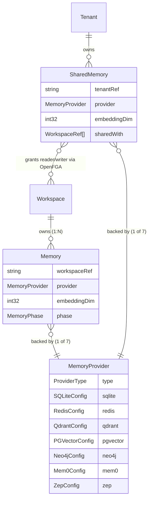
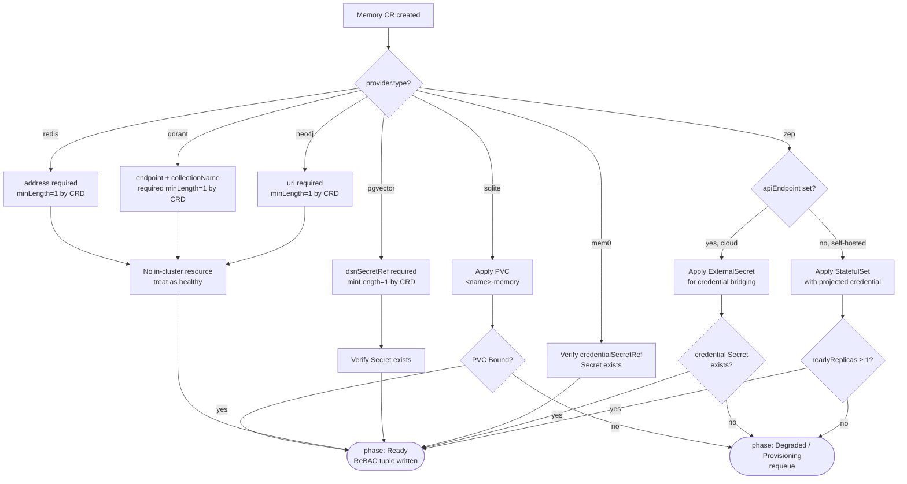

<!-- SPDX-License-Identifier: Apache-2.0 -->
<!-- Copyright (c) 2026 keese-ai -->

# Memory

Every keese agent workspace gets a durable, queryable memory store backed by one of seven pluggable providers — from an ephemeral-friendly SQLite file on a PVC all the way to a hosted graph database in Neo4j or a managed vector service like Qdrant Cloud.

!!! info "Audience"
    Agent developers and platform operators who need to choose and configure a memory backend for workspaces. **Prerequisites:** [Workspaces & sessions](workspaces.md) · [Authorization (ReBAC / OpenFGA)](authorization-rebac.md)

---

## Two memory kinds

Keese exposes two CRDs in the `keese.ai/v1alpha1` group:

| Kind | Short name | Scope | Purpose |
|---|---|---|---|
| `Memory` | `mem` | Namespaced | Per-workspace private store |
| `SharedMemory` | `smem` | Namespaced (tenant ns) | Cross-workspace shared store, gated by OpenFGA tuples |

Both kinds share the same seven-backend `spec.provider` discriminated one-of. The controller enforces mutual exclusion at the API level via a CEL `XValidation` rule — exactly one provider sub-field may be set.



---

## The seven backends

### SQLite (default)

The simplest backend. The controller SSA-applies a single `ReadWriteOnce` PVC named `<memory-name>-memory` in the workspace namespace. The agent runtime mounts the PVC and drives SQLite directly.

**Single-pod invariant.** Because the PVC is `ReadWriteOnce`, only one pod may mount it at a time. Do not attempt to attach the same `Memory` CR to a workspace whose runtime scales beyond one replica — the reconciler will not prevent this but the second pod will fail to mount.

**Reclaim policy.** `spec.provider.sqlite.reclaimPolicy` defaults to `Retain`: deleting the `Memory` CR leaves the PVC in place so session history survives accidental deletion. Set to `Delete` only when you intentionally want data erasure on CR removal.

```yaml
apiVersion: keese.ai/v1alpha1
kind: Memory
metadata:
  name: my-agent-memory
  namespace: tenant-acme
spec:
  workspaceRef: my-workspace
  provider:
    type: sqlite
    sqlite:
      storageSize: 4Gi
      reclaimPolicy: Retain
```

### Redis

`spec.provider.redis.address` is **required** by the CRD schema (`minLength: 1`, listed in
the CRD `required:` array). Setting `address` to an empty string or omitting it while the
`redis:` sub-struct is present is rejected at admission.

- **External mode** (`address` set to a valid `host:port`): the controller treats the address
  as healthy; no in-cluster resources are projected. You are responsible for the Redis endpoint.

!!! warning "In-cluster StatefulSet path not reachable via current API"
    The controller contains code to SSA-apply an in-cluster `redis:7` StatefulSet + headless
    Service when `address` is empty, but the CRD schema prevents this — `address` is a required
    field. The in-cluster path is not accessible via `v1alpha1`. For dev, deploy Redis separately
    (e.g. via Helmfile) and reference it with `address`.

### Qdrant

Both `spec.provider.qdrant.collectionName` and `spec.provider.qdrant.endpoint` are
**required** by the CRD schema (`minLength: 1`, listed in the CRD `required:` array).
Setting either field to an empty string or omitting it while the `qdrant:` sub-struct is
present is rejected at admission.

- **External mode** (`endpoint` set to a valid gRPC URL): the controller treats the endpoint
  as healthy; no in-cluster resources are projected. You are responsible for the Qdrant instance.

!!! warning "In-cluster StatefulSet/QdrantCluster path not reachable via current API"
    The controller contains code to SSA-apply an in-cluster Qdrant StatefulSet or
    `QdrantCluster` when `endpoint` is empty, but the CRD schema prevents this — `endpoint`
    is a required field. The in-cluster path is not accessible via `v1alpha1`. For dev, deploy
    Qdrant separately and reference it with `endpoint`.

### pgvector

`spec.provider.pgvector.dsnSecretRef` is **required** by the CRD schema (`minLength: 1`,
listed in the CRD `required:` array). Setting it to an empty string or omitting it while
the `pgvector:` sub-struct is present is rejected at admission.

- **External mode** (`dsnSecretRef` set to a Secret name): the DSN lives in a K8s Secret
  mounted as a projected file (rule 05.7). The controller validates the Secret exists and
  returns healthy; no in-cluster database is projected.

!!! warning "In-cluster CNPG/StatefulSet path not reachable via current API"
    The controller contains code to SSA-apply an in-cluster CloudNativePG Cluster or
    `pgvector:pg17` StatefulSet when `dsnSecretRef` is empty, but the CRD schema prevents
    this — `dsnSecretRef` is a required field. The in-cluster path is not accessible via
    `v1alpha1`. For dev, provision Postgres separately and reference it via `dsnSecretRef`.

### Neo4j

`spec.provider.neo4j.uri` is **required** by the CRD schema (`minLength: 1`, listed in
the CRD `required:` array). Setting it to an empty string or omitting it while the
`neo4j:` sub-struct is present is rejected at admission.

- **External mode** (`uri` set to a valid Bolt URI): no in-cluster resources are projected.
  You are responsible for the Neo4j instance.

!!! warning "In-cluster StatefulSet path not reachable via current API"
    The controller contains code to SSA-apply an in-cluster `neo4j:5-community` StatefulSet
    (with `NEO4J_AUTH=none`) when `uri` is empty, but the CRD schema prevents this — `uri`
    is a required field. The in-cluster path is not accessible via `v1alpha1`. For dev,
    deploy Neo4j separately and reference it by URI.

### Mem0 (hosted)

Mem0 is a hosted-only provider. `spec.provider.mem0.credentialSecretRef` is required — it names a K8s Secret that must be populated by ExternalSecrets Operator from OpenBao (or your cloud KMS). The Secret is mounted as a projected file at `/var/run/keese/secrets/mem0-api-key` on the memory-adapter sidecar. No env vars (rule 05.7).

!!! warning "Credential wiring — partially planned"
    The ExternalSecrets reconciliation path (`OpenBao → ExternalSecret → K8s Secret`) must be provisioned by the platform operator. The `Memory` controller only reads the named Secret; it does not create the ExternalSecret. See [Configure egress credentials](../guides/egress-credentials.md) for how to wire this.

### Zep

Zep operates in two sub-modes:

- **Zep Cloud** (`apiEndpoint` set): the controller SSA-applies an `ExternalSecret` to bridge `credentialSecretRef` from OpenBao. No in-cluster workload is projected.
- **Self-hosted Zep** (`apiEndpoint` empty): the controller projects a `ghcr.io/getzep/zep:latest` StatefulSet. The `credentialSecretRef` Secret is mounted as a projected volume at `/var/run/keese/secrets/zep` — this is the **only** in-cluster backend that mounts a credential file.

---

## Backend selection — decision tree



---

## `embeddingDim` immutability

`spec.embeddingDim` sets the vector dimensionality for the backing store. It is **immutable after creation**, enforced by the `embedding-dim-immutable` `ValidatingAdmissionPolicy` (VAP). Attempting to change it after the first reconcile produces a 403 from the API server.

If you need a different dimensionality you must delete the `Memory` CR and create a new one. Keep `reclaimPolicy: Retain` (the default) if you want the old PVC preserved during the transition.

---

## Reconciler lifecycle

The memory controller (`internal/controller/keese/memory_controller.go`) implements a five-phase FSM:

```
Pending → Provisioning → Ready ↔ Degraded → Terminating
```

Key invariants the reconciler maintains:

1. The finalizer `finalizers.memory.keese.ai/cleanup` is added before any external resource is created.
2. On deletion, OpenFGA tuples are purged **before** the backend is deprovisioned — this prevents orphaned grants.
3. Status is patched via the status subresource; the controller never reads `status` back into a reconcile decision (rule 04.4).
4. All Kubernetes resource writes use Server-Side Apply with `fieldOwner=keese-memory-controller`.
5. The reconciler converges in ≤ 3 reconciles with no spec change (envtest-verified, rule 04.16).

---

## SharedMemory and OpenFGA authorization

`SharedMemory` extends the pattern to cross-workspace access. Each entry in `spec.sharedWith` names a Workspace in a (potentially different) namespace and grants it `reader` or `writer` access.

```yaml
apiVersion: keese.ai/v1alpha1
kind: SharedMemory
metadata:
  name: platform-knowledge
  namespace: tenant-acme
spec:
  tenantRef: acme
  provider:
    type: qdrant
    qdrant:
      endpoint: https://my-cluster.qdrant.io:6333
      collectionName: platform-knowledge
  embeddingDim: 1536
  sharedWith:
    - name: workspace-alpha
      namespace: tenant-acme
      access: writer
    - name: workspace-beta
      namespace: tenant-acme
      access: reader
```

The controller writes an OpenFGA tuple for each entry:

- `access: writer` → `memory:<uid>#writer@service_account:<workspace-sa>`
- `access: reader` → `memory:<uid>#reader@service_account:<workspace-sa>`

**Mutation authz.** Only users bearing the `tenant#admin` relation in OpenFGA may mutate `spec.sharedWith`. This is enforced controller-side: the reconciler performs a single-hop OpenFGA `Check` (≤ 15 ms) and emits an `UnauthorizedSharedMemoryMutation` event and sets phase `Degraded` if the caller lacks the relation. There is no admission VAP for this check — CEL cannot perform cross-resource OpenFGA calls.

On deletion, all `memory.reader` and `memory.writer` tuples are purged before the finalizer is removed. If a `ReferenceGrant` backing a cross-namespace reference is deleted while tuples remain active, the controller detects the orphan on the next reconcile, purges the tuples, and emits a `SharedMemoryGrantRevoked` event.

---

## Status fields

```bash
kubectl get mem -n tenant-acme
# NAME               AGE   READY   PHASE   PROVIDER
# my-agent-memory    4m    True    Ready   sqlite
```

| Field | Meaning |
|---|---|
| `status.phase` | `Pending / Provisioning / Ready / Degraded / Terminating` |
| `status.conditions[Ready]` | Standard condition; `True` when backend is confirmed healthy |
| `status.backendProvisioned` | `true` once the backend resource exists and is confirmed present |
| `status.rebacTupleCount` | Number of OpenFGA tuples currently written (for debugging) |
| `status.observedGeneration` | Last `.metadata.generation` the controller successfully reconciled |

---

## Observability

The memory-adapter sidecar emits OTEL spans `keese.memory.read` and `keese.memory.write` with attributes `provider`, `workspace`, and `tenant`. These are inherited by the agent via gRPC metadata propagation.

Controller-level Prometheus metrics (prefix `keese_`):

| Metric | Labels |
|---|---|
| `memory_operation_duration_seconds` | `provider`, `operation`, `workspace` |
| `memory_errors_total` | `provider`, `error_type`, `workspace` |
| `memory_provisioning_duration_seconds` | `provider` |

Key events emitted to the Kubernetes event stream (source: `memory-controller`):

`MemoryProvisioned`, `MemoryProvisionFailed`, `MemoryQuotaExceeded`, `EmbeddingDimMismatch`, `MemoryPVCLost`, `MemoryCredentialStale`, `SharedMemoryGrantRevoked`, `UnauthorizedSharedMemoryMutation`

---

## Production guidance summary

| Backend | In-cluster fallback | Auth status | Production recommendation |
|---|---|---|---|
| `sqlite` | PVC (ReadWriteOnce) | N/A | Fine for single-replica workspaces |
| `redis` | Not reachable via v1alpha1 API (`address` required) | Unauthenticated (unreachable) | External managed Redis — `address` required |
| `qdrant` | Not reachable via v1alpha1 API (`endpoint` required) | Unauthenticated (unreachable) | External Qdrant — `endpoint` required |
| `pgvector` | Not reachable via v1alpha1 API (`dsnSecretRef` required) | No password (unreachable) | External managed Postgres — `dsnSecretRef` required |
| `neo4j` | Not reachable via v1alpha1 API (`uri` required) | NEO4J_AUTH=none (unreachable) | External Neo4j — `uri` required |
| `mem0` | Hosted only | Projected credential file | Requires ExternalSecrets wiring |
| `zep` | StatefulSet or Zep Cloud | Projected credential file | Cloud mode preferred |

---

## See also

- [Workspaces & sessions](workspaces.md) — how Workspaces own Memory CRs
- [Authorization (ReBAC / OpenFGA)](authorization-rebac.md) — tuple shapes for `memory.reader` / `memory.writer`
- [Configure memory backends](../guides/memory-backends.md) — step-by-step provisioning guide
- [RAG & knowledge bases](rag.md) — ingesting documents into a vector-backed Memory
