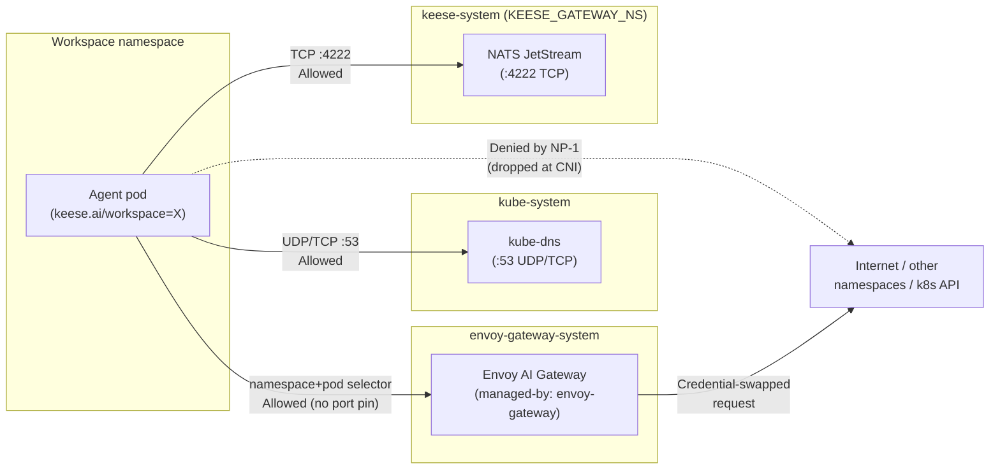
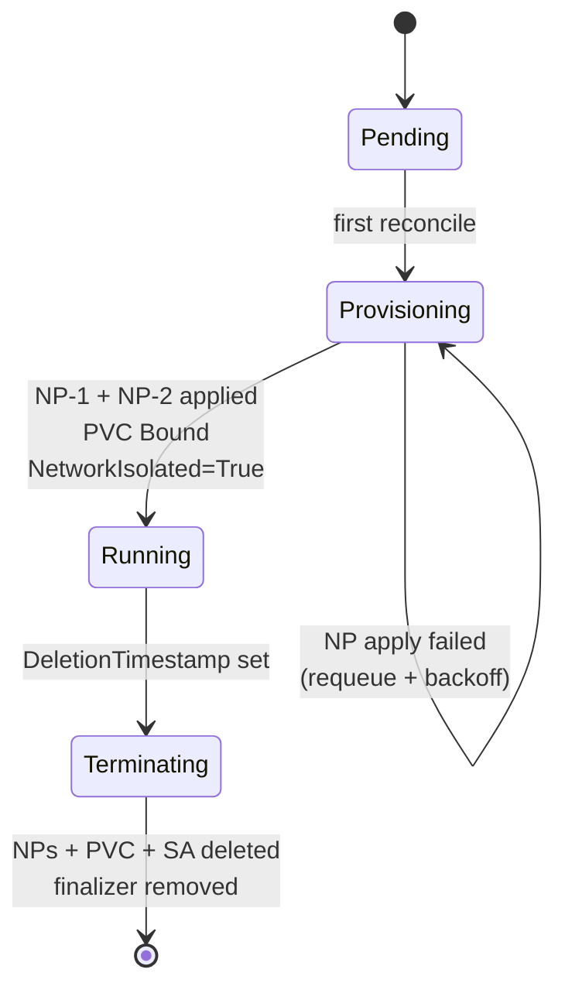

<!-- SPDX-License-Identifier: Apache-2.0 -->
<!-- Copyright (c) 2026 keese-ai -->

# Network isolation

Every workspace namespace receives a pair of fail-closed `NetworkPolicy` objects the moment it is reconciled, ensuring a compromised agent pod cannot reach arbitrary internet endpoints, peer namespaces, or the Kubernetes API.

!!! info "Audience"
    Platform operators and security reviewers who need to understand how workspace traffic is constrained. **Prerequisites:** [Concepts in 5 minutes](../getting-started/concepts-in-5-minutes.md) · [Identity & zero-trust](identity-zero-trust.md) · [Workspaces & sessions](workspaces.md)

---

## Why fail-closed by default

Keese's threat model treats every agent runtime pod as potentially compromised (zero-trust rule 05). A compromised pod must not:

- Reach arbitrary internet addresses to exfiltrate data or download payloads.
- Contact peer workspace namespaces directly and bypass authorization checks.
- Reach the Kubernetes API or internal cluster services that are not explicitly permitted.

The only legitimate outbound paths for an agent pod are the **Envoy AI Gateway** (all model and tool calls) and **NATS JetStream** (async messaging). Everything else is dropped at the CNI level, before any application-layer control can intervene.

---

## The two NetworkPolicy objects

The `WorkspaceReconciler` applies exactly two `NetworkPolicy` objects to every workspace namespace via **Server-Side Apply** (`fieldOwner: keese-workspace-controller`). Both are applied at workspace creation and re-asserted on every reconcile pass — the loop is idempotent across three or more passes.

Policy names embed the workspace UID so they are collision-safe across tenants:

| Object name | Purpose |
|---|---|
| `keese-workspace-<uid>-default-deny` | Deny all ingress and all egress for pods carrying `keese.ai/workspace=<name>` |
| `keese-workspace-<uid>-egress` | Allow egress to: kube-dns (:53), Envoy AI Gateway pods, NATS pods (:4222) |

### NP-1 — fail-closed default-deny

```yaml
apiVersion: networking.k8s.io/v1
kind: NetworkPolicy
metadata:
  name: keese-workspace-<uid>-default-deny
  namespace: <workspace-namespace>
spec:
  podSelector:
    matchLabels:
      keese.ai/workspace: <workspace-name>
  policyTypes: [Ingress, Egress]
  # No rules → deny all ingress and egress
```

The empty `policyTypes` list with no rule entries is the Kubernetes-native way to express a deny-all. The `podSelector` is scoped to pods that carry the `keese.ai/workspace` label; other pods in the namespace (e.g. Capsule admission infrastructure) are not affected.

### NP-2 — egress allowlist

```yaml
apiVersion: networking.k8s.io/v1
kind: NetworkPolicy
metadata:
  name: keese-workspace-<uid>-egress
  namespace: <workspace-namespace>
spec:
  podSelector:
    matchLabels:
      keese.ai/workspace: <workspace-name>
  policyTypes: [Egress]
  egress:
  # kube-dns — required for in-cluster Service name resolution
  - ports:
    - protocol: UDP
      port: 53
    - protocol: TCP
      port: 53
    to:
    - namespaceSelector:
        matchLabels:
          kubernetes.io/metadata.name: kube-system
      podSelector:
        matchLabels:
          k8s-app: kube-dns

  # Envoy AI Gateway — namespace+pod selector only (see port-pinning caveat below)
  - to:
    - namespaceSelector:
        matchLabels:
          kubernetes.io/metadata.name: envoy-gateway-system
      podSelector:
        matchLabels:
          app.kubernetes.io/managed-by: envoy-gateway

  # NATS JetStream — port 4222 pinned
  # namespace = KEESE_GATEWAY_NS env var (default: keese-system)
  - ports:
    - protocol: TCP
      port: 4222
    to:
    - namespaceSelector:
        matchLabels:
          kubernetes.io/metadata.name: keese-system   # <KEESE_GATEWAY_NS>
      podSelector:
        matchLabels:
          app.kubernetes.io/name: nats
```

No CIDR blocks are used. Every allow names an exact destination via the `namespaceSelector + podSelector` conjunction — the narrowest selector the `networking.k8s.io/v1` API supports (zero-trust rule 05.5).

!!! warning "Gateway egress rule: namespace+pod selector only — no destination port pinning"
    The egress rule for the Envoy AI Gateway deliberately omits a `ports` entry. Kubernetes `NetworkPolicy` port matching operates on the **destination pod's container port** (after kube-proxy DNAT), not the Service port the client dials. The Envoy Gateway proxy pod's listener port is controlled by the upstream Helm chart (e.g. `10443` in chart v1.4.x) and is not in keese's control. Pinning `:443` in the policy would cause the traffic — which arrives at the pod on a different port — to be dropped silently.

    The security boundary remains the `namespaceSelector + podSelector` conjunction, which allows egress only to pods managed by Envoy Gateway in the `envoy-gateway-system` namespace. Destination port pinning can be re-introduced once a service-port-aware CNI (Cilium with `EnableServiceTopology`, or Calico named ports) is in use. This is tracked as a future improvement in the design.

---

## Traffic flow diagram



The gateway is the only hop that reaches the internet. It terminates the agent's projected ServiceAccount token, evaluates the OpenFGA authorization check via `ext_authz`, and injects the appropriate upstream credential before forwarding. See [Egress & the AI Gateway](egress-ai-gateway.md) and [Credential broker](credential-broker.md).

---

## Policy lifecycle ownership

The Workspace controller owns both policies via SSA — not Capsule's `TenantResource`. This avoids SSA field-ownership conflicts: Capsule manages quota, LimitRange, and RBAC at the `Tenant` level and does not write workspace `NetworkPolicy` objects. Platform-team policies that write to distinct names coexist without conflict.

When a `Workspace` is deleted, the finalizer (`finalizers.workspace.keese.ai/cleanup`) ensures both `NetworkPolicy` objects are removed before the finalizer is released. See [`internal/controller/keese/workspace_controller.go`](https://github.com/keese-ai/keese/blob/main/internal/controller/keese/workspace_controller.go) lines 275–283.

---

## The `NetworkIsolated` condition

After both policies are applied successfully, the reconciler sets a condition on `Workspace.status`:

```yaml
conditions:
- type: NetworkIsolated
  status: "True"
  reason: NetworkPoliciesApplied
  message: Default-deny and egress allow NetworkPolicies are in place
  observedGeneration: 1
```

If either SSA call fails (e.g. the CNI has not registered the `networking.k8s.io` API), `NetworkIsolated` remains `False`, `Progressing` flips to `True` with reason `NetworkPolicyFailed`, and the reconciler requeues with backoff. The workspace does not advance to `Running` until `NetworkIsolated` is `True`.



---

## Argo Workflow pod isolation

Argo step pods run in the workspace namespace (same-namespace model from design 03) and carry the `keese.ai/workspace` label. They inherit NP-1 and NP-2 automatically — no Argo-specific `NetworkPolicy` authoring is needed. The Argo controller itself lives outside workspace namespaces and is unaffected by these policies.

Artifact store egress (S3, GCS, MinIO) is a cross-dependency tracked in design 21. When enabled, `spec.artifactEgressPolicy` on the `Workspace` causes the controller to inject a third `NetworkPolicy` via SSA, also scoped by label. Dev-mode MinIO egress is granted only to namespaces labeled `keese.ai/dev-only: "true"`.

!!! warning "Planned — not yet implemented"
    The `spec.artifactEgressPolicy` field and the third `NetworkPolicy` injection are described in design 21 and are not yet implemented. Artifact egress is currently blocked for workspace pods.

---

## Cross-tenant agent-to-agent calls

`spec.a2a scope: cross-tenant` (Transport CRD, design 09) does **not** add a direct pod-to-pod egress rule between tenant namespaces. All cross-tenant agent calls route through the Envoy AI Gateway (port 443 / pod-selector path, already permitted by NP-2). The gateway validates the `CrossTenantAgreement`-backed OpenFGA tuple (`workspace.messageable_from`) before forwarding.

`keese.ai/cross-tenant-peer-of` namespace labels are intentionally **not used** as `NetworkPolicy` selectors. A direct pod-to-pod egress path across tenant namespaces would bypass `ext_authz` and violate zero-trust rule 05.4.

---

## Bootstrap requirements

The egress allow rules use `namespaceSelector` to target specific namespaces by their `kubernetes.io/metadata.name` label (stable since Kubernetes 1.21). No additional labeling is required for those selectors.

The NATS namespace selector in NP-2 is determined by the `KEESE_GATEWAY_NS` environment variable (default: `keese-system`), read by `WorkspaceReconciler.GatewayNamespace`. The Envoy AI Gateway proxy runs in `envoy-gateway-system` (hardcoded); a `Service` of type `ExternalName` in `keese-system` (named `envoy-ai-gateway`) aliases to the real proxy for DNS resolution.

!!! warning "Dev bootstrap operational gotcha — set KEESE_GATEWAY_NS=nats"
    The dev bootstrap helmfile deploys NATS to the `nats` namespace, not `keese-system`.
    If you run keese against a dev cluster without overriding `KEESE_GATEWAY_NS=nats`,
    the NATS egress rule will select `keese-system` for NATS pods — which will not match
    any pod — and agent pods will be unable to reach NATS. Always set
    `KEESE_GATEWAY_NS=nats` when using the standard dev bootstrap.

Run the pre-flight check before provisioning workspaces in a new cluster:

```bash
# Verify that namespace labels are in place and the CNI enforces NetworkPolicy
make check-np-labels
```

!!! danger "CNI must enforce NetworkPolicy"
    `kindnet` (the default kind CNI) does **not** enforce `NetworkPolicy`. The CI matrix uses Calico on kind for all network-isolation tests. Running keese on a cluster with a non-enforcing CNI silently removes the network boundary. Always verify CNI enforcement before trusting the fail-closed guarantee.

---

## Observability

| Signal | Name | Notes |
|---|---|---|
| OTEL span | `keese.network.np.applied` | emitted on each successful SSA pass |
| OTEL span | `keese.network.np.conflict` | emitted when SSA returns a field-ownership conflict |
| Event | `NetworkPolicyApplied` | recorded on the `Workspace` object |
| Event | `NetworkPolicyConflict` | triggers alert after 3 conflicts in 5 minutes |
| Event | `NetworkPolicyGapDetected` | fired when a required namespace label is missing |
| Metric | `keese_workspace_np_apply_total{result}` | labelled `success` / `error` |
| Metric | `keese_workspace_np_conflict_total{namespace}` | count of SSA conflicts per namespace |

CNI flow logs (Cilium Hubble `cilium_drop_total{reason="POLICY_DENIED"}` or Calico flow logs) feed into the `keese-netflow-*` Elastic index. An alert fires on unexpected drops in workspace namespaces.

---

## Failure modes

| Failure | Detection | Mitigation |
|---|---|---|
| NP-2 labels missing or wrong | `NetworkPolicyGapDetected` event; agent pod `EgressBlocked` | Run `make check-np-labels`; re-apply bootstrap helmfile |
| CNI does not enforce NP | Negative kuttl test fails in CI | Enforce Calico (or Cilium) on every non-dev cluster |
| Platform team overwrites NP | SSA `NetworkPolicyConflict` event; conflict metric spikes | Controller re-asserts on next reconcile; alert after 3 conflicts/5m |
| Artifact egress blocked | `WorkflowRun.status.phase=Failed`; `ArtifactEgressBlocked` event | Awaiting design-21 implementation |
| Cross-tenant direct pod attempt | NP-1 drops silently; `A2APeerAuthzDenied` at gateway | Architecture prevents direct path; all cross-tenant traffic transits gateway |

**Break-glass:** `kubectl patch networkpolicy <name> -n <ns> --type=merge` opens a temporary gap. The controller will re-assert the intended policy on the next reconcile. Break-glass events must be logged per zero-trust rule 05.13.

---

## Test coverage

| Test | Kind | Assertion |
|---|---|---|
| `TestWorkspaceNPApplied` | envtest | NP-1 and NP-2 exist after reconcile; idempotent across 3 passes |
| `TestWorkspaceNPFieldOwner` | envtest | SSA `fieldOwner = keese-workspace-controller` on both NPs |
| `TestNegativeEgressInternet` | kuttl | Pod in workspace namespace cannot reach `1.1.1.1:80` (Calico-enforced kind) |
| `TestPositiveEgressGateway` | kuttl | Pod can reach Envoy AI Gateway service |
| `TestPositiveEgressNATS` | kuttl | Pod can reach NATS service on `:4222` |
| `TestArgoStepPodInheritsNP` | kuttl | Argo step pod in workspace namespace cannot reach `1.1.1.1:80` |
| `TestCrossTenantDirectBlocked` | kuttl | Pod cannot reach a peer workspace pod IP directly |

---

## See also

- [Identity & zero-trust](identity-zero-trust.md) — the threat model and zero-trust invariants these policies enforce
- [Egress & the AI Gateway](egress-ai-gateway.md) — what happens after traffic reaches the gateway
- [Credential broker](credential-broker.md) — how the gateway swaps agent tokens for upstream credentials
- [Workspaces & sessions](workspaces.md) — the full workspace lifecycle and all reconciled sub-resources
