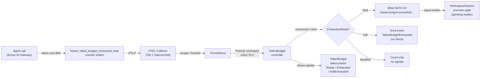
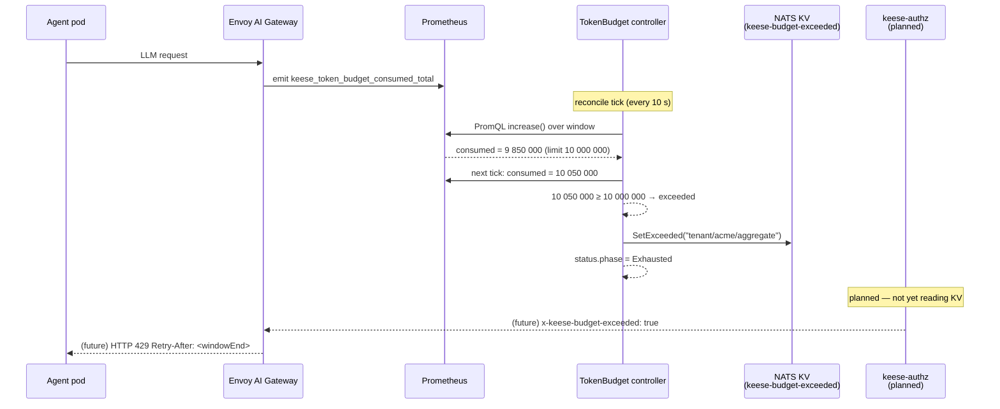

<!-- SPDX-License-Identifier: Apache-2.0 -->
<!-- Copyright (c) 2026 keese-ai -->

# Token budgets & observability

keese accounts for LLM token consumption through a layered pipeline: Prometheus counters
produced by the Envoy AI Gateway feed a `TokenBudget` controller that enforces long-window
spend limits and propagates enforcement signals, while an OpenTelemetry collector topology
delivers traces, logs, and metrics to Elastic APM and ECK.

!!! info "Audience"
    Platform operators configuring spend controls and observability pipelines.
    **Prerequisites:** [Egress & the AI Gateway](egress-ai-gateway.md) ·
    [Tenancy & namespaces](tenancy.md)

---

## How token accounting works

Every LLM call routed through the Envoy AI Gateway emits a Prometheus counter
after the upstream response:

```
keese_token_budget_consumed_total{tenant, workspace, model, direction}
```

`direction` is `input` or `output`. The counter is written by the gateway's
token-cost filter and reaches Prometheus through the OTEL collector pipeline
(Tier 1 DaemonSet → Tier 2 Deployment; see [OTEL pipeline topology](otel-pipeline.md)).

The `TokenBudget` controller (under `policy.keese.ai/v1alpha1`) reconciles every
10 seconds. For each `TokenBudget` CR it queries Prometheus using
`sum(increase(keese_token_budget_consumed_total{...}[<windowDuration>]))` to
calculate consumption within the current accounting window, then compares the
result against the per-model limits declared in `spec.limits`.



### Accounting window

`spec.windowDuration` sets the billing window (default `720h`, i.e. 30 days).
The format accepts `h`, `d`, and `m` suffixes (e.g. `24h`, `7d`).
`spec.windowAnchor` optionally anchors the window to a fixed RFC3339 timestamp;
without it the window starts at the first reconcile. On every boundary the
controller archives `status.consumedCurrent` into `status.consumedPrevious`
and resets counters.

### Scope: tenant vs. workspace

A `TokenBudget` scopes to exactly one of a named `Tenant` (cluster-level
aggregate) or a named `Workspace` (namespace-scoped). The CEL validation rule
on `spec.scope` enforces the discriminated one-of:

```yaml
apiVersion: policy.keese.ai/v1alpha1
kind: TokenBudget
metadata:
  name: acme-monthly
  namespace: acme
spec:
  scope:
    tenant:
      name: acme           # or workspace: {name: my-workspace}
  windowDuration: "720h"
  exhaustionMode: hard     # hard | soft | disabled
  limits:
    - model: "*"           # aggregate across all models
      totalTokens: 10000000
    - model: "claude-sonnet-4-6"
      inputTokens: 6000000
      outputTokens: 4000000
```

### ExhaustionMode

| Mode | Behavior |
|---|---|
| `hard` (default) | Controller writes `true` to NATS KV key `keese-budget-exceeded/<scope>/<model>`. In-flight upstream call completes (Envoy pool semantics); subsequent calls are blocked. |
| `soft` | Emits a `TokenBudgetExhausted` Kubernetes event and the `keese_token_budget_exhaustion_events_total{mode=soft}` counter. No gateway block. |
| `disabled` | Counting continues; no enforcement signals of any kind. Use this as a rollback path. |

!!! warning "NATS enforcement reader not yet implemented"
    The controller writes the NATS KV boolean signal (`hard` mode) but the
    gateway-side reader — the `keese-authz` ext_proc step that consults the
    `keese-budget-exceeded` KV bucket and returns HTTP 429 — does not yet exist.
    Until that reader ships, `exhaustionMode: hard` records the signal but does
    **not** block traffic. Three pieces ship together when enforcement lands:
    the `nats-io/nats.go` dependency, a real `NatsJSSignaler` wired in `cmd/main.go`,
    and the gateway-side KV reader. See
    [`internal/controller/policy/nats.go`](https://github.com/keese-ai/keese/blob/main/internal/controller/policy/nats.go)
    for the interface comment.

---

## Budget exceeded path



The sequence highlights the current partial state: the controller writes the
signal, but the gateway does not yet read it. The reconcile-to-enforcement lag
(up to 10 seconds) is intentional — short-window rate limiting is handled by
Envoy AI Gateway's `BackendTrafficPolicy` token-cost filter; `TokenBudget`
governs long-window (daily/monthly) spend.

---

## TokenBudget status and conditions

The controller maintains four conditions on every `TokenBudget`:

| Condition | Meaning |
|---|---|
| `Ready` | True unless `exhaustionMode: hard` and the budget is exceeded. |
| `BudgetExceeded` | True when any limit entry is crossed. |
| `MetricFetchHealthy` | False when Prometheus queries fail; last-known values held (no false-clear). |
| `ResetFailed` | True when a window-reset failed; enforcement holds on the stale signal. |

Printer columns visible via `kubectl get tb`:

```bash
kubectl get tb -n acme
# NAME           AGE   READY   PHASE      WINDOWEND              EXHAUSTION
# acme-monthly   3d    True    Ready      2026-06-28T00:00:00Z   hard
```

Phase values are `Ready`, `Exhausted`, `SoftExhausted`, and `ResetFailed`.

### Prometheus metrics emitted by the controller

| Metric | Type | Labels |
|---|---|---|
| `keese_token_budget_consumed_total` | Counter | `tenant, workspace, model, direction` |
| `keese_token_budget_limit` | Gauge | `tenant, model, window, direction` |
| `keese_token_budget_remaining` | Gauge | `tenant, model, window, direction` |
| `keese_token_budget_exhaustion_events_total` | Counter | `tenant, workspace, mode` |
| `keese_token_budget_reset_errors_total` | Counter | `tenant, window` |

### Cardinality ceiling

The TokenBudget controller hard-rejects creation of more than 1,200 `TokenBudget` CRs
cluster-wide (controller-side enforcement; no separate `ValidatingAdmissionPolicy`
exists for this ceiling). The controller emits a `TooManyBudgets` warning event when
the count exceeds 900. Cardinality estimate: 100 tenants × 10 models × 3 windows × 2
directions = 60K series — well within Prometheus limits.

---

## OTEL pipeline

Traces, logs, and metrics flow through a two-tier OpenTelemetry collector
design (Tier 1 DaemonSet → Tier 2 Deployment). The pipeline is currently
**disabled by default** in `make bootstrap-infra`. For collector topology,
sampling strategy, fan-out destinations, and APM fallback details see
[OTEL pipeline topology](otel-pipeline.md).

---

## FeatureGate metrics

The `FeatureGateReconciler` (also in the `policy` package) projects effective
gate values into ConfigMap `keese-system/keese-features` (`gates.json`) via
Server-Side Apply. It emits one Kubernetes event per gate transition requiring
a restart:

```
event reason: RestartRequired
message: "FeatureGate <name> changed; consumers (<owners>) require restart to observe the new value"
```

The controller itself does not emit Prometheus metrics. The `status.effective`
field on each `FeatureGate` CR is the observable state; the Ready condition
reflects whether the projection succeeded.

!!! note "keese-authz ext_authz binary emits no metrics"
    The `keese-authz` binary has its Prometheus `BindAddress` set to `'0'`
    (`cmd/keese-authz/main.go:95`), so no `/metrics` endpoint is exposed.
    Allow/deny rates must be derived from its structured audit log, not from a
    Prometheus scrape.

The `OIDCProvider` controller **does** emit Prometheus metrics:

| Metric | Type | Description |
|---|---|---|
| `keese_oidc_template_eval_errors_total` | Counter | Audience-template render failures |
| `keese_oidc_audience_template_eval_total` | Counter | Total audience-template evaluations |
| `keese_oidc_token_rotation_seconds` | Histogram | SA token rotation latency |
| `keese_gateway_jwks_fetch_failures_total` | Counter | JWKS endpoint fetch failures |
| `keese_oidc_cache_invalidations_total` | Counter | JWKS cache invalidations |

The `CrossTenantAgreement` controller does not currently emit Prometheus metrics;
observability is limited to Kubernetes events and controller-runtime structured logs.

---

## Failure modes

| Failure | Detection | Mitigation |
|---|---|---|
| Prometheus unavailable | `MetricFetchHealthy=False` condition; `MetricFetchFailed` event | Controller retries; existing enforcement signal held (fail-closed) |
| Budget reset fails | `status.phase=ResetFailed`; `TokenBudgetResetFailed` alert | Enforcement continues; manual NATS KV delete runbook |
| NATS KV signal write fails | `BudgetSignalWriteFailed` event; `keese_token_budget_reset_errors_total` | Retry with backoff; alert at >1% drop rate |
| Controller + NATS both down | No signal; no `hard` enforcement | Short-window `BackendTrafficPolicy` still enforces; `BudgetEnforcementUnavailable` alert |
| APM exporter down | `send_failed_spans_total>0` sustained 30 s | Fallback chain; `APMExportDegraded` event |
| Span missing `keese.tenant` | `keese_otel_discard_total` | Route to `keese-discard-*`; ops review |

---

## See also

- [OTEL pipeline topology](otel-pipeline.md) — two-tier collector design, sampling, APM fallback
- [Egress & the AI Gateway](egress-ai-gateway.md) — `BackendTrafficPolicy` token-cost filter (short-window rate limiting)
- [Guardrails](guardrails.md) — `GuardrailBinding.spec.tokenBudget` merge lattice
- [Feature gates](feature-gates.md) — FeatureGate CR and the `keese-features` ConfigMap
- [guides/token-budgets.md](../guides/token-budgets.md) — step-by-step: create a TokenBudget, verify consumption, test exhaustion
