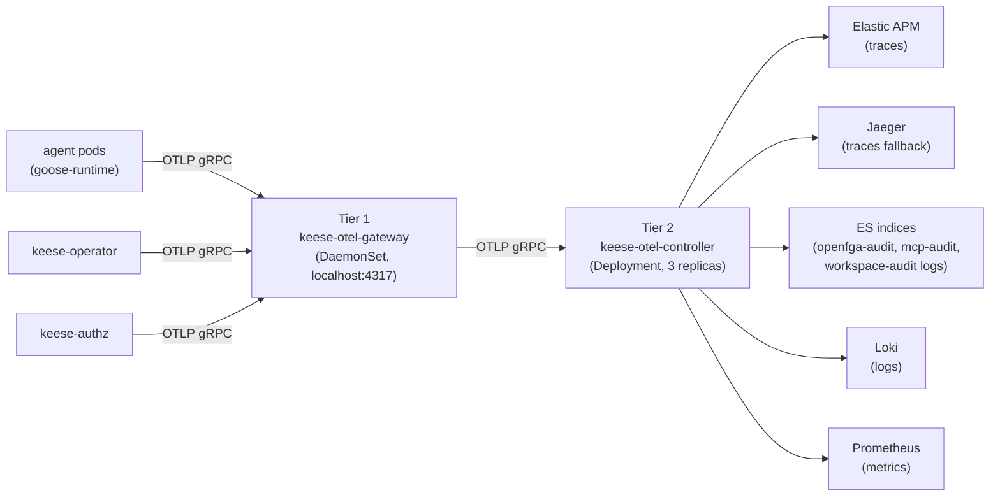

<!-- SPDX-License-Identifier: Apache-2.0 -->
<!-- Copyright (c) 2026 keese-ai -->

# OTEL pipeline topology

keese routes traces, logs, and metrics through a two-tier OpenTelemetry
collector design (design
[`10a`](https://github.com/keese-ai/keese/blob/main/docs/designs/10a-otel-topology.md)).
The pipeline is currently **disabled by default** — see the warning below.

!!! info "Audience"
    Platform engineers configuring the observability stack.
    **Prerequisites:** [Token budgets & observability](observability.md) ·
    [Egress & the AI Gateway](egress-ai-gateway.md)

---

## Two-tier collector design

**Tier 1 — Gateway DaemonSet (`keese-otel-gateway`):** One pod per node.
Envoy and `keese-authz` pods emit OTLP to `localhost:4317` (DaemonSet
hostPort). Co-location is required for tail-sampling correctness. Resources:
1 vCPU / 2 Gi request; 2 vCPU / 4 Gi limit.

**Tier 2 — Controller Deployment (`keese-otel-controller`):** 3 replicas with
HPA on memory (80%) and PDB `minAvailable: 2`. Receives OTLP from Tier 1
forwarders, agent pods, and operator controllers. Applies resource-attribute
injection, the `keese-argument-redactor` processor, and the tenant-isolation
filter. Reachable at `keese-otel-controller.keese-system.svc.cluster.local:4317`.

!!! warning "OTEL Collector Helmfile release disabled"
    The Tier 1 and Tier 2 collector deployments are specified in
    `dev/bootstrap/values/otel-collector.yaml` but the Helmfile release is
    currently **disabled** (not installed by `make bootstrap-infra`). Traces,
    logs, and metrics will not flow until the release is re-enabled and the
    `helmfile.lock` pin is updated. The `TokenBudget` controller falls back to
    its `FakePrometheusQuerier` when Prometheus is unreachable; all budgets
    hold their last-known values (no false-clear).

---

## Sampling strategy

| Traffic class | Mechanism | Dev rate | Prod rate |
|---|---|---|---|
| Normal (non-error, within SLO) | Head probabilistic | 10% | 1% |
| Error spans (`status_code=ERROR`) | Tail 100% keep | 100% | 100% |
| Slow spans (p95 > 2× SLO) | Tail 100% keep | 100% | 100% |
| Budget-exhausted / force-revoke | Tail 100% keep | 100% | 100% |

Tail-sampling: `decision_wait: 10s`; `num_traces: 50,000` (gateway tier).

---

## Fan-out destinations

| Destination | Pipeline | Retention |
|---|---|---|
| Elastic APM | Traces (Tier 2) | 30-day hot, 90-day warm |
| Jaeger | Traces fallback | 7-day |
| ES `keese-openfga-audit-*` | Logs (Tier 1+2) | 30-day ILM |
| ES `keese-mcp-audit-*` | Logs (Tier 2) | 30-day ILM |
| ES `keese-workspace-audit-*` | Logs (Tier 2) | 30-day ILM |
| Loki `{job=keese-*}` | Logs (Tier 1+2) | ≥ 1 year |
| Prometheus | Metrics (Tier 1+2) | 30-day |

### APM fallback

Primary: `otlp/apm` exporter to
`keese-apm-apm-http.elastic-system.svc.cluster.local:8200`. If
`otelcol_exporter_send_failed_spans_total{exporter="apm"}` exceeds zero for
30 seconds, the collector falls back to: (1) Jaeger, if deployed; (2) debug
exporter (dev only); (3) drop with counter
`keese_otel_traces_dropped_total{reason="no_exporter"}` and a
`APMExportDegraded` event. Recovery: 5 minutes of clean APM exports restores
the primary.

---

## Per-tenant trace isolation

Tier 2 injects `keese.tenant=<T>` from the `x-keese-tenant` header stamped
by `keese-authz`. Spans still missing `keese.tenant` after injection are routed
to `keese-discard-*` indices and counted by
`keese_otel_discard_total{reason="missing_tenant"}`. Kibana surfaces one Space
per tenant; the Tenant controller writes the Kibana ES role via SSA.

---

## Mandatory resource attributes

| Attribute | Source |
|---|---|
| `service.name` | Binary constant (`keese-operator`, `keese-authz`, `goose-runtime`) |
| `service.version` | Semver via `ldflags -X` |
| `k8s.pod.uid` / `k8s.pod.name` | Downward API |
| `keese.tenant` | Tier 2 processor from `x-keese-tenant` |
| `keese.workspace` | Tier 2 processor from `x-keese-workspace` when present |
| `deployment.environment` | ConfigMap `keese-otel-env` key `env` |

---

## See also

- [Token budgets & observability](observability.md) — TokenBudget policy, spend controls
- [Observability setup guide](../guides/observability-setup.md) — step-by-step collector setup
- [Metrics & events reference](../reference/metrics-events.md) — full Prometheus metric catalog
