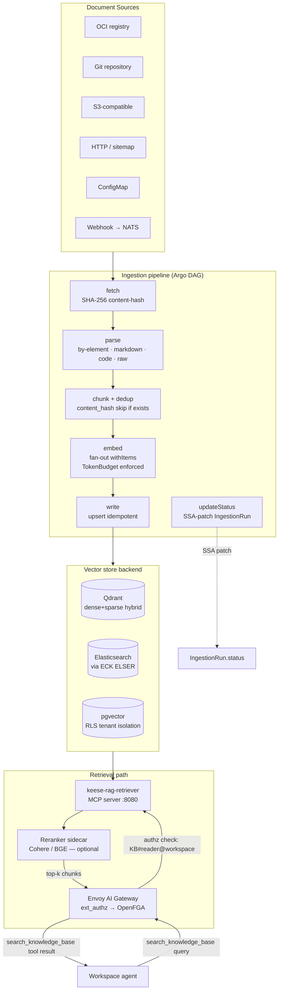
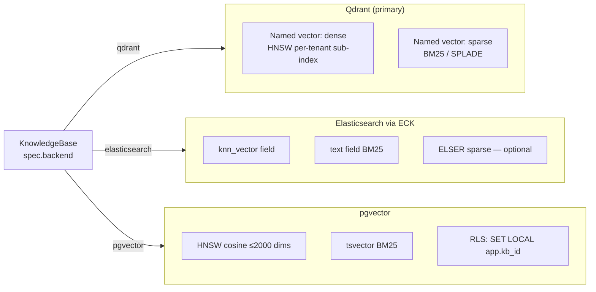

<!-- SPDX-License-Identifier: Apache-2.0 -->
<!-- Copyright (c) 2026 keese-ai -->

# RAG & knowledge bases

Retrieval-augmented generation (RAG) in keese lets workspace agents query structured
document indexes over a secure, budget-enforced MCP tool — without ever holding
embedding-provider credentials.

!!! warning "Planned — not yet implemented"
    The designs for this capability are finalized (score 95/100, `status: current`) and
    a full API spec exists, but **no controller code has been written yet**. Everything
    on this page describes the intended design. Do not rely on any of these APIs in
    production.

!!! info "Audience"
    Agent platform engineers who need to understand how keese will surface document
    retrieval to workspace agents. **Prerequisites:** [Workspaces & sessions](workspaces.md),
    [Authorization (ReBAC / OpenFGA)](authorization-rebac.md),
    [Egress & the AI Gateway](egress-ai-gateway.md).

---

## How RAG differs from Memory

keese's `Memory` CRD (see [Memory](memory.md)) is a per-workspace session scratch-pad:
agents write and read short-lived context within a single session. `KnowledgeBase` is
different in every dimension:

| | Memory | KnowledgeBase |
|---|---|---|
| Scope | One workspace session | Shared across many workspaces |
| Write path | Agent writes inline, at runtime | Batch or streaming ingestion pipeline |
| Read path | Direct store call | MCP tool via Envoy AI Gateway |
| Credential on agent pod | None (projected SA token) | None (retriever pod holds creds) |
| Indexing | Key-value / graph / vector (simple) | Multi-source, chunked, embedded, dedup |

Both preserve the zero-trust invariant: agent pods carry no upstream credentials (rule 05.2).

---

## The five CRDs

All five kinds land in the `keese.ai/v1alpha1` API group.

| Kind | Scope | Short name | Responsibility |
|---|---|---|---|
| `KnowledgeBase` | Namespaced | `kb` | Index configuration, backend binding, retrieval policy |
| `DocumentSource` | Namespaced | `ds` | Source connector definition and schedule |
| `IngestionRun` | Namespaced | `ir` | One execution of the ingestion pipeline (Argo-backed, TTL 7d) |
| `EmbeddingModel` | Namespaced | `em` | Provider, model name, and dimension (immutable after creation) |
| `SharedKnowledgeBase` | Cluster | `skb` | Cross-tenant read grants, backed by an Approved `CrossTenantAgreement` |

The design source of truth is
[`docs/designs/28-rag-ingestion.md`](https://github.com/keese-ai/keese/blob/main/docs/designs/28-rag-ingestion.md),
[`docs/designs/28b-rag-backends.md`](https://github.com/keese-ai/keese/blob/main/docs/designs/28b-rag-backends.md), and
[`docs/designs/28c-rag-pipeline.md`](https://github.com/keese-ai/keese/blob/main/docs/designs/28c-rag-pipeline.md).

---

## Ingestion and retrieval pipeline

The diagram below shows the full planned data path from raw documents to an agent
tool response.



### Ingestion stages

Each `IngestionRun` maps to an Argo Workflow DAG with six ordered steps:

1. **fetch** — pulls raw content from the `DocumentSource` connector; assigns a SHA-256
   content hash to each blob.
2. **parse** — extracts structure using the configured parser strategy: `by-element`
   (Unstructured.io, default), `markdown` (header-hierarchy-aware), `code`
   (tree-sitter function-boundary), or `raw` (fixed-size sliding window).
3. **chunk + dedup** — splits documents into chunks tagged with metadata
   (`knowledge_base_id`, `document_source_id`, `source_uri`, `content_hash`,
   `chunk_index`, `token_count`, `language`, `ingested_at`). Chunks whose
   `content_hash` already exists in the backend are skipped; the counter
   `IngestionRun.status.skippedDedup` tracks this.
4. **embed** — calls the embedding API in a fan-out (`withItems`) Argo step. Before
   each batch, the controller checks `TokenBudget.status.remaining` for
   `embedding_tokens`; exhaustion halts the run with event `EmbeddingBudgetExhausted`.
5. **write** — upserts vectors to the backend using `content_hash` as the idempotency
   key. Increments `IngestionRun.status.chunksWritten`.
6. **updateStatus** — SSA-patches `IngestionRun.status` fields with final counts.

### Retrieval contract

A `keese-rag-retriever` Deployment (one per `KnowledgeBase`) exposes an MCP server on
port 8080. Agent calls arrive through the Envoy AI Gateway `MCPRoute`; `ext_authz`
checks the OpenFGA relation `knowledge_base:KB#reader@workspace:W` before the request
reaches the retriever. Agents that fail the authz check receive an MCP error — no
data leaks across workspace boundaries.

The exposed MCP tool signature:

```
search_knowledge_base(query: string, top_k: int, filters: map)
```

Internally the retriever:

1. Embeds the query using the same `EmbeddingModel` as the index.
2. Runs a hybrid dense + sparse search against the backend.
3. Optionally reranks with a sidecar (Cohere rerank-v3 or BGE-reranker); if the
   sidecar is unreachable it falls back silently to RRF-only (event
   `RerankerUnavailable`).
4. Returns the top-k chunks with metadata to the agent.

---

## Vector store backends

Three backends are supported in `v1alpha1`, bound to `KnowledgeBase.spec.backend`
as a discriminated one-of. The backend type is **immutable** after creation — enforced
by a CEL `XValidation` rule on the CRD (controller rejects any UPDATE that changes
`spec.backend.type`). Migration is always create-new-KB + reingest + workspace cutover.



### Qdrant

The primary backend. A single collection per `KnowledgeBase`; tenant isolation is
achieved via payload filtering (`tenantPayloadField`, default `knowledge_base_id`)
with a per-tenant HNSW sub-index (`payload_m=16`). Hybrid search combines a dense
named vector with a sparse named vector; weights come from
`spec.hybridSearch.{bm25Weight,vectorWeight}`.

Credentials flow: OpenBao → ExternalSecrets Operator → Kubernetes Secret → projected
volume at `/var/run/keese/secrets/qdrant-api-key` on the retriever pod. Agent pods
never see the key (rule 05.2, rule 05.7).

### Elasticsearch via ECK

References an existing ECK-managed `Elasticsearch` CR (the same cluster used for
observability). keese does not provision the ECK cluster. Index strategy is
`per-kb` (default) or `shared` (adds a `knowledge_base_id` term filter). Optional
ELSER sparse model enables learned sparse retrieval. Retrieval uses a single
`_search` combining `knn` + `query.match` + `rrf`. ILM retention is configurable via
`spec.backend.elasticsearch.ilmPolicy` (default: hot-warm-delete 90d).

### pgvector

ACID guarantees with Row-Level Security for tenant isolation. The HNSW index is
limited to 2000 dimensions by pgvector; the KnowledgeBase controller rejects
(via a CEL `XValidation` on the `EmbeddingModel` CRD) any `EmbeddingModel` with
`spec.dimensions > 2000` when bound to a `pgvector` backend — this is a CRD-level
CEL rule, not a separate `ValidatingAdmissionPolicy`. Retrieval uses a single SQL
query combining `tsvector` BM25 rank and pgvector cosine distance fused via a CTE.
The controller sets `SET LOCAL app.kb_id = '<kb-uid>'` on each query session to
enforce the RLS policy.

!!! danger "pgvector dimension ceiling"
    pgvector's HNSW index hard-caps at 2000 dimensions. Admission will reject
    any `EmbeddingModel` pairing with `pgvector` that exceeds this limit. Use Qdrant
    or Elasticsearch for models with higher-dimensional embeddings (e.g., 3072-dim
    OpenAI `text-embedding-3-large`).

---

## Embedding model

`EmbeddingModel` records the provider, model name, embedding dimension, and endpoint.

!!! warning "Dimension is immutable"
    `spec.dimensions` cannot be changed after creation — enforced by a CEL `XValidation`
    rule on the `EmbeddingModel` CRD (not the `embedding-dim-immutable` VAP, which covers
    `Memory` and `SharedMemory` resources). Changing the model means creating a new
    `EmbeddingModel` object, creating a new `KnowledgeBase` that references it,
    reingesting all content, and cutting workspaces over. Any `KnowledgeBase` that still
    references the old `EmbeddingModel` blocks its deletion (event
    `EmbeddingModelInUseDeleteRejected`).

Supported providers: `openai`, `cohere`, `voyage`, `nvidia`, `jina`, and `local`
(in-cluster Service). Hosted providers resolve credentials through the
[Credential broker](credential-broker.md); agent pods are never involved in that
exchange.

---

## Streaming ingestion

`DocumentSource.spec.mode: streaming` switches from scheduled Argo batch runs to a
long-lived Deployment-based embedder:

- The controller provisions a NATS JetStream subject
  `keese.tenant.<t>.rag.<ds-uid>.>` when the `DocumentSource` is created.
- A `keese-embedder-<ds-uid>` Deployment subscribes to that subject, processes
  chunks as they arrive, and writes them to the backend.
- CDC pipelines (e.g., Debezium) publish to the NATS subject; the Debezium CR is
  managed outside keese's scope.
- Both the Deployment and the NATS subject are torn down by the `DocumentSource`
  finalizer on deletion — no orphans.
- A `PodDisruptionBudget` ensures at least one embedder pod remains ready during
  node drain.

---

## Authorization and cross-tenant sharing

Every authorization-affecting field on these CRDs carries a `+keese:rebac-tuple`
marker. The controller writes OpenFGA tuples as part of its reconcile loop.

| Tuple written | By | When |
|---|---|---|
| `knowledge_base:KB#owner@tenant:T` | KnowledgeBase controller | On provisioning |
| `knowledge_base:KB#reader@workspace:W` | KnowledgeBase controller | Per entry in `spec.workspaceRefs` |
| `shared_knowledge_base:SKB#reader@tenant:T` | SharedKnowledgeBase controller | Per entry in `spec.readerTenants` |

Cross-tenant read grants require an Approved `CrossTenantAgreement` (see
[Cross-tenant collaboration](cross-tenant.md)). If the agreement is revoked, the
controller purges the orphaned tuples on the next reconcile and emits event
`SharedKnowledgeBaseGrantRevoked`.

---

## Token budget integration

`embedding_tokens` is a resource type on `policy.keese.ai/TokenBudget`, alongside
the existing `prompt_tokens` and `completion_tokens`. The KnowledgeBase controller
rejects (sets phase `Degraded` with event `EmbeddingBudgetMissing`) any
`KnowledgeBase` that does not reference a `TokenBudget` with
`resourceType: embedding_tokens` — this is controller-side enforcement, not a
`ValidatingAdmissionPolicy`.

Per-run accounting:

- The `embed` stage increments `IngestionRun.status.embeddingTokensConsumed` after
  each batch.
- On run completion the controller SSA-patches
  `TokenBudget.status.used.embedding_tokens`.
- If `TokenBudget.status.remaining` reaches zero mid-run, the embed stage halts
  immediately (event `EmbeddingBudgetExhausted`; phase set to `Failed`).

See [Token budgets & observability](observability.md) for budget configuration.

---

## Lifecycle and deletion safety

**KnowledgeBase** deletion is finalizer-gated (`finalizers.knowledgebase.keese.ai/cleanup`).
The controller refuses to proceed while `status.referencingWorkspaceCount > 0`.
When all workspace references are removed, deletion order is: purge OpenFGA tuples →
delete backend collection/index → release finalizer.

**EmbeddingModel** deletion is refused while any `KnowledgeBase` references it
(`EmbeddingModelInUseDeleteRejected` event). Create a replacement model, reingest,
cut over, then delete the old one.

**IngestionRun** carries no finalizer — it is ephemeral. A per-run Secret
(`keese-ir-<run-id>-creds`) is garbage-collected via owner reference when the TTL
expires (default 7 days).

---

## Example: minimal KnowledgeBase (Qdrant)

!!! warning "Planned — not yet implemented"
    These manifests reflect the intended API shape. They will not apply to a real
    cluster until the controllers are implemented.

```yaml
apiVersion: keese.ai/v1alpha1
kind: EmbeddingModel
metadata:
  name: openai-ada-002
  namespace: team-a
spec:
  provider: openai
  model: text-embedding-ada-002
  dimensions: 1536
  maxContextTokens: 8191
  endpoint:
    hostedRef:
      backendSecurityPolicyRef:
        name: openai-bsp
---
apiVersion: keese.ai/v1alpha1
kind: KnowledgeBase
metadata:
  name: product-docs
  namespace: team-a
spec:
  tenantRef:
    name: team-a
  embeddingModelRef:
    name: openai-ada-002
  backend:
    qdrant:
      host: qdrant.qdrant.svc.cluster.local
      collectionName: product-docs
      embeddingDim: 1536
      replicationFactor: 2
  hybridSearch:
    enabled: true
    bm25Weight: 0.3
    vectorWeight: 0.7
  workspaceRefs:
    - name: ws-researcher
---
apiVersion: keese.ai/v1alpha1
kind: DocumentSource
metadata:
  name: product-docs-git
  namespace: team-a
spec:
  knowledgeBaseRef:
    name: product-docs
  source:
    git:
      url: https://github.com/acme/product-docs
      branch: main
  schedule:
    type: cron
    cron: "0 2 * * *"
  parser:
    type: markdown
```

---

## See also

- [Memory](memory.md) — per-session scratch-pad (different from KnowledgeBase)
- [Egress & the AI Gateway](egress-ai-gateway.md) — how the MCP retrieval tool is
  routed and authorized
- [Authorization (ReBAC / OpenFGA)](authorization-rebac.md) — the OpenFGA tuples
  that gate retrieval access
- [Guides: Configure memory backends](../guides/memory-backends.md) — analogous
  walkthrough for the Memory CRD while RAG guides are pending
