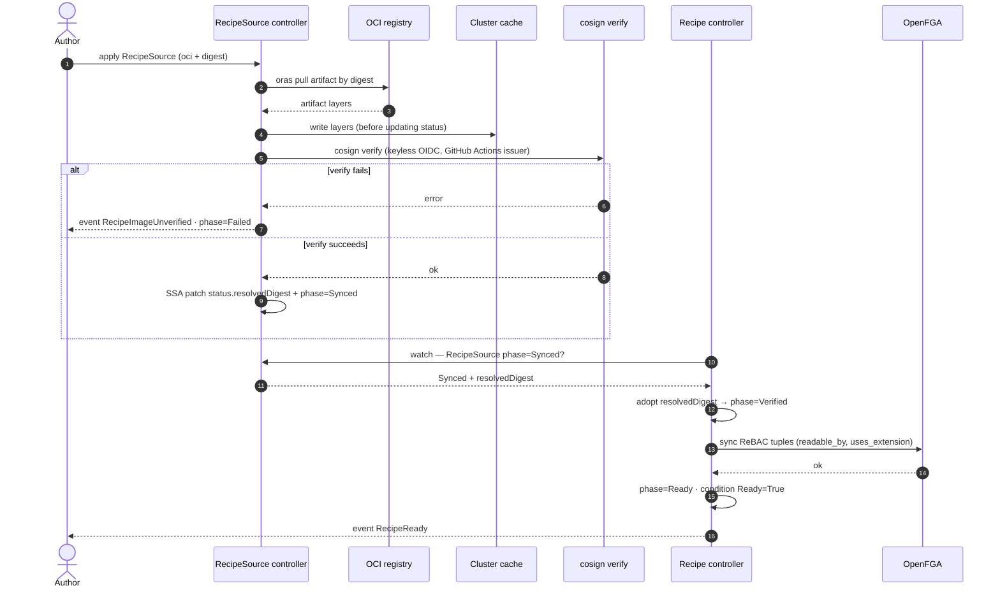

<!-- SPDX-License-Identifier: Apache-2.0 -->
<!-- Copyright (c) 2026 keese-ai -->

# Recipes

A Recipe is a versioned, signed, reproducible task definition — instructions plus a declared tool allowlist, model preference, extensions, typed parameters, and optional pre/post-flight hooks — that an agent runtime executes inside a Workspace.

!!! info "Audience"
    Agent developers who want to write, distribute, or version agent tasks. **Prerequisites:** [Concepts in 5 minutes](../getting-started/concepts-in-5-minutes.md) · [Workspaces & sessions](workspaces.md) · [Guardrails](guardrails.md)

## What a Recipe is

A `Recipe` (`keese.ai/v1alpha1`) is a Kubernetes custom resource that captures everything the runtime needs to reproduce a specific agent task:

| Field | Purpose |
|---|---|
| `spec.instructions` | Path to `instructions.md` within the OCI artifact layer |
| `spec.tools[]` | Allowlist of tools the recipe may invoke |
| `spec.model.{provider,modelID}` | Model preference; e.g. `anthropic` / `claude-sonnet-4-6` |
| `spec.preFlight` | Hook (CEL expression or named shell hook) run before execution |
| `spec.postFlight` | Hook run after the recipe exits or the session ends |
| `spec.extensions[]` | `RuntimeExtension` references the recipe requires |
| `spec.parameters[]` | Typed args (`string`, `int`, `bool`) injected as env vars |
| `spec.sourceRef` | Reference to a `RecipeSource` that provides the artifact |

Every Recipe references a `RecipeSource` (`keese.ai/v1alpha1`) that resolves and caches the artifact before the Recipe can reach `Ready`.

!!! note "Label required"
    Both `Recipe` and `RecipeSource` objects must carry the label `keese.ai/managed=true`. The controller's event-filter predicate silently skips resources that lack it. See [`internal/controller/keese/constants.go`](https://github.com/keese-ai/keese/blob/main/internal/controller/keese/constants.go).

## RecipeSource backends

`RecipeSource.spec` uses a **discriminated one-of**: exactly one of `oci`, `git`, or `configMap` may be set (enforced by a CEL XValidation rule on the CRD).

### OCI (preferred in production)

```yaml
apiVersion: keese.ai/v1alpha1
kind: RecipeSource
metadata:
  name: code-review-source
  namespace: team-alpha
  labels:
    keese.ai/managed: "true"
spec:
  oci:
    registry: ghcr.io
    repository: keese-ai/recipes/code-review
    digest: sha256:a1b2c3d4e5f6...   # required outside dev namespaces
    secretRef:
      name: ghcr-pull-secret           # projected file, never an env var
```

The `digest` field is required in non-dev namespaces — enforced by the `adk-runtime-image-digest-pinned` `ValidatingAdmissionPolicy` for ADK runtimes, and by a CEL `XValidation` rule on the `RecipeSource` CRD for OCI recipe sources. Tags are accepted only in `keese.ai/env=dev` namespaces where the controller resolves tag → digest each reconcile and re-pulls on change.

Pull credentials in `secretRef` are mounted as projected files under `/var/run/keese/secrets/` per [zero-trust rule 05.7](identity-zero-trust.md).

### Git

```yaml
spec:
  git:
    url: https://github.com/my-org/agent-recipes
    revision: a3f1c2b9d4e8f7a0b1c2d3e4f5a6b7c8d9e0f1a2  # full 40-char SHA, CRD XValidation-enforced
    secretRef:
      name: github-deploy-key
```

The `revision` must match `^[0-9a-f]{40}$` — a CEL pattern rule on the CRD rejects partial refs.

### ConfigMap (dev only)

```yaml
spec:
  configMap:
    name: my-recipe-inline
    namespace: team-alpha-dev
```

!!! warning "Dev namespaces only"
    The `configMap` source type is blocked by a CEL `XValidation` rule on the `RecipeSource` CRD in any namespace that does not carry the label `keese.ai/env=dev`. Using it in a production namespace results in a `DevSourceInProdNamespace` rejection (no separate `ValidatingAdmissionPolicy` for this check).

## Pull → verify → cache flow

The `RecipeSource` controller resolves and caches the artifact; only after it reaches `Synced` can the `Recipe` advance to `Ready`.



The cache write happens **before** `status.resolvedDigest` is updated via Server-Side Apply. This ordering ensures idempotency: if the controller restarts mid-pull, it re-verifies but skips the pull if the cache already holds the digest.

!!! danger "cosign verification is fail-closed"
    If `cosign verify` fails for any reason — corrupt signature, unknown issuer, expired certificate — the `RecipeSource` moves to `phase: Failed` and emits a `RecipeImageUnverified` event. The Recipe will not advance to `Ready`. Existing Workspaces already running continue from the artifact cached on their PVC; new Workspace creation is blocked.

## Recipe phase state machine

The Recipe controller transitions through a defined set of phases. `Ready` is the only phase from which a Workspace can reference the Recipe.

```mermaid
stateDiagram-v2
    [*] --> Pending : resource created

    Pending --> Pulling : reconciler starts
    Pulling --> Pulling : RecipeSource not yet Synced<br/>(requeue 5s)
    Pulling --> Failed : RecipeSource not found<br/>or not Synced after retries

    Pulling --> Verified : RecipeSource.status.resolvedDigest<br/>adopted; cosign passed

    Verified --> Failed : ReBAC tuple sync error<br/>(requeue 5s)
    Verified --> Ready : ReBAC tuples written<br/>condition Ready=True

    Ready --> Terminating : DeletionTimestamp set
    Failed --> Pulling : spec updated / requeue

    Terminating --> [*] : ReBAC tuples deleted<br/>finalizer removed
```



The `RecipeSource` has its own simpler FSM: `Pending → Synced | Failed`.

## Three-gate admission

When a `Workspace` is created (or updated) with `spec.recipeRef` set, an admission webhook calls `CheckThreeGates` ([`internal/controller/keese/recipe_admission.go`](https://github.com/keese-ai/keese/blob/main/internal/controller/keese/recipe_admission.go)). All three gates must pass; partial admission is forbidden.

### Gate 1 — Tool gate

Every tool in `Recipe.spec.tools[]` must appear in `GuardrailBinding.status.effectivePolicy.tools.allow`. The effective policy is read generation-fresh to guard against TOCTOU races: if `effectivePolicy.observedGeneration` does not match `Workspace.status.guardrailGeneration`, the webhook returns `409 StaleParentStatus` and the caller retries.

### Gate 2 — Model gate

`Recipe.spec.model.provider + "/" + modelID` must be present in the effective model allowlist. Violation produces `RecipeModelNotAllowed`.

### Gate 3 — Extension gate

For each entry in `Recipe.spec.extensions[]`, the webhook calls OpenFGA to check the tuple `extension:E#enabled_in@workspace:W` using the workspace ServiceAccount token (audience `keese-egress-<tenant>`, TTL ≤ 10 minutes).

!!! warning "Extension gate timeout is fail-closed"
    If any OpenFGA call for an extension takes longer than 500 ms (`extAuthzTimeout`), the webhook returns `503` and the Workspace is not admitted. This is deliberate — the system fails closed rather than risk admitting a recipe with unverified extension access. Retry the Workspace create once the OpenFGA latency normalises.

### Admission gate summary

| Gate | Checked against | Violation event |
|---|---|---|
| Tool | `GuardrailBinding.status.effectivePolicy.tools.allow` | `RecipeToolNotAllowed` |
| Model | effective model allowlist | `RecipeModelNotAllowed` |
| Extension | OpenFGA `extension#enabled_in` tuple | `RecipeExtensionNotEnabled` |
| (Freshness) | policy observedGeneration == workspace guardrailGeneration | `StaleParentStatus` |

## Pre/post-flight hooks

A recipe may declare hooks that run before or after execution. The `RecipeHook` type accepts exactly one of:

- `cel` — a CEL expression evaluated in the admission/controller context.
- `shellRef` — a reference to a registered shell hook by name. Inline shell is explicitly forbidden.

```yaml
spec:
  preFlight:
    cel: "workspace.spec.tier == 'premium'"
  postFlight:
    shellRef: notify-slack
```

!!! warning "shellRef hooks are planned — not yet implemented"
    The `shellRef` field is defined in the API, but the hook executor that dispatches named shell hooks is not yet implemented. Using `shellRef` will currently have no effect. CEL expressions are evaluated at admission time by the webhook.

## Parameters

Parameters are typed recipe arguments (`string`, `int`, `bool`) injected as environment variables into the workspace pod when the recipe is applied:

```yaml
spec:
  parameters:
    - name: TARGET_REPO
      type: string
      required: true
    - name: MAX_COMMENTS
      type: int
      required: false
      default: "10"
    - name: DRY_RUN
      type: bool
      required: false
      default: "false"
```

Required parameters without a supplied value cause Workspace admission to fail with a validation error.

## A minimal Recipe example

```yaml
apiVersion: keese.ai/v1alpha1
kind: RecipeSource
metadata:
  name: code-review-source
  namespace: team-alpha
  labels:
    keese.ai/managed: "true"
spec:
  oci:
    registry: ghcr.io
    repository: keese-ai/recipes/code-review
    digest: sha256:a1b2c3d4e5f6a7b8c9d0e1f2a3b4c5d6e7f8a9b0c1d2e3f4a5b6c7d8e9f0a1b2
---
apiVersion: keese.ai/v1alpha1
kind: Recipe
metadata:
  name: code-review
  namespace: team-alpha
  labels:
    keese.ai/managed: "true"
spec:
  instructions: instructions.md
  model:
    provider: anthropic
    modelID: claude-sonnet-4-6
  tools:
    - name: read_file
    - name: search_code
    - name: post_comment
  parameters:
    - name: TARGET_REPO
      type: string
      required: true
  sourceRef:
    name: code-review-source
```

Check status after applying:

```bash
kubectl get recipe code-review -n team-alpha
# NAME          AGE   READY   PHASE   MODEL             SOURCE
# code-review   30s   True    Ready   claude-sonnet-4-6 code-review-source

kubectl get recipe code-review -n team-alpha -o jsonpath='{.status.resolvedDigest}'
# sha256:a1b2c3d4...
```

## ReBAC integration

When a Recipe reaches `Ready`, the controller writes OpenFGA tuples:

- `recipe:<name>#readable_by@namespace:<namespace>` — scopes recipe visibility to its home namespace.
- `recipe:<name>#uses_extension@extension:<namespace>/<name>` — one tuple per `spec.extensions[]` entry.

The tuple count is surfaced in `status.rebacTupleCount` for debuggability. On deletion, the finalizer `finalizers.recipe.keese.ai/cache-cleanup` ensures tuples are removed before the object is garbage collected.

## Versioning and upgrades

| Scenario | Behaviour |
|---|---|
| Production: `spec.oci.digest` set | Immutable once set. Bump the digest field to trigger a re-pull + re-verify. |
| Dev: tag only | Controller resolves tag → digest each reconcile; re-pulls only when digest changes. |
| Upgrading a running Workspace | In-flight Workspaces continue from the PVC-cached artifact. To upgrade, delete and recreate the Workspace — a CRD CEL `XValidation` rule rejects in-place `spec.recipeRef` mutation (not a separate VAP). |

## Observability

The recipe controllers emit structured metrics under the `keese_recipe_` prefix:

| Metric | Type | Labels |
|---|---|---|
| `keese_recipe_pull_duration_seconds` | histogram | `source_type`, `registry` |
| `keese_recipe_admit_decisions_total` | counter | `result`, `reason` |
| `keese_recipe_cache_hits_total` | counter | `registry` |
| `keese_recipe_verify_failures_total` | counter | `registry` |

OTEL spans: `recipe.pull` (labels: `source_type`, `digest`) and `recipe.admit` (labels: `workspace`, `tenant`, `gate`, `result`).

Alerts: `RecipeVerifyFailureSpike` fires when `verify_failures_total > 0` for 5 minutes; `RecipePullBackpressure` fires when P99 pull duration exceeds 30 seconds.

## See also

- [Guardrails](guardrails.md) — the GuardrailBinding that backs the tool and model gates
- [Workspaces & sessions](workspaces.md) — how a Workspace references a Recipe via `spec.recipeRef`
- [Authorization (ReBAC / OpenFGA)](authorization-rebac.md) — the tuple model behind extension gating
- [Guides: Write & distribute a recipe](../guides/recipes.md) — step-by-step authoring walkthrough
