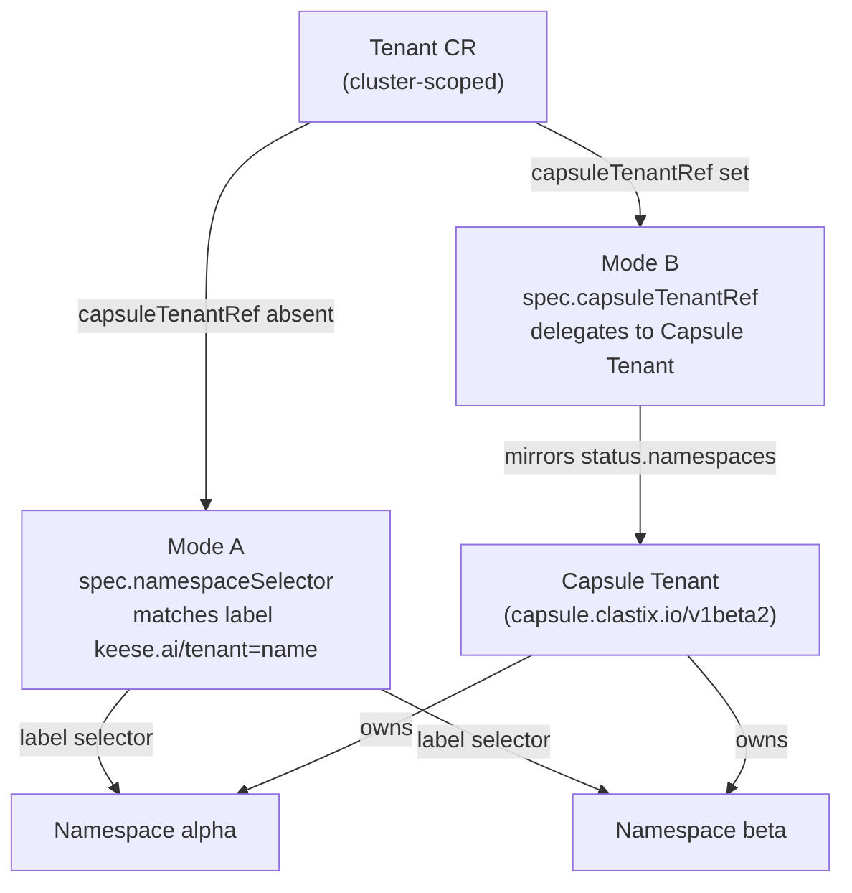
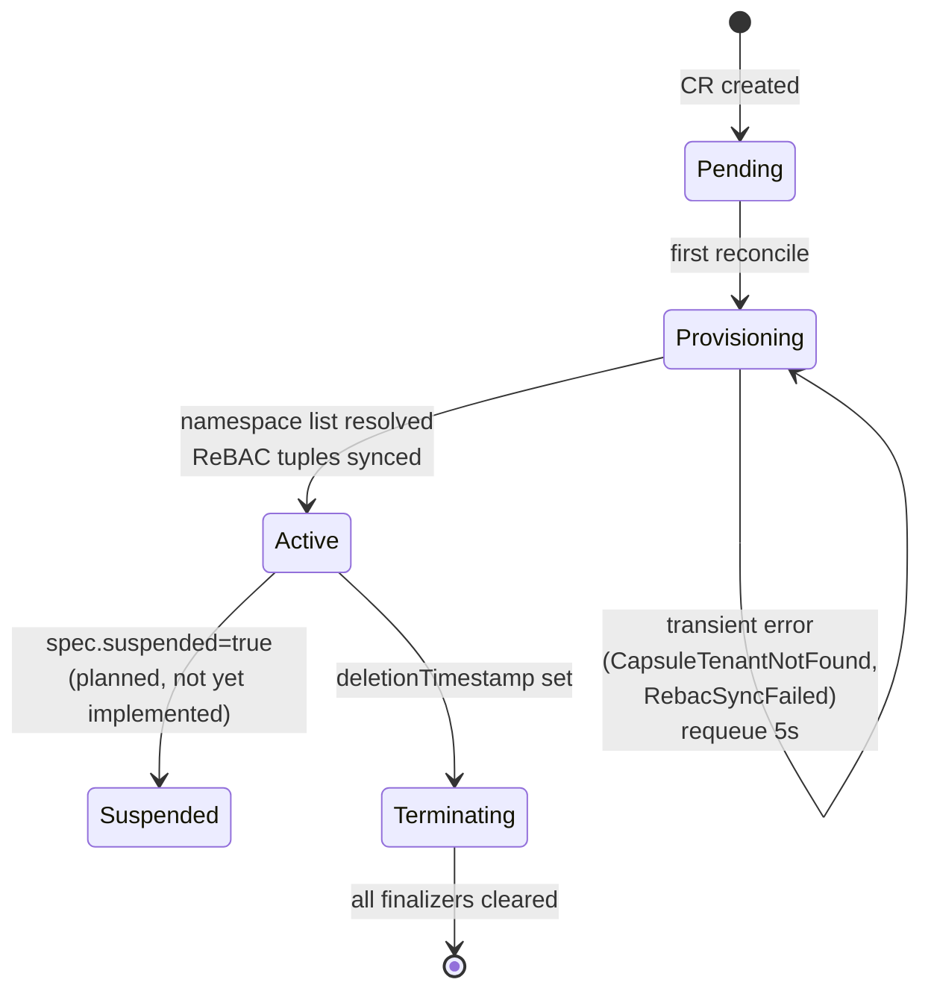
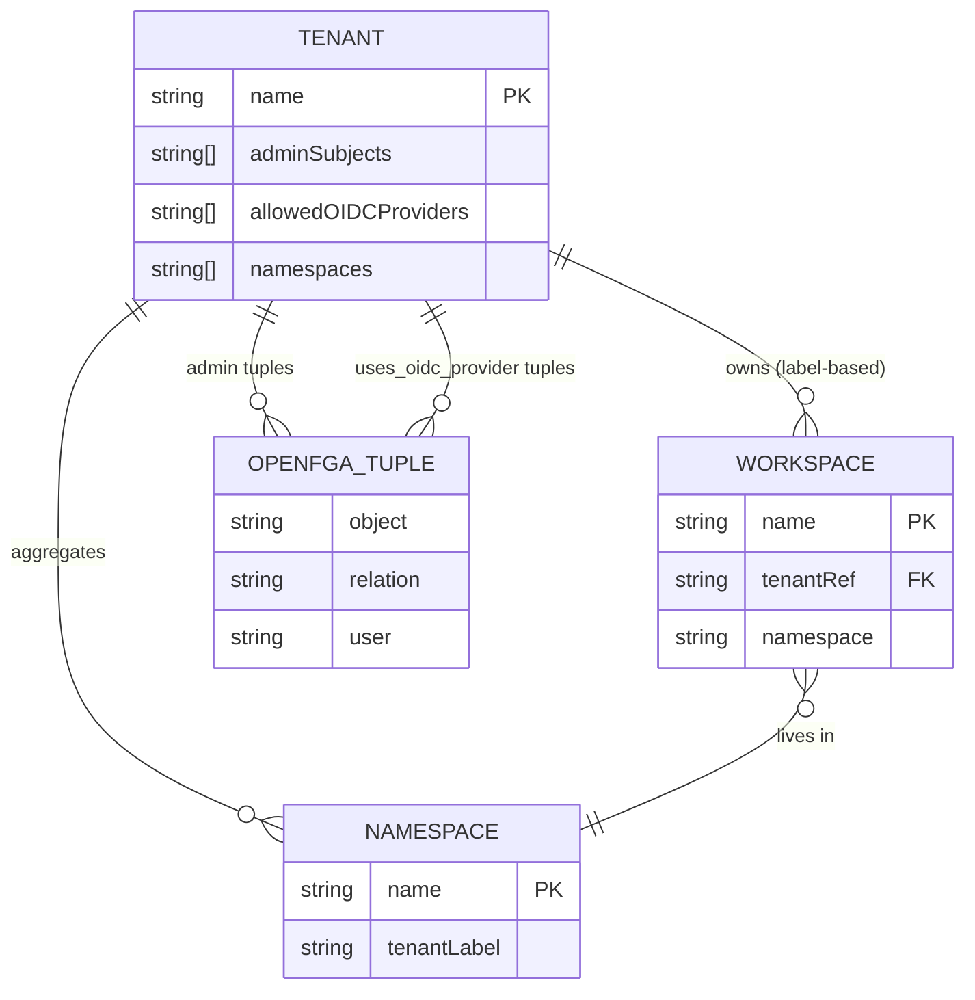

<!-- SPDX-License-Identifier: Apache-2.0 -->
<!-- Copyright (c) 2026 keese-ai -->

# Tenancy & namespaces

A **Tenant** is keese's top-level isolation boundary, giving a team or project its own identity scope, namespace set, guardrail defaults, token budget, and credential pool.

!!! info "Audience"
    Tenant administrators setting up a new team on a shared keese cluster. **Prerequisites:** [Concepts in 5 minutes](../getting-started/concepts-in-5-minutes.md) · [Identity & zero-trust](identity-zero-trust.md)

---

## What a Tenant is (and is not)

A Tenant is a cluster-scoped `keese.ai/v1alpha1/Tenant` CR. Its `metadata.name` is the identity key that every OpenFGA authorization check references as `tenant:<name>`.

A Tenant does **not** own exactly one namespace. A tenant owns one or more namespaces; a `Workspace` lives inside any tenant-owned namespace; multiple Workspaces may share a namespace. Namespace creation is a platform-team action — the keese operator does not create namespaces on your behalf.

---

## Namespace aggregation: Mode A vs. Mode B

The controller resolves which namespaces belong to a tenant through one of two modes, selected by which spec field you set.



### Mode A — label selector (no Capsule required)

Set `spec.namespaceSelector` to a label selector. The controller lists namespaces matching the selector and populates `status.namespaces[]`. Add a namespace to the tenant by labeling it:

```bash
kubectl label namespace my-ns keese.ai/tenant=acme
```

!!! warning "Label is immutable once set"
    The Tenant controller blocks mutation or removal of `keese.ai/tenant=<name>` after it is first applied. Attempting to remove the label while Workspaces exist emits a `TenantLabelLocked` event and the controller sets the namespace back to `Degraded` phase. Drain all Workspaces in the namespace before relabeling. (This guard is controller-side; no standalone `ValidatingAdmissionPolicy` exists for tenant namespace labels.)

### Mode B — Capsule delegation

Set `spec.capsuleTenantRef.name` to an existing `capsule.clastix.io/v1beta2/Tenant`. The keese controller mirrors `Capsule.status.namespaces[]` into `Tenant.status.namespaces[]` and sets `status.capsuleTenantResolved=true`. Capsule remains authoritative for namespace membership; `spec.namespaceSelector` is silently ignored in this mode (a `NamespaceSelectorIgnoredInModeB` warning event is emitted if both fields are set).

`spec.capsuleTenantRef.name` is immutable while any namespace is live (enforced by a CEL XValidation on the field).

!!! note "Capsule is optional"
    Mode B requires Capsule installed in the cluster. Mode A works with any vanilla Kubernetes 1.30+ cluster. The operator detects Capsule CRDs at startup (`--capsule-integration=auto|on|off`).

---

## Tenant spec reference

| Field | Mode | Required | Notes |
|---|---|---|---|
| `spec.capsuleTenantRef.name` | B | No | Immutable while namespaces live |
| `spec.namespaceSelector` | A | No | Ignored in Mode B |
| `spec.adminSubjects[]` | Both | **Yes** | ≥ 1 entry; CEL `XValidation` on CRD enforced |
| `spec.defaultGuardrailBindings[]` | Both | No | Names of `GuardrailBinding` CRs inherited by workspaces |
| `spec.tokenBudgetRef` | Both | No | Must resolve when set (webhook) |
| `spec.credentialPoolRef` | Both | No | Must resolve when set (webhook) |
| `spec.defaultWorkspaceQuota` | Both | No | `ResourceList` applied to each workspace |
| `spec.dedicatedGateway` | Both | No | Provisions a per-tenant Envoy AI Gateway; cannot toggle while namespaces exist |
| `spec.oidc.allowedProviders[]` | Both | No | Empty = all configured providers accepted |
| `spec.jwksCacheFailOpenSeconds` | Both | No | Range `[30, 600]`; default 300 (shared) / 60 (dedicated gateway) |
| `spec.auditArgumentsRedacted` | Both | No | Default `false` (PII-safe); set `true` to route MCP arguments through Presidio redaction |
| `spec.defaultCallRetryBudget` | Both | No | `maxRetries` + `perCallTimeout` (≥ 1s) per call |

### Admin subjects

`spec.adminSubjects[]` is the list of Kubernetes/OIDC identities that hold admin rights on this tenant. Each entry carries a `kind` (`User`, `Group`, or `ServiceAccount`) and a `name`. For every entry the controller writes an OpenFGA tuple:

```
tenant:<name>#admin@user:<subject-name>
```

At least one entry is mandatory; admission is rejected otherwise.

### Default guardrails and token budget

`spec.defaultGuardrailBindings[]` lists `GuardrailBinding` CR names that every workspace in this tenant inherits automatically. This lets a platform team enforce company-wide policies without requiring individual workspace authors to repeat them.

`spec.tokenBudgetRef` points to a `TokenBudget` CR that governs the tenant's aggregate token spend. The budget is OwnerRef-coupled to the Tenant and garbage-collected when the Tenant is deleted.

---

## Tenant phase FSM



| Phase | Meaning |
|---|---|
| `Pending` | CR just created; controller has not yet processed it |
| `Provisioning` | Controller is resolving namespaces and syncing ReBAC tuples; retries on transient errors |
| `Active` | Namespace list resolved, tuples synced, `Ready=True` |
| `Suspended` | Planned; not yet implemented |
| `Terminating` | `deletionTimestamp` is set; finalizers are being drained |

---

## Deletion gates

Three finalizers block premature deletion:

| Finalizer | Blocks until |
|---|---|
| `finalizers.tenant.keese.ai/agreements` | All `CrossTenantAgreement` CRs referencing this tenant (in `Approved` phase) are removed or re-pointed |
| `finalizers.tenant.keese.ai/workspaces` | All `Workspace` CRs with `spec.tenantRef.name=<this-tenant>` are deleted or reassigned |
| `finalizers.tenant.keese.ai/namespaces` | Mode A only: namespace labels cleaned up |

While any gate is active, the controller emits a `TenantDeletionBlocked` warning event and requeues every 5 seconds. Delete workspaces and drain agreements first; then the Tenant deletes cleanly.

---

## ReBAC tuples written to OpenFGA

The controller calls OpenFGA (via `TenantOpenFGARebacWriter`) on every reconcile to sync two families of tuples. On deletion it calls `Delete` for the same set.



**Tuple shapes:**

| Trigger | OpenFGA tuple |
|---|---|
| Each `spec.adminSubjects[].name` | `tenant:<name>#admin@user:<subject-name>` |
| Each `spec.oidc.allowedProviders[]` | `tenant:<name>#uses_oidc_provider@oidc_provider:<provider>` |

When `OPENFGA_API_URL` is not set (local dev), the controller uses `TenantNoopRebacWriter` — the operator boots normally but no tuples are written.

---

## Minimal example

```yaml
apiVersion: keese.ai/v1alpha1
kind: Tenant
metadata:
  name: acme
spec:
  # Mode A: aggregate namespaces that carry keese.ai/tenant=acme
  namespaceSelector:
    matchLabels:
      keese.ai/tenant: acme

  # At least one admin subject is required
  adminSubjects:
    - kind: User
      name: alice@acme.example.com

  # Inherit a company-wide guardrail on every workspace
  defaultGuardrailBindings:
    - acme-content-policy

  # Default compute quota for each workspace
  defaultWorkspaceQuota:
    cpu: "4"
    memory: 8Gi
```

```bash
kubectl apply -f tenant-acme.yaml
kubectl get tenant acme
# NAME   AGE   READY  PHASE   NAMESPACES
# acme   10s   True   Active  0
```

Label a namespace to bring it under the tenant:

```bash
kubectl label namespace acme-workflows keese.ai/tenant=acme
kubectl get tenant acme
# NAME   AGE   READY  PHASE   NAMESPACES
# acme   30s   True   Active  1
```

### Mode B example (Capsule)

```yaml
apiVersion: keese.ai/v1alpha1
kind: Tenant
metadata:
  name: acme
spec:
  # Mode B: delegate namespace aggregation to an existing Capsule Tenant
  capsuleTenantRef:
    name: acme-capsule   # must be an existing capsule.clastix.io/v1beta2/Tenant

  adminSubjects:
    - kind: Group
      name: acme-platform-admins
```

---

## Observability

The reconciler emits structured events; use `kubectl describe tenant <name>` to read them.

| Event reason | Type | Meaning |
|---|---|---|
| `TenantProvisioned` | Normal | Tenant transitioned to Active |
| `NamespaceAdded` | Normal | A namespace joined the tenant |
| `NamespaceRemoved` | Normal | A namespace left the tenant |
| `TenantLabelLocked` | Warning | Namespace label mutation denied while Workspaces exist |
| `CapsuleTenantNotFound` | Warning | Mode B: referenced Capsule Tenant does not exist |
| `RefNotResolved` | Warning | `tokenBudgetRef`, `credentialPoolRef`, or `artifactStoreRef` cannot be resolved |
| `TenantDeletionBlocked` | Warning | Deletion gated on workspaces or agreements |
| `SelectorOverlapDenied` | Warning | `namespaceSelector` overlaps another Tenant |
| `NamespaceSelectorIgnoredInModeB` | Warning | Both fields set; `namespaceSelector` ignored |
| `JWKSCacheExhausted` | Warning | JWKS fail-open window expired; gateway is failing-closed |
| `AuditRedactionUnavailable` | Warning | `auditArgumentsRedacted=true` but Presidio sidecar unreachable |

Key metrics (prefix `keese_`):

- `keese_tenant_reconcile_duration_seconds{mode,phase}` — reconcile latency by mode and phase
- `keese_tenant_namespace_count{tenant,mode}` — live namespace count
- `keese_tenant_capsule_sync_errors_total{tenant}` — Mode B resolution failures
- `keese_tenant_deletion_blocked_total{tenant}` — deletion gate hits
- `keese_envoy_jwks_cache_fail_open_seconds_remaining{tenant}` — JWKS cache headroom

!!! warning "Planned — not yet implemented"
    `spec.suspended` and the `Suspended` phase are defined in the FSM but the controller does not yet act on a suspension flag. Setting it has no effect in the current alpha.

    The `--tenant-crd-mode=off` rollback flag (pre-D26 label-only mode) is specified in the design but not yet implemented. Emergency rollback currently requires manual operator redeployment.

---

## Next steps

- [Workspaces & sessions](workspaces.md) — create agent workspaces inside a tenant
- [Authorization (ReBAC / OpenFGA)](authorization-rebac.md) — understand the tuple model
- [Cross-tenant collaboration](cross-tenant.md) — `CrossTenantAgreement` CRDs
- [Configure memory backends](../guides/memory-backends.md) — attach persistent memory to workspaces
