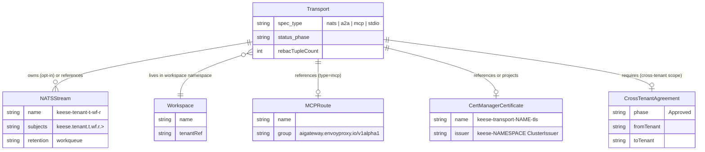
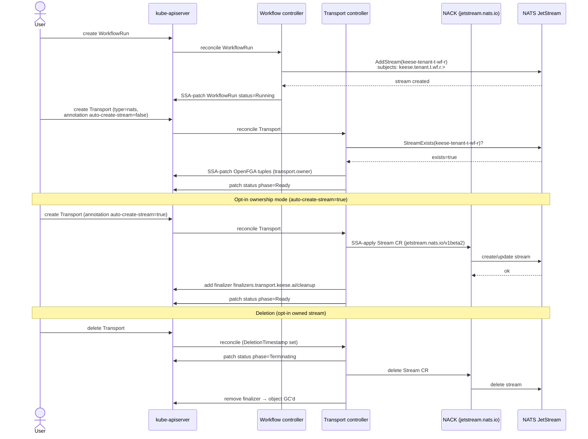

<!-- SPDX-License-Identifier: Apache-2.0 -->
<!-- Copyright (c) 2026 keese-ai -->

# Transports & messaging

The `Transport` CRD is keese's declarative surface for wiring agent-to-agent and agent-to-tool messaging — selecting the right protocol, configuring stream ownership, and enforcing the cross-tenant gate before a single message can flow.

!!! info "Audience"
    Agent developers and platform operators who need to understand how keese routes messages between workspaces and steps. **Prerequisites:** [Workspaces & sessions](workspaces.md) · [Identity & zero-trust](identity-zero-trust.md) · [Authorization (ReBAC / OpenFGA)](authorization-rebac.md)

---

## The `Transport` kind

`Transport` is a namespace-scoped resource in the `keese.ai/v1alpha1` group. Its `spec.type` field selects the protocol, and `spec.type` is **immutable after creation** — enforced by a CEL `XValidation` rule on the CRD (reason `TransportTypeImmutable`). To change the protocol, create a new `Transport` and migrate consumers.

Exactly one sub-struct matching `spec.type` must be present; the others must be absent. This mutual-exclusion invariant is enforced by a CEL `XValidation` rule on the CRD (reason `TransportSubfieldMismatch`) — not by a separate `ValidatingAdmissionPolicy`.

```yaml
apiVersion: keese.ai/v1alpha1
kind: Transport
metadata:
  name: wf-messaging
  namespace: tenant-acme-ws-alpha
  labels:
    keese.ai/managed: "true"
spec:
  type: nats
  nats:
    clusterRef:
      name: nats-cluster
      namespace: nats   # dev bootstrap deploys NATS here; set KEESE_GATEWAY_NS=nats
    streamName: keese-tenant-abc-wf-xyz
    consumerName: ws-alpha-consumer
    ackPolicy: explicit
    maxDeliver: 3
    ackWait: 30s
```

The controller watches only objects carrying the label `keese.ai/managed: "true"`.

### Status and lifecycle

```
Pending → Provisioning → Ready → Degraded → Terminating
```

| Phase | Meaning |
|---|---|
| `Pending` | Initial state before first reconcile pass |
| `Provisioning` | Dependency checks in progress |
| `Ready` | All dependencies satisfied; ReBAC tuples written |
| `Degraded` | At least one dependency unresolvable; retrying |
| `Terminating` | DeletionTimestamp set; finalizer cleanup in progress |

Status includes `observedGeneration`, a `conditions` list (keyed on `type`), and `rebacTupleCount` — the count of OpenFGA tuples written by the last successful sync.

Printer columns: **Age**, **Ready**, **Phase**, **Type**.

---

## Transport types



### `type: nats` — NATS JetStream

NATS JetStream is keese's primary intra-tenant transport. The Workflow controller provisions a per-WorkflowRun stream at creation time; the Transport references it.

**Subject naming:** `keese.tenant.<tenant-uid>.wf.<workflow-run-uid>.>` — all sub-topics within this prefix (e.g. `…steps.alpha`, `…events`) are created by the recipe. Topic existence within the prefix _is_ the intra-tenant authorization signal; the NATS server validates the JWT audience before accepting publish or subscribe. No per-message ReBAC check is needed, saving one round-trip per message.

**Cross-tenant NATS** uses a separate prefix per `CrossTenantAgreement`: `keese.cta.<cta-uid>.*` (design 25, in progress).

**Stream ownership modes:**

| Mode | How | When to use |
|---|---|---|
| Pre-existing (default) | Controller verifies stream exists; emits `NATSStreamNotFound` if absent | Multi-tenant clusters; NACK manages lifecycle |
| Opt-in controller-owned | Annotation `keese.ai/auto-create-stream: "true"` | Dev/test or single-tenant; controller calls `AddStream` / `DeleteStream` |

When `auto-create-stream` is set, `spec.nats.streamConfig` is read and the controller SSA-projects a `jetstream.nats.io/v1beta2.Stream` CR (via NACK) with field owner `keese-transport-controller`. Without the annotation, `streamConfig` is silently ignored and a `NATSStreamConfigIgnored` warning is emitted. A finalizer (`finalizers.transport.keese.ai/cleanup`) is added only in opt-in mode and is removed after the stream is deleted.

Default stream configuration (when `streamConfig` is absent):

| Field | Default |
|---|---|
| `subjects` | `["keese.transport.<stream-name>.>"]` |
| `retention` | `limits` |
| `maxAge` | `168h` (7 days) |
| `storage` | `file` |
| `replicas` | `3` |
| `discard` | `old` |

**Delivery guarantee:** at-least-once. Deduplication is owned by the Workflow controller via `Nats-Msg-Id`; a KV store `keese-wf-delivered` with 24 h TTL prevents double-processing.

**TLS:** reference an existing cert-manager `Certificate` via `spec.nats.tls.certificateRef`. With `keese.ai/auto-manage-cert: "true"`, the controller SSA-projects a certificate named `keese-transport-<name>-tls` issued by ClusterIssuer `keese-<namespace>` with ECDSA-256 key, 90-day duration, 30-day renewal window.

!!! warning "Planned — not yet implemented"
    Modifying `streamConfig` on a live stream (e.g. changing `replicas` or `retention`) currently emits `NATSStreamMigrationRequired` but does not automatically execute the dual-consumer + backfill migration. That runbook is planned for P8.

### `type: a2a` — agent-to-agent gRPC

Direct gRPC calls between workspace agent pods. The `endpoint` must start with `grpc://` or `grpcs://` (enforced by a CEL `XValidation` rule on the CRD). Two peer-authentication modes are supported:

| `peerAuth` | Mechanism | When to use |
|---|---|---|
| `workspace-sa` (default) | Caller presents a projected SA token with audience `keese-wf-<run-uid>` (TTL ≤ 600 s); receiver validates issuer `kubernetes.default.svc.cluster.local` | Intra-cluster workspaces |
| `mutual-tls` | External gRPC peers with no Kubernetes identity; ACL via `mutualTLS.aclRef` | Out-of-cluster or non-keese agents |

**Scope:**

| `scope` | Authorization check | Requirement |
|---|---|---|
| `intra-tenant` (default) | None beyond SA token validation | Same tenant |
| `cross-tenant` | OpenFGA `Check(workspace:<peer>#messageable_from@workspace:<caller>)` at subscribe + first publish | Approved `CrossTenantAgreement` must exist |

For `scope: cross-tenant`, the controller calls `CTAResolver.HasApprovedCTA` during every reconcile. If no Approved CRA exists, the Transport enters `Degraded` with reason `CrossTenantAgreementMissing`.

**Delivery guarantee:** at-most-once (gRPC unary; caller-side retry responsibility).

!!! warning "Partial implementation"
    The `a2a` type validates dependencies and writes ReBAC tuples today, but the actual gRPC listener sidecar that serves calls into the agent pod is not yet implemented. The `NATSSubscription` trigger and output-sink projections referenced in design 03b are also no-ops at this time.

### `type: mcp` — Model Context Protocol

Routes tool calls through an Envoy AI Gateway [`MCPRoute`](https://gateway.envoyproxy.io/) (group `aigateway.envoyproxy.io/v1alpha1`). Admission validates the referenced MCPRoute exists; it emits `MCPRouteNotFound` and sets the Transport to `Degraded` if the route is absent. TLS is delegated entirely to Envoy AI Gateway.

| Field | Default | Constraint |
|---|---|---|
| `mcpRouteRef` | — | Required |
| `protocolVersion` | `2024-11-05` | String |
| `toolTimeout` | `30s` | 1 s – 300 s |

**Delivery guarantee:** at-most-once (JSON-RPC; caller-side retry).

!!! warning "Partial implementation"
    The `mcp` type validates the MCPRoute reference and reaches `Ready` phase, but the full MCP session lifecycle — streaming tool results, cancellation, sampling — is not yet wired end-to-end. Treat it as alpha.

### `type: stdio` — stdio bridge sidecar

Bridges a Unix-socket stdio protocol (used by goose's ACP headless mode) to the in-cluster message bus. A dedicated sidecar container image is injected into the workspace session pod.

| Field | Default | Range |
|---|---|---|
| `bridgeImage` | — | Required |
| `inboundQueueDepth` | `100` | 10 – 10 000 |
| `outboundQueueDepth` | `1000` | 100 – 100 000 |
| `reconnectBufferBytes` | `4 194 304` (4 MiB) | 1 MiB – 64 MiB |
| `reconnectRetries` | `3` | 1 – 10 |
| `reconnectBackoff.initial` | `1s` | Duration |
| `reconnectBackoff.multiplier` | `2.0` | 1.0 – 10.0 |
| `reconnectBackoff.max` | `30s` | Duration |

**Delivery guarantee:** reliable in-order within the running process. Unacknowledged frames in the outbound buffer are lost on SIGKILL.

No external dependencies to validate; `bridgeImage` is required (CRD-level CEL `MinLength` rule; rejection reason `BridgeImageRequired`). The controller reaches `Ready` immediately after dependency validation.

If `outboundQueueDepth` is exceeded the bridge drops the oldest frame and emits `StreamLagged`. Increase `outboundQueueDepth` or reduce message production rate if this event appears.

---

## NATS stream provisioning sequence



---

## cert-manager auto-TLS

When a Transport carries the annotation `keese.ai/auto-manage-cert: "true"`, the controller SSA-projects a `cert-manager.io/v1` `Certificate` object:

| Attribute | Value |
|---|---|
| Name | `keese-transport-<transport-name>-tls` |
| SecretName | `keese-transport-<transport-name>-tls` |
| ClusterIssuer | `keese-<transport-namespace>` (tenant default) |
| DNS SANs | Derived from NATS `clusterRef` hostname or A2A `endpoint` hostname |
| Key algorithm | ECDSA P-256 |
| Duration | 90 days; renew at 30 days before expiry |

The resulting Secret is mounted to workspace session pods via projected volume (never as an env var — rule 05.7). The condition `CertificateProjected=True` is set on success.

Without the annotation, the controller only verifies that the `certificateRef` named in the spec already exists, and emits `CertificateNotFound` if absent.

---

## Cross-tenant gate

When `spec.a2a.scope: cross-tenant`, the Transport controller checks for an Approved `CrossTenantAgreement` (CTA) covering the `(from-namespace → endpoint)` pair before the Transport can reach `Ready`. This is in addition to the admission-time check performed by the Workflow controller when a `WorkflowRun` references the Transport.

The two-layer approach is intentional: the admission check fast-fails the `WorkflowRun` create request with a human-readable error; the reconciler check enforces the gate continuously even if the CTA expires after the `WorkflowRun` was admitted.

```
Reconcile check: CTAResolver.HasApprovedCTA(namespace, endpoint)
  → true  → proceed to ReBAC tuple write → Ready
  → false → Degraded / reason: CrossTenantAgreementMissing
```

OpenFGA relations involved (design 04a iter-5, landed 2026-04-21):

- `tenant.allows_messaging: [tenant]` — bilateral approval at the tenant level
- `workspace.messageable_from: [workspace]` — fine-grained pair-level permission written by the CTA controller at approval time

!!! warning "Workspace snapshot uses synthetic placeholders"
    The `CrossTenantAgreement` controller is implemented and OpenFGA tuples are written at approval, but `resolveWorkspaces` currently returns a synthetic workspace name (`ws-<tenantName>`) rather than enumerating real Workspace CRs (import-cycle barrier at `crosstenanagreement_controller.go:478`). `messageable_from` tuples use placeholder names until this is resolved. Do not rely on tuple accuracy for cross-tenant authorization in production.

---

## RBAC and security

The Transport controller carries these RBAC markers (from [`transport_controller.go`](https://github.com/keese-ai/keese/blob/main/internal/controller/keese/transport_controller.go)):

- `keese.ai/transports`: `get;list;watch;create;update;patch;delete`
- `keese.ai/transports/status`: `get;update;patch`
- `keese.ai/transports/finalizers`: `update`
- `jetstream.nats.io/streams,consumers`: `get;list;watch;create;update;patch;delete`
- `cert-manager.io/certificates`: `get;list;watch;create;update;patch`
- `mcp.keese.ai/mcproutes`: `get;list;watch`
- `gateway.networking.k8s.io/referencegrants`: `get;list;watch`

All writes use Server-Side Apply with field owner `keese-transport-controller` and `ForceOwnership: true`.

Transport specs carry no credentials (rule 05.7). Certificates are referenced by name; their Secret material is mounted via projected volume by the WorkspaceSession controller.

---

## Failure modes

| Failure | Detection | Phase |
|---|---|---|
| NATS stream absent (default mode) | `NATSStreamNotFound` event | Degraded |
| NATS stream config change on live stream | `NATSStreamMigrationRequired` event | (manual runbook) |
| cert-manager Certificate absent | `CertificateNotFound` event | Degraded |
| cert-manager Certificate projection failed | `CertificateProjectionFailed` event | Degraded |
| MCPRoute not found | `MCPRouteNotFound` event | Degraded |
| ReferenceGrant missing (cross-namespace) | `ReferenceGrantMissing` event | Degraded |
| Cross-tenant CTA missing or expired | `CrossTenantAgreementMissing` event | Degraded |
| A2A peer authz denied (OpenFGA) | `A2APeerAuthzDenied` event | Degraded |
| stdio outbound buffer overflow | `StreamLagged` event (drop-oldest) | Ready (degraded I/O) |
| `spec.type` mutation attempt | CRD CEL `XValidation` (`TransportTypeImmutable`) | Admission rejected |

---

## Observability

OTEL spans emitted by the reconciler:

- `keese.transport.provision`
- `keese.transport.dep_resolve`
- `keese.transport.degraded`
- `keese.transport.terminating`
- `keese.transport.a2a.auth`

Metrics:

| Metric | Labels |
|---|---|
| `keese_transport_messages_total` | `type`, `direction`, `tenant` |
| `keese_transport_errors_total` | `type`, `reason`, `tenant` |
| `keese_transport_dep_resolve_duration_seconds` | `type` |
| `keese_transport_a2a_auth_duration_seconds` | `peer_auth_mode`, `scope` |

---

## See also

- [Workflows & triggers](workflows.md) — how the Workflow controller provisions NATS streams and WorkflowRun-scoped SA audiences
- [Network isolation](network-isolation.md) — NetworkPolicy rules that restrict NATS and Envoy AI Gateway egress from workspace namespaces
- [Cross-tenant collaboration](cross-tenant.md) — the `CrossTenantAgreement` lifecycle that gates `scope: cross-tenant` transports
- [Egress & the AI Gateway](egress-ai-gateway.md) — how `type: mcp` connects to Envoy AI Gateway MCPRoutes
