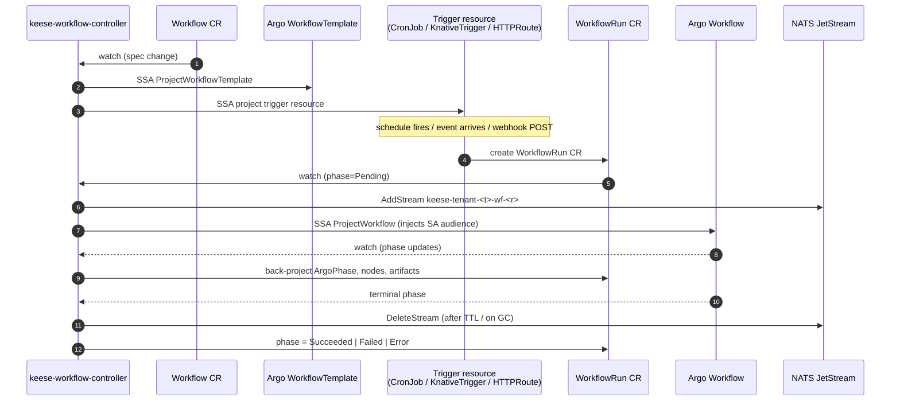
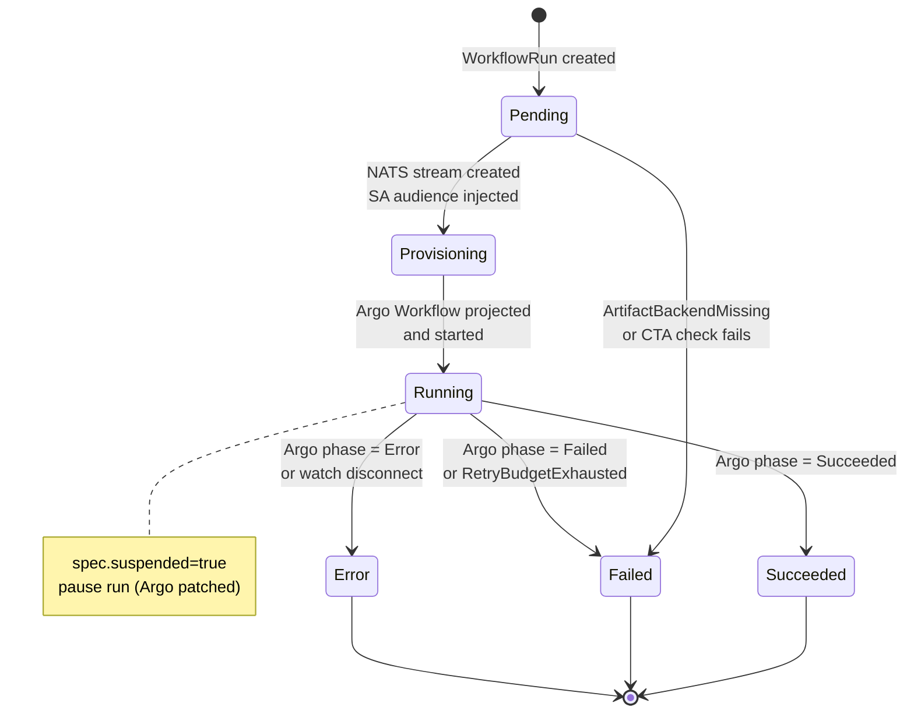

<!-- SPDX-License-Identifier: Apache-2.0 -->
<!-- Copyright (c) 2026 keese-ai -->

# Workflows & triggers

A `Workflow` is a keese-native orchestration CRD that projects an Argo `WorkflowTemplate` and manages how that template is activated, run, and torn down — while hiding Argo internals from the workspace author.

!!! info "Audience"
    Agent developers who need recurring, event-driven, or webhook-triggered automation against a keese Workspace. **Prerequisites:** [Workspaces & sessions](workspaces.md) · [Identity & zero-trust](identity-zero-trust.md)

---

## How it fits together

The `Workflow` CRD (`keese.ai/v1alpha1`, short name `wf`) owns three concerns:

1. **Template projection** — it mirrors its `spec.templates[]` into an Argo `WorkflowTemplate` in the same namespace, via Server-Side Apply with `fieldOwner: keese-workflow-controller`.
2. **Trigger projection** — it creates the backing Kubernetes resources (CronJob, Knative Trigger, HTTPRoute) that fire `WorkflowRun` objects on schedule or event.
3. **Lifecycle supervision** — it blocks deletion while active `WorkflowRun` objects exist and cleans up when all runs reach a terminal phase.

Each invocation produces a `WorkflowRun` CR (`shortName: wfr`). The controller projects each `WorkflowRun` into an Argo `Workflow` object, back-projects Argo status fields into `WorkflowRun.status`, and provisions the per-run NATS JetStream stream used for step-level messaging.



---

## The Workflow spec

```yaml
apiVersion: keese.ai/v1alpha1
kind: Workflow
metadata:
  name: code-review
  namespace: team-alpha          # Workspace namespace
spec:
  workspaceRef:
    name: ci-workspace           # non-interactive Workspace
  entrypoint: review-pr
  templates:
    - name: review-pr
      image: ghcr.io/keese-ai/keese:latest
      command: [keese-agent]
      args: [--recipe, code-review-recipe]
      transportRef:
        name: github-transport   # +keese:rebac-tuple=workflow.step.transport
      retryLimit: 2
  triggers:
    - type: Cron
      cron:
        schedule: "0 9 * * 1-5"
        timezone: "America/New_York"
  concurrencyPolicy: Forbid
  defaultRetryBudget:
    limit: 10
    backoffSeconds: 30
```

Key constraints enforced at admission:

- `spec.templates` must have at least one entry.
- Each `WorkflowTrigger` must set exactly one variant (`cron` / `knativeTrigger` / `natsSubscription` / `httpWebhook`).
- `WorkflowRun` objects are rejected when the referenced `Workspace.spec.interactive == true`.

---

## Trigger projections

The controller maps each `spec.triggers[]` entry to a Kubernetes resource. All projected resources carry an owner reference back to the `Workflow` CR so they cascade-delete when the `Workflow` is deleted.

| Trigger type | Projected resource | Notes |
|---|---|---|
| `Cron` | `batch/v1.CronJob` | Runs `keese-wf-launcher` on schedule; creates `WorkflowRun` |
| `KnativeTrigger` | `eventing.knative.dev/v1.Trigger` | Routes CloudEvents to the wf-launcher Service |
| `HTTPWebhook` | `gateway.networking.k8s.io/v1.HTTPRoute` | HMAC-validated POST → wf-launcher; key loaded from OpenBao via projected Secret |
| `NATSSubscription` | _(none — see warning below)_ | Sets `TriggerProjected=False/KEDAUnavailable` |

!!! warning "NATSSubscription trigger is a no-op today"
    The `NATSSubscription` trigger type is defined in the API but the KEDA `ScaledObject`
    that backs it cannot be projected due to a dependency conflict tracked in `go.mod`
    (search for `TODO(dep-conflict)`). The controller sets condition
    `TriggerProjected=False` with reason `KEDAUnavailable` and continues — the Workflow
    reaches `Ready` but this trigger fires no runs until the KEDA conflict is resolved.

!!! warning "Output sinks are no-op today"
    `spec.outputs[]` fields (`KnativeSink`, `NATSPublish`, `S3`, `GitHubPR`) are validated
    at admission but the reconciler loop does not project them yet (tracked as TD-P2-10).
    Declaring outputs in a Workflow is safe; they will be projected once the feature lands.

The `HTTPWebhook` trigger uses HMAC-SHA256 (`X-Hub-Signature-256`) for authentication. The shared key is loaded from `/var/run/keese/secrets/<trigger-name>` inside the `keese-trigger-receiver` pod — never from an environment variable. The receiver watches the mounted file for rotation via inotify; no restart is required.

---

## WorkflowRun lifecycle

A `WorkflowRun` is created by a trigger resource (or manually). It moves through six phases:



The `status` fields worth watching:

| Field | Meaning |
|---|---|
| `status.phase` | keese phase (above) |
| `status.argoPhase` | Raw Argo string (`Running`, `Succeeded`, …) |
| `status.argoWorkflowName` | Projected Argo object name |
| `status.nodes[]` | Per-step Argo node snapshots |
| `status.artifacts[]` | Output artifact paths after completion |
| `status.startedAt` / `finishedAt` | Wall-clock run window |

Check both columns in `kubectl`:

```bash
kubectl get workflowruns -n team-alpha
# NAME             AGE   READY   PHASE       ARGOPHASE
# code-review-7x   4m    True    Running     Running
```

---

## Concurrency policy

`Workflow.spec.concurrencyPolicy` mirrors the Kubernetes `CronJob` convention:

| Value | Behaviour |
|---|---|
| `Allow` (default) | Multiple `WorkflowRun` objects may execute concurrently; each maps to its own Argo Workflow. |
| `Forbid` | Admission rejects a new run while any is in-flight; event `ConcurrentRunForbidden` is emitted. |
| `Replace` | The prior Argo Workflow is patched with `spec.shutdown: Terminate`; the controller waits up to `replaceDrainSeconds` (default 60 s) before force-terminating and starting the replacement. |

Concurrent runs share the same `TokenBudget` CR — budget is not split per run.

---

## Messaging plane

Every `WorkflowRun` gets an isolated NATS JetStream stream provisioned at creation time:

| Config | Value |
|---|---|
| Stream name | `keese-tenant-<tenant-uid>-wf-<run-uid>` |
| Subject prefix | `keese.tenant.<t>.wf.<r>.>` |
| Retention | `workqueue` |
| Max age | `WorkflowRun.spec.timeout` |
| Replicas | 3 |

Sub-topics (e.g. `….steps.alpha`, `….events`) are created by the recipe, not the controller. NATS JWT audience validates tenant membership; no per-message ReBAC check is needed.

Each Argo step pod receives a projected ServiceAccount token with a per-run audience `keese-wf-<run-uid>` (TTL ≤ 600 s; kubelet rotates at 80%). This audience is injected via SSA onto the Argo Workflow object at projection time and requires the `workflowRun` named template in `OIDCProvider.spec.audienceTemplates`. If the template is absent the controller emits `MissingWorkflowAudience` and the run stays `Pending`.

!!! warning "Known bug: NATS stream not always deleted on cleanup"
    There is a known copy-paste bug where `tenantUID` and `runUID` are swapped in the
    stream teardown path, which can cause `NATSStreamDeleteFailed` events and leave orphan
    streams. Streams expire naturally via `maxAge` equal to the run timeout, and owner-ref
    GC on the Argo Workflow deletes them when the workflow object is removed. Manual cleanup:
    `nats stream delete keese-tenant-<t>-wf-<r>`.

---

## Supervisor pattern

Set `spec.supervisionContext` on a `WorkflowRun` to require human approval at step boundaries:

```yaml
spec:
  workspaceRef:
    name: ci-workspace
  workflowRef:
    name: code-review
  supervisionContext:
    requireApproval: true
    reviewerRef: platform-sre    # ServiceAccount or Group
    maxWaitSeconds: 7200
```

The controller labels the projected Argo Workflow with `keese.ai/supervision: "enabled"`. A supervision controller (design 23) watches this label and pauses the run at each step boundary until an approval annotation is applied. `status.argoRetryInFlight: true` suppresses supervision evaluation during active retry cycles.

---

## Retry budget

Two independent layers compose the final retry limit for each step:

1. **Per-step `retryLimit`** — set directly on `WorkflowTemplateStep.retryLimit` (default 3, max 10).
2. **Cross-step `retryBudget`** — set on `WorkflowRun.spec.retryBudget` (default 10, max 50); inherited from `Workflow.spec.defaultRetryBudget` if unset.

The controller injects `retryStrategy.limit = min(step.retryLimit, remainingCrossStepBudget)` into each Argo template via SSA. When the cross-step budget is exhausted the controller patches `WorkflowRun.spec.suspended: true`, Argo pauses, and the event `RetryBudgetExhausted` is emitted. A human increments the budget and clears `suspended` to resume.

---

## Creating a WorkflowRun manually

In addition to trigger-fired runs you can create a `WorkflowRun` directly:

```bash
kubectl apply -n team-alpha -f - <<'EOF'
apiVersion: keese.ai/v1alpha1
kind: WorkflowRun
metadata:
  name: code-review-manual-001
spec:
  workspaceRef:
    name: ci-workspace
  workflowRef:
    name: code-review
  parameters:
    - name: pr-number
      value: "4217"
  retryBudget: 5
  timeout: 30m
EOF
```

Watch the run:

```bash
kubectl get workflowrun code-review-manual-001 -n team-alpha -w
# NAME                    AGE   READY   PHASE         ARGOPHASE
# code-review-manual-001  0s    False   Pending       
# code-review-manual-001  3s    False   Provisioning  
# code-review-manual-001  8s    True    Running       Running
# code-review-manual-001  4m    True    Succeeded     Succeeded
```

---

## Observability

The controller emits structured OTEL spans and Kubernetes events for every major transition. Key events to watch:

| Reason | Level | Meaning |
|---|---|---|
| `WorkflowProjected` | Normal | Argo WorkflowTemplate was projected successfully |
| `TriggerProjected` | Normal | A trigger resource was projected |
| `TriggerKEDAUnavailable` | Warning | NATSSubscription trigger skipped (dep conflict) |
| `WorkflowNATSStreamProvisioned` | Normal | Per-run JetStream stream created |
| `NATSStreamDeleteFailed` | Warning | Stream teardown failed; will retry |
| `RetryBudgetExhausted` | Warning | Cross-step retry budget used up; run suspended |
| `ConcurrentRunForbidden` | Warning | Concurrency policy blocked a new run |
| `CrossTenantAgreementMissing` | Warning | No approved CTA for the cross-tenant Transport reference |
| `MissingWorkflowAudience` | Warning | OIDCProvider missing `workflowRun` audience template |
| `WorkflowCascadeBlocked` | Warning | Workflow deletion blocked by active runs |

Key metrics:

- `keese_workflowrun_phase_total{phase,tenant}` — run counts by terminal phase
- `keese_workflowrun_retry_budget_exhausted_total{tenant}` — budget exhaustion rate
- `keese_workflow_nats_stream_provision_duration_seconds` — stream provisioning latency
- `keese_trigger_dispatch_total{type,tenant,result}` — trigger fire rate and errors

---

## Cross-tenant workflows

When a `WorkflowTemplateStep` references a `Transport` with `spec.a2a.scope: cross-tenant`, the admission webhook resolves the peer Workspace and Tenant and verifies a matching approved `CrossTenantAgreement` exists before the `WorkflowRun` is admitted. If no approved CTA is found, admission is rejected with `CrossTenantAgreementMissing` and the response message identifies both the missing `(from, to)` tenant pair and the offending `transportRef`.

Runtime enforcement is layered at the messaging transport via OpenFGA tuple `workspace:<peer>#messageable_from@workspace:<this>`. The admission check is a fast-fail UX layer; bypass at the transport is not possible.

See [Cross-tenant collaboration](cross-tenant.md) for CTA authoring guidance.

---

## See also

- [Workspaces & sessions](workspaces.md) — the Workspace and WorkspaceSession that back each run
- [Transports & messaging](transports.md) — the Transport CRD referenced by workflow steps
- [Guardrails](guardrails.md) — GuardrailBindings applied per step
- [Recipes](recipes.md) — the Recipe CRD that defines what a step runs
