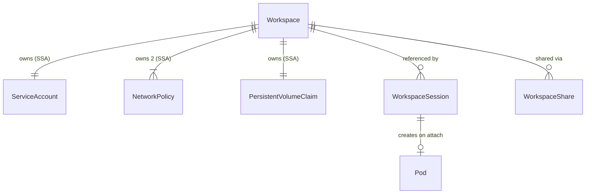
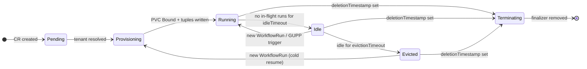
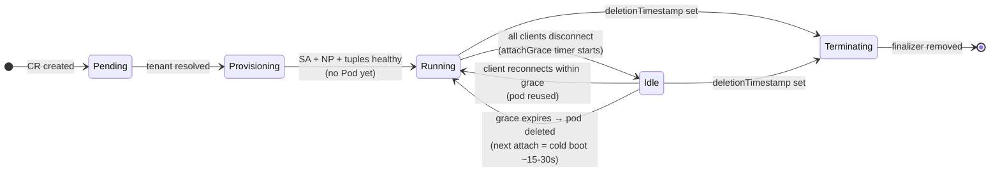
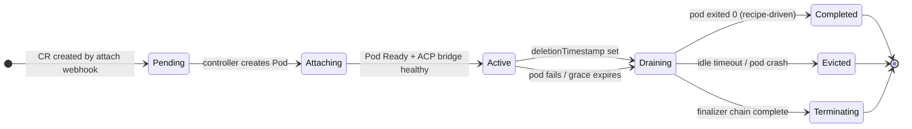
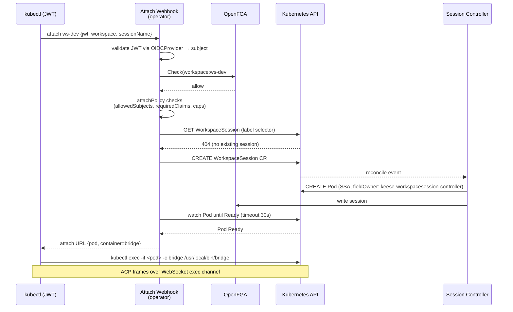

<!-- SPDX-License-Identifier: Apache-2.0 -->
<!-- Copyright (c) 2026 keese-ai -->

# Workspaces & Sessions

A `Workspace` is the durable identity of one autonomous agent: it owns a dedicated
ServiceAccount, fail-closed NetworkPolicy pair, session PVC, and all OpenFGA authorization
tuples for that agent's lifetime.

!!! info "Audience"
    Agent developers and platform engineers integrating AI workloads into keese.
    **Prerequisites:** [Concepts in 5 minutes](../getting-started/concepts-in-5-minutes.md)
    · [Tenancy & namespaces](tenancy.md) · [Identity & zero-trust](identity-zero-trust.md)

---

## What a Workspace is

Every agent in keese runs inside a `Workspace` (`keese.ai/v1alpha1`, short name `ws`).
The Workspace CR is namespace-scoped, lives within the owning tenant's namespace, and
acts as the root of a small ownership graph:

- **One ServiceAccount** (`ksa-<workspace-uid>`) carries the agent's projected SA token.
- **Two NetworkPolicies** — a fail-closed default-deny and an egress allowlist — enforce
  zero-trust at the network layer.
- **One PVC** (`keese-ws-<uid>-session`) backs the SQLite checkpoint store used by the
  agent runtime.
- **Zero or more Pods** — created lazily on demand by the workspace session controller,
  not by the Workspace controller itself.

The Workspace controller uses **Server-Side Apply** with
`fieldOwner: keese-workspace-controller` for every write, so sub-resources are always
reconcilable without ownership conflicts.



---

## Workspace lifecycle (FSM)

The `spec.interactive` field determines which finite-state machine applies.  It is
**immutable after creation** (enforced by a CEL `XValidation` rule on the CRD).

### Non-interactive workspaces (`spec.interactive: false`, default)

Non-interactive workspaces are driven by `WorkflowRun` objects (Argo Workflows under
the hood). No persistent agent pod exists at `Ready`; Argo manages step pods within
the workspace namespace.



`spec.concurrencyPolicy` (`Allow | Forbid | Replace`) is evaluated at `WorkflowRun`
admission. `Replace` tears down the running run before starting the new one.

### Interactive workspaces (`spec.interactive: true`)

Interactive workspaces use a lazy pod model.  No Pod is created at `Ready`; the pod is
spun up only when the first `WorkspaceSession` attaches.  When all clients disconnect
and `spec.attachGrace` expires, the pod is deleted (scale-to-zero).



!!! note
    The current implementation maps `Pending → Provisioning → Running` in a single
    reconcile loop once the PVC is `Bound`.  The `Idle` and `Evicted` phases are
    recognized enum values in the API type but full idle-timer eviction requires the
    session controller to signal back — see `WorkspaceSessionPhase` below.

---

## Child resources provisioned via SSA

The workspace controller applies four categories of child resources on every reconcile
(idempotent, field-owner guarded):

| Resource | Name pattern | Purpose |
|---|---|---|
| `ServiceAccount` | `ksa-<workspace-uid>` | Agent identity; carries the projected SA token audience `keese-egress-<tenant>` |
| `NetworkPolicy` (deny) | `keese-workspace-<uid>-default-deny` | Fail-closed: no ingress, no egress unless another policy permits |
| `NetworkPolicy` (egress) | `keese-workspace-<uid>-egress` | Permits DNS (:53), Envoy AI Gateway pods, and NATS JetStream (:4222) |
| `PersistentVolumeClaim` | `keese-ws-<uid>-session` | SQLite checkpoint store; `ReadWriteOnce`; defaults to `10Gi` |

!!! warning "Pod is NOT in this list"
    The Workspace controller does not create the agent Pod directly.  Pods are created by
    the `WorkspaceSession` controller when a session attaches.  The `status.podRef` field
    reflects the most recent pod, written by the session controller.

### Egress NetworkPolicy detail

The egress policy deliberately **does not pin a destination port** for the Envoy AI
Gateway because Kubernetes NetworkPolicy port matching applies to the pod's container port
after DNAT, not the Service port the client dials.  The Envoy Gateway proxy pod listener
port varies by chart version and is not under keese's control.  The security boundary is
the namespace + pod selector, which constrains traffic to the gateway pods only
(see [Egress & the AI Gateway](egress-ai-gateway.md) and [Network isolation](network-isolation.md)).

---

## Session control fields

### `spec.sessionMode` — when is the pod active?

| Value | Behaviour |
|---|---|
| `Always` | Pod is started immediately at workspace creation and kept running. |
| `OnDemand` (default) | Pod is created on the first `WorkspaceSession` attach and deleted when idle for `spec.attachGrace`. |

### `spec.attachPolicy` — how do new sessions attach?

| Value | Behaviour |
|---|---|
| `Reuse` (default) | New sessions join the existing running pod in `shared` or `per-user` mode. |
| `New` | Each attach request requires a fresh pod. Use with `sessionMode: per-attach`. |

### `spec.interactive` — immutability

Once set, `spec.interactive` cannot be changed.  Switching modes requires deleting the
Workspace (which drains cleanly via the finalizer) and creating a new one with
`spec.resumeFrom` pointing at the last checkpoint.

---

## WorkspaceSession

A `WorkspaceSession` (`wsess`) represents a single attach event — the pairing of an
agent identity (the `attachSubject`) with a workspace pod.

### Session lifecycle FSM



`Completed` is distinct from `Evicted`: a non-interactive recipe-driven session whose
pod exited with code 0 lands in `Completed` — callers should treat this as success.

### Session naming

Session names follow the pattern `<workspace>-<subject-hash-16>-<session-name>`.
The `sessionName` field defaults to `"default"`.  The four immutable fields are:

- `spec.workspaceRef`
- `spec.attachSubject`
- `spec.sessionName`
- `spec.mode`

These are enforced by CEL `XValidation` markers on the CRD on `UPDATE`.

### Pod-sharing model (`spec.mode`)

The session mode is inherited from `Workspace.spec.sessionMode` and is immutable once
the `WorkspaceSession` is created.

| Mode | Uniqueness key | Effect |
|---|---|---|
| `shared` | `workspaceRef` only | One CR and one pod per workspace; all subjects share it. |
| `per-user` | `(workspaceRef, attachSubject, sessionName)` | Each user gets their own CR + pod; multiple terminals for the same user can attach to the same session. |
| `per-attach` | operator-generated name | A new CR + pod per attach; caller-provided `sessionName` is rejected (`AttachSessionNameForbidden`). |

### Finalizer chain

On delete, the session controller runs the following drain sequence before removing
`finalizers.workspacesession.keese.ai/cleanup`:

1. Set `status.phase = Draining`.
2. Call `AgentRuntime.Drain(ctx, session, 90s)` — flushes the SQLite checkpoint to the
   workspace PVC.
3. Delete the Pod.  The pod has `terminationGracePeriodSeconds: 120`.
4. Remove any OpenFGA tuples scoped to the session.
5. Remove the finalizer.

If `AgentRuntime.Drain` does not return within 90 seconds, the controller logs
`DrainTimeout` and proceeds to pod deletion anyway.

Set `spec.preserveOnPodFailure: true` to keep the CR alive in a `Failed` state after a
pod crash, enabling post-mortem inspection before manual deletion.

---

## Session attach sequence

The following shows the full server-side attach flow for an interactive workspace.
The `attach webhook` runs inside the keese operator binary.



If the Pod does not reach `Ready` within 30 seconds, the webhook returns
`503 SessionStartTimeout`.  The CR is left in place; the session controller continues
reconciling.  The client can retry the attach and find the existing CR on the next call.

### VAP admission checks on CREATE

Before the `WorkspaceSession` CR is persisted, all of the following must pass:

| Check | Reject reason |
|---|---|
| Parent Workspace exists and `spec.interactive: true` | `AttachNotAllowedOnNonInteractiveWorkspace` |
| No existing session for uniqueness key | `DuplicateSession` |
| `per-attach` mode: sessionName is operator-generated | `AttachSessionNameForbidden` |
| `attachGraceSeconds` in [0, 86400] | `AttachGraceOutOfBounds` |
| Per-user concurrent session count ≤ cap | `SessionsPerUserLimitExceeded` |
| Total concurrent attach count ≤ cap | `ConcurrentAttachLimitExceeded` |

---

## WorkspaceShare — cross-namespace access

A `WorkspaceShare` (`wss`) grants read or write access to a Workspace from a
**different namespace**, using a Gateway API `ReferenceGrant` and OpenFGA tuples.

```yaml
apiVersion: keese.ai/v1alpha1
kind: WorkspaceShare
metadata:
  name: ws-dev-share-to-analytics
  namespace: tenant-acme
spec:
  workspaceRef:
    name: ws-dev
  targetNamespace: tenant-analytics
  grantees:
    - "user:bob@example.com"
  readOnly: true           # true = viewer, false = editor; default true
```

The controller projects a `ReferenceGrant` into the source namespace (allowing the target
namespace to reference the Workspace's resources) and writes one
`workspace:<name>#cross_ns_viewer@<grantee>` OpenFGA tuple per grantee entry.
The `status.referenceGrantName` field records the projected grant's name.

!!! note "WorkspaceShare is implemented"
    The controller SSA-projects a `ReferenceGrant` into the workspace namespace and writes
    `workspace:<name>#cross_ns_viewer@<grantee>` OpenFGA tuples per `spec.grantees[]`.
    Some edge cases (drift reconciliation when the `ReferenceGrant` is manually deleted,
    cross-tenant share backed by an approved `CrossTenantAgreement`) are still stabilising
    in alpha.

---

## Minimal workspace manifest

```yaml
apiVersion: keese.ai/v1alpha1
kind: Workspace
metadata:
  name: ws-dev
  namespace: tenant-acme
spec:
  tenantRef:
    name: acme
  runtimeRef:
    name: goose-stable           # references an AgentRuntime in the same namespace
  sessionMode: OnDemand
  attachPolicy: Reuse
  interactive: false             # WorkflowRun-driven; set true for interactive sessions
  sessionStorage: 10Gi
  egress:
    allowedTools:
      - github-read
      - web-search
```

```bash
kubectl apply -f workspace.yaml
kubectl get ws -n tenant-acme

# NAME     PHASE       READY   RUNTIME        INTERACTIVE   AGE
# ws-dev   Running     True    goose-stable   false         42s
```

### Interactive workspace example

```yaml
apiVersion: keese.ai/v1alpha1
kind: Workspace
metadata:
  name: ws-interactive
  namespace: tenant-acme
spec:
  tenantRef:
    name: acme
  runtimeRef:
    name: goose-stable
  interactive: true              # immutable — cannot be changed after creation
  sessionMode: OnDemand
  attachPolicy: Reuse
  attachGrace: 5m
```

### Attaching a session

```bash
# The keese CLI is planned; today, create the WorkspaceSession CR directly.
kubectl apply -f - <<EOF
apiVersion: keese.ai/v1alpha1
kind: WorkspaceSession
metadata:
  name: ws-interactive-alice-default
  namespace: tenant-acme
  labels:
    keese.ai/workspace: ws-interactive
    keese.ai/session-name: default
spec:
  workspaceRef: ws-interactive
  attachSubject: "user:alice@example.com"
  sessionName: default
  mode: per-user
  attachGraceSeconds: 300
EOF

kubectl get wsess -n tenant-acme
# NAME                              PHASE    READY   SUBJECT                   SESSION   AGE
# ws-interactive-alice-default      Active   True    user:alice@example.com    default   10s
```

!!! warning "Planned — not yet implemented"
    The `kubectl-keese attach` CLI command that drives the full webhook-based attach
    flow (JWT validation, OpenFGA check, session creation, pod watch, and exec handoff)
    is planned but not yet shipped.  The YAML-based workaround above creates the session
    CR without the admission checks; use it only in development.

---

## Status conditions

| Condition | Meaning |
|---|---|
| `Ready` | Workspace is fully provisioned: SA, NetworkPolicy, PVC, and OpenFGA tuples are all healthy. |
| `Progressing` | A reconcile step is pending or has failed; `reason` and `message` carry details. |
| `NetworkIsolated` | Both NetworkPolicies (default-deny + egress allowlist) are applied. |
| `SessionStorageReady` | The session PVC is in `Bound` phase. |

All conditions carry `observedGeneration` matching `metadata.generation`, so controllers
downstream can safely gate on generation-aligned status.

---

## ReBAC tuples written by the Workspace controller

On each sync the controller calls `WorkspaceRebacWriter.Sync` with a deterministic set
of OpenFGA tuples.  The current implementation writes:

| Tuple | Source field |
|---|---|
| `tenant:<name>#member@service_account:ksa-<uid>` | `spec.tenantRef.name` |
| `workspace:<name>#owner@tenant:<name>` | `spec.tenantRef.name` |
| `workspace:<name>#editor@user:<id>` | `spec.editors[]` |
| `workspace:<name>#viewer@user:<id>` | `spec.viewers[]` |
| `tool:<name>#allowed_in@workspace:<name>` | `spec.egress.allowedTools[]` |

All tuples are deleted during the finalizer drain phase before the finalizer is removed.

---

## See also

- [Agent runtimes (SPI)](agent-runtimes.md) — which runtimes can power a workspace
- [Identity & zero-trust](identity-zero-trust.md) — projected SA tokens and egress credential broker
- [Egress & the AI Gateway](egress-ai-gateway.md) — how the egress NetworkPolicy maps to the gateway
- [Workflows & triggers](workflows.md) — how non-interactive workspaces receive `WorkflowRun` objects
