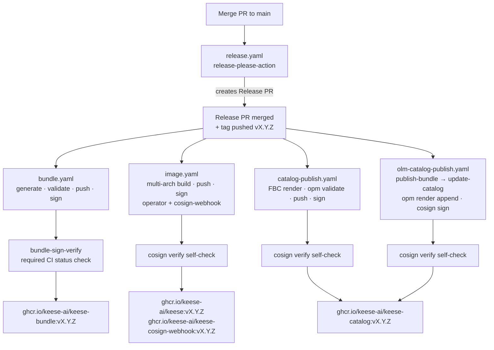
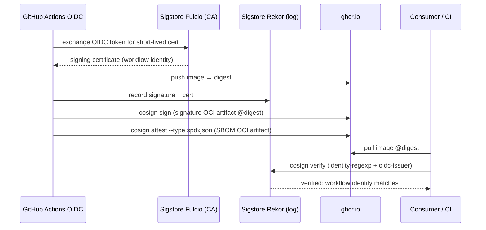

<!-- SPDX-License-Identifier: Apache-2.0 -->
<!-- Copyright (c) 2026 keese-ai -->

# Build & release (OLM + cosign)

Every keese release is fully automated: a merged PR triggers release-please, a tag triggers four parallel GitHub Actions workflows, and every published artifact is signed with Sigstore cosign keyless OIDC and attested with a syft SBOM.

!!! note "Four tag-triggered publish workflows"
    `bundle.yaml`, `image.yaml`, `catalog-publish.yaml`, and `olm-catalog-publish.yaml` all fire on `push: tags: v*`. A failure in any one does not cancel the others, but OLM upgrade will not function correctly unless all four succeed.

!!! info "Audience"
    Contributor working on the release pipeline, cutting a release, or debugging a failed CI run. **Prerequisites:** [Development environment](dev-environment.md) · [CI/CD pipeline](cicd.md) · familiarity with OLM and cosign.

## Release chain overview



All four publish workflows are independent and run in parallel after the tag push. A failure in any one does not cancel the others, but OLM upgrade will not function correctly unless all four succeed.

## Versioning with release-please

Keese uses [release-please v4](https://github.com/googleapis/release-please) in **manifest mode** (`release-type: simple`). The configuration lives at:

- [`release-please-config.json`](https://github.com/keese-ai/keese/blob/main/release-please-config.json) — package: `.`, release-type: `simple`
- [`.release-please-manifest.json`](https://github.com/keese-ai/keese/blob/main/.release-please-manifest.json) — current version pointer (e.g. `{"." : "0.1.0"}`)

The workflow ([`.github/workflows/release.yaml`](https://github.com/keese-ai/keese/blob/main/.github/workflows/release.yaml)) runs on every push to `main` and maintains a rolling "Release PR". When that PR is merged:

1. release-please bumps the manifest and creates a GitHub Release + tag (`v0.1.0`).
2. The tag triggers `bundle.yaml`, `image.yaml`, `catalog-publish.yaml`, and `olm-catalog-publish.yaml`.

Version bumping follows conventional commits:

| Commit type | Bump |
|---|---|
| `feat:` | minor (pre-1.0: patch) |
| `fix:`, `perf:`, etc. | patch |
| `BREAKING CHANGE:` footer | major |

`bump-minor-pre-major: true` and `bump-patch-for-minor-pre-major: true` keep the pre-1.0 series on patch-only unless you explicitly set a feat commit.

!!! note
    release-please only creates and merges the Release PR — it does **not** push images or bundles. All publish steps happen via tag-triggered workflows, not from the release-please job itself.

## OLM bundle (`bundle.yaml`)

Workflow: [`.github/workflows/bundle.yaml`](https://github.com/keese-ai/keese/blob/main/.github/workflows/bundle.yaml)

**On every `main` push:** runs `make bundle bundle-validate` to surface generation drift. No image is pushed.

**On tag push (`v*`):**

1. Asserts `bundle/` is present (missing is a CI failure, not a skip).
2. `make bundle bundle-validate` — regenerates the CSV + CRD manifests and validates with `operator-sdk bundle validate`.
3. Builds and pushes `ghcr.io/keese-ai/keese-bundle:vX.Y.Z` via `docker/build-push-action` with `provenance: true` and `sbom: true`.
4. Signs the bundle image with `cosign sign --yes` (keyless OIDC).
5. Generates an SPDX JSON SBOM with `syft` and attaches it with `cosign attest --type spdxjson`.
6. Runs `make bundle-sign-verify` as a required status check before any catalog push.

### Local bundle regeneration

```bash
make bundle          # operator-sdk generate bundle --channels=alpha
make bundle-validate # operator-sdk bundle validate ./bundle
```

The bundle channel is `alpha` (default channel: `alpha`), as declared in [`bundle/metadata/annotations.yaml`](https://github.com/keese-ai/keese/blob/main/bundle/metadata/annotations.yaml).

## Operator image (`image.yaml`)

Workflow: [`.github/workflows/image.yaml`](https://github.com/keese-ai/keese/blob/main/.github/workflows/image.yaml)

Tag pushes trigger a matrix build for two images:

| Matrix entry | Dockerfile | Published as |
|---|---|---|
| `keese` | `Dockerfile` | `ghcr.io/keese-ai/keese:vX.Y.Z` |
| `keese-cosign-webhook` | `Dockerfile.keese-cosign-webhook` | `ghcr.io/keese-ai/keese-cosign-webhook:vX.Y.Z` |

Each image is:

- Built with `docker buildx` for `linux/amd64` and `linux/arm64`.
- Pushed with OCI provenance attestation (`provenance: true`, `sbom: true`).
- Signed with `cosign sign --yes` (keyless OIDC).
- Attested with an SPDX JSON SBOM via `cosign attest`.
- Self-verified with `scripts/bundle-sign-verify.sh` before the job completes.

Main-branch pushes do **not** trigger `image.yaml`; a compile-and-test check runs instead so image publishing is tag-only.

## FBC catalog (`catalog-publish.yaml`)

Workflow: [`.github/workflows/catalog-publish.yaml`](https://github.com/keese-ai/keese/blob/main/.github/workflows/catalog-publish.yaml)

The File-Based Catalog (FBC) is the OLM index that OperatorHub uses to discover and upgrade keese. The template lives at [`bundle/.config/index-template.yaml`](https://github.com/keese-ai/keese/blob/main/bundle/.config/index-template.yaml) and declares keese plus four required dependencies: cert-manager, Capsule, argo-workflows, and external-secrets-operator.

Pipeline steps:

1. `scripts/build-catalog.sh --skip-validate` — renders the FBC template to `catalog/keese/`.
2. `opm validate catalog/keese` — validates the rendered catalog.
3. Builds and pushes `ghcr.io/keese-ai/keese-catalog:vX.Y.Z` (and `:latest`).
4. Signs with `cosign sign --yes` (keyless OIDC).
5. Self-verifies the signature with `cosign verify`.
6. Generates and attests an SPDX JSON SBOM.

## OLM catalog append (`olm-catalog-publish.yaml`)

Workflow: [`.github/workflows/olm-catalog-publish.yaml`](https://github.com/keese-ai/keese/blob/main/.github/workflows/olm-catalog-publish.yaml)

Also tag-triggered (`push: tags: v*`), this workflow is a two-job sequence that appends a newly published bundle into the live catalog image, as an alternative to building the catalog from the on-disk FBC template:

1. **`publish-bundle`**: regenerates the bundle (`make bundle bundle-validate`), builds and pushes the bundle image, cosign signs + SBOM attests, runs `make bundle-sign-verify`.
2. **`update-catalog`**: pulls the current `ghcr.io/keese-ai/keese-catalog` image (or bootstraps a fresh one), runs `opm migrate` + `opm render` to append the new bundle, validates, builds and pushes the updated catalog image, cosign signs + verifies.

!!! note
    Both `catalog-publish.yaml` and `olm-catalog-publish.yaml` write to `ghcr.io/keese-ai/keese-catalog`. The former builds the catalog from the FBC template on disk; the latter appends an already-pushed bundle to the live catalog index. On a standard release both run from the same tag — whichever completes last wins `:latest`.

## Upgrade graph: `set-csv-replaces.sh`

Script: [`scripts/set-csv-replaces.sh`](https://github.com/keese-ai/keese/blob/main/scripts/set-csv-replaces.sh)

OLM requires each CSV to declare `spec.replaces` pointing at the previous CSV so the upgrade graph is contiguous. This script manages that chain:

```
bundle/.previous-csv   →  stores "keese.vX.Y.Z" of the last-released version
bundle/manifests/keese.clusterserviceversion.yaml  →  gets spec.replaces patched
bundle/.config/index-template.yaml  →  gets a new channel entry + bundle stanza appended
```

Run this **before** committing the release bundle:

```bash
scripts/set-csv-replaces.sh
```

The script performs four steps internally:

| Step | Action |
|---|---|
| 01 | check deps (`yq`, `python3`) |
| 02 | patch `spec.replaces` in the CSV |
| 03 | advance `.previous-csv` pointer to the new CSV name |
| 04 | append new channel entry + bundle stanza to `index-template.yaml` |

!!! warning "First release"
    `bundle/.previous-csv` currently contains `keese.v0.0.0-placeholder`. This must be updated to `keese.v0.0.1` before cutting `v0.0.2`. The script exits non-zero if previous == current.

## Cosign signing and SBOM attestation



### Identity pins (rule 05.12)

Every `cosign verify` call — in CI self-checks and in `scripts/bundle-sign-verify.sh` — pins both the certificate identity regexp and the OIDC issuer:

```bash
cosign verify \
  --certificate-identity-regexp \
    'https://github.com/keese-ai/keese/.github/workflows/.*' \
  --certificate-oidc-issuer \
    'https://token.actions.githubusercontent.com' \
  <image-ref>@sha256:<digest>
```

Tag-only refs are rejected by `bundle-sign-verify.sh`; a digest is required.

### Verify locally

```bash
# Verify the bundle image
scripts/bundle-sign-verify.sh ghcr.io/keese-ai/keese-bundle@sha256:<digest>

# Verify the operator image
scripts/bundle-sign-verify.sh ghcr.io/keese-ai/keese@sha256:<digest>

# Verify the catalog image
cosign verify \
  --certificate-identity-regexp \
    'https://github.com/keese-ai/keese/.github/workflows/catalog-publish.yaml@refs/.*' \
  --certificate-oidc-issuer \
    'https://token.actions.githubusercontent.com' \
  ghcr.io/keese-ai/keese-catalog@sha256:<digest>
```

## Image digest pinning

Rule 05.12 requires production and CSV overlays to reference images by digest, not tag. Tags are acceptable only in `dev/` overlays. The `bundle-sign-verify.sh` script enforces this pre-flight — it exits 2 if the image ref does not contain `@sha256:`.

After a release, update the CSV `spec.install.spec.deployments[].spec.template.spec.containers[].image` in `bundle/manifests/keese.clusterserviceversion.yaml` to the digest-pinned form published by `image.yaml`.

!!! warning "Planned — not yet implemented"
    Automated digest pinning back into the CSV post-publish is not yet scripted. Currently this is a manual step after the tag workflows complete. Tracked as a follow-up to TD-P3-03.

## Release checklist

```bash
# 1. Ensure bundle is regenerated and clean
make bundle bundle-validate

# 2. Set spec.replaces and advance the upgrade graph
scripts/set-csv-replaces.sh

# 3. Commit the bundle changes (required for the release PR)
git add bundle/ && git commit -m "chore(bundle): set spec.replaces for vX.Y.Z"

# 4. Merge the release-please PR — this pushes the tag
#    (release-please handles this automatically)

# 5. Monitor the four tag-triggered workflows
#    .github/workflows/bundle.yaml
#    .github/workflows/image.yaml
#    .github/workflows/catalog-publish.yaml
#    .github/workflows/olm-catalog-publish.yaml

# 6. After all four complete, verify signatures
scripts/bundle-sign-verify.sh ghcr.io/keese-ai/keese-bundle@sha256:<digest>
scripts/bundle-sign-verify.sh ghcr.io/keese-ai/keese@sha256:<digest>
```

## See also

- [CI/CD pipeline](cicd.md) — full workflow inventory and status checks
- [SDLC & the design gate](sdlc.md) — how release readiness is gated
- [Install via OLM](../guides/install-olm.md) — consumer side of the OLM bundle
- [Development environment](dev-environment.md) — local toolchain setup
