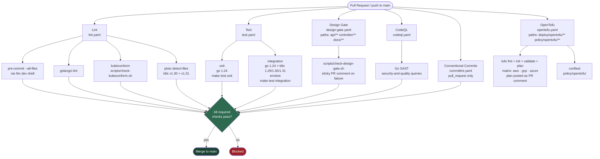
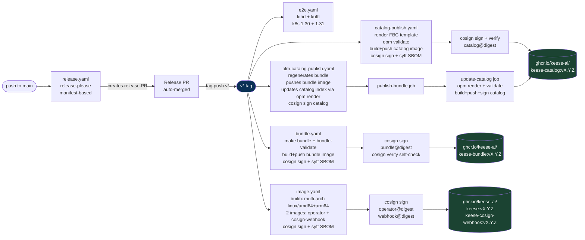

<!-- SPDX-License-Identifier: Apache-2.0 -->
<!-- Copyright (c) 2026 keese-ai -->

# CI/CD pipeline

Every commit to keese runs through a layered GitHub Actions pipeline: lightweight checks gate every PR, a nightly schedule catches regressions, and a tag push drives the full signed-artifact release chain.

!!! info "Audience"
    Contributors and maintainers who want to understand what runs, when it runs, and what must pass before code lands on `main`.
    **Prerequisites:** familiarity with [SDLC & the design gate](sdlc.md) · [Build & release](build-release.md)

---

## Overview

The pipeline is split into two operational modes:

| Mode | Trigger | Goal |
|---|---|---|
| **PR checks** | `pull_request` · `push: main` | Block regressions before merge |
| **Release chain** | `push: tags: v*` | Produce signed, attested, published artifacts |

A third class of workflows runs on a **schedule** or reacts to repository events rather than code changes.

---

## PR-check workflows

The following diagram shows every required check that must pass before a PR can merge to `main`. Branch-protection rules are documented in [`docs/references/branch-protection.md`](https://github.com/keese-ai/keese/blob/main/docs/references/branch-protection.md).



### Workflow-by-workflow reference

#### `commitlint.yaml` — Conventional Commits

Trigger: `pull_request`

Runs `@commitlint/cli` with `@commitlint/config-conventional` against every commit between `base.sha` and `head.sha`. Scopes must align with top-level directories or phase IDs (`api`, `controller`, `bundle`, `dev`, `rebac`, `guardrail`, `repo`, `lint`, etc.). See [Contributing](contributing.md) for allowed types.

#### `lint.yaml` — Four-job lint suite

Trigger: `pull_request` and `push: main`

| Job | Tool | What it checks |
|---|---|---|
| `pre-commit-all` | Nix dev shell → `pre-commit run --all-files` | SPDX headers, detect-secrets, gitleaks, shellcheck, markdownlint, addlicense |
| `golangci` | golangci-lint (latest) | Go static analysis, style, and vet |
| `kubeconform` | kubeconform (`scripts/check-kubeconform.sh`) | CRD manifests in `config/` validate against upstream schema |
| `pluto` | Pluto v5 | Deprecated API versions in `config/` flagged for k8s 1.30 and 1.31 |

All four jobs are required status checks.

#### `test.yaml` — Unit and integration

Trigger: `pull_request` and `push: main`

| Job | Matrix | Timeout | Make target |
|---|---|---|---|
| `unit` | go 1.24 | 20 min | `make test-unit` |
| `integration` | go 1.24 × k8s 1.29.x / 1.30.x / 1.31.x | 30 min | `make test-integration` |

Integration jobs use `controller-runtime/tools/setup-envtest` and cache binaries under `~/.local/share/kubebuilder-envtest`. The race detector is enabled. If `go.mod` is absent the jobs self-skip (not fail) — useful during early scaffolding.

#### `design-gate.yaml` — Design Gate

Trigger: `pull_request` on paths `api/**`, `internal/controller/**`, `docs/designs/**`, `docs/specs/**`, `docs/plans/**`; also `push: main`

Runs `scripts/check-design-gate.sh`. If the check fails on a PR, a sticky comment is posted with the failure summary. The gate is currently **open** (since 2026-04-22); the workflow still runs on every PR that touches the guarded paths to catch regressions.

!!! note
    The design gate is a **hard block**: a PR that touches `api/` or `internal/controller/` without a corresponding passing design check will not merge.

#### `codeql.yaml` — SAST

Trigger: `push: main`, `pull_request: main`, and weekly schedule (Monday 07:00 UTC)

Runs CodeQL `security-and-quality` queries for Go. Results upload as SARIF to the Security tab. Required status check.

#### `opentofu.yaml` — Infrastructure plan

Trigger: `pull_request` on paths `deploy/opentofu/**`, `policy/opentofu/**`

Jobs:

- `plan-only` (matrix: aws, gcp, azure) — `tofu fmt -check`, `tofu init -backend=false`, `tofu validate`, `tofu plan -lock=false`. **Never runs `tofu apply`** (decision D18). Plans are posted as sticky PR comments.
- `conftest` (matrix: aws, gcp, azure) — evaluates Rego policies in `policy/opentofu/` against each module.

Not a required status check on every PR — only fires when relevant paths change.

---

## Release chain

The release chain is fully tag-driven. `release-please` running on `main` creates and auto-merges a release PR, which pushes a `vX.Y.Z` tag. That tag triggers five downstream workflows in parallel.



### `release.yaml` — release-please

Trigger: `push: main`

Uses `googleapis/release-please-action` in manifest mode (config: `release-please-config.json`, manifest: `.release-please-manifest.json`). Maintains a rolling release PR that bumps the version and generates a changelog from Conventional Commits. When that PR merges, release-please pushes the version tag.

### `e2e.yaml` — End-to-end (kind + kuttl)

Trigger: `push: tags: v*`, daily schedule (06:00 UTC), `workflow_dispatch`

Spins up kind clusters (`kindest/node`) at k8s 1.30.x and 1.31.x, runs `make bootstrap-infra test-e2e`, uploads kuttl reports as artifacts. **Not a required PR check** — runs post-tag and nightly to catch regressions that envtest misses.

### `bundle.yaml` — OLM bundle

Trigger: `push: main` (validate-only) · `push: tags: v*` (publish+sign)

On `main` pushes: `make bundle bundle-validate` surfaces generation drift. On a tag:

1. Assert `bundle/` present (missing → hard failure, no silent skip).
2. `make bundle bundle-validate` — regenerates and validates the OLM bundle.
3. Build and push `ghcr.io/keese-ai/keese-bundle:<tag>` with SBOM attestation (`--sbom=true --provenance=true`).
4. `cosign sign --yes` (keyless OIDC).
5. `syft` generates an SPDX-JSON SBOM; `cosign attest` attaches it.
6. `make bundle-sign-verify` — self-check that verifies the cosign signature before the job exits.

### `image.yaml` — Operator and webhook images

Trigger: `push: tags: v*` · `workflow_dispatch`

Builds two images via `docker/build-push-action` in a matrix:

| Name | Dockerfile | Image |
|---|---|---|
| `keese` | `Dockerfile` | `ghcr.io/keese-ai/keese:<tag>` |
| `keese-cosign-webhook` | `Dockerfile.keese-cosign-webhook` | `ghcr.io/keese-ai/keese-cosign-webhook:<tag>` |

Both images are multi-arch (`linux/amd64,linux/arm64`), carry provenance and SBOM attestations, and are cosign keyless-OIDC signed. Missing Dockerfile → hard failure (no silent skip, decision TD-P1-05).

### `catalog-publish.yaml` — File-Based Catalog (FBC)

Trigger: `push: tags: v*` · `workflow_dispatch`

1. Renders the FBC template via `scripts/build-catalog.sh --skip-validate`.
2. Validates with `opm validate catalog/keese` (OPM v1.43.1 pinned in env).
3. Builds and pushes `ghcr.io/keese-ai/keese-catalog:<tag>` (also tagged `:latest`).
4. Cosign sign + verify (identity-regexp matches `.github/workflows/catalog-publish.yaml@refs/.*`).
5. Syft SBOM → `cosign attest`.

### `olm-catalog-publish.yaml` — Catalog index append

Trigger: `push: tags: v*` · `workflow_dispatch` (requires manual `tag` input)

Two sequential jobs:

1. **`publish-bundle`**: regenerates the bundle (`make bundle bundle-validate`), pushes bundle image, cosign signs + SBOM attests, runs `make bundle-sign-verify`.
2. **`update-catalog`**: pulls the existing catalog (or bootstraps a fresh one), runs `opm migrate` + `opm render` to append the new bundle, validates, builds and pushes the updated catalog image, cosign signs + verifies.

!!! note
    `catalog-publish.yaml` and `olm-catalog-publish.yaml` both write `ghcr.io/keese-ai/keese-catalog`. They serve slightly different use-cases — the former builds from an FBC template on-disk; the latter appends an already-pushed bundle to the live catalog. On a standard release both run from the same tag; whichever completes last wins `:latest`.

---

## Scheduled and event-driven workflows

| Workflow | Trigger | Purpose |
|---|---|---|
| `scorecard.yaml` | Weekly (Monday 06:00 UTC) + `branch_protection_rule` + `push: main` | OpenSSF Scorecard analysis; uploads SARIF to Security tab |
| `codeql.yaml` | Weekly (Monday 07:00 UTC) + `push/PR: main` | SAST; already listed under PR checks |
| `e2e.yaml` | Daily (06:00 UTC) + `push: tags: v*` | Regression smoke on kind |
| `docs.yaml` | `push: main` (paths: `book/**`) | Build (`mkdocs build --strict`) then deploy to GitHub Pages |
| `verify-gate-commit.yaml` | `push: main` (paths: `docs/plans/README.md`) | Detects gate-status flips; requires `@keese-ai/architects` membership + GPG/SSH-signed commit |

### `scorecard.yaml` — OpenSSF Scorecard

Runs `ossf/scorecard-action` with `publish_results: true`. SARIF results are uploaded to the Security tab via `codeql-action/upload-sarif`. Deferrals and known gaps are tracked in [`docs/references/scorecard-deferrals.md`](https://github.com/keese-ai/keese/blob/main/docs/references/scorecard-deferrals.md).

### `docs.yaml` — Documentation site

Trigger: `push: main` on `book/**` and `.github/workflows/docs.yaml`

Builds the mkdocs-material site (`mkdocs build --strict`), uploads the `book/site/` artifact, then deploys to GitHub Pages. `--strict` means any broken link or bad admonition fails the build.

### `verify-gate-commit.yaml` — Gate-open commit verification

Watches `docs/plans/README.md` on `main`. Diffs the `gate_status:` frontmatter field between `HEAD~1` and `HEAD`. If it flipped `closed → open`:

1. Verifies the commit author is an active member of `@keese-ai/architects` via the GitHub API.
2. Verifies the commit is cryptographically signed (`commit.verification.verified == true`).

Any failure on a gate-flip commit blocks subsequent runs until corrected.

---

## Cosign verification

All signed artifacts carry a keyless OIDC identity from GitHub Actions. To verify any released image locally:

```bash
cosign verify \
  --certificate-identity-regexp \
    "https://github.com/keese-ai/keese/.github/workflows/.*" \
  --certificate-oidc-issuer \
    "https://token.actions.githubusercontent.com" \
  ghcr.io/keese-ai/keese:v0.1.0
```

Replace the image reference with the digest form (`@sha256:…`) for pinned verification.

!!! warning "docker push is denied in local sessions"
    Per zero-trust rule 05.15, `docker push` is blocked for interactive Claude Code sessions. All image publishing happens exclusively through GitHub Actions using OIDC-scoped tokens.

---

## Branch protection summary

Required status checks on `main` (must pass before merge):

- `Lint / pre-commit-all`
- `Lint / golangci`
- `Lint / kubeconform`
- `Lint / pluto`
- `Test / unit (1.24)`
- `Test / integration (1.24, 1.29.x)` · `(1.24, 1.30.x)` · `(1.24, 1.31.x)`
- `Design Gate / check`
- `Conventional Commits / commitlint`
- `CodeQL / analyze (go)`

Additional branch-protection settings (no direct pushes, 1 required review, dismiss stale reviews, signed-commits recommended) are recorded in [`docs/references/branch-protection.md`](https://github.com/keese-ai/keese/blob/main/docs/references/branch-protection.md).

---

## Concurrency and cancellation

Most PR-triggered workflows use a concurrency group keyed on `github.ref` with `cancel-in-progress: true`. This means a force-push or new commit cancels the in-flight run for the same branch. Exceptions:

- `docs.yaml` uses `group: pages` with `cancel-in-progress: false` — pages deploys are serialised.
- `verify-gate-commit.yaml` uses `cancel-in-progress: false` — gate-flip verification must complete.

---

## See also

- [Build & release (OLM + cosign)](build-release.md)
- [SDLC & the design gate](sdlc.md)
- [Testing strategy](testing.md)
- [Development environment (Nix)](dev-environment.md)
