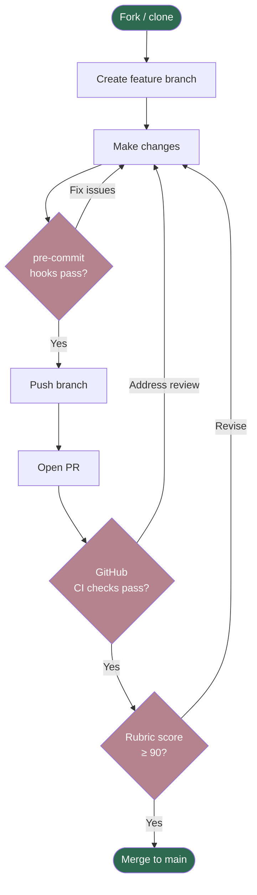
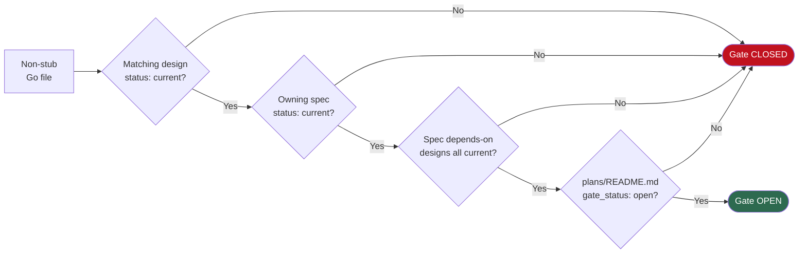

<!-- SPDX-License-Identifier: Apache-2.0 -->
<!-- Copyright (c) 2026 keese-ai -->

# Contributing

Everything you need to open a pull request that passes all checks and meets the project's quality bar.

!!! info "Audience"
    External contributors and new team members. **Prerequisites:** a working Nix devshell
    ([`development/dev-environment.md`](dev-environment.md)) and familiarity with
    Kubernetes operators in Go is helpful but not required for docs/design contributions.

---

## Contribution workflow at a glance



---

## Setting up

### Install pre-commit hooks

The Nix devshell provides all required tools. After entering the shell, install the hooks:

```bash
pre-commit install --install-hooks
pre-commit install --hook-type commit-msg
```

Both stages are required: `--install-hooks` runs on every `git commit`, and
`--hook-type commit-msg` installs the Conventional Commits check on the commit message
itself.

Verify everything is working:

```bash
pre-commit run --all-files
```

---

## Conventional Commits

Every commit — on every branch — must follow [Conventional Commits 1.0.0](https://www.conventionalcommits.org/).
The format is enforced automatically by commitizen at the `commit-msg` hook stage and
again by a GitHub Actions workflow on every PR.

```
<type>(<scope>): <subject>

[optional body]

[optional footer — BREAKING CHANGE: ...]
```

### Allowed types

| Type | Use for |
|---|---|
| `feat` | User-visible feature |
| `fix` | Bug fix |
| `docs` | Documentation only |
| `chore` | Housekeeping (deps, tooling) with no code effect |
| `refactor` | Code change that is neither a fix nor a feature |
| `test` | Add or correct tests |
| `ci` | CI config / workflow changes |
| `build` | Build system, Makefile, Dockerfile |
| `perf` | Performance improvement |
| `style` | Formatting, whitespace, no logic change |

Any other type fails validation.

### Scopes

Align the scope with exactly one of:

- A top-level directory: `api`, `scripts`, `bundle`, `dev`, `deploy`.
- A component name: `controller`, `rebac`, `guardrail`, `runtime`.
- A phase ID from `docs/plans/`: `phase-02`, `phase-03a`.

Pick the most specific. The scope is required; omitting it fails the hook.

### Subject rules

- **≤ 72 characters**.
- Imperative mood: `add`, not `added` or `adds`.
- Lowercase first letter.
- No trailing period.

### Good examples

```
feat(api): add status.phase transition to Provisioning
fix(controller): retry on transient watch error
docs(references): add deployment how-to
refactor(phase-03): extract helper into pkg/util
chore(deps): bump controller-runtime to v0.19
ci: sign image in release workflow
```

### Breaking changes

Signal both ways — both are required:

1. `!` before the colon: `feat(api)!: rename spec.mode to spec.engine`
2. Footer line: `BREAKING CHANGE: spec.mode removed; migrate to spec.engine`

---

## The pre-commit hook suite

The full hook pipeline runs in the order below. Every hook must pass before a commit
is accepted locally, and CI reruns the same suite on every push.

### General hygiene

| Hook | What it checks |
|---|---|
| `trailing-whitespace` | No trailing spaces |
| `end-of-file-fixer` | Files end with a newline |
| `check-yaml` | YAML is valid |
| `check-added-large-files` | No file > 1 MiB (except `.plan-logs/`) |
| `check-merge-conflict` | No leftover conflict markers |
| `mixed-line-ending` | Consistent line endings |

### Secrets scanning

`detect-secrets` runs against a baseline stored in `.secrets.baseline`. If a new
potential secret is detected, the commit is blocked. Update the baseline only after
a manual audit:

```bash
detect-secrets scan --baseline .secrets.baseline
```

!!! danger "Never commit real credentials"
    Even if `detect-secrets` misses a finding, committing API keys, tokens, or
    passwords to any branch violates the project's security policy. Use `.env.local`
    (gitignored) for local secrets.

### License / SPDX headers

`addlicense` checks that every source file starts with:

```go
// SPDX-License-Identifier: Apache-2.0
// Copyright (c) 2026 keese-ai
```

Equivalent syntax applies to other languages (`#` for shell/YAML/Make/Nix, `<!-- -->` for
HTML/Markdown in `docs/`). The `book/` tree is excluded from addlicense since mkdocs pages
carry the header as an HTML comment.

To add missing headers in bulk:

```bash
addlicense -c "keese-ai" -l apache ./api ./internal ./cmd ./scripts
```

### Shell scripts

Two hooks run on all `*.sh` files:

- **shellcheck** (`-x -S error`) — static analysis, follows `source` calls. Only errors
  block the commit; warnings are advisory.
- **shfmt** (`-i 2 -ci -bn -w`) — canonical formatting. The hook rewrites files in place;
  `git add` them again if changed.

Every new script must start with:

```bash
#!/usr/bin/env bash
# SPDX-License-Identifier: Apache-2.0
# Copyright (c) 2026 keese-ai
set -euo pipefail
IFS=$'\n\t'
```

### Markdown

`markdownlint` runs against `.markdownlint.json`. The most common failures are:

- Headers not following a sequential hierarchy.
- Trailing whitespace on list items.
- Code fences missing a language tag.

### Diagram freshness

`scripts/check-diagram-freshness.sh` re-renders every committed diagram source
(`*.d2`, `*.mmd`, `*.dot`) and compares the output to the committed SVG. A diagram
that has drifted from its source file blocks the commit.

!!! tip "Updating a diagram"
    If you change source code that a diagram depicts, update the diagram source in the
    same commit. The hook will re-render and verify. See
    [`development/diagrams.md`](diagrams.md) for the rendering commands.

### Go code quality

| Hook | What it does | Stage |
|---|---|---|
| `gofumpt` | Strict `gofmt` superset; rewrites in place | pre-commit |
| `goimports` | Sorts imports; local prefix `github.com/keese-ai/keese` | pre-commit |
| `go-mod-tidy` | Checks `go.mod`/`go.sum` are tidy | pre-commit |
| `golangci-lint` | Lints only the diff since `HEAD~1` | pre-commit |
| `govulncheck` | Scans for known CVEs | **pre-push** |

`govulncheck` runs only on `git push`, not on every commit, because it is slow. It will
block a push if new vulnerabilities are found.

### Kubernetes manifests

| Hook | What it validates |
|---|---|
| `controller-gen-freshness` | `make manifests generate` has been run; no drift in `config/crd/` |
| `kubeconform` | `config/` and `bundle/manifests/` are schema-valid for Kubernetes 1.30/1.31 |
| `pluto` | No deprecated API versions used in `config/` |
| `kustomize-overlays` | Every overlay under `config/` builds cleanly |
| `crd-validation` | CRD samples pass `--dry-run=server` via envtest |

If you touch `api/**_types.go` or `PROJECT`, run `make manifests generate` before
committing to keep the generated output in sync.

### ReBAC tuple markers

Every CRD field that affects authorization must carry a
`// +keese:rebac-tuple=<relation>` marker naming the OpenFGA tuple the reconciler
writes. `scripts/check-rebac-markers.sh` scans all `api/**_types.go` files and fails
if any authz-affecting field is missing its marker.

!!! warning "Blocker — not a warning"
    A missing `+keese:rebac-tuple` marker is a merge blocker. See
    [`concepts/authorization-rebac.md`](../concepts/authorization-rebac.md) for the
    tuple shape reference.

### Signal handling

`scripts/check-signal-handling.sh` greps every `cmd/**/main.go` for a
`signal.NotifyContext(…, syscall.SIGTERM…)` call. Any binary that is missing a SIGTERM
handler fails the commit.

### OLM bundle

`operator-sdk bundle validate ./bundle` runs when any file under `bundle/` changes.
Use `make bundle` (not manual editing) to regenerate the bundle after API or RBAC
changes.

### OpenTofu

`tofu fmt -check`, `tofu validate`, and `conftest test` (OPA policy) run on any
`deploy/opentofu/**/*.tf` change.

---

## The design gate

The design gate prevents implementation from outpacing documentation. `scripts/check-design-gate.sh`
enforces four invariants:



A Go file is considered a "stub" if it both contains the `TODO(design-gate)` sentinel
comment **and** has ≤ 35 non-blank non-comment lines. Any file exceeding either
threshold is treated as a real implementation and triggers the gate check.

The gate is currently **open** (since 2026-04-22). All 62 designs and 27 specs carry
`status: current`. Do not remove the `TODO(design-gate)` sentinel from stub files
unless you are also landing the corresponding implementation with a matching current
design and spec.

---

## PR expectations

### What CI runs

Every pull request triggers:

1. `pre-commit run --all-files` (same hooks as local, no surprises).
2. `go test ./...` with envtest for controller suites.
3. `commitlint` — validates every commit message in the PR.
4. `operator-sdk bundle validate` on the full bundle.
5. OpenSSF Scorecard (weekly; not blocking for every PR).

### Rubric score ≥ 90

PRs that introduce or modify a plan, spec, or design must attach a rubric score from
[`docs/plans/rubric.md`](https://github.com/keese-ai/keese/blob/main/docs/plans/rubric.md).
The scoring categories and their weights are:

| # | Category | Weight |
|---|---|---|
| 1 | Scope clarity | 10 |
| 2 | Architecture fit | 10 |
| 3 | Security posture | 15 |
| 4 | Automatability | 10 |
| 5 | Verifiability | 15 |
| 6 | Failure-mode awareness | 10 |
| 7 | Context efficiency for Claude | 10 |
| 8 | Docs quality | 5 |
| 9 | Observability | 5 |
| 10 | Operational readiness | 10 |

Verdicts: **SHIP ≥ 85**, **REVISE 65–84**, **REPLAN < 65**. The project targets ≥ 90
before landing. A maximum of 3 iterations are allowed on a given plan decomposition;
if iteration 3 is still below threshold, split the phase or rescope.

### Branching

- Branch from `main`.
- Branch name: `<type>/<short-slug>`, e.g. `feat/workspace-session-rbac` or
  `fix/sigterm-drain-timeout`.
- Keep branches short-lived. Rebase on `main` if you fall more than a few commits
  behind.

### Commit hygiene

- One logical change per commit. Split a refactor from a feature fix — the hooks
  validate each commit independently.
- Do not squash to a single commit before opening a PR. The maintainer will squash
  on merge if needed.

### Documentation

- Code changes that alter observable API fields, controller behavior, or user-facing
  workflow must update the relevant page(s) under `book/docs/` in the same PR.
- Diagram sources (`*.d2`, `*.mmd`) must be updated in the same commit as the code
  they depict (enforced by the `diagram-freshness` hook).

---

## See also

- [`development/dev-environment.md`](dev-environment.md) — Nix devshell setup and tool versions
- [`development/sdlc.md`](sdlc.md) — SDLC, the design gate, and phase lifecycle
- [`development/testing.md`](testing.md) — envtest, kuttl, and e2e test harness
- [`development/diagrams.md`](diagrams.md) — diagram authoring and rendering
