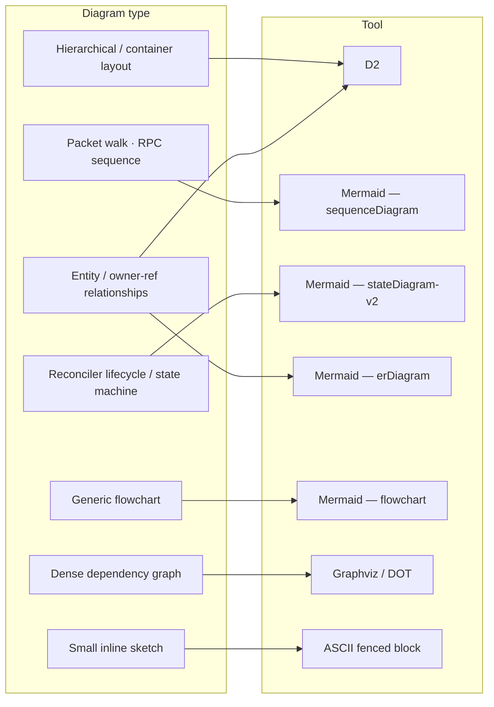

<!-- SPDX-License-Identifier: Apache-2.0 -->
<!-- Copyright (c) 2026 keese-ai -->

# Diagram authoring

Every diagram in this project is generated from a checked-in text source — never a binary export, screenshot, or hand-drawn file.

!!! info "Audience"
    Contributors adding or updating diagrams in `docs/` or `book/`. **Prerequisites:** [Development environment](dev-environment.md) (tools are provided by `nix develop`).

## Principles

Five rules govern every diagram in the repo:

1. **Text-first.** Source files (`*.d2`, `*.mmd`, `*.dot`) are committed; rendered SVGs live alongside them. Binaries (`.drawio`, `.vsd`, screenshots) are never committed.
2. **Right tool per type.** Do not force Mermaid to render a topology, or D2 to render a sequence diagram. See the [tool matrix](#tool-matrix) below.
3. **Diagrams are authoritative.** Drift between a diagram and the code it depicts is a bug, severity equal to stale API documentation.
4. **Ship diagram and code together.** A code change that alters depicted structure must update the relevant diagram in the same commit.
5. **Trace to source.** Every diagram source file declares `source_refs:` in its header — the files or designs it depicts. A diagram without `source_refs` is suspicious and may be flagged by review.

## Tool matrix



The full prose rationale for each choice lives in [`docs/references/diagram-authoring.md`](https://github.com/keese-ai/keese/blob/main/docs/references/diagram-authoring.md).

### Summary table

| Diagram type | Tool | Notes |
|---|---|---|
| Hierarchical / container layout | **D2** | `container` groupings nest cleanly; multi-level layout |
| Packet walks, RPC flows | **Mermaid** `sequenceDiagram` | GitHub-native; no external renderer needed |
| Lifecycle / reconciler state | **Mermaid** `stateDiagram-v2` | Reads like code |
| Entity / owner-ref relationships | **Mermaid** `erDiagram` or **D2** | Prefer D2 when nested under a parent resource |
| Generic flowchart | **Mermaid** `flowchart` | Universal, lowest friction |
| Dense dependency graph | **Graphviz / DOT** | Rank-based layout, disciplined edge routing |
| Small inline sketch | ASCII in a fenced block | No toolchain overhead |

## Toolchain

All three tools are pinned in [`flake.nix`](https://github.com/keese-ai/keese/blob/main/flake.nix) and available inside `nix develop`:

- `d2` — Terrastruct, <https://d2lang.com>
- `mermaid-cli` (`mmdc`) — <https://mermaid.js.org>
- `graphviz` — standard `dot`, `neato`, `sfdp`

Render commands:

```bash
# D2
d2 docs/designs/diagrams/my-topology.d2 docs/designs/diagrams/my-topology.svg

# Mermaid
mmdc -i docs/plans/diagrams/my-flow.mmd -o docs/plans/diagrams/my-flow.svg

# Graphviz
dot -Tsvg internal/dep-graph.dot -o docs/designs/diagrams/dep-graph.svg
```

Rendered SVGs live next to their sources with a matching slug and `.svg` extension — the freshness hook depends on this naming convention.

## Source file headers

Every diagram source must open with a header block declaring its origin. The exact comment syntax varies by tool:

**D2:**
```d2
# SPDX-License-Identifier: Apache-2.0
# Copyright (c) 2026 keese-ai
# source_refs: internal/controller/keese/workspace/reconciler.go
# depicts: Workspace reconcile loop — phase-05
```

**Mermaid `.mmd`:**
```
%% SPDX-License-Identifier: Apache-2.0
%% Copyright (c) 2026 keese-ai
%% source_refs: api/keese/v1alpha1/workspace_types.go
%% depicts: Workspace status state machine
```

**Graphviz DOT:**
```dot
// SPDX-License-Identifier: Apache-2.0
// Copyright (c) 2026 keese-ai
// source_refs: docs/designs/10a-otel-topology.md
// depicts: OTEL collector pipeline
```

The `source_refs` field lists the repo-relative paths of the files the diagram depicts, comma-separated when there are multiple.

## Book pages: inline Mermaid only

Pages under `book/docs/` use **inline Mermaid fenced blocks** (```` ```mermaid ````), not committed `.mmd` source files. This distinction matters for two reasons:

1. **Native rendering.** mkdocs-material renders inline Mermaid without a build step or external renderer.
2. **Freshness hook decoupling.** The `check-diagram-freshness` pre-commit hook scans for `*.mmd` and `*.d2` source files in `docs/` and `book/`, then re-renders and diffs them against committed SVGs. An inline Mermaid block inside a `.md` file is invisible to this hook — there is no parallel `.svg` to diff against, and that is intentional.

!!! note
    If you are adding a diagram that lives only inside a `book/docs/` Markdown page, write it as an inline ```` ```mermaid ```` block. Do not create a sibling `.mmd` source file for it; the freshness hook would then require a committed `.svg` that the book's build system does not produce.

    For standalone referenced diagrams in `docs/designs/` or `docs/plans/`, always use committed source + SVG pairs and let the hook validate them.

## Freshness enforcement (`check-diagram-freshness`)

The pre-commit hook at [`scripts/check-diagram-freshness.sh`](https://github.com/keese-ai/keese/blob/main/scripts/check-diagram-freshness.sh) runs on every commit. It:

1. Scans `docs/` and `book/` recursively for `*.d2`, `*.mmd`, and `*.dot` source files.
2. Re-renders each source into a temporary SVG using the appropriate tool (`d2`, `mmdc`, or `dot`).
3. Compares the fresh render to the committed sibling `.svg`, normalising whitespace to avoid timestamp-only drift.
4. Fails the commit if any source has drifted from its render.

```
diagram freshness check FAILED — re-render and re-stage
  re-render: d2 docs/designs/diagrams/workspace-topology.d2 docs/designs/diagrams/workspace-topology.svg
```

To fix a freshness failure, run the printed re-render command and `git add` the resulting SVG before committing again.

### Marking a diagram stale

In rare cases a diagram cannot be updated in the same commit as the code change (e.g., the tool binary is unavailable in CI, or the diagram is under active rework). Mark the source `status: stale` in its header:

**D2:**
```d2
# status: stale
```

**Mermaid:**
```
%% status: stale
```

The hook detects this marker and skips the freshness check with a warning rather than failing. A `stale` marker is tolerated for **one phase** before becoming a blocker. Clean it up promptly.

## Worked example: D2 topology

Full structure for a new D2 diagram in a design doc:

```d2
# SPDX-License-Identifier: Apache-2.0
# Copyright (c) 2026 keese-ai
# source_refs: internal/controller/authz/oidcprovider/reconciler.go
# depicts: OIDCProvider reconcile topology

direction: right

controller: OIDC Provider Controller {
  shape: rectangle
  style.fill: "#f6f8fa"

  reconciler: Reconciler
  extauth: extAuth client
}

openfga: OpenFGA {
  shape: cylinder
}

controller.reconciler -> controller.extauth: "evaluate tuple"
controller.extauth -> openfga: "Check()"
openfga --> controller.extauth: "allowed | denied"
```

Render and stage alongside the design doc:

```bash
d2 docs/designs/diagrams/oidcprovider-topology.d2 \
   docs/designs/diagrams/oidcprovider-topology.svg
git add docs/designs/diagrams/oidcprovider-topology.d2 \
        docs/designs/diagrams/oidcprovider-topology.svg
```

## Checklist before committing a diagram

- [ ] Source file has SPDX + copyright header
- [ ] `source_refs:` lists the files the diagram depicts
- [ ] `depicts:` is a one-line human description
- [ ] Sibling `.svg` exists and was produced by the correct tool
- [ ] `check-diagram-freshness` passes locally (`pre-commit run check-diagram-freshness`)
- [ ] Commit includes both the source and the render in the same `git add`

## See also

- [Development environment (Nix)](dev-environment.md) — toolchain installation via `nix develop`
- [Documentation system](documentation.md) — where diagrams live within the overall doc structure
- [SDLC & the design gate](sdlc.md) — phase cadence that governs when diagrams must ship with code
- [Repository map](repo-map.md) — directory layout for `docs/designs/diagrams/` and `docs/plans/diagrams/`
