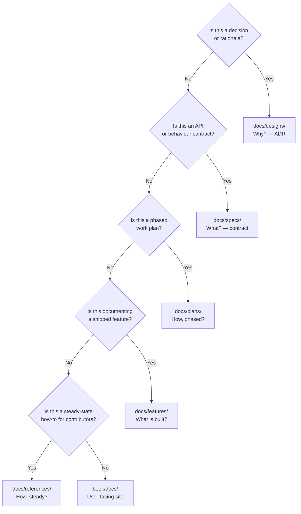

<!-- SPDX-License-Identifier: Apache-2.0 -->
<!-- Copyright (c) 2026 keese-ai -->

# Documentation system

The keese documentation lives in two parallel trees — a machine-readable `docs/` hierarchy for Claude and contributors, and a human-facing `book/` site for users — each with enforced structure and frontmatter. The `docs/` hierarchy enforces a 200-line-per-file limit per AI context rules. The `book/` site targets 120–400 lines per page — short enough to scan, long enough to be complete.

!!! info "Audience"
    Contributors adding or updating documentation. · **Prerequisites:** familiarity with Conventional Commits (see [SDLC & the design gate](sdlc.md)) and a working dev environment (see [Development environment](dev-environment.md)).

---

## Two trees, two audiences

| Tree | Audience | Question answered |
|---|---|---|
| `docs/` | Claude, reviewers, contributors | Structure, contracts, decisions, how things work |
| `book/` | End users, operators, developers | How to install, operate, and extend keese |

Changes to implemented behaviour should update **both** trees: a `docs/features/` entry for the machine-readable record, and a `book/` concept or guide page for the human-readable site.

---

## The five `docs/` sub-trees



| Sub-tree | Purpose | Example filename |
|---|---|---|
| `docs/designs/` | Architecture Decision Records — rationale and trade-offs | `20-api-group-layout.md` |
| `docs/specs/` | API / behaviour contracts; referenced by reconcilers | `keese.ai-v1alpha1-workspace.md` |
| `docs/plans/` | Phased implementation plans, scored against the rubric | `phase-02-auth-rewrite.md` |
| `docs/features/` | One doc per shipped feature; links code ↔ user docs | `workspace-session.md` |
| `docs/references/` | Steady-state contributor how-tos (not phased, not ADRs) | `documentation-system.md` |

The canonical source for this mapping is
[`docs/references/documentation-system.md`](https://github.com/keese-ai/keese/blob/main/docs/references/documentation-system.md).

---

## Frontmatter and SPDX headers

Every file in either tree starts with the SPDX/copyright pair as an HTML comment, then a YAML frontmatter block.

```markdown
<!-- SPDX-License-Identifier: Apache-2.0 -->
<!-- Copyright (c) 2026 keese-ai -->

---
scope: design            # design | spec | plan | reference | feature
category: adr            # adr | contract | phase | reference | feature
depends: [docs/designs/20-api-group-layout.md]
related_skills: [architect]
status: accepted         # proposed | accepted | superseded (designs)
                         # current | draft | deprecated    (specs/refs)
                         # todo | in_progress | done        (plans)
last_verified: 2026-05-29
---
```

The `last_verified` field must be updated when you verify a doc is still accurate. CI (`make docs-verify`) walks `// Architecture:` and `// Spec:` annotations in source files and fails if the referenced path is missing.

---

## Hard limits and split rules

**200 lines maximum** per file (including frontmatter). This is enforced by convention and caught in review.

When a file approaches the limit, split along natural seams:

| Doc type | How to split |
|---|---|
| `designs/` | File a second ADR — one design answers one decision |
| `specs/` | Split by sub-resource or domain |
| `plans/` | Split by phase suffix: `phase-02a.md`, `phase-02b.md` |
| `references/` | Split by subtopic; keep the parent as a short index |
| `features/` | One feature per file; link related features from each |

**Do not** split a design doc by adding more prose. If it is too long, it almost certainly contains two decisions — file a second ADR.

---

## The `book/` user site

The `book/` directory is an [mkdocs-material](https://squidfunk.github.io/mkdocs-material/) site built with `cd book && mkdocs build --strict`. It is the only output served to end users.

Pages are organised into six sections:

| Section | Covers |
|---|---|
| Getting Started | Install, first workspace, first workflow |
| Concepts | One page per subsystem (architecture, tenancy, memory, …) |
| Guides | Runnable how-tos with copy-pasteable commands |
| Reference | API groups, CLI, Make targets, feature-gate catalog, glossary |
| Scenarios | End-to-end narrative walkthroughs |
| Development | This section — contributor docs |

### Style rules for `book/` pages

- **First two lines:** SPDX + copyright HTML comment.
- **H1** title, then a one-sentence summary, then an `!!! info "Audience"` admonition with prerequisites.
- Use `!!! warning "Planned — not yet implemented"` for features not yet shipped.
- Show real, apply-able YAML in ` ```yaml ` blocks; real shell commands in ` ```bash ` blocks with expected output where useful.
- Do not paste large Go source. Reference as `path:line` or as a GitHub link.
- Cross-links to other book pages use **relative** markdown paths (e.g. `../guides/memory-backends.md`). Links to `docs/designs/` or source code use full GitHub URLs — never `../../docs/` relative paths (they break `mkdocs --strict`).
- Aim for 120–400 lines per page.

---

## Diagrams as source of truth

Diagrams are authoritative. A diagram that drifts from the implementation is a bug of equal severity to stale API docs.

The tool matrix from
[`docs/references/diagram-authoring.md`](https://github.com/keese-ai/keese/blob/main/docs/references/diagram-authoring.md):

| Diagram type | Tool | Rationale |
|---|---|---|
| Hierarchical / container layout | **D2** | nested containers, multi-level layout |
| Packet walks, RPC flows | **Mermaid** `sequenceDiagram` | GitHub-native; no external render |
| Lifecycle / reconciler state | **Mermaid** `stateDiagram-v2` | reads as code |
| Entity / owner-ref relationships | **Mermaid** ER or D2 | D2 when nested under a parent resource |
| Generic flowchart | **Mermaid** `flowchart` | universal |
| Dense dependency graph | **Graphviz / DOT** | rank-based layout |
| Small inline sketch | ASCII in a fenced block | no tooling overhead |

All three tools (`d2`, `mmdc`, `dot`) are pinned in `flake.nix`.

The pre-commit hook `check-diagram-freshness` re-renders every committed diagram source and diffs against the committed render. Drift fails the commit. To bypass in an emergency, mark the source `status: stale` in its header — tolerated for one phase only.

!!! warning "book/ diagrams are Mermaid fenced blocks"
    Pages under `book/docs/` use fenced ` ```mermaid ` blocks rendered natively by mkdocs-material. They are not pre-rendered SVGs. Use the right Mermaid diagram type from the tool matrix above.

---

## The documentation rubric

The user-facing `book/` and `docs/features/` are scored against a 10-category rubric defined in
[`docs/plans/documentation-rubric.md`](https://github.com/keese-ai/keese/blob/main/docs/plans/documentation-rubric.md).
Target: **≥ 90 / 100**. Verdicts: SHIP ≥ 90 · REVISE 70–89 · REWORK < 70.

| # | Category | Weight | Full points require |
|---|---:|---:|---|
| 1 | Feature coverage | 15 | Every implemented feature has a concept entry and a guide |
| 2 | Accuracy vs. code | 15 | Every claim matches `main`; field names / paths verified |
| 3 | Progressive disclosure | 10 | Audience-fit; concepts build in order; prereqs stated |
| 4 | Findability | 10 | Working cross-links; glossary; search-friendly headings |
| 5 | Task orientation | 10 | Guides are runnable end-to-end with expected output |
| 6 | Diagrams | 10 | ≥1 per concept page; correct type; all render |
| 7 | Examples & scenarios | 8 | ≥3 narrative scenarios; realistic sample YAML |
| 8 | Reference quality | 10 | All CRD kinds, CLI, config, metrics / events |
| 9 | Developer / SDLC | 7 | Design-gate, testing, CI/CD, build, honest roadmap |
| 10 | Build & hygiene | 5 | `mkdocs build --strict` passes; SPDX present; no orphans |

Scores are recorded in `docs/plans/documentation-iterations.md` using the template in the rubric. Run up to three refinement passes (coverage → clarity → polish) before restructuring.

---

## How to add a doc

### Adding a `docs/` doc

1. Identify the correct sub-tree using the flowchart above.
2. Copy `docs/_templates/<scope>.md` (if present) or follow the frontmatter shape for that scope.
3. Fill in all frontmatter fields; set `last_verified` to today.
4. Keep the file under 200 lines. Split now rather than later.
5. Append a row to the sub-tree's `README.md` index (e.g. `docs/references/README.md`).
6. If the doc adds a new repeatable contributor task, add a row to the task matrix in `CLAUDE.md`.
7. Commit with `docs(<scope>): add <short-title>` — see [SDLC & the design gate](sdlc.md).

### Adding a `book/` page

1. Write the file at the path listed in `book/mkdocs.yml` `nav:`, or add a new nav entry.
2. Follow the page structure: SPDX comment → H1 → summary → audience admonition → H2/H3 body.
3. Include at least one Mermaid diagram on concept pages (two is better).
4. Verify cross-links are relative paths to other book pages, or GitHub URLs for repo files.
5. Run `cd book && mkdocs build --strict` to catch broken links before committing.
6. Commit with `docs(book): add <page-title>`.

!!! tip "Cross-link checklist"
    - Book page → book page: relative path, e.g. `../concepts/memory.md`
    - Book page → source code: `https://github.com/keese-ai/keese/blob/main/<path>`
    - Book page → `docs/designs/` or `docs/specs/`: GitHub URL only
    - Never use `../../docs/` in a book page — mkdocs --strict rejects it

---

## See also

- [SDLC & the design gate](sdlc.md) — how docs gate moves through the design → spec → plan → code pipeline
- [Diagram authoring](diagrams.md) — full diagram cookbook with D2 / Mermaid / Graphviz examples
- [Repository map](repo-map.md) — where everything lives in the repo
- [Contributing](contributing.md) — commit conventions, PR process, pre-commit hooks
