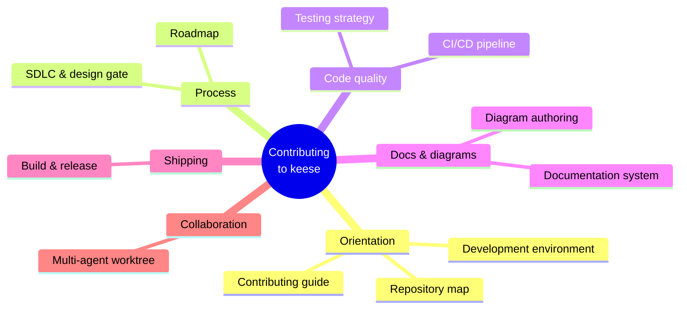
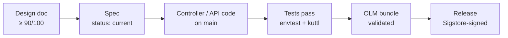

<!-- SPDX-License-Identifier: Apache-2.0 -->
<!-- Copyright (c) 2026 keese-ai -->

# Development

Everything you need to contribute code, documentation, or infrastructure to keese — from setting up the dev environment to cutting a release.

!!! info "Audience"
    Contributors and maintainers of the keese project. **Prerequisites:** familiarity with Go and Kubernetes operators; a working Docker or Podman installation. Start with [Getting Started](../getting-started/index.md) if you are an end-user rather than a contributor.

## Contributor topic map

The mindmap below shows how the development topics relate to each other. Each leaf corresponds to a page in this section.



## Where to start

| If you want to… | Go to |
|---|---|
| Understand the repo layout | [Repository map](repo-map.md) |
| Get your local environment running | [Development environment (Nix)](dev-environment.md) |
| Understand how designs, specs, and plans gate code | [SDLC & the design gate](sdlc.md) |
| Run or write tests | [Testing strategy](testing.md) |
| Read and write the book docs | [Documentation system](documentation.md) |
| Add or update architecture diagrams | [Diagram authoring](diagrams.md) |
| Understand the CI pipeline | [CI/CD pipeline](cicd.md) |
| Cut a release or sign an image | [Build & release](build-release.md) |
| Dispatch parallel subagent work | [Multi-agent worktree workflow](multi-agent.md) |
| See what is built vs. what is planned | [Roadmap](roadmap.md) |
| Send a pull request | [Contributing](contributing.md) |

## Repository layout at a glance

```
keese/
├── api/                     # CRD Go types — 20 kinds, 3 API groups
├── internal/controller/     # 18 reconcilers (gate open, implemented)
├── internal/runtime/        # Agent runtime SPI + goose provider
├── cmd/                     # 5 binaries (operator, keese-authz, keese-drain, keese-wf-launcher, keese-cosign-webhook)
├── config/                  # Kustomize base + overlays (dev/, kind/, prod/)
├── bundle/                  # OLM bundle (generated — do not hand-edit)
├── deploy/opentofu/         # Cloud deploy: aws/, gcp/, azure/
├── dev/                     # kind + Tilt + Helmfile local bootstrap
├── scripts/                 # Helpers: agent-dispatch, worktree-merge, design-gate check
├── docs/                    # designs/, specs/, plans/, features/, references/ (internal)
└── book/                    # User-facing docs site (mkdocs-material) ← you are here
```

The full path-by-purpose table lives in [Repository map](repo-map.md).

## Technology stack

| Layer | Technology |
|---|---|
| Language | Go 1.24+ |
| Framework | Operator SDK (go/v4 plugin), controller-runtime |
| Packaging | OCI images, OLM bundle, Sigstore cosign (keyless OIDC) |
| Manifests | Kustomize (in-cluster), OpenTofu (cloud infra), Helmfile (dev deps) |
| Multi-tenancy | Capsule + optional vcluster |
| ReBAC | OpenFGA |
| Egress | Envoy Gateway + Envoy AI Gateway |
| Messaging | NATS JetStream via NACK |
| Workflow | Argo Workflows |
| Memory | Pluggable `Memory` CRD: SQLite / Redis / Qdrant / pgvector / Neo4j / Mem0 / Zep |
| Secrets | OpenBao + ExternalSecrets Operator |
| Observability | OpenTelemetry → Elastic APM (traces) + ECK (logs, metrics) |
| Local dev | ctlptl + kind + Tilt + Helmfile |
| Pre-commit | Conventional Commits, detect-secrets, gitleaks, shellcheck, markdownlint |
| CI/CD | GitHub Actions + release-please + OpenSSF Scorecard |
| Primary IDE | GoLand (native ACP); VSCode secondary |

## First-time setup

```bash
# 1. Load the Nix dev shell (pins all tooling versions)
direnv allow

# 2. Install git hooks
pre-commit install --install-hooks
pre-commit install --hook-type commit-msg

# 3. Explore available make targets
make help
```

Spin up a local cluster when you need a live API server:

```bash
make kind-up            # ctlptl-managed kind cluster
make bootstrap-infra    # helmfile sync: cert-manager, Capsule, Envoy AI Gateway,
                        #   OpenFGA, NACK/NATS, ECK, OpenBao, ExternalSecrets,
                        #   Argo, Qdrant, Kyverno, OTEL
make tilt-up            # hot-reload the operator against the cluster
```

See [Development environment (Nix)](dev-environment.md) and [Bootstrap a local cluster](../guides/bootstrap-local.md) for full details.

## SDLC and the design gate

keese follows a **designs-before-specs-before-code** discipline enforced by `scripts/check-design-gate.sh` and GitHub Actions:

- All 62 designs and 27 specs scored ≥ 90/100 before the gate opened on **2026-04-22**.
- Controller and API code now land freely on `main`; the gate remains open.
- A spec may not reach `status: current` before its owning design does.



Every plan, spec, and implementation target passes through three review passes before landing: correctness & security, performance & quality, and operational readiness. See [SDLC & the design gate](sdlc.md).

## Commit conventions

Commits use **Conventional Commits**, enforced by `commitlint` pre-commit:

```
<type>(<scope>): <subject>
```

Valid types: `feat`, `fix`, `docs`, `chore`, `refactor`, `test`, `ci`, `build`, `perf`, `style`, `release`.

Scopes align with sub-phase IDs or top-level directories: `api`, `controller`, `bundle`, `dev`, `rebac`, `guardrail`, `repo`, `readme`, `lint`.

```bash
# Good examples
feat(api): add CrossTenantAgreement status conditions
fix(controller): retry on transient OpenFGA unavailable
docs(designs): add credential-broker ADR
```

No secrets in git — ever. Use `.env.local` (gitignored); see `.env.local.example` for the template.

## Testing at a glance

```
internal/controller/<group>/<kind>/
├── suite_test.go      # envtest — loads CRDs, asserts ≥ 3 idempotent reconciles
└── *_test.go          # table-driven unit tests

config/samples/        # ≥ 2 samples per CRD (minimal + fully populated)
scripts/dev/
├── e2e-smoke.sh       # full kind smoke test
└── sigterm-drain-test.sh  # SIGTERM drain assertion
```

Every reconciler must pass `suite_test.go` before merging. See [Testing strategy](testing.md) for harness details and the envtest / kuttl setup.

## Supply-chain posture

- Images are pinned by digest in CSVs and production overlays.
- Bundle + operator images are signed via **Sigstore cosign** (keyless OIDC) on every release.
- SBOMs generated by `syft`, attested via `cosign attest`.
- **OpenSSF Scorecard** runs weekly; high-severity failures block release.
- `govulncheck ./...` runs in CI; no dep is vendored until imported.

See [Build & release](build-release.md) for the full release checklist.

## See also

- [Repository map](repo-map.md) — detailed path-by-purpose table
- [SDLC & the design gate](sdlc.md) — the full gate history and phase status
- [Testing strategy](testing.md) — envtest, kuttl, and SIGTERM drain tests
- [Roadmap](roadmap.md) — what is built on `main` vs. what is planned
