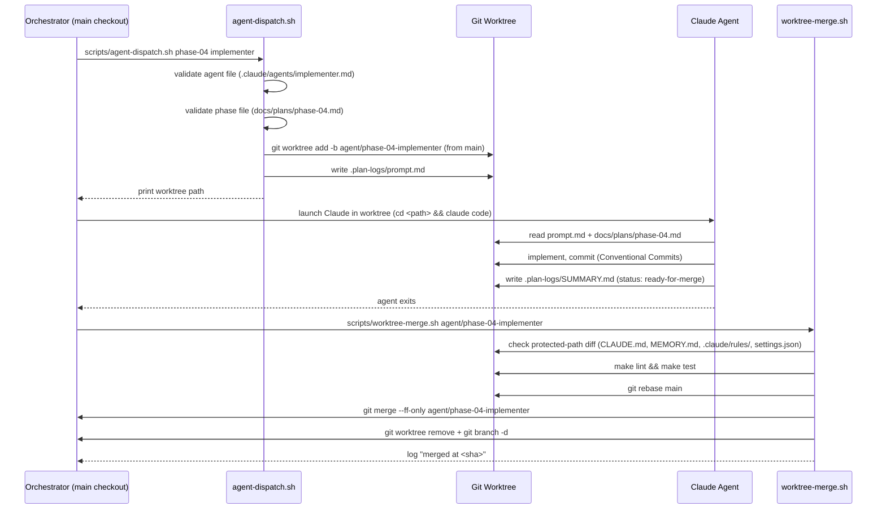
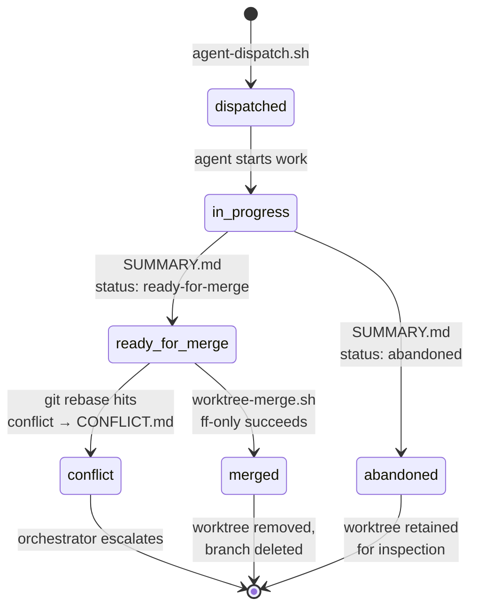

<!-- SPDX-License-Identifier: Apache-2.0 -->
<!-- Copyright (c) 2026 keese-ai -->

# Multi-agent worktree workflow

Run multiple Claude subagents in parallel, each in its own isolated git worktree, then merge their work back to `main` with a single deterministic script.

!!! info "Audience"
    Keese contributors and operators who want to parallelize agent-driven development work. **Prerequisites:** familiarity with git worktrees; a working clone of the keese repo.

## Why worktrees

One human plus several Claude agents editing a single checkout produces overlapping diffs,
conflicting code-generator outputs, and racing `go.sum` writes. Git worktrees solve this by
giving each agent an independent filesystem view that shares the parent `.git` directory —
so branches, refs, and the object store stay consistent without copying the repo.

An additional risk unique to inline (non-worktree) agents is index contamination: if two
agents call `git add` concurrently and the parent calls `git commit`, the commit silently
includes both agents' staged files under a single commit message. The worktree model closes
this window entirely.

```
keese/                              ← main checkout (branch: main)
keese-worktrees/
  phase-04-implementer/             ← branch: agent/phase-04-implementer
  phase-04-security-reviewer/       ← branch: review/phase-04-security-reviewer
  phase-05-crd-author/              ← branch: agent/phase-05-crd-author
```

Worktrees live in a **sibling directory** (`keese-worktrees/` by default, governed by
`scripts/lib/paths.sh::paths::worktree_base`). The sibling placement keeps IDE file-watchers
on the main checkout free of spurious change events.

## Full dispatch-to-merge sequence



## Agent branch lifecycle



## Dispatching an agent

```bash
scripts/agent-dispatch.sh <phase-id> <agent-name> [--branch=<name>] [--base=<ref>]
```

| Argument | Required | Default | Notes |
|---|---|---|---|
| `phase-id` | yes | — | e.g. `phase-04`; matched against `docs/plans/<phase-id>.md` |
| `agent-name` | yes | — | must match a file in `.claude/agents/<name>.md` |
| `--branch` | no | `agent/<slug>-<agent-name>` | override the branch name |
| `--base` | no | `main` | branch point; see stale-base gotcha below |

**What the script does:**

1. Validates that `<agent-name>.md` exists under `.claude/agents/`; fails fast if not.
2. Creates (or re-attaches) the branch from `--base`, adds the worktree under `keese-worktrees/`.
3. Seeds `.plan-logs/prompt.md` in the worktree with phase, agent, branch, and
   base metadata, plus numbered instructions the agent follows on startup.
4. Prints the worktree path to stdout so the caller can `cd` and launch Claude.

```bash
# Examples
scripts/agent-dispatch.sh phase-02 implementer
scripts/agent-dispatch.sh phase-03a security-reviewer --branch=review/phase-03a
scripts/agent-dispatch.sh feature-rebac rebac-modeler --base=main
```

### Agent selection

Pick the cheapest model tier that can do the job:

| Agent | Model tier | Typical task |
|---|---|---|
| `architect` | Opus | Draft designs (ADRs), critique plans |
| `implementer` | Sonnet | Write code, tests, book docs |
| `crd-author` | Sonnet | Scaffold and flesh out CRD types |
| `controller-author` | Sonnet | Implement reconcilers |
| `security-reviewer` | Opus | Audit RBAC, auth paths, signing wiring |
| `rebac-modeler` | Opus | Change OpenFGA model + tuple shapes |
| `plan-scorer` | Sonnet | Score a plan/design/spec against the rubric |
| `explorer` | Haiku | Search, enumerate files, list symbols |
| `debugger` | Haiku | Triage failing tests, parse stack traces |

Agent system-prompt files live at
[`.claude/agents/<name>.md`](https://github.com/keese-ai/keese/tree/main/.claude/agents/)
and include a `model:` frontmatter field that Claude Code uses automatically.

## Agent completion protocol

When the agent finishes its work it writes:

```
.plan-logs/<phase-id>/SUMMARY.md
```

Minimal required content:

```markdown
---
phase: phase-02
agent: implementer
model: claude-sonnet-4-6
ended: 2026-05-29T14:00:00Z
branch: agent/phase-02-implementer
worktree: ../keese-worktrees/phase-02-implementer
status: ready-for-merge   # ready-for-merge | blocked | abandoned
---

## What shipped
- ...

## Follow-ups
- ...

## Test evidence
- make lint: PASS
- make test: PASS
```

The agent then exits. It does **not** merge — that is exclusively the orchestrator's job.

## Shared config inside a worktree

Each worktree inherits the full repo layout. Key files the agent reads:

- `.claude/agents/<name>.md` — the agent's own system prompt.
- `.claude/rules/*.md` — hard rules; read-only in worktrees.
- `.claude/skills/*.md` — available skills.
- `MEMORY.md` — **read-only by convention** on non-main branches. The dispatch
  prompt instructs agents not to append to it; the orchestrator on `main` is the
  only writer. No filesystem permission is enforced by the script.

## Merging back to main

```bash
scripts/worktree-merge.sh <branch> [--squash] [--keep-worktree] [--no-verify-green]
```

| Flag | Effect |
|---|---|
| `--squash` | Collapse all commits into one; message taken from `SUMMARY.md` frontmatter |
| `--keep-worktree` | Skip the post-merge `git worktree remove` + `git branch -d` |
| `--no-verify-green` | Skip `make lint && make test` gate (use only in CI with separate gate job) |

**Default (non-squash) flow:**

1. Locate the worktree by branch name via `git worktree list --porcelain`.
2. Check the diff against `main` for protected paths; abort if any are touched.
3. Run `make lint && make test` inside the worktree.
4. `git rebase main` inside the worktree; abort and write `CONFLICT.md` on conflict.
5. `git checkout main && git merge --ff-only <branch>`.
6. Remove the worktree and delete the branch (unless `--keep-worktree`).

**Squash flow** additionally runs `git merge --squash` before the ff-only merge, using the
first commit subject from the worktree's log as the commit message.

```bash
# Standard merge (preserves individual commits)
scripts/worktree-merge.sh agent/phase-04-implementer

# Squash a WIP-heavy branch into one commit
scripts/worktree-merge.sh agent/phase-04-implementer --squash

# Keep the worktree for post-merge inspection
scripts/worktree-merge.sh agent/phase-04-implementer --keep-worktree
```

## Protected paths

The merge script hard-blocks any branch whose diff touches these four paths:

| Path | Reason |
|---|---|
| `CLAUDE.md` | Claude's task-to-doc index; cache warmth |
| `MEMORY.md` | Cross-session decision log; append on main only |
| `.claude/rules/` | Non-negotiable conventions; drive all agent behavior |
| `.claude/settings.json` | Permissions + hooks; central authority |

There is intentionally **no override flag** — changes to protected paths must happen
on `main` directly. To add a new protected path, edit the `protected_hits` grep
regex in [`scripts/worktree-merge.sh`](https://github.com/keese-ai/keese/blob/main/scripts/worktree-merge.sh)
on `main`.

Everything else is explicitly allowed in worktrees, including `docs/**`, `book/**`,
`.claude/skills/**`, `.claude/agents/**`, source code, and manifests.

## Conflict policy

**Abort and escalate — never auto-resolve.** If `git rebase main` hits a conflict the
script:

1. Runs `git rebase --abort` in the worktree.
2. Writes `.plan-logs/<phase>/CONFLICT.md` with `git status` output and the list of
   conflicting files.
3. Exits non-zero with a next-step command for the orchestrator.

An agent resolving a rebase conflict unsupervised has historically stomped correct work.
This rule is load-bearing.

## Pre-merge gate

These checks all run before the ff-only merge and block if any fail:

```bash
make lint
make test
# Every commit subject in the branch must pass commitlint
git log origin/main..HEAD --format=%s | commitlint
```

A dirty working tree after running code generators (e.g. `make manifests`) counts as a
failure — the agent should have committed the generated output.

## Post-merge steps (orchestrator)

1. Post the `SUMMARY.md` body to the PR thread if one exists.
2. Append one line to `MEMORY.md` on `main` capturing the phase outcome.
3. Remove `.plan-logs/<phase>/AGENT.md` (the active-agent marker); keep `SUMMARY.md`
   as a permanent history artifact.

## Parallel dispatch

Multiple agents can run simultaneously as long as their branches are independent:

```bash
# Dispatch two agents in parallel (run in separate terminals or background)
scripts/agent-dispatch.sh phase-04 implementer &
scripts/agent-dispatch.sh phase-04 security-reviewer --branch=review/phase-04-sec &
wait

# Merge sequentially (fast-forward requires serial merges to main)
scripts/worktree-merge.sh agent/phase-04-implementer
scripts/worktree-merge.sh review/phase-04-sec
```

!!! warning "Merge order matters"
    Only one `worktree-merge.sh` can touch `main` at a time. The second merge may
    require a fresh `git rebase` if the first merge moved `main` HEAD. The script
    handles this automatically — just re-run if the first rebase detects drift.

## Known gotchas

### Stale-base branches from the worktree pool

!!! warning "Stale-base gotcha (2026-05-06)"
    The Claude Agent SDK's `isolation: "worktree"` parameter draws from a pool/cache
    and may branch from a stale `main` HEAD — potentially **before** a recent rename
    or restructure. Symptom: the worktree references old path layouts; merging back
    produces a massive create/delete diff instead of a clean patch.

    **Workaround:** Use `scripts/agent-dispatch.sh` directly rather than relying on
    the SDK's built-in worktree isolation. The script always branches from the ref
    you pass with `--base` (default `main`). If you must use the SDK pool, verify
    the worktree's base commit with `git log --oneline -3` before letting the agent
    begin work.

### Parallel inline agents contaminate the git index

!!! warning "Index contamination (non-worktree)"
    Inline agents (no worktree isolation) that call `git add` concurrently with the
    parent committing can accidentally include each other's staged-but-uncommitted
    work under the wrong commit message.

    **Workaround:** When dispatching parallel inline agents, use `git add <exact
    paths>` — never `git add .` or `git add <directory>` — or use the worktree
    model for any parallel work.

### Squash must not be used on security-reviewer branches

Security-reviewer output carries a fine-grained audit trail. Squashing erases
the intermediate reasoning steps that a future security audit may need. Always
merge reviewer branches without `--squash`.

## Slash-command shortcuts

The `/dispatch` and `/merge-worktree` skills wrap these scripts for interactive use
from within Claude Code:

```
/dispatch phase-04 implementer
/merge-worktree agent/phase-04-implementer
```

See [`.claude/skills/`](https://github.com/keese-ai/keese/tree/main/.claude/skills/)
for the underlying skill definitions.

## See also

- [Repository map](repo-map.md) — where agents find source, tests, and configs
- [SDLC & the design gate](sdlc.md) — how phases gate on design + spec scores
- [Development environment (Nix)](dev-environment.md) — setting up the local shell before dispatching
- [Testing strategy](testing.md) — what the pre-merge gate actually runs
