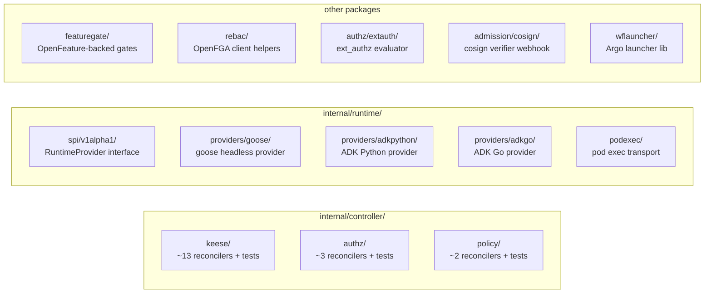

<!-- SPDX-License-Identifier: Apache-2.0 -->
<!-- Copyright (c) 2026 keese-ai -->

# Repository map

A guided tour of every top-level directory in the keese repository, so a new contributor can navigate from source to manifest to test without guessing.

!!! info "Audience"
    Contributors and maintainers who need to find their way around the codebase. · **Prerequisites:** [Development environment (Nix)](dev-environment.md), basic familiarity with Kubernetes operators.

---

## High-level layout

```mermaid
flowchart TD
    ROOT["keese/"]

    ROOT --> API["api/<br/>20 CRD kinds<br/>3 API groups"]
    ROOT --> INTERNAL["internal/<br/>controllers · runtime SPI<br/>authz · rebac · featuregate"]
    ROOT --> CMD["cmd/<br/>5 binaries"]
    ROOT --> CONFIG["config/<br/>Kustomize base + overlays"]
    ROOT --> BUNDLE["bundle/<br/>OLM bundle (generated)"]
    ROOT --> CATALOG["catalog/<br/>File-based OLM catalog"]
    ROOT --> DEPLOY["deploy/opentofu/<br/>AWS · GCP · Azure"]
    ROOT --> DEV["dev/<br/>Local infra bootstrap<br/>kind · Tilt · Helmfile"]
    ROOT --> DOCS["docs/<br/>Designs · specs · plans<br/>features · references"]
    ROOT --> BOOK["book/<br/>mkdocs-material site"]
    ROOT --> SCRIPTS["scripts/<br/>CI helpers + gate checks<br/>agent-dispatch · worktree-merge"]
    ROOT --> TESTS["tests/<br/>e2e (kuttl) · openfga"]
    ROOT --> HACK["hack/<br/>boilerplate · testdata"]

    API --> KEESE_API["keese/v1alpha1<br/>13 kinds"]
    API --> AUTHZ_API["authz/v1alpha1<br/>5 kinds"]
    API --> POLICY_API["policy/v1alpha1<br/>2 kinds"]

    INTERNAL --> CTRL["controller/<br/>keese/ · authz/ · policy/"]
    INTERNAL --> RUNTIME["runtime/<br/>spi/ · providers/<br/>(goose · adk-python · adk-go)"]
    INTERNAL --> OTHER["featuregate/<br/>rebac/ · authz/ · wflauncher/"]

    CMD --> MGR["main.go<br/>operator manager"]
    CMD --> AUTHZ_CMD["keese-authz/<br/>ext_authz gRPC server"]
    CMD --> DRAIN["keese-drain/<br/>workspace drain helper"]
    CMD --> WF["keese-wf-launcher/<br/>Argo workflow launcher"]
    CMD --> COSIGN["keese-cosign-webhook/<br/>OLM bundle cosign verifier"]

    CONFIG --> BASE["base: crd/ · rbac/<br/>manager/ · webhook/<br/>certmanager/ · vap/"]
    CONFIG --> OVL["overlays/<br/>dev/ · prod/"]
    CONFIG --> SAMPLES["samples/<br/>≥2 YAML per CRD kind"]
```



---

## `api/` — CRD type definitions

All CRD Go types live here, organized by API group and version. Every file carries the SPDX header and follows [`.claude/rules/04-kubernetes.md`](https://github.com/keese-ai/keese/blob/main/.claude/rules/04-kubernetes.md).

### `api/keese/v1alpha1/` — core workload primitives

| File | Kind | Scope |
|---|---|---|
| `workspace_types.go` | `Workspace` | Namespaced |
| `workspacesession_types.go` | `WorkspaceSession` | Namespaced |
| `workspaceshare_types.go` | `WorkspaceShare` | Namespaced |
| `agentruntime_types.go` | `AgentRuntime` | Cluster |
| `runtimeextension_types.go` | `RuntimeExtension` | Namespaced |
| `memory_types.go` | `Memory` | Namespaced |
| `sharedmemory_types.go` | `SharedMemory` | Namespaced |
| `recipe_types.go` | `Recipe` | Namespaced |
| `recipesource_types.go` | `RecipeSource` | Namespaced |
| `transport_types.go` | `Transport` | Namespaced |
| `workflow_types.go` | `Workflow` | Namespaced |
| `workflowrun_types.go` | `WorkflowRun` | Namespaced |
| `tenant_types.go` | `Tenant` | Cluster |
| `common_types.go` | shared field structs | — |
| `groupversion_info.go` | scheme registration | — |

### `api/authz/v1alpha1/` — access control

| File | Kind |
|---|---|
| `guardrailbinding_types.go` | `GuardrailBinding` |
| `toolbinding_types.go` | `ToolBinding` |
| `workspacetool_types.go` | `WorkspaceTool` |
| `crosstenanagreement_types.go` | `CrossTenantAgreement` |
| `oidcprovider_types.go` | `OIDCProvider` |

### `api/policy/v1alpha1/` — quantitative constraints

| File | Kind |
|---|---|
| `tokenbudget_types.go` | `TokenBudget` |
| `featuregate_types.go` | `FeatureGate` |

`zz_generated.deepcopy.go` in each package is machine-generated by `make generate` — do not edit by hand.

---

## `internal/` — implementation packages



### `internal/controller/`

Reconcilers mirror the API group layout. Each controller subdirectory contains:

- `<kind>_controller.go` — reconcile loop
- `<kind>_events.go` — typed event reason constants
- `<kind>_rebac*.go` — OpenFGA tuple writes
- `<kind>_controller_test.go` — envtest suite (idempotency over ≥3 reconciles)
- `suite_test.go` — envtest setup with CRDs loaded from `config/crd/bases/`

All writes go through Server-Side Apply with `client.FieldOwner("keese-<kind>-controller")`.

### `internal/runtime/`

The agent runtime SPI (`spi/v1alpha1/`) defines the `RuntimeProvider` interface. Provider implementations live under `providers/`:

- `goose/` — primary; wraps goose headless process
- `adkpython/` — ADK Python; **alpha stub, not production-ready**
- `adkgo/` — ADK Go; **alpha stub, not production-ready**

See [Agent runtimes (SPI)](../concepts/agent-runtimes.md) for the design.

### `internal/featuregate/`

OpenFeature-backed feature gate evaluation. Gates are declared in `api/policy/v1alpha1/featuregate_types.go` and loaded from `config/featuregates/` at startup. See [Feature gates](../concepts/feature-gates.md).

---

## `cmd/` — binaries

| Entry point | Binary name | Purpose |
|---|---|---|
| `main.go` | `keese-manager` | Operator manager — runs all 18 reconcilers |
| `keese-authz/` | `keese-authz` | ext_authz gRPC server wired to Envoy AI Gateway |
| `keese-drain/` | `keese-drain` | Workspace drain helper; called by `WorkspaceSession` termination |
| `keese-wf-launcher/` | `keese-wf-launcher` | Non-interactive Argo Workflow launcher for agent pods |
| `keese-cosign-webhook/` | `keese-cosign-webhook` | Admission webhook; verifies cosign keyless-OIDC signatures on OLM bundle images at `InstallPlan`/`ClusterServiceVersion` admission (gated by `cosign-installplan-verify` / `cosign-installplan-failclosed`) |

Every `main.go` installs a `signal.NotifyContext` for `SIGTERM` and `SIGINT` before starting the manager loop (rule 06-signal-handling §1).

---

## `config/` — Kustomize manifests

```
config/
├── crd/bases/          # generated CRD manifests (make manifests)
├── rbac/               # ClusterRole / RoleBinding markers output
├── manager/            # Deployment + ServiceAccount for the operator
├── webhook/            # MutatingWebhookConfiguration + ValidatingWebhookConfiguration
├── certmanager/        # Certificate + Issuer for webhook TLS
├── vap/                # ValidatingAdmissionPolicy (CEL rules)
├── featuregates/       # FeatureGate CRs shipped with the operator
├── network-policy/     # Default-deny NetworkPolicies for workspace namespaces
├── prometheus/         # ServiceMonitor for Prometheus scraping
├── scorecard/          # operator-sdk scorecard test config
├── subscription/       # OLM Subscription for dev installs
├── overlays/
│   ├── dev/            # kind/Tilt overlay — image tag, reduced replicas
│   └── prod/           # production overlay — image digest pinning
└── samples/            # ≥2 sample CRs per kind (minimal + fully populated)
```

!!! note
    `config/crd/bases/` and `config/rbac/` are **generated** — run `make manifests` after any API type change. Never edit these files directly.

---

## `bundle/` and `catalog/` — OLM packaging

`bundle/` contains the OLM bundle (CSV, CRD copies, metadata), generated by `make bundle`. The `catalog/keese/` directory holds the file-based catalog entry consumed by `operator-catalog` image builds. Both are regenerated artefacts; `scripts/check-bundle-drift.sh` fails CI if they drift from the API types.

See [Build & release](build-release.md) for the full OLM workflow.

---

## `deploy/opentofu/` — cloud infrastructure

```
deploy/opentofu/
├── aws/      # EKS cluster, IAM OIDC trust, ECR, RDS/pgvector
├── gcp/      # GKE cluster, Workload Identity, Artifact Registry
├── azure/    # AKS cluster, Azure AD WI, ACR
└── README.md
```

Each target provisions the Kubernetes cluster and the cloud IAM bindings keese needs for `BackendSecurityPolicy` credential exchange. See [Cloud deploy (OpenTofu)](../guides/cloud-deploy.md).

---

## `dev/` — local development infrastructure

```
dev/
├── bootstrap/
│   ├── helmfile.yaml        # Helmfile for all dev deps
│   ├── helmfile.lock        # pinned chart digests
│   ├── values/              # per-chart value overrides
│   ├── aigateway/           # Envoy AI Gateway overlay
│   ├── nats/                # NATS JetStream config
│   ├── openbao/             # OpenBao dev config
│   ├── openfga/             # OpenFGA dev config
│   └── cert-manager-issuers/
├── kind/                    # ctlptl kind cluster config
├── runtimes/
│   ├── anthropic-direct/    # goose runtime pointed at Anthropic API
│   └── goose-from-source/   # goose built from source
├── samples/                 # example CRs for local smoke testing
└── demo/                    # guided demo scripts
```

`make kind-up` creates the cluster via ctlptl, `make bootstrap-infra` runs `helmfile sync` inside `dev/bootstrap/`, and `make tilt-up` starts Tilt hot-reload. See [Bootstrap a local cluster](../guides/bootstrap-local.md).

---

## `docs/` — contributor design corpus

| Subdirectory | Contains | Count |
|---|---|---|
| `docs/designs/` | Architecture decisions (WHY) | 62 designs, all `status: current` |
| `docs/specs/` | Testable contracts (WHAT) | 27 specs |
| `docs/plans/` | Phased work plans + rubric + gate audit | 12 phase docs |
| `docs/features/` | Implemented feature write-ups | growing |
| `docs/references/` | Cookbook how-tos (steady-state) | 15+ references |

!!! tip
    Use the task → doc routing table in [CLAUDE.md](https://github.com/keese-ai/keese/blob/main/CLAUDE.md) to jump directly to the one doc relevant to your task. Loading the full `docs/` tree is unnecessary and expensive.

---

## `book/` — user-facing documentation site

`book/docs/` is the mkdocs-material source for this site. The `mkdocs.yml` at `book/mkdocs.yml` drives the navigation. Pages are organized into sections matching the top-level nav: Getting Started, Concepts, Guides, Reference, Scenarios, Development.

---

## `scripts/` — CI automation and gate checks

| Script | Purpose |
|---|---|
| `check-design-gate.sh` | Enforces no spec before owning design; verifies gate-open commit |
| `check-rebac-markers.sh` | Ensures every authz-affecting field has `// +keese:rebac-tuple=...` |
| `check-signal-handling.sh` | Greps each `cmd/**/main.go` for `signal.Notify` |
| `check-bundle-drift.sh` | Fails if `bundle/` is stale relative to CRD types |
| `check-netpol-wildcards.sh` | Rejects wildcard NetworkPolicies |
| `check-crd-validation.sh` | Runs `kubectl apply --dry-run=server` on all samples |
| `check-kubeconform.sh` | Schema-validates all manifests |
| `agent-dispatch.sh` | Creates a git worktree and spawns a subagent |
| `worktree-merge.sh` | Merges a completed subagent worktree back to main |
| `dev/e2e-smoke.sh` | End-to-end smoke on kind |
| `dev/sigterm-drain-test.sh` | SIGTERM drain test for all binaries |
| `lib/log.sh` | Structured logging helpers for all scripts |
| `lib/signals.sh` | POSIX trap helpers for script signal handling |

---

## `tests/` — integration and policy tests

```
tests/
├── e2e/
│   ├── kuttl-config.yaml         # kuttl harness config
│   ├── lib/                      # shared shell helpers
│   ├── workspace-progression/    # workspace lifecycle scenario
│   ├── multi-tenant/             # tenant isolation scenario
│   ├── cross-workspace/          # cross-tenant agreement scenario
│   ├── agentruntime-drain/       # SIGTERM drain scenario
│   ├── aigw-defense/             # AI gateway egress defense
│   ├── chaos-network/            # network partition resilience
│   ├── non-interactive-launcher/ # wf-launcher smoke
│   └── olm-upgrade/              # OLM upgrade path test
└── openfga/
    └── oidc-provider.yaml        # OpenFGA model fixtures
```

Unit and envtest suite tests live alongside their controllers in `internal/controller/`. The `tests/e2e/` kuttl scenarios run against a live kind cluster and require `make bootstrap-infra` to be complete.

---

## `hack/` — build support files

`hack/boilerplate.go.txt` is the copyright header template injected by `controller-gen`. `hack/testdata/` holds golden files for admission webhook and validation tests.

---

## `.claude/` — AI-assisted development harness

```
.claude/
├── rules/      # non-negotiable conventions (always loaded into context)
├── agents/     # pre-configured subagent personas (architect, implementer, …)
├── skills/     # on-demand skill docs
├── commands/   # slash command implementations
└── hooks/      # pre/post tool call hooks
```

These files are not application code — they configure how Claude Code navigates and contributes to the project. See [CLAUDE.md](https://github.com/keese-ai/keese/blob/main/CLAUDE.md) for the task → doc → skill routing table.

---

## Root-level files of note

| File | Purpose |
|---|---|
| `go.mod` / `go.sum` | Go module — `github.com/keese-ai/keese` |
| `Makefile` | Primary build entrypoint (`make help` for catalog) |
| `Makefile.operator-sdk-generated` | operator-sdk generated targets (included by Makefile) |
| `PROJECT` | operator-sdk project metadata |
| `Tiltfile` | Tilt live-reload configuration |
| `flake.nix` / `flake.lock` | Nix dev shell (pinned toolchain) |
| `Dockerfile` | Operator manager image |
| `Dockerfile.goose-runtime` | Goose agent runtime image |
| `Dockerfile.adk-python` | ADK Python runtime image |
| `Dockerfile.keese-authz` | keese-authz binary image |
| `Dockerfile.keese-cosign-webhook` | cosign webhook image |
| `Dockerfile.keese-catalog` | OLM catalog image |
| `CLAUDE.md` | Task → doc → skill index (always in context) |
| `MEMORY.md` | Cross-session decision log |
| `SECURITY.md` | Vulnerability reporting policy |
| `CONTRIBUTING.md` | Contribution guide |
| `.env.local.example` | Secrets template (`.env.local` is gitignored) |
| `lychee.toml` | Link-checker config for docs CI |

---

## Next steps

- [Development environment (Nix)](dev-environment.md) — get your shell set up
- [SDLC & the design gate](sdlc.md) — understand the design-first workflow
- [Testing strategy](testing.md) — envtest, kuttl, and smoke tests
- [CI/CD pipeline](cicd.md) — GitHub Actions workflows that guard `main`
