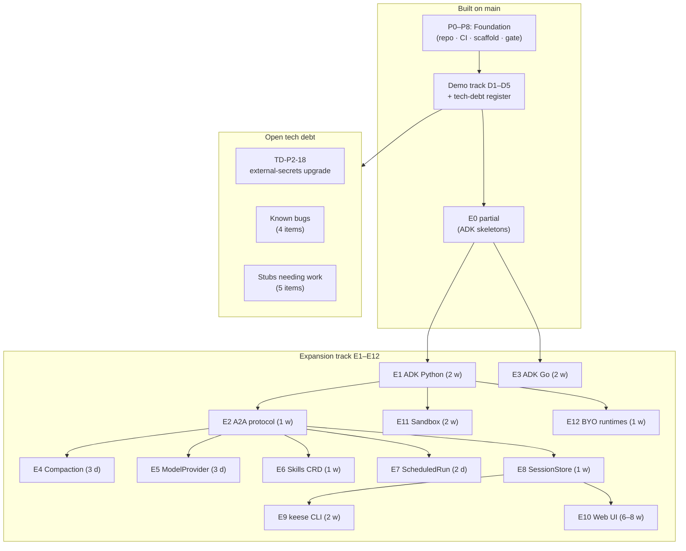
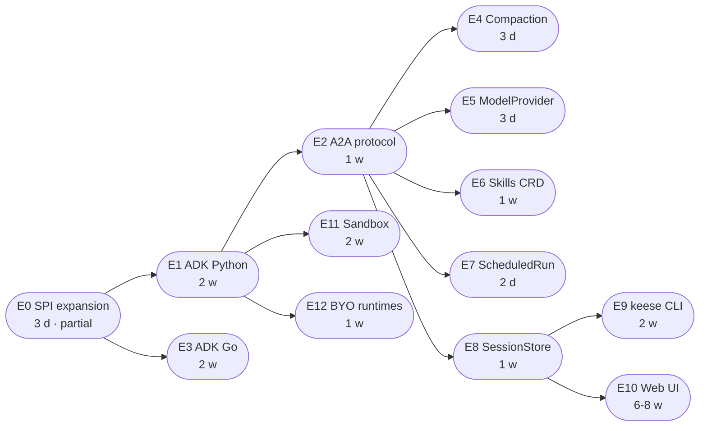
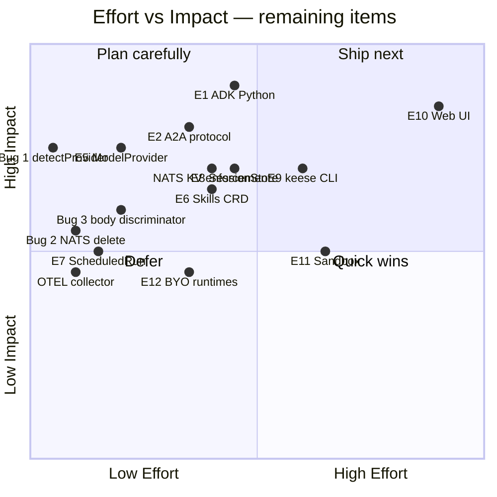

<!-- SPDX-License-Identifier: Apache-2.0 -->
<!-- Copyright (c) 2026 keese-ai -->

# Roadmap (built vs remaining)

An honest status board showing what is implemented on `main`, what is known-broken or stubbed, and what the expansion track plans to add.

!!! info "Audience"
    Contributors, early adopters, and anyone evaluating keese's current capabilities.
    **Prerequisites:** [Repository map](repo-map.md) · [SDLC & the design gate](sdlc.md)

---

## What is built on `main`

The design gate opened on 2026-04-22. All 62 designs and 27 specs reached `status: current` with honest scores ≥ 90. Since then, the demo track (D1–D5) and tech-debt register (TD-P1/P2/P3) have landed the following.

### Three API groups — 20 CRD kinds

| Group | Kinds |
|---|---|
| `keese.ai/v1alpha1` | AgentRuntime · Memory · Recipe · RecipeSource · RuntimeExtension · SharedMemory · Tenant · Transport · Workflow · WorkflowRun · Workspace · WorkspaceSession · WorkspaceShare (13 types + `common_types.go`) |
| `authz.keese.ai/v1alpha1` | CrossTenantAgreement · GuardrailBinding · OIDCProvider · ToolBinding · WorkspaceTool (5 types) |
| `policy.keese.ai/v1alpha1` | FeatureGate · TokenBudget (2 types) + `groupversion_info.go` |

All types have `// +kubebuilder:subresource:status`, `observedGeneration`, printer columns, and `// +keese:rebac-tuple=<relation>` markers where they affect authorization.

### 18 reconcilers

| Package | Reconcilers |
|---|---|
| `internal/controller/keese` | Workspace · WorkspaceShare · WorkspaceSession · AgentRuntime · Memory · SharedMemory · Recipe · RecipeSource · RuntimeExtension · Tenant · Transport · Workflow · WorkflowRun |
| `internal/controller/authz` | CrossTenantAgreement · GuardrailBinding · OIDCProvider |
| `internal/controller/policy` | FeatureGate · TokenBudget |

Every reconciler uses Server-Side Apply with the correct `keese-<kind>-controller` field owner, wires `Owns()` watches for pod/PVC ownership, emits structured events from a `const` table, and installs SIGTERM drain via `signal.NotifyContext`.

### Five binaries

| Binary | Purpose |
|---|---|
| `cmd/main.go` | Operator — all 18 controllers, Recipe webhook, OpenFGA ReBACwriters |
| `cmd/keese-authz/` | Envoy ext_authz gRPC server — OpenFGA-backed tool allowlist |
| `cmd/keese-drain/` | preStop sidecar — checkpoint marker for SIGTERM drain |
| `cmd/keese-wf-launcher/` | Workflow trigger launcher — creates `WorkflowRun` CRs on schedule/event |
| `cmd/keese-cosign-webhook/` | Admission webhook server — validates `InstallPlan` images against Sigstore keyless OIDC; gated by `cosign-installplan-verify` feature gate (alpha, default-off) |

### Runtime SPI and providers

The `internal/runtime/spi/v1alpha1` package defines the full `AgentRuntime` interface (`Bootstrap`, `Run`, `Resume`, `Drain`, `Attach`, `InjectPrompt`, `InvokeSubAgent`, `Health`, `StreamEvents`) plus sentinel errors and the `CapabilityMatrix` type.

Three provider packages exist under `internal/runtime/providers/`:

- **goose** — `Bootstrap`, `Run`, `Resume`, `Drain` implemented; `InjectPrompt` writes to a FIFO at `${HOME}/.local/state/goose/inject-fifo` (operator side only; goose fork not yet built). `Attach` returns `ErrAttachUnsupported` when no pod identity is provided; `InvokeSubAgent` returns `ErrUnsupported`.
- **adkpython** — E0 skeleton; all methods return `ErrUnsupported`. Real implementation lands in E1.
- **adkgo** — E0 skeleton; all methods return `ErrUnsupported`. Real implementation lands in E3.

### Other implemented items

- **OpenFGA ReBAC** — real `OpenFGARebacWriter` across all controllers; `FakeRebacWriter` confined to `*_rebac_fake_test.go` files.
- **Memory backends** — 7 providers (SQLite, Redis, Qdrant, pgvector, Neo4j, Mem0, Zep) via `MultiBackendProvisioner`; in-cluster providers use SSA StatefulSets.
- **Envoy AI Gateway stacks** — Anthropic (live demo), AWS Bedrock (OIDC-STS), GCP Vertex (WIF), Azure OpenAI (Entra) manifests under `dev/bootstrap/aigateway/`.
- **OLM bundle** — CSV, RBAC manifests, `olm-catalog-publish.yaml` workflow, `set-csv-replaces.sh`, `build-catalog.sh`, OperatorHub FBC template.
- **ValidatingAdmissionPolicies** — 5 VAPs: `embedding-dim-immutable`, `break-glass-annotation`, `regional-sensitive`, `sqlite-single-consumer`, `adk-runtime-image-digest-pinned` (rejects AgentRuntime adkPython/adkGo images without `@sha256:` digest).
- **Admission webhook** — `RecipeWebhook` (defaulting + validation); cert-manager TLS.
- **cosign webhook** — `keese-cosign-webhook` validates `InstallPlan` images against Sigstore keyless OIDC; gated by `cosign-installplan-verify` feature gate (alpha, default-off).
- **Feature gates** — `policy.keese.ai/v1alpha1.FeatureGate` CRD + controller projects values into `keese-system/keese-features` ConfigMap via OpenFeature SDK.
- **OpenTofu cloud modules** — EKS, GKE Autopilot, AKS at `deploy/opentofu/{aws,gcp,azure}/`.
- **Conftest Rego policies** — 4 files + tests at `policy/opentofu/` (29 tests pass).
- **e2e kuttl suites** — `workspace-progression`, `agentruntime-drain`, `multi-tenant`, `chaos-network`, `olm-upgrade`, `aigw-defense`, `cross-workspace`, `non-interactive-launcher`.
- **CI/CD** — 15 GitHub Actions workflows with SHA-pinned actions, per-job `permissions:`, CodeQL, Scorecard.
- **infra bootstrap** — `make bootstrap-infra` → Helmfile (kind) + `install-crds.sh`; Tilt dev loop.
- **Backup/DR runbooks** — OpenBao, OpenFGA, NATS JetStream at `docs/references/backup-and-dr*.md`.

---

## Track overview

---

## Known bugs and stubs (must fix before relying on these paths)

### Bug 1 — `detectProvider` does not handle `adkPython` / `adkGo`

!!! danger "Confirmed code bug"
    `internal/controller/keese/agentruntime_controller.go:182–193` — the
    `detectProvider` switch handles `goose`, `claudeCode`, and `aider` only.
    Any `AgentRuntime` CR with `spec.implementation.adkPython` or `adkGo` set
    falls through to the `default` branch and returns the error
    `"spec.implementation: no provider field is set"`.

    This means E0's API additions are NOT reachable through the controller.
    Fix: add `case impl.AdkPython != nil: return "adkPython"` and the equivalent
    `adkGo` arm before landing E1 or E3 work.

### Bug 2 — WorkflowRun NATS stream delete uses wrong tenant UID

!!! danger "Confirmed code bug"
    `internal/controller/keese/workflowrun_controller.go:442–444` — in
    `reconcileRunDelete`, both `tenantUID` and `runUID` are set to `string(wfr.UID)`.
    The stream name becomes `keese-tenant-<wfr-uid>-wf-<wfr-uid>`.
    In `ensureNATSStream` (line 289) `tenantUID` comes from `resolveTenantUID`,
    producing a different name. The delete call therefore targets a stream that
    does not exist, leaking every WorkflowRun's JetStream stream on deletion.

### Bug 3 — ext_authz body discriminator never fires (sub-tool variants unresolved)

!!! warning "Known gap — production impact"
    `cmd/keese-authz` resolves only the bare tool name (e.g. `tool:anthropic.messages`).
    Envoy does not buffer the request body for ext_authz by default, so the
    `bodyDiscriminator` that would resolve per-model sub-tools
    (e.g. `tool:anthropic.messages.claude-opus-4`) never fires end-to-end.
    **Workaround:** include both the bare and per-model entries in
    `Workspace.spec.egress.allowedTools`.
    **Fix:** configure `with_request_body: true` on
    `SecurityPolicy.spec.extAuth.grpc` and add the upstream Envoy buffer filter.

### Bug 4 — ext_authz ToolBinding/WorkspaceTool trie uses 10 s polling, not informers

!!! warning "Known gap"
    The trie that backs `keese-authz` is refreshed on a 10-second timer.
    `ToolBinding` and `WorkspaceTool` CRD changes take up to 10 seconds to
    propagate. Replace the polling ticker with controller-runtime informer event
    handlers to make the trie eventually-consistent within a single reconcile cycle.

### Stub 1 — ToolBinding and WorkspaceTool have no reconcilers

!!! warning "Planned — not yet implemented"
    `api/authz/v1alpha1/toolbinding_types.go` and `workspacetool_types.go` compile
    and the ext_authz trie reads them via polling, but there are no
    `ToolBindingReconciler` or `WorkspaceToolReconciler` structs, no status
    conditions, no events, and no OpenFGA tuple writes from these controllers.
    Status subresource management and ReBAC tuple projection are deferred.

### Stub 2 — CrossTenantAgreement `resolveWorkspaces` is a stub

!!! warning "Planned — not yet implemented"
    `internal/controller/authz/crosstenanagreement_controller.go:474–483` —
    `resolveWorkspaces` returns `[]string{"ws-" + tenantName}` rather than listing
    real `Workspace` CRs filtered by `tenantRef` and `WorkspaceSelector`. The TODO
    comment cites an import-cycle blocker between the `authz` and `keese` controller
    packages. Fix: use `unstructured` client + field-index on `tenantRef.name`.

### Stub 3 — NATS KV budget enforcement is write-only, no gateway reader

!!! warning "Planned — not yet implemented"
    `internal/controller/policy/nats.go` documents explicitly: the `NatsSignaler`
    interface is wired in production with `FakeNatsSignaler{}` (see `internal/controller/policy/tokenbudget_controller.go:502-503`).
    The TokenBudget controller writes budget-exceeded signals to NATS KV keys, but
    nothing in the gateway path (`keese-authz` / ext_proc) reads those keys to block
    LLM calls. Token budget enforcement is therefore not enforced at the egress plane.
    Three pieces must ship together: `nats-io/nats.go` in `go.mod`, a real
    `NatsJSSignaler`, and the gateway-side reader in `keese-authz`.

### Stub 4 — OTEL collector is commented out in Helmfile

!!! warning "Planned — not yet implemented"
    `dev/bootstrap/helmfile.yaml:261–273` — the `otel-collector` Helm release is
    commented out due to a missing `image.repository` value required by chart
    version 0.112.0. Until this is fixed and the chart deployed, operators and
    agents do not ship OTEL spans to a collector in local dev clusters.
    Fix: add `image: { repository: otel/opentelemetry-collector-k8s }` to
    `values/otel-collector.yaml` and uncomment the release.

### Stub 5 — external-secrets chart upgrade pending

!!! warning "Open tech debt (TD-P2-18)"
    `dev/bootstrap/helmfile.yaml` pins external-secrets at 0.10.5. The upstream
    chart index dropped the 0.x series; current index starts at 1.x with breaking
    `SecretStore` CRD field-path changes. Must plan the migration before the next
    chart-pin sweep.

---

## Expansion track (E0–E12)

The expansion track brings keese to feature parity with kagent v0.9.x by adding ADK runtimes, A2A protocol, UI, CLI, Skills, and more. Total effort: ~22–27 single-engineer-weeks or ~12–15 calendar weeks with two to three engineers.

### Effort and dependency map

### Phase descriptions

| Phase | Title | Status | Notes |
|---|---|---|---|
| E0 | AgentRuntime SPI expansion | Partial | `adkPython` + `adkGo` API fields and provider skeletons landed; `detectProvider` bug (Bug 1 above) must be fixed |
| E1 | ADK Python runtime | Planned | Bootstrap/Run/Drain for ADK Python; real capability flags; envtest + kuttl suite |
| E2 | A2A protocol on Workspace | Planned | `Workspace.spec.a2a` + Transport `scope: cross-tenant` + CTA admission |
| E3 | ADK Go runtime | Planned | Same surface as E1 for the Go ADK SDK |
| E4 | Context compaction | Planned | Compaction trigger on `adkPython`/`adkGo`; configurable strategy |
| E5 | ModelProvider CRD | Planned | New `keese.ai/v1alpha1.ModelProvider`; 9-provider discovery (Anthropic, OpenAI, Bedrock, Vertex, Azure, Mistral, Cohere, Llama, custom) |
| E6 | Skills CRD | Planned | `Skill`, `SkillSource`, `SharedSkill` kinds; init-container projection |
| E7 | ScheduledRun CRD | Planned | Cron-triggered `WorkflowRun` wrapper |
| E8 | SessionStore CRD | Planned | Pluggable session DB (PostgreSQL + SQLite); replaces goose's direct PVC writes |
| E9 | keese CLI | Planned | `keese` binary — Cobra + Bubbletea TUI; wraps `kubectl` + `keese-api` backend |
| E10 | Web UI | Planned | Chat, agents, sessions, tools, knowledge bases, tenant admin |
| E11 | Sandbox runtime | Planned | Kata Containers + NVIDIA tooling investigation |
| E12 | BYO runtimes | Planned | LangGraph / CrewAI container support |

### Items explicitly deferred (no phase assigned)

| Item | Reason |
|---|---|
| `v1alpha1 → v1beta1` promotion / conversion webhooks | Rule 04.13 — deferred to first beta promotion |
| Per-agent replica autoscaling | Design work not started |
| Inline human approval gate | Design work not started |
| CNCF sandbox graduation | Deferred |
| kagent integration | Explicitly out of scope; keese is standalone |
| CLI WireGuard tunnel (`keesectl tunnel`) | Design 13 complete; implementation not started |
| RAG / knowledge bases | Designs and spec current (28/28b/28c + `keese.ai-v1alpha1-rag.md`); zero controller code — implementation not started |

---

## Effort vs. impact of remaining work

The quadrant below uses a rough two-axis judgment: **impact** (how many users or capabilities it unblocks) and **effort** (weeks to ship).

---

## Open P2 tech debt

Only one P2 item remains open after the demo track:

| ID | Item |
|---|---|
| TD-P2-18 | Upgrade `external-secrets` chart from 0.10.5 to 1.x/2.x (breaking `SecretStore` field paths; plan migration before next chart-pin sweep) |

All P1 and all other P2/P3 items from the tech-debt register are closed.

---

## Deferred by design

Two P3 rows are intentionally not work items:

- **TD-P3-02** — Conversion webhooks for `v1alpha1 → v1beta1`. Rule 04.13 explicitly defers these to the first kind's beta promotion. No kind has reached `v1beta1`; reopen when the first `migration-<kind>.md` plan scores ≥ 90.
- **TD-P3-05** — Real keese fork of goose. Multi-week effort to fork [github.com/block/goose](https://github.com/block/goose), implement the InjectPrompt FIFO reader, and build a signed `ghcr.io/keese-ai/goose-runtime` image. Opens a separate epic in `docs/plans/keese-goose-fork/` when work begins.

---

## See also

- [SDLC & the design gate](sdlc.md) — how phases are scored and promoted
- [Testing strategy](testing.md) — envtest, kuttl, and chaos suites
- [Build & release (OLM + cosign)](build-release.md) — how the bundle ships
- [Contributing](contributing.md) — picking up an open item
