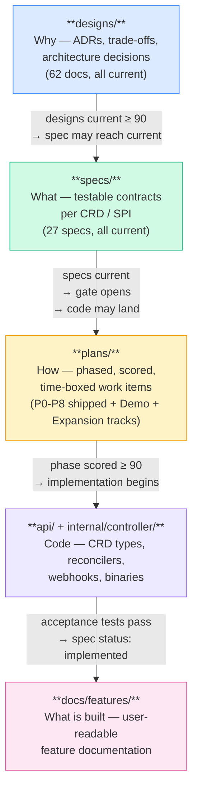

<!-- SPDX-License-Identifier: Apache-2.0 -->
<!-- Copyright (c) 2026 keese-ai -->

# SDLC & the Design Gate

keese uses a structured delivery model — designs explain **why**, specs define **what**, plans phase **how**, code implements, and feature docs record **what is built**.

!!! info "Audience"
    Contributors adding CRDs, controllers, designs, specs, or plans. · **Prerequisites:** [Repository map](repo-map.md) · [Development environment](dev-environment.md)

---

## Delivery model overview

Five document trees and the code that follows them:



The flow is **intentionally gated**: code cannot land until the designs and specs it implements are reviewed, scored, and current. This keeps architecture decisions auditable and prevents implementation drift.

---

## The five document trees

| Tree | Question answered | Lives at | Entry type |
|---|---|---|---|
| `docs/designs/` | **Why** — decisions, rationale, trade-offs | ADRs, one per decision | `scope: design` |
| `docs/specs/` | **What** — testable API / SPI contracts | One per CRD group or interface | `scope: spec` |
| `docs/plans/` | **How, phased** — scored work items | Phase docs with iteration logs | `scope: plan` |
| `docs/features/` | **What is built** — user-facing narrative | Short feature pages | `scope: feature` |
| `docs/references/` | **How, steady-state** — operational guides | How-to references | `scope: reference` |

The `book/` tree (this site) is the user-facing layer — it draws on all five trees but is authored separately and does not gate code.

---

## Document status lifecycle

Every design and spec carries a `status` frontmatter field. The lifecycle differs slightly between document types.

```mermaid
stateDiagram-v2
    direction LR

    [*] --> draft : doc created

    state "designs/" {
        draft --> current : scores ≥ 90<br/>across 3 rubric passes
        current --> superseded : replaced by a<br/>newer decision
    }

    state "specs/" {
        draft2 : draft
        current2 : current
        implemented : implemented
        draft2 --> current2 : all owning designs<br/>are current
        current2 --> implemented : acceptance tests<br/>exist and pass<br/>(regression_lock: true)
        implemented --> current2 : requires migration plan<br/>scored ≥ 90
    }

    note right of current : design gate opens<br/>when ALL 62 designs<br/>and 27 specs reach current
    note right of implemented : downgrade blocked<br/>without migration plan
```

**Design status values:**

- `draft` — placeholder; content under construction.
- `current` — scored ≥ 90 on iteration 3; authoritative.
- `superseded` — replaced; kept for historical record (e.g., `docs/designs/20-api-group-layout.md`).

**Spec status values:**

- `draft` — one or more owning designs are not yet `current`.
- `current` — all owning designs are `current`; spec content authored and reviewed.
- `implemented` — all acceptance tests pass; `regression_lock: true` set.

!!! note
    Downgrading a spec from `implemented` back to `current` requires a `docs/plans/migration-<slug>.md` plan scored ≥ 90. This protects consumers of stable APIs.

---

## The design gate

The design gate is the hard checkpoint between documentation and implementation. **It opened on 2026-04-22.**

### What the gate enforces

`scripts/check-design-gate.sh` (also wired as a required GitHub Actions check on `api/**` and `internal/controller/**` PRs) verifies four rules:

1. **Non-stub code implies current design.** Any `*_types.go` or `*_controller.go` file that exceeds 35 non-blank non-comment lines (or lacks the `TODO(design-gate)` sentinel) must have a matching `docs/designs/*.md` with `status: current`.
2. **Non-stub code implies current spec.** The same file must have a matching `docs/specs/*.md` for its API group and version with `status: current`.
3. **Specs cannot outrun designs.** No spec may be `status: current` while any design in its `depends:` list is still `status: draft`.
4. **Plans README score.** `docs/plans/README.md` frontmatter field `gate_status` must be `open`.

```bash
# Run locally
make design-gate

# Or directly
scripts/check-design-gate.sh
# Exit 0: Design gate OPEN (no violations).
# Exit 1: violations listed to stderr
```

### Pre-gate vs post-gate governance

| Concern | Pre-gate (before 2026-04-22) | Post-gate (now) |
|---|---|---|
| Controller body | Stub only (`TODO(design-gate)` + ≤ 35 LOC) | Full implementation allowed |
| API fields | Declared, minimal | Complete; validated by VAP/webhook |
| OLM bundle | Regenerated from stubs | Generated from real manifests |
| Spec status | `draft` or `current` | `current` advancing to `implemented` |
| Design score requirement | Must reach ≥ 90 before unblocking | Already satisfied; maintained by re-review on change |

!!! warning "Gate is open — but alpha quality applies"
    The design gate opened on 2026-04-22. 18 reconcilers and 20 CRD kinds are implemented on `main`. The project is **alpha**: APIs may change, some controllers are partial, and the Demo track (D4 cloud deploy, D5 smoke) is still in progress. Do not depend on API stability for production workloads yet.

### What opening the gate changed for contributors

- You may now write non-stub reconciler bodies in `internal/controller/`.
- You may add fields and CEL validations to types under `api/`.
- Every new field on a CRD type must still have a `// +keese:rebac-tuple=<relation>` marker if it affects authorization (rule 04.14).
- The `make manifests` + `make generate` cycle must stay clean; drift blocks merge.

---

## Rubric-scored refinement

Every plan, spec, and implementation target passes through **up to three** review passes scored against `docs/plans/rubric.md`.

### Rubric categories (100 points total)

| # | Category | Weight | Threshold for full credit |
|---|---|---|---|
| 1 | Scope clarity | 10 | Goal in one sentence; bounded inputs/outputs/exit criteria |
| 2 | Architecture fit | 10 | Aligns with `CLAUDE.md` key beliefs; no `.claude/rules/` violation |
| 3 | Security posture | 15 | Threat model named; secrets / least-privilege handled |
| 4 | Automatability | 10 | Every step runnable via `make` or script |
| 5 | Verifiability | 15 | Unit + integration + e2e tests declared |
| 6 | Failure-mode awareness | 10 | Rollback plan; partial failure handling; gotchas listed |
| 7 | Context efficiency for Claude | 10 | Uses CLAUDE.md routing; ≤ 200-line docs |
| 8 | Docs quality | 5 | SPDX headers; frontmatter complete; no broken links |
| 9 | Observability | 5 | Metrics, traces, events declared |
| 10 | Operational readiness | 10 | HA; upgrade/rollback; resource ceilings stated |

**Verdicts:** SHIP ≥ 85 · REVISE 65–84 · REPLAN < 65

### Three refinement passes

Each iteration focuses on one concern:

1. **Correctness & security** — does it do the right thing safely?
2. **Performance & quality** — is it efficient and idiomatic Go/YAML?
3. **Operational readiness** — can it be deployed, observed, and rolled back?

!!! tip "Iteration cap"
    Maximum three iterations on the same decomposition. If iteration 3 still scores below SHIP, **split** the phase (scope too broad) or **rescope** (wrong problem). Do not iterate a fourth time — that is a design signal.

### Recording scores

Scores are recorded in an `## Iteration log` section within each plan phase doc or spec, using the template in `docs/plans/rubric.md:57-82`. CI does not assert scores automatically; the phase author and reviewer are responsible.

---

## Plan tracks

The plans directory organizes work into three tracks:

### Foundation track (P0–P8, all shipped)

Sequential phases that built the operator scaffold, docs skeleton, CI/CD pipeline, local infra bootstrap, and the gate-freeze enforcement itself. All eight phases scored ≥ 90 and are `status: shipped`.

### Demo track (D1–D5 + TD)

Time-boxed post-gate phases targeting the first end-to-end cloud agent demo. Target score ≥ 85 (time-boxed). D1–D3 shipped; D4 (cloud deploy) partial; D5 (smoke + runbook) in progress. A tech-debt register (`docs/plans/demo/tech-debt.md`) tracks every shortcut taken under time pressure.

### Ecosystem Expansion track (E0–E12)

13 phases adding Google ADK Python/Go runtimes, A2A protocol, kagent-comparable UI/CLI, sandboxed runtimes, and the `keese` CLI. E0 (ADK provider skeletons) is partial; E1–E12 are planned. Total estimated effort: 22–27 single-engineer-weeks.

!!! warning "Planned — not yet implemented"
    Expansion phases E1–E12 are planned but not started. Features they introduce (keese CLI, web UI, ADK runtimes, Skills CRD, ScheduledRun CRD, SessionStore CRD) do not yet exist. See [docs/plans/expansion/README.md](https://github.com/keese-ai/keese/blob/main/docs/plans/expansion/README.md) for the full index.

---

## Adding a new design, spec, or plan

### Adding a design

1. Pick the next available number from `docs/designs/README.md`.
2. Copy frontmatter from an existing current design; set `status: draft`.
3. Fill the doc through 3 rubric passes; target ≥ 90 on pass 3.
4. Set `status: current`; append a row to `docs/designs/README.md`.
5. Commit: `docs(designs): add NN-<slug>`.

### Adding a spec

1. Identify all owning designs — every design in your `depends:` list must be `status: current` before you can promote the spec to `current`.
2. Create the spec at `docs/specs/<group>-v1alpha1-<kind>.md`; set `status: draft`.
3. Promote to `status: current` only after all designs are current.
4. Append a row to `docs/specs/README.md`.
5. Commit: `docs(specs): add <group>-v1alpha1-<kind>`.

### Adding a plan phase

1. Add a row to the appropriate track table in `docs/plans/README.md`.
2. Create the phase doc; include an `## Iteration log` section.
3. Score against the rubric before marking `status: in-progress`.
4. A phase starting `in-progress` with a score below 85 is a merge blocker.

---

## Enforcement hooks

| Hook / check | What it enforces | When it runs |
|---|---|---|
| `scripts/check-design-gate.sh` | Non-stub code has current designs + specs; no spec current while design draft | Pre-commit + CI (required PR check) |
| `scripts/check-rebac-markers.sh` | Every authz-affecting field has `// +keese:rebac-tuple=` | Pre-commit |
| `scripts/check-signal-handling.sh` | Every `cmd/**/main.go` has `signal.NotifyContext(…SIGTERM…)` | Pre-commit |
| `addlicense` | SPDX + copyright headers present | Pre-commit |
| `commitlint` | Conventional Commits format | Pre-commit |
| `.github/workflows/design-gate.yaml` | Gate check on `api/**`, `internal/controller/**`, `docs/**` | GitHub Actions (required) |

---

## See also

- [Repository map](repo-map.md) — where everything lives and why
- [Documentation system](documentation.md) — frontmatter schema, split rules, cross-reference patterns
- [Testing strategy](testing.md) — envtest, kuttl, e2e smoke
- [CI/CD pipeline](cicd.md) — GitHub Actions workflows, required checks
