<!-- SPDX-License-Identifier: Apache-2.0 -->
<!-- Copyright (c) 2026 keese-ai -->

# Testing strategy

keese uses a four-tier test pyramid — unit, envtest integration, OpenFGA model, and kuttl
end-to-end — with each tier buying a distinct kind of confidence at a distinct cost.

!!! info "Audience"
    Contributors writing or modifying controllers, reconcilers, or e2e suites.
    **Prerequisites:** [Development environment](dev-environment.md) · a running
    `kind-keese-dev` cluster for e2e work ([Bootstrap a local cluster](../guides/bootstrap-local.md))

---

## The test pyramid

```mermaid
flowchart TB
    subgraph Tier4["Tier 4 — kuttl e2e (make test-e2e / test-e2e-extended / test-e2e-olm-upgrade)"]
        E1[workspace-progression]
        E2[aigw-defense]
        E3[agentruntime-drain]
        E4[multi-tenant]
        E5[chaos-network]
        E6[cross-workspace]
        E7[non-interactive-launcher]
        E8[olm-upgrade]
    end
    subgraph Tier3["Tier 3 — OpenFGA model tests (fga model test)"]
        F1[oidc-provider gating]
        F2[cross-tenant deny assertions]
    end
    subgraph Tier2["Tier 2 — envtest integration (make test-integration)"]
        I1[//go:build integration · CRDs loaded]
        I2[3-reconcile idempotency · Ginkgo/Gomega]
        I3[Fake client vs real apiserver]
    end
    subgraph Tier1["Tier 1 — unit (make test-unit)"]
        U1[Pure logic · go test -short -race]
        U2[Table-driven · no external deps]
    end

    Tier1 -->|opt-in build tag| Tier2
    Tier2 -->|live cluster required| Tier3
    Tier2 -->|live cluster required| Tier4

    style Tier1 fill:#e8f5e9,stroke:#43a047
    style Tier2 fill:#e3f2fd,stroke:#1e88e5
    style Tier3 fill:#fff3e0,stroke:#fb8c00
    style Tier4 fill:#fce4ec,stroke:#e53935
```

The race detector (`-race`) is **mandatory** in CI for every unit and integration package.
No opt-out exists.

---

## Tier 1 — unit tests

Unit tests cover pure logic with fakes and no external dependencies. They run by default
with every `go test` invocation.

```bash
make test-unit
# Expands to: go test -short -race ./...
```

**Conventions enforced by `.claude/rules/06-testing.md`:**

- Table-driven tests; one subtest per case.
- Assertions via Gomega `Expect`/`Require`; fail fast on cascading errors.
- Async assertions use `Eventually` with a poll interval — never `time.Sleep`.
- Deterministic random seeds: fixed and logged if randomness is used.
- Tests own their state; no shared globals; parallel execution encouraged where isolated.

!!! note
    `go test -short` skips anything tagged `integration` or `e2e` by convention.
    The `-short` flag is also respected by any test that calls `testing.Short()`.

---

## Tier 2 — envtest integration tests

Integration tests start a real Kubernetes API server via
[`controller-runtime/envtest`](https://pkg.go.dev/sigs.k8s.io/controller-runtime/envtest)
and load CRDs from `config/crd/bases/`. They are opt-in via `//go:build integration`.

```bash
make test-integration
# Expands to:
#   setup-envtest use <K8S_VERSION> --bin-dir bin/
#   KUBEBUILDER_ASSETS="$(setup-envtest use <K8S_VERSION> -p path)" \
#     go test -v -race -tags=integration ./internal/controller/... -timeout=20m
```

CI runs a matrix across K8s 1.29, 1.30, and 1.31 (see
`.github/workflows/test.yaml`).

### Setup

```bash
# One-time: install setup-envtest
go install sigs.k8s.io/controller-runtime/tools/setup-envtest@latest
make envtest-setup      # Runs: setup-envtest use <K8S_VERSION>
```

The envtest binaries are cached under `~/.local/share/kubebuilder-envtest`.

### Suite layout

Each controller package has a `suite_test.go` (build-tagged `integration`) that:

1. Starts an `envtest.Environment` loading a targeted subset of CRDs from
   `config/crd/bases/` (only the CRDs the package under test needs — loading all 20
   CRD files caused envtest timeout under concurrent package runs).
2. Registers schemes for `keese.ai/v1alpha1`, `authz.keese.ai/v1alpha1`,
   `policy.keese.ai/v1alpha1`, and Gateway API types.
3. Starts a `ctrl.Manager` and registers the controller under test.

Key packages with envtest coverage:

| Package | Suite file |
|---|---|
| `internal/controller/keese` | `workspace_suite_test.go`, `memory_suite_test.go`, `recipe_suite_test.go`, `transport_suite_test.go`, `runtime_suite_test.go`, `tenancy_suite_test.go`, `workflow_suite_test.go` |
| `internal/controller/authz` | `suite_test.go` |
| `internal/controller/policy` | `suite_test.go` |

### 3-reconcile idempotency contract

Every controller test asserts idempotency: running `Reconcile` three times with no spec
change must not mutate the object on the third pass (the `ResourceVersion` must be stable).
This is the canonical pattern from
[`internal/controller/keese/workspace_controller_test.go`](https://github.com/keese-ai/keese/blob/main/internal/controller/keese/workspace_controller_test.go):

```go
// eventuallyTimeout / interval used by all Eventually assertions.
const (
    eventuallyTimeout  = 10 * time.Second
    eventuallyInterval = 250 * time.Millisecond
)

It("converges in ≤3 reconciles with no spec change", func() {
    req := reconcile.Request{NamespacedName: nsn}
    var lastVersion string
    for i := 0; i < 3; i++ {
        _, err := r.Reconcile(ctx, req)
        Expect(err).NotTo(HaveOccurred())
        var fresh keesev1alpha1.Workspace
        Expect(k8sClient.Get(ctx, nsn, &fresh)).To(Succeed())
        if i == 2 {
            Expect(fresh.ResourceVersion).To(Equal(lastVersion),
                "spec unchanged; ResourceVersion should not increment on pass 3")
        }
        lastVersion = fresh.ResourceVersion
    }
})
```

`Eventually(…, eventuallyTimeout, eventuallyInterval)` is the standard async assertion
wrapper across all integration tests — 10 s timeout, 250 ms poll.

### Fake client vs. envtest

| Use envtest when... | Use fake client when... |
|---|---|
| Testing watch/informer behavior | Testing pure reconcile logic with no list-watch dependency |
| Verifying finalizer lifecycle | Verifying a single-function computation |
| Checking NetworkPolicy creation | The test needs speed and CRD install time is a concern |

The fake client does not support watch, so controller tests that depend on the manager's
informer cache must use envtest.

---

## Tier 3 — OpenFGA model tests

The OpenFGA authorization model is tested with the `fga` CLI's built-in tuple-assertion
engine. Test files live under `tests/openfga/` and reference the model at
`dev/bootstrap/openfga/model.fga`.

```bash
# Run a single model test file:
fga model test --tests tests/openfga/oidc-provider.yaml

# Run all model tests (once a test-openfga Make target is wired up):
find tests/openfga/ -name '*.yaml' -exec fga model test --tests {} \;
```

Currently one test file is present: `tests/openfga/oidc-provider.yaml`, which asserts:

- **ALLOW** — explicit `uses_oidc_provider` tuple grants the relation for `tenant:acme` → `oidc_provider:google`.
- **DENY** — no tuple for a rogue issuer means ext_authz denies.
- **DENY** — a tuple written for a *different* tenant (`other`) does not bleed into `acme`.

!!! warning "Planned — not yet implemented"
    A `make test-openfga` target is not yet wired up. Until then, run test files individually
    with `fga model test --tests <file>`. Additional model test files covering workspace
    sharing, cross-tenant agreements, and guardrail bindings are planned as part of the
    ReBAC model coverage build-out.

---

## Tier 4 — kuttl end-to-end suites

kuttl drives numbered `TestStep` YAML files against an existing `kind-keese-dev` cluster.
It does **not** spin up its own cluster; `make kind-up && make bootstrap-infra` must run
first.

### Prerequisites

```bash
# Cluster up and infra bootstrapped:
make kind-up
make bootstrap-infra

# kuttl on PATH (Nix flake or):
go install github.com/kudobuilder/kuttl/cmd/kubectl-kuttl@latest
```

### Make targets

| Target | Runs | Required cluster state |
|---|---|---|
| `make test-e2e` | All kuttl suites discovered under `tests/e2e/` via `tests/e2e/kuttl-config.yaml` (8 suites) | `kind-up` + `bootstrap-infra` |
| `make test-e2e-extended` | Named extended subset sequentially (workspace-progression, agentruntime-drain, multi-tenant, chaos-network, cross-workspace, non-interactive-launcher) | `kind-up` + `bootstrap-infra` + seeded OpenFGA + OpenBao |
| `make test-e2e-olm-upgrade` | `olm-upgrade` | Both bundle images pre-loaded into kind |

Global suite config is in `tests/e2e/kuttl-config.yaml`: 5-minute per-test timeout,
`parallel: 1` (serial — cluster state is shared).

### What each suite asserts

```mermaid
flowchart LR
    subgraph Standard["All suites (make test-e2e — all 8 via kuttl-config.yaml)"]
        WP["workspace-progression<br/>Tenant → Workspace → WorkspaceSession<br/>reaches Active/Ready"]
        AG["aigw-defense<br/>Ext_authz strips hostile<br/>auth headers<br/>4 request shapes → HTTP 200<br/>with BSP-injected credential"]
    end

    subgraph Extended["Extended subset (make test-e2e-extended — 6 suites sequentially)"]
        AD["agentruntime-drain<br/>Drain → pod-delete → Resume<br/>SQLite checkpoint survives PVC cycle"]
        MT["multi-tenant<br/>Two tenants Active · Sessions Active<br/>Cross-tenant TCP probe → Failed<br/>(NetworkPolicy fail-closed)"]
        CN["chaos-network<br/>Deny-all egress injected →<br/>EgressUnavailable=True in 30s<br/>Restore → EgressUnavailable=False<br/>Controller restart → Session survives"]
        CW["cross-workspace<br/>Producer + Consumer Workspaces Ready<br/>SharedMemory Active · Transport Ready<br/>NATS pub/sub round-trip asserted"]
        NIL["non-interactive-launcher<br/>Batch recipe Job runs to Completed<br/>keese-wf-launcher creates<br/>WorkspaceSession → Phase=Completed"]
    end

    subgraph OLM["OLM suite (make test-e2e-olm-upgrade)"]
        OU["olm-upgrade<br/>v1 bundle installed<br/>InstallPlan approved → v2<br/>CSV Replacing → Succeeded<br/>Session pod stays Running"]
    end

    Standard --> Extended
    Extended --> OLM
```



#### Suite-by-suite reference

**`workspace-progression`** (`tests/e2e/workspace-progression/`)

Applies `dev/demo/hello-keese.yaml`, then waits for:
- `tenant.keese.ai/alpha` → `phase=Active`
- `workspace/my-ws` in namespace `alpha` → `condition=Ready`
- `workspacesession/my-session` in namespace `alpha` → `phase=Active`

Step timeout: 240 s (covers cold image pulls + PVC binding).

---

**`aigw-defense`** (`tests/e2e/aigw-defense/`)

Runs `scripts/dev/test-aigw-defense.sh`, which fires four request shapes at the AI
Gateway and asserts that client-supplied `Authorization` headers are stripped before
reaching the backend, and that the BackendSecurityPolicy-injected credential appears
in the forwarded request. Returns HTTP 200 for all four shapes.

---

**`agentruntime-drain`** (`tests/e2e/agentruntime-drain/`)

Four steps (see `tests/e2e/agentruntime-drain/README.md`):

| Step | Action |
|---|---|
| 00 | Namespace, PVC, and memory ConfigMap created |
| 01 | Writer pod writes a mock SQLite file to the session PVC |
| 02 | Drain pod writes the JSON checkpoint marker atomically (simulates `preStop` hook) |
| 03 | Resume pod asserts checkpoint AND SQLite file both exist on the PVC |

Acceptance: all three pods exit `Succeeded`; resume logs contain
`Resume complete — memory survived drain/restart cycle`.

---

**`multi-tenant`** (`tests/e2e/multi-tenant/`)

Provisions two tenants (`alpha`, `beta`). Asserts both tenants `Active`, both workspaces
`Ready`, both sessions `Active`. Then runs a TCP probe pod from the `alpha` namespace
toward the `beta-memory` service; the probe must exit `Failed` (NetworkPolicy blocks
cross-tenant egress). The CrossTenantAgreement happy path is deferred because it requires
a live OpenFGA instance for tuple negotiation.

---

**`chaos-network`** (`tests/e2e/chaos-network/`)

Seven-step suite: brings a workspace up, injects a deny-all egress `NetworkPolicy`
(label `keese.ai/chaos-fault=egress-deny`), asserts `EgressUnavailable=True` within 30 s,
deletes the fault policy, asserts recovery, then does a `kubectl rollout restart` of the
controller-manager Deployment and asserts the `WorkspaceSession` pod survives unchanged.

---

**`cross-workspace`** (`tests/e2e/cross-workspace/`)

Applies `dev/demo/cross-workspace.yaml` (producer + consumer Workspaces, SharedMemory,
Transport, WorkspaceShare). Asserts `producer` Ready, `consumer` Ready, `transport/team-bus`
Ready, `sharedmemory/team-notes` Active, and the `ReferenceGrantProjected` condition on the
WorkspaceShare. Then runs a NATS pub/sub round-trip across the `team-bus` Transport using
the `nats` CLI inside the session pods.

---

**`non-interactive-launcher`** (`tests/e2e/non-interactive-launcher/`)

Provisions a non-interactive `Workspace` with `interactive: false` and `sessionMode:
OnDemand`, backed by a ConfigMap-carried recipe. Runs `keese-wf-launcher` as a Kubernetes
`Job`. Asserts `job/launcher-batch-hello` reaches `condition=Complete` within 300 s.

---

**`olm-upgrade`** (`tests/e2e/olm-upgrade/`)

Five-step OLM upgrade path: installs bundle `v0.0.1-demo.1`, creates a Tenant/Workspace/
WorkspaceSession, approves the pending InstallPlan for `v0.0.1-demo.2`, asserts
`CSV Replacing → Succeeded`, and then asserts the session pod stays `Running` through the
operator replacement (90 s grace period). Ends with `operator-sdk cleanup keese`.

---

## Coverage and flake policy

### Coverage thresholds

Per-package thresholds are declared in `test/coverage-targets.yaml`. CI runs
`scripts/coverage-check.sh` and fails below threshold. Lowering a threshold is a
rubric-scored change requiring a written justification.

### Flake policy

Tracked in [`docs/plans/flake-log.md`](https://github.com/keese-ai/keese/blob/main/docs/plans/flake-log.md):

- **Two flakes on `main` within a rolling 7-day window** → quarantine immediately.
- Quarantine mechanism: a build tag or skip guard specific to the language/framework.
- CI retry budget: at most **2 reruns**. More reruns indicate a real bug, not test
  infrastructure noise.
- A test quarantined for more than two phases without a resolution plan is **deleted**.

As of the last verification there are no active quarantined tests.

---

## Signal-handling smoke

Rule `06-signal-handling.md` requires every `cmd/` binary to handle `SIGTERM` cleanly.
The script `scripts/dev/sigterm-drain-test.sh` validates this against a live operator pod:

```bash
bash scripts/dev/sigterm-drain-test.sh
# Asserts:
#   (a) Operator pod exits with code 0 within terminationGracePeriodSeconds (60 s)
#   (b) Leader lease is released before exit
#   (c) Structured 'shutdown' log line is present
```

The script skips gracefully if no operator pod is running.

The pre-commit hook `check-signal-handling.sh` (registered as `id: signal-handling` in
`.pre-commit-config.yaml` at line 228) greps every `cmd/**/main.go` for a
`signal.NotifyContext` call and fails if absent, catching this requirement automatically
on every commit.

---

## Running tests locally — quick reference

```bash
# Unit only (fast, default):
make test-unit

# Integration (requires setup-envtest):
make envtest-setup
make test-integration

# All e2e suites (all 8 discovered via tests/e2e/kuttl-config.yaml):
make kind-up
make bootstrap-infra
make test-e2e

# All extended e2e suites:
make test-e2e-extended

# OLM upgrade path (requires pre-loaded bundle images):
make test-e2e-olm-upgrade

# Signal drain smoke:
bash scripts/dev/sigterm-drain-test.sh

# OpenFGA model assertion (single file):
fga model test --tests tests/openfga/oidc-provider.yaml

# Full pre-push gate (fmt + vet + lint + unit + integration + bundle):
make verify
```

---

## CI integration

| Workflow | Trigger | What runs |
|---|---|---|
| `.github/workflows/test.yaml` | PR + push to `main` | `make test-unit` · `make test-integration` (K8s matrix 1.29/1.30/1.31) |
| `.github/workflows/e2e.yaml` | Nightly cron + tag push + `workflow_dispatch` | `make bootstrap-infra test-e2e` on kind (K8s 1.30/1.31) |

The e2e workflow uploads `kuttl-report.xml` as an artifact on completion (even on failure)
for post-run inspection.

---

## See also

- [Development environment (Nix)](dev-environment.md) — install setup-envtest, kuttl, fga CLI via the Nix flake
- [SDLC & the design gate](sdlc.md) — when tests are required before a phase gates
- [CI/CD pipeline](cicd.md) — how test jobs connect to release and scorecard checks
- [Bootstrap a local cluster](../guides/bootstrap-local.md) — prerequisite for all e2e tiers
