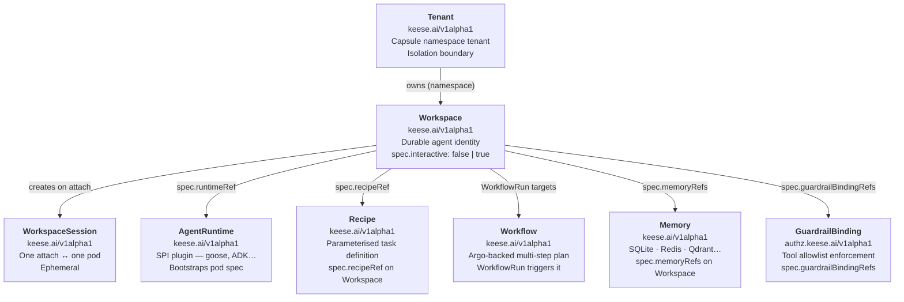

<!-- SPDX-License-Identifier: Apache-2.0 -->
<!-- Copyright (c) 2026 keese-ai -->

# Concepts in 5 minutes

keese organizes AI agents as Kubernetes-native objects, connects them to LLMs through a zero-trust egress gateway, and enforces every authorization decision with OpenFGA before a single token leaves the cluster.

!!! info "Audience"
    Anyone starting with keese — operators, platform engineers, and curious developers. **Prerequisites:** none. This page gives you the mental model; the linked pages go deeper.

---

## The object graph

Everything in keese traces back to four core objects arranged in a simple containment hierarchy.



### Tenant

A `Tenant` is the top-level isolation boundary — it owns a set of Kubernetes namespaces managed by [Capsule](https://capsule.clastix.io). Every other object lives inside a tenant's namespace. Tenants carry quota ceilings (CPU, memory, token budgets) that propagate down to workspaces.

### Workspace

A `Workspace` is the durable identity of one autonomous agent. Its two modes are fixed at creation (`spec.interactive` is immutable):

| `spec.interactive` | Mode | Trigger |
|---|---|---|
| `false` (default) | Workflow-driven, no persistent pod | `WorkflowRun` CR |
| `true` | Attach-driven, pod spins up on first session | `WorkspaceSession` attach |

On creation the workspace controller provisions a **ServiceAccount** (the agent's only credential), a **PVC** (durable session state), a **NetworkPolicy** (fail-closed default-deny), and a set of **OpenFGA tuples** (authorization facts).

### WorkspaceSession

For interactive workspaces, a `WorkspaceSession` represents one attach — one human or process connected to the running agent pod. The session lifecycle is short: it is created by the attach webhook and deleted when the connection closes or the pod fails.

Two distinct fields control session behaviour:

| Field | Resource | Values | Controls |
|---|---|---|---|
| `spec.sessionMode` | `Workspace` | `Always` \| `OnDemand` | Pod lifecycle — whether the agent pod runs continuously or spins up only when a session attaches |
| `spec.mode` | `WorkspaceSession` | `shared` \| `per-user` \| `per-attach` | Pod sharing — whether concurrent attaches share a pod, get one pod each, or get a fresh pod per attach (immutable after creation) |

### AgentRuntime

An `AgentRuntime` describes *how* to run an agent — which container image, which ACP transport, which environment settings. It implements a small SPI (`Bootstrap`, `Resume`, `Drain`) so keese can plug in different runtimes (goose, ADK Python, ADK Go) without changing the workspace controller.

### Recipe and Workflow

A `Recipe` is a parameterised task template — a reusable script a workspace can execute. A `Workflow` wraps an Argo Workflow template; `WorkflowRun` CRs trigger multi-step plans and are bound to a workspace via its `spec.concurrencyPolicy`.

---

## How an agent reaches an LLM

This is the piece that matters most for security. An agent pod never holds an API key. Instead, a projected ServiceAccount token is its only credential, and every LLM call is routed through the Envoy AI Gateway, which validates authorization before forwarding the request and injects the real upstream credential only at the gateway edge.

```mermaid
sequenceDiagram
    participant AP as Agent Pod<br/>(projected SA token only)
    participant EG as Envoy AI Gateway<br/>keese-system:443
    participant JA as JWT Authn filter<br/>(Envoy-native)
    participant EA as keese-authz<br/>gRPC :9001
    participant FGA as OpenFGA
    participant NK as NATS KV<br/>(revocation + budget)
    participant CB as Credential Broker<br/>BackendSecurityPolicy
    participant LLM as Upstream LLM<br/>(Anthropic, OpenAI…)

    AP->>EG: HTTPS POST /v1/messages<br/>Authorization: Bearer <sa-token>
    EG->>JA: validate JWT; project aud to metadata
    JA-->>EG: keese.sa_token.aud = keese-egress-<tenant>

    EG->>EA: ext_authz CheckRequest<br/>(metadata, tool name, workspace UID)
    EA->>NK: read revocation version for workspace
    NK-->>EA: version OK / revoked
    EA->>NK: read budget-exceeded flag for workspace
    NK-->>EA: within budget
    EA->>FGA: Check(tool:<name>#can_call@user:ksa-<workspace-uid>)<br/>HIGHER_CONSISTENCY ≤ 50 ms
    FGA-->>EA: allow / deny

    EA-->>EG: 200 OK (or 403 / 429)
    EG->>CB: select BackendSecurityPolicy for tenant
    CB-->>EG: inject upstream API key (from OpenBao / KMS)
    EG->>LLM: HTTPS POST with real API key<br/>(agent never sees it)
    LLM-->>EG: response
    EG-->>AP: response (API key stripped)
```

### Step by step

**1. The agent has exactly one credential.** A projected ServiceAccount token with audience `keese-egress-<tenant>` and TTL ≤ 10 minutes. No kubeconfig, no API keys, no database DSNs.

**2. The JWT Authn filter validates the token.** Envoy's built-in JWT filter checks the token against the in-cluster JWKS endpoint and projects the `aud` claim into request metadata. No custom Envoy build is required.

**3. `keese-authz` makes the authorization decision.** The ext_authz service (a keese-owned gRPC binary at `cmd/keese-authz/`, listening on `:9001`) does the following in order:

- Checks NATS KV to see if the workspace token epoch has been revoked (`spec.forceRevoke`).

!!! warning "Planned — NATS KV budget check not yet wired"
    The gateway-side NATS KV reader for `TokenBudget` enforcement is not yet implemented. The `TokenBudget` controller writes the budget-exceeded signal, but `keese-authz` does not yet read it on each request. Budget enforcement today is applied at `WorkspaceSession` provisioning time and via an Envoy `BackendTrafficPolicy` short-window cap.

- Issues a single OpenFGA `Check` call: `tool:<name>#can_call@user:ksa-<workspace-uid>`. This 4–5-hop computed relation walks `tool → allowed_in → workspace → owner → tenant → member` in one round trip, with a p99 budget of ≤ 50 ms.

**4. The credential broker injects the real key.** If the check passes, Envoy selects the matching `BackendSecurityPolicy`, which the credential broker has pre-loaded with the upstream API key sourced from OpenBao or cloud KMS. The key is injected at the gateway edge and is never visible to the agent pod.

**5. The response comes back clean.** The upstream response flows back through the gateway. Token usage is counted by the OTEL pipeline and eventually compared against the `TokenBudget` CR.

!!! danger "Fail-closed by design"
    If `keese-authz` is unreachable, Envoy denies all egress (`failure_mode_allow: false`). If OpenFGA is unreachable, ext_authz returns 503 which Envoy converts to 403. An agent cannot reach the internet even if all authz infrastructure is degraded — it simply cannot send any requests.

---

## The authorization graph

Behind the sequence above, OpenFGA holds a small set of typed relation tuples. The workspace controller writes them on create; GuardrailBinding controllers manage tool allowlists; CrossTenantAgreement controllers add cross-tenant messaging grants.

| Tuple | Meaning |
|---|---|
| `workspace:W#owner@tenant:T` | Workspace W belongs to tenant T |
| `tenant:T#member@service_account:SA` | SA (workspace agent) is a member of tenant T |
| `tool:X#allowed_in@workspace:W` | Tool X may be called from workspace W |
| `workspace:W#editor@user:U` | Human U can attach to workspace W |
| `credential:C#bound_to@workspace:W` | Credential C is available via workspace W's gateway route |

The computed relation `tool#can_call` traverses these tuples automatically so the gateway only needs one `Check` call per request.

!!! note "Every authz-affecting field is marked"
    Every CRD field that drives an OpenFGA tuple carries a `// +keese:rebac-tuple=<relation>` Go marker. A pre-commit hook (`scripts/check-rebac-markers.sh`) fails if a field is added without one. This makes the authorization surface auditable from code review.

---

## Workspace lifecycle at a glance

The workspace controller runs a finite state machine. Non-interactive workspaces park in `Idle` between workflow runs; interactive ones scale the pod to zero after `spec.attachGrace` expires. Both FSMs converge through the same `Provisioning → Ready` path.

```
Pending → Provisioning → Running ⇄ Idle → Evicted
               ↑                              |
               └──────────────────────────────┘
     (new WorkflowRun or attach re-enters Provisioning)
               ↓
          Terminating
```

The six valid `WorkspacePhase` values are: `Pending`, `Provisioning`, `Running`, `Idle`, `Evicted`, and `Terminating`. There are no `Suspended`, `Revoked`, or `Degraded` phases — do not filter or alert on those strings. The `status.phase` field and the `Ready` condition are the two fields to watch when debugging.

---

## What you own vs. what keese owns

| You declare | keese provisions |
|---|---|
| `Workspace` spec | ServiceAccount, PVC, NetworkPolicy, OpenFGA tuples |
| `GuardrailBinding` | Tool allowlist tuples in OpenFGA |
| `TokenBudget` | NATS KV budget-exceeded flag, HTTP 429 at gateway |
| `AgentRuntime` | Pod spec template (image, resources, ACP transport) |
| `Recipe` | Parameterised task — workspace just points at it |

The design goal is that you write small, declarative CRs and keese handles the rest: identity, network isolation, egress authorization, credential injection, and token accounting.

---

## Next steps

- [Getting Started: prerequisites](prerequisites.md) — tools you need before installing.
- [Getting Started: install on kind](install-kind.md) — run a local cluster in 10 minutes.
- [Concepts: identity & zero-trust](../concepts/identity-zero-trust.md) — the full SA token + OIDC story.
- [Concepts: authorization (ReBAC / OpenFGA)](../concepts/authorization-rebac.md) — the full tuple model and consistency tiers.
