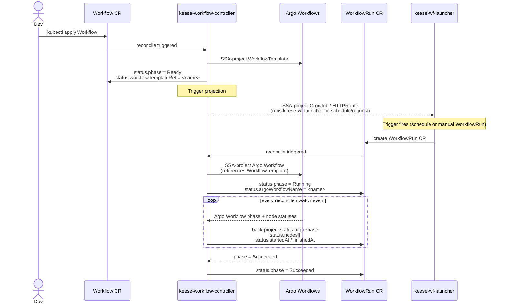
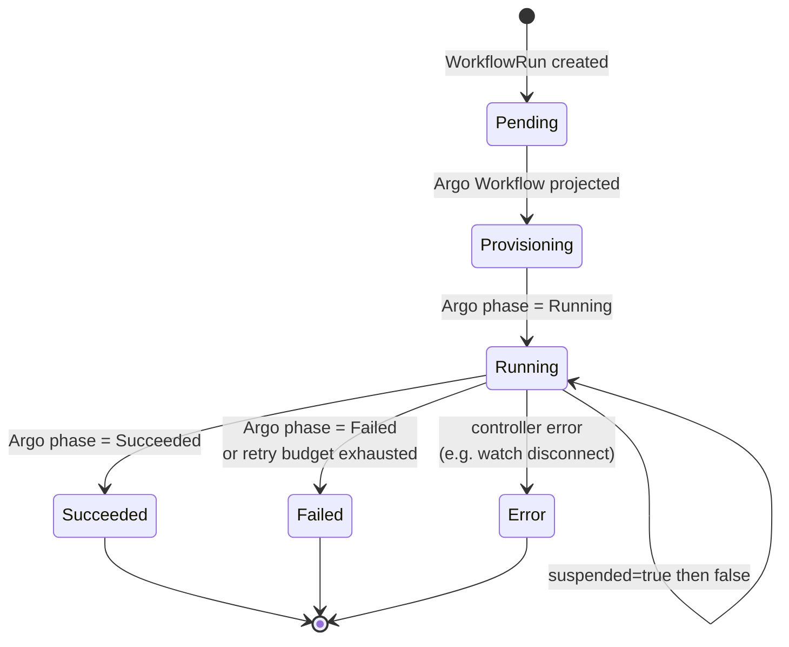

<!-- SPDX-License-Identifier: Apache-2.0 -->
<!-- Copyright (c) 2026 keese-ai -->

# Your first workflow

Run a non-interactive agent task on a schedule or on demand by defining a `Workflow` and watching its run status back-project from Argo Workflows.

!!! info "Audience"
    Agent developers and platform engineers who have completed the workspace setup.
    **Prerequisites:** [Your first workspace & session](first-workspace.md) ·
    [Install locally on kind](install-kind.md) · Argo Workflows running in the cluster
    (bootstrapped via [Bootstrap a local cluster](../guides/bootstrap-local.md)).

---

## How it works

A `Workflow` CR is the keese definition of a repeatable, non-interactive agent task.
It is not an Argo resource directly — the `keese-workflow-controller` projects it:

1. `Workflow.spec.templates[]` → Argo `WorkflowTemplate` (via Server-Side Apply)
2. `Workflow.spec.triggers[]` → a `CronJob`, Knative `Trigger`, or Gateway API
   `HTTPRoute`, each running the `keese-wf-launcher` binary
3. When a trigger fires, `keese-wf-launcher` creates a `WorkflowRun` CR, which
   causes the controller to project an Argo `Workflow` into the workspace namespace
4. The controller watches the Argo `Workflow` and back-projects its `phase`,
   `startedAt`, `finishedAt`, and node statuses onto `WorkflowRun.status`



!!! warning "Output sinks are not yet implemented"
    `Workflow.spec.outputs[]` fields (`KnativeSink`, `NATSPublish`, `S3`, `GitHubPR`)
    are validated by the API server at admission time but the reconciler's
    `reconcileOutput` function is a documented intentional no-op pending a
    follow-on work item. Do not rely on output projections today.

!!! warning "NATSSubscription trigger is not yet projected"
    The `NATSSubscription` trigger type (`TriggerType=NATSSubscription`) records a
    `TriggerProjected=False/KEDAUnavailable` condition and produces no CRD projection.
    This is blocked by a KEDA dependency conflict (see `go.mod` TODO). Use `Cron` or
    `HTTPWebhook` triggers instead.

---

## Step 1 — Create a non-interactive Workspace

Workflows run against a non-interactive `Workspace` (the default). If you created a
workspace in the previous guide you can reuse it, provided its `spec.interactive` field
is `false` (the default). Attempting to create a `WorkflowRun` against an interactive
workspace is rejected by the admission policy with reason
`WorkflowRunNotAllowedOnInteractiveWorkspace`.

```yaml
apiVersion: keese.ai/v1alpha1
kind: Workspace
metadata:
  name: code-review
  namespace: team-alpha
spec:
  runtimeRef:
    name: goose-default         # must reference a Ready AgentRuntime
  tenantRef:
    name: team-alpha            # must reference the owning Tenant
  recipeRef:
    name: code-review-recipe
  concurrencyPolicy: Allow
```

```bash
kubectl apply -f workspace-batch.yaml
kubectl get workspace code-review -n team-alpha
# NAME          READY   PHASE
# code-review   True    Ready
```

---

## Step 2 — Define the Workflow

A `Workflow` ties a workspace to one or more step templates and declares how runs are
triggered. The `spec.entrypoint` field names which template runs first.

```yaml
# config/samples/keese_v1alpha1_workflow_cron.yaml
apiVersion: keese.ai/v1alpha1
kind: Workflow
metadata:
  name: daily-code-review
  namespace: team-alpha
spec:
  workspaceRef:
    name: code-review
  entrypoint: run-review

  templates:
    - name: run-review
      image: ghcr.io/keese-ai/keese:latest
      command: ["keese-wf-launcher"]
      args: ["--workspace", "code-review", "--namespace", "team-alpha"]
      retryLimit: 2

  triggers:
    - type: Cron
      cron:
        schedule: "0 8 * * 1-5"   # weekdays at 08:00 UTC
        timezone: "UTC"

  defaultRetryBudget:
    limit: 10
    backoffSeconds: 30

  concurrencyPolicy: Forbid
```

```bash
kubectl apply -f config/samples/keese_v1alpha1_workflow_cron.yaml
kubectl get workflow daily-code-review -n team-alpha
# NAME                 READY   PHASE   RUNCOUNT
# daily-code-review    True    Ready   0
```

The controller projects the `WorkflowTemplate` into the Argo Workflows namespace and
creates a `CronJob` named `keese-wf-daily-code-review-cron` that fires `keese-wf-launcher`
on the declared schedule.

!!! note "Concurrency policy"
    `Forbid` rejects a new `WorkflowRun` while any is in-flight.
    `Allow` (the default) lets multiple runs execute concurrently against the same workspace.
    `Replace` terminates the prior Argo Workflow (30 s drain window) before starting the new one.

---

## Step 3 — Trigger a run manually

Rather than waiting for the CronJob, create a `WorkflowRun` directly. This is also the
correct approach for ad-hoc or CI-triggered runs.

```yaml
# config/samples/keese_v1alpha1_workflowrun_manual.yaml
apiVersion: keese.ai/v1alpha1
kind: WorkflowRun
metadata:
  name: daily-code-review-run-001
  namespace: team-alpha
spec:
  workspaceRef:
    name: code-review
  workflowRef:
    name: daily-code-review
  parameters:
    - name: target-branch
      value: "main"
  retryBudget: 5
  timeout: 30m
```

```bash
kubectl apply -f config/samples/keese_v1alpha1_workflowrun_manual.yaml
```

---

## Step 4 — Watch the run progress

```bash
# Short status view (printer columns)
kubectl get workflowrun daily-code-review-run-001 -n team-alpha -w
# NAME                         READY   PHASE         ARGOPHASE
# daily-code-review-run-001    True    Provisioning  <none>
# daily-code-review-run-001    True    Running       Running
# daily-code-review-run-001    True    Succeeded     Succeeded

# Full status with conditions
kubectl get workflowrun daily-code-review-run-001 -n team-alpha -o yaml | \
  yq '.status'
```

The key status fields are:

| Field | Meaning |
|---|---|
| `status.phase` | keese-level phase: `Pending` → `Provisioning` → `Running` → `Succeeded` / `Failed` / `Error` |
| `status.argoPhase` | Raw Argo `Workflow.status.phase` string, back-projected every reconcile |
| `status.argoWorkflowName` | Name of the Argo `Workflow` object in the workspace namespace |
| `status.startedAt` / `status.finishedAt` | Mirrored from Argo |
| `status.nodes[]` | Per-step node statuses mirrored from Argo |
| `status.conditions[Ready]` | Standard Kubernetes `Ready` condition |

---

## Step 5 — Add an HTTP webhook trigger

For event-driven or CI-triggered runs, declare an `HTTPWebhook` trigger. The controller
projects a Gateway API `HTTPRoute` named `keese-wf-<workflow-name>-webhook` pointing
at the `keese-wf-launcher` service.

```yaml
triggers:
  - type: HTTPWebhook
    httpWebhook:
      path: "/trigger/daily-code-review"
      secretRef:
        name: code-review-webhook-hmac   # Secret with HMAC key for verification
```

```bash
# Retrieve the HTTPRoute projected by the controller
kubectl get httproute keese-wf-daily-code-review-webhook -n team-alpha

# Fire a manual webhook (replace HOST with your Gateway external IP/hostname)
curl -X POST https://${HOST}/trigger/daily-code-review \
  -H "X-Keese-Signature: <hmac>" \
  -H "Content-Type: application/json" \
  -d '{}'
```

---

## Suspend and resume a run

A run can be paused without cancellation by patching `spec.suspended`:

```bash
kubectl patch workflowrun daily-code-review-run-001 \
  -n team-alpha \
  --type merge \
  -p '{"spec":{"suspended":true}}'
```

The controller SSA-patches `spec.suspend: true` onto the underlying Argo `Workflow`
within one reconcile. Clear the flag to resume:

```bash
kubectl patch workflowrun daily-code-review-run-001 \
  -n team-alpha \
  --type merge \
  -p '{"spec":{"suspended":false}}'
```

---

## Lifecycle phases at a glance



---

## Retention and cleanup

Completed Argo `Workflow` objects in the workspace namespace are retained for 7 days by
default (`ttlStrategy.secondsAfterCompletion: 604800`), then garbage-collected by Argo.
The `WorkflowRun` CR itself is not automatically deleted — delete it explicitly when
no longer needed:

```bash
kubectl delete workflowrun daily-code-review-run-001 -n team-alpha
```

Deleting a `Workflow` CR blocks until all non-terminal `WorkflowRun` objects are complete.
The controller emits a `WorkflowCascadeBlocked` warning event and requeues until the
active run count reaches zero.

---

## Troubleshooting

```bash
# Controller events on the Workflow
kubectl describe workflow daily-code-review -n team-alpha | grep -A 40 Events

# Controller events on the WorkflowRun
kubectl describe workflowrun daily-code-review-run-001 -n team-alpha | grep -A 40 Events

# Direct Argo Workflow status (substitute the name from status.argoWorkflowName)
kubectl get workflow.argoproj.io <argo-workflow-name> -n team-alpha -o yaml | \
  yq '.status.phase, .status.nodes'

# Launcher pod logs (from the CronJob-generated pod)
kubectl logs -n team-alpha -l keese.ai/workflow=daily-code-review --tail=50
```

Common conditions to look for:

| Condition / Event | Cause | Action |
|---|---|---|
| `TriggerProjected=False/KEDAUnavailable` | `NATSSubscription` trigger used | Switch to `Cron` or `HTTPWebhook` |
| `ProjectionFailed` | Argo WorkflowTemplate SSA failed | Check Argo Workflows CRDs are installed |
| `WorkflowRunNotAllowedOnInteractiveWorkspace` | Workspace is interactive | Create a separate non-interactive Workspace |
| `RetryBudgetExhausted` | All step retries consumed | Increment `spec.retryBudget` and clear `spec.suspended` |

---

## Next steps

- [Concepts: Workflows & triggers](../concepts/workflows.md) — full trigger and concurrency model
- [Concepts: Workspaces & sessions](../concepts/workspaces.md) — workspace lifecycle and session attachment
- [Guides: Write & distribute a recipe](../guides/recipes.md) — package agent logic into a reusable Recipe
- [Guides: Set token budgets](../guides/token-budgets.md) — control per-run LLM spend
