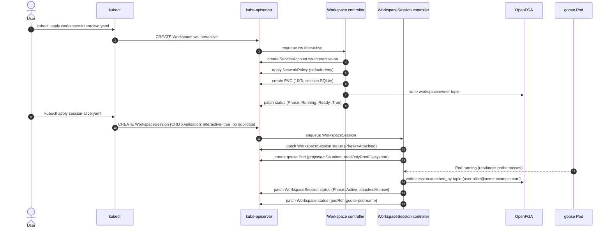

<!-- SPDX-License-Identifier: Apache-2.0 -->
<!-- Copyright (c) 2026 keese-ai -->

# Your first workspace & session

Apply an AgentRuntime, a RecipeSource, a Recipe, a Workspace, and a WorkspaceSession; then watch the resources progress to `Running` and `Active` and inspect the projected ServiceAccount, NetworkPolicy, and session PVC that the controller provisions automatically.

!!! info "Audience"
    Agent developers getting started with keese · **Prerequisites:** [Install locally on kind](install-kind.md) — you need a running kind cluster with the keese operator installed and a tenant namespace available.

---

## Overview

Five objects collaborate to run an agent session:

| Kind | Scope | Role |
|---|---|---|
| `AgentRuntime` | Cluster | Registers a runtime provider (goose, ADK-Python, etc.) with its OCI image |
| `RecipeSource` | Namespace | Points to the artifact (ConfigMap or OCI image) that contains the agent's instructions |
| `Recipe` | Namespace | Declares the instructions source, model, and allowed tools |
| `Workspace` | Namespace | Binds a runtime + recipe + tenant; owns the PVC, ServiceAccount, and NetworkPolicy |
| `WorkspaceSession` | Namespace | Attaches an identity to a workspace; drives a pod to `Active` |

The Workspace controller provisions infrastructure; the WorkspaceSession controller drives the pod lifecycle and writes OpenFGA tuples for the attached identity.

```mermaid
stateDiagram-v2
    direction LR
    [*] --> Pending : CR created
    Pending --> Provisioning : controller picks up CR
    Provisioning --> Running : SA + NetworkPolicy + PVC bound;<br/> pod scheduled (sessionMode=Always)<br/> or pod deferred (OnDemand)
    Running --> Idle : no active sessions<br/> + sessionMode=OnDemand
    Idle --> Running : WorkspaceSession created
    Running --> Evicted : node pressure / quota exceeded
    Running --> Terminating : Workspace deleted
    Evicted --> Terminating : manual delete
    Terminating --> [*] : finalizer removed
```



!!! note
    `sessionMode: OnDemand` (the default) keeps the pod absent until a WorkspaceSession is created. `sessionMode: Always` starts the pod immediately after `Provisioning`.

---

## Step 1 — Register an AgentRuntime

`AgentRuntime` is cluster-scoped, so create it once per cluster (or reuse one installed by your platform team).

```yaml
# agentruntime-goose.yaml
apiVersion: keese.ai/v1alpha1
kind: AgentRuntime
metadata:
  name: goose-runtime
spec:
  implementation:
    goose:
      image: ghcr.io/block/goose:latest
```

!!! warning "Pin images by digest in production"
    The sample above uses a mutable tag. In production, pin by digest — e.g. `ghcr.io/block/goose@sha256:<digest>` — per [zero-trust rule 05.12](../concepts/identity-zero-trust.md). The Workspace admission webhook rejects tag-only references in namespaces that carry `keese.ai/env: production`.

```bash
kubectl apply -f agentruntime-goose.yaml
kubectl get agentruntime goose-runtime
```

Expected output:

```
NAME            PHASE   PROVIDER   READY   AGE
goose-runtime   Ready   goose      True    10s
```

The controller validates the image reference against `SupportedImageVersions`. If the image tag is outside the supported semver range the phase becomes `Incompatible` and the Workspace admission webhook rejects any Workspace referencing it.

---

## Step 2 — Create a RecipeSource

A `RecipeSource` tells the Recipe controller where to fetch the agent's instruction artifact. The simplest option for local development is a `ConfigMap`-backed source, which avoids the need for an OCI registry.

```yaml
# recipesource-sample.yaml
apiVersion: keese.ai/v1alpha1
kind: RecipeSource
metadata:
  name: recipesource-sample
  namespace: tenant-acme
spec:
  configMap:
    name: summarize-instructions
    namespace: tenant-acme
---
apiVersion: v1
kind: ConfigMap
metadata:
  name: summarize-instructions
  namespace: tenant-acme
data:
  instructions.md: |
    You are a summarization assistant. Read the provided text and return a concise summary.
```

```bash
kubectl apply -f recipesource-sample.yaml -n tenant-acme
kubectl get recipesource recipesource-sample -n tenant-acme
```

!!! tip "OCI-backed RecipeSource"
    For production, use an OCI artifact reference instead of a ConfigMap. See [Guide: Recipes](../guides/recipes.md) for the full RecipeSource spec and cosign verification details.

---

## Step 3 — Create a Recipe

A Recipe declares the agent's instructions source, model, and tool allowlist. The controller pulls and cosign-verifies the OCI artifact referenced by `sourceRef`; the recipe phase advances to `Ready` when verification succeeds.

```yaml
# recipe-summarize.yaml
apiVersion: keese.ai/v1alpha1
kind: Recipe
metadata:
  name: summarize-recipe
  namespace: tenant-acme
spec:
  instructions: instructions.md        # path within the OCI artifact layer
  model:
    provider: anthropic
    modelID: claude-sonnet-4-6
  tools:
    - name: read_file
    - name: web_search
  sourceRef:
    name: recipesource-sample          # must exist in the same namespace
```

```bash
kubectl apply -f recipe-summarize.yaml -n tenant-acme
kubectl get recipe summarize-recipe -n tenant-acme
```

Expected output:

```
NAME               READY   PHASE   MODEL                AGE
summarize-recipe   True    Ready   claude-sonnet-4-6    15s
```

!!! warning "Planned — not yet implemented"
    The `recipesource-sample` RecipeSource and OCI pull + cosign verification loop are partially implemented. The Recipe controller sets `phase: Ready` but skips the cosign step until the RecipeSource controller reaches GA status. Do not rely on `status.resolvedDigest` in alpha.

---

## Step 4 — Create a Workspace

The Workspace binds the runtime and recipe to a tenant namespace. On creation the controller:

1. Creates a dedicated `ServiceAccount` (name written to `status.serviceAccountName`).
2. Applies a fail-closed default-deny `NetworkPolicy` (name in `status.networkPolicyName`) — only egress to the Envoy AI Gateway on port 443 is permitted.
3. Provisions a `PersistentVolumeClaim` for SQLite session state.
4. Writes OpenFGA tuples for `editors` and `viewers`.

```yaml
# workspace-demo.yaml
apiVersion: keese.ai/v1alpha1
kind: Workspace
metadata:
  name: ws-demo
  namespace: tenant-acme
spec:
  runtimeRef:
    name: goose-runtime          # must be Ready
  recipeRef:
    name: summarize-recipe       # optional; omit for an interactive workspace
  tenantRef:
    name: acme-tenant
  sessionMode: OnDemand          # default; pod starts on first WorkspaceSession
  attachPolicy: Reuse            # reuse an existing pod when possible
  attachGrace: 30s
  sessionStorage: "10Gi"
  editors:
    - alice@acme.example.com
  viewers:
    - bob@acme.example.com
```

```bash
kubectl apply -f workspace-demo.yaml -n tenant-acme
kubectl get workspace ws-demo -n tenant-acme -w
```

Watch the phase transition:

```
NAME      PHASE          READY   RUNTIME        INTERACTIVE   AGE
ws-demo   Pending        False   goose-runtime  false         1s
ws-demo   Provisioning   False   goose-runtime  false         3s
ws-demo   Running        True    goose-runtime  false         12s
```

### Inspect the provisioned resources

```bash
# ServiceAccount created by the controller
kubectl get workspace ws-demo -n tenant-acme \
  -o jsonpath='{.status.serviceAccountName}'
# → ws-demo-sa  (example; exact name is controller-generated)

# Fail-closed NetworkPolicy
kubectl get networkpolicy \
  $(kubectl get workspace ws-demo -n tenant-acme \
    -o jsonpath='{.status.networkPolicyName}') \
  -n tenant-acme -o yaml

# Session PVC
kubectl get pvc -n tenant-acme -l keese.ai/workspace=ws-demo
```

The NetworkPolicy allows only egress to the `keese-egress-gateway` Service on port 443 and denies all other ingress and egress. This enforces [zero-trust rule 05.4](../concepts/identity-zero-trust.md).

!!! note "Workspace conditions"
    Four conditions track provisioning health:

    | Condition | Meaning |
    |---|---|
    | `Ready` | All sub-resources provisioned; workspace accepting sessions |
    | `Progressing` | Controller is actively reconciling |
    | `NetworkIsolated` | Default-deny NetworkPolicy is in place |
    | `SessionStorageReady` | PVC is bound |

    A workspace is usable only when `Ready=True` and `NetworkIsolated=True`.

---

## Step 5 — Attach a WorkspaceSession

A `WorkspaceSession` attaches an identity (an OpenFGA subject string) to a workspace. The WorkspaceSession controller starts the goose pod (if not already running), writes `session:<uid>#attached_by@user:alice@acme.example.com` as an OpenFGA tuple, and drives the session to `Active`.

!!! warning "Interactive workspace required"
    WorkspaceSession requires `spec.interactive: true` on the parent Workspace. The `ws-demo` above has `interactive: false` (the default), so it runs recipes unattended. For an interactive session, re-create the Workspace with `interactive: true`. Once set, `interactive` is immutable.

For this example, create a second interactive workspace:

```yaml
# workspace-interactive.yaml
apiVersion: keese.ai/v1alpha1
kind: Workspace
metadata:
  name: ws-interactive
  namespace: tenant-acme
spec:
  runtimeRef:
    name: goose-runtime
  tenantRef:
    name: acme-tenant
  interactive: true              # immutable after creation
  sessionMode: OnDemand
  attachPolicy: Reuse
  sessionStorage: "10Gi"
```

```bash
kubectl apply -f workspace-interactive.yaml -n tenant-acme
kubectl get workspace ws-interactive -n tenant-acme
# Wait for Phase=Running
```

Now attach a session. The resource name follows the pattern `<workspace>-<subject-hash-16>-<session-name>`, where `<subject-hash-16>` is the first 16 hex characters of the SHA-256 hash of `spec.attachSubject`.

Compute the hash for your subject string before creating the manifest:

```bash
# Compute the 16-character subject hash
SUBJECT="user:alice@acme.example.com"
HASH=$(printf '%s' "$SUBJECT" | sha256sum | cut -c1-16)
echo "$HASH"
# → a1b2c3d4e5f6a7b8  (example; your value depends on the subject string)
```

```yaml
# session-alice.yaml
apiVersion: keese.ai/v1alpha1
kind: WorkspaceSession
metadata:
  name: ws-interactive-a1b2c3d4e5f6a7b8-default   # replace hash with your computed value
  namespace: tenant-acme
  labels:
    keese.ai/workspace: ws-interactive
    keese.ai/subject-hash: a1b2c3d4e5f6a7b8         # first 16 hex chars of SHA-256(attachSubject)
    keese.ai/session-name: default
spec:
  workspaceRef: ws-interactive
  attachSubject: "user:alice@acme.example.com"
  sessionName: default
  mode: per-user
```

```bash
kubectl apply -f session-alice.yaml -n tenant-acme
kubectl get workspacesession -n tenant-acme -w
```

Expected output:

```
NAME                                        READY   PHASE       SUBJECT                      SESSION   AGE
ws-interactive-a1b2c3d4e5f6a7b8-default    False   Pending     user:alice@acme.example.com  default   1s
ws-interactive-a1b2c3d4e5f6a7b8-default    False   Attaching   user:alice@acme.example.com  default   3s
ws-interactive-a1b2c3d4e5f6a7b8-default    True    Active      user:alice@acme.example.com  default   18s
```

### What just happened



### Session pod identity

The pod runs with the workspace `ServiceAccount` and carries a projected token with audience `keese-egress-<tenant>` and TTL ≤ 10 minutes. No kubeconfig, no upstream API keys — only the SA token reaches the pod. The Envoy AI Gateway swaps the SA token for the upstream model credential at egress.

```bash
# Inspect the projected volume on the session pod
PODNAME=$(kubectl get workspacesession \
  ws-interactive-a1b2c3d4e5f6a7b8-default \
  -n tenant-acme -o jsonpath='{.status.podRef.name}')

kubectl get pod $PODNAME -n tenant-acme \
  -o jsonpath='{.spec.volumes[?(@.name=="kube-api-access")]}' | jq .
```

---

## Step 6 — Watch conditions and events

```bash
# Workspace conditions
kubectl get workspace ws-interactive -n tenant-acme \
  -o jsonpath='{.status.conditions}' | jq .

# WorkspaceSession phase + client count
kubectl get workspacesession \
  ws-interactive-a1b2c3d4e5f6a7b8-default \
  -n tenant-acme -o yaml

# Kubernetes events for the workspace
kubectl get events -n tenant-acme \
  --field-selector involvedObject.name=ws-interactive \
  --sort-by='.lastTimestamp'
```

---

## Step 7 — Clean up

Delete the WorkspaceSession first; the controller drains the pod (up to 90 seconds) before removing the OpenFGA tuple and the finalizer. Then delete the Workspace to tear down the PVC, NetworkPolicy, and ServiceAccount.

```bash
kubectl delete workspacesession \
  ws-interactive-a1b2c3d4e5f6a7b8-default \
  -n tenant-acme

# Wait for termination to complete
kubectl get workspacesession -n tenant-acme -w

# Then delete the workspace
kubectl delete workspace ws-interactive -n tenant-acme
kubectl delete workspace ws-demo -n tenant-acme
```

!!! warning "PVC retention"
    By default, the session PVC is **not** deleted when the Workspace is deleted. The SQLite session history remains on the PVC for post-mortem analysis. Delete the PVC manually once you no longer need the session history.

---

## Troubleshooting

| Symptom | Check |
|---|---|
| Workspace stuck in `Provisioning` | `kubectl get events -n <ns>` — look for PVC bind failures or admission webhook errors |
| `NetworkIsolated=False` | NetworkPolicy creation failed; check RBAC for the operator ServiceAccount |
| WorkspaceSession stuck in `Attaching` | Pod not scheduling — check node resources and `kubectl describe pod <name>` |
| `AgentRuntime` phase `Incompatible` | Image tag outside `SupportedImageVersions`; pin a supported digest |
| Session `Evicted` unexpectedly | Node memory pressure; see [lifecycle-supervision](../concepts/lifecycle-supervision.md) |

---

## See also

- [Concepts: Workspaces & sessions](../concepts/workspaces.md) — design rationale and FSM detail
- [Guide: Create a workspace & attach a session](../guides/workspace-session.md) — production-grade YAML with guardrails and memory
- [Concepts: Identity & zero-trust](../concepts/identity-zero-trust.md) — how the projected SA token and NetworkPolicy enforce zero-trust
- [Concepts: Agent runtimes (SPI)](../concepts/agent-runtimes.md) — choosing between goose, ADK-Python, and ADK-Go
