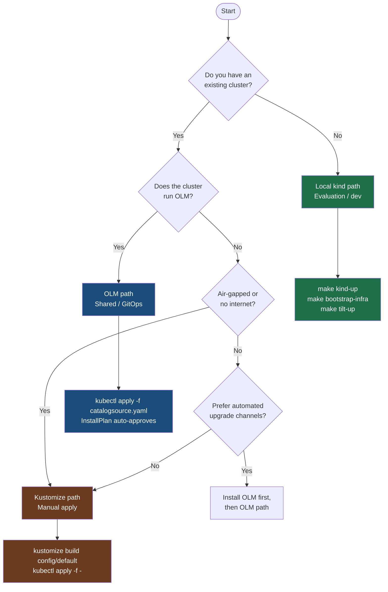
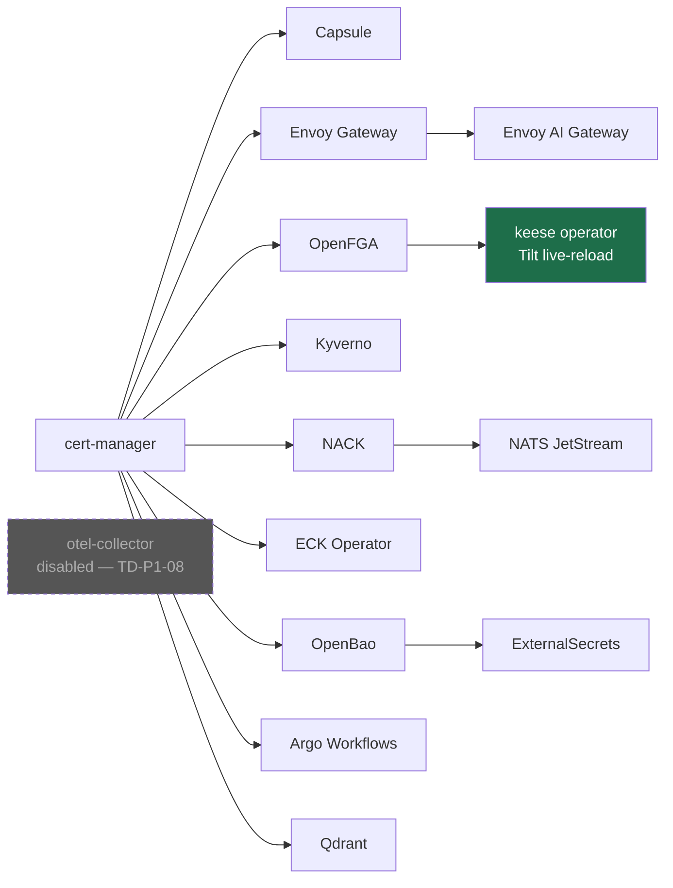

<!-- SPDX-License-Identifier: Apache-2.0 -->
<!-- Copyright (c) 2026 keese-ai -->

# Getting Started

Install keese, bring up a cluster, and run your first workspace — choose the path that matches your environment.

!!! info "Audience"
    Platform engineers and developers evaluating keese for the first time.
    **Prerequisites:** basic familiarity with Kubernetes and `kubectl` · [Prerequisites](prerequisites.md)

---

## Three install paths

keese ships as a Kubernetes operator packaged in three consumable forms.
Pick the one that matches your situation:

| Path | Best for | Time to first workspace |
|---|---|---|
| **Local kind** | Evaluation, development, contribution | ~10 min (warm cache) |
| **OLM** | Shared clusters, GitOps-managed upgrades | ~5 min (post-prereqs) |
| **Kustomize (manual)** | Air-gapped or tightly controlled environments | ~15 min |

The flowchart below will guide you to the right path.



---

## Path 1 — Local kind (evaluation and development)

This is the fastest path to a running system. `make kind-up` creates a
[ctlptl](https://github.com/tilt-dev/ctlptl)-managed kind cluster named
`keese-dev` with a local image registry on port 5005. `make bootstrap-infra`
then runs `helmfile sync` to install 14 dependency releases in their required
dependency order. `make tilt-up` starts Tilt for hot-reload of the operator.

```bash
# 1. Clone and enter the Nix dev shell
git clone https://github.com/keese-ai/keese && cd keese
direnv allow            # activates: nix develop shell with all tools

# 2. Install pre-commit hooks
pre-commit install --install-hooks
pre-commit install --hook-type commit-msg

# 3. Spin up a local cluster + all dependencies
make kind-up            # ctlptl → kind cluster keese-dev + registry :5005
make bootstrap-infra    # helmfile sync → cert-manager, Capsule, Envoy AI Gateway,
                        #   OpenFGA, NATS JetStream, ECK, OpenBao, ExternalSecrets,
                        #   Argo Workflows, Qdrant, Kyverno
                        #   (OTEL collector disabled — TD-P1-08)
make tilt-up            # Tilt hot-reload: builds + loads operator, seeds data
```

The bootstrap target also applies the NATS streams and AI Gateway stack
(Anthropic path) automatically.

!!! tip "Timing"
    `make kind-up && make bootstrap-infra` targets ≤ 300 seconds on a modern
    laptop with a warm Docker layer cache. Cold-pull on a fast connection is
    typically under 8 minutes.

!!! warning "OpenBao in dev mode"
    The local kind bootstrap runs OpenBao in **dev mode** — auto-unsealed with
    the well-known root token `root` and **in-memory** storage. Data is
    re-seeded by Tilt on every restart. This configuration is for evaluation
    only; never use it against real tenant data. See
    [Bootstrap a local cluster](../guides/bootstrap-local.md) for details.

See [Install locally on kind](install-kind.md) for the step-by-step walkthrough,
including optional `ANTHROPIC_API_KEY` seeding and troubleshooting.

---

## Path 2 — OLM (shared clusters, GitOps)

The OLM path installs keese through Operator Lifecycle Manager's subscription
and catalog model. Upgrades happen automatically through upgrade channels
(`alpha` during the current release series). OLM handles CRD migrations,
RBAC, and leader election.

```bash
# Apply the keese CatalogSource (points at ghcr.io/keese-ai/keese-catalog)
kubectl apply -f https://github.com/keese-ai/keese/releases/latest/download/catalogsource.yaml

# Create a subscription (alpha channel)
kubectl apply -f - <<'EOF'
apiVersion: operators.coreos.com/v1alpha1
kind: Subscription
metadata:
  name: keese
  namespace: operators
spec:
  channel: alpha
  name: keese
  source: keese-catalog
  sourceNamespace: olm
EOF
```

The OLM `InstallPlan` auto-approves on `alpha` channel. Once the `ClusterServiceVersion`
reaches `Succeeded`, the operator is ready.

!!! warning "Planned — not yet implemented"
    The public CatalogSource image (`ghcr.io/keese-ai/keese-catalog`) and the
    `catalogsource.yaml` download URL are not yet published. The OLM bundle
    structure is generated locally via `make bundle && make bundle-validate`
    and can be installed from a local catalog during development.
    Track progress in the [CI/CD pipeline](../development/cicd.md) page.

See [Install via OLM](../guides/install-olm.md) for the full guide including
OperatorGroup setup and upgrade channel selection.

---

## Path 3 — Kustomize (manual / air-gapped)

For environments without OLM or outbound internet access, apply the
`config/default` Kustomize overlay directly. You are responsible for managing
CRD upgrades and RBAC drift between releases.

```bash
# Build and apply manifests from a local checkout or pinned tarball
kustomize build config/default | kubectl apply --server-side -f -

# Verify the operator deployment is healthy
kubectl rollout status deployment/keese-controller-manager -n keese-system
```

!!! warning "Planned — not yet implemented"
    The `config/default` overlay and the operator container image
    (`ghcr.io/keese-ai/keese`) are actively being developed. The manifests
    exist in the repository but the operator binary itself is in active
    development. Use the local kind path to evaluate the operator today.

For air-gapped installation, mirror the operator image digest and update
`IMG` in your overlay before applying. See
[Cloud deploy (OpenTofu)](../guides/cloud-deploy.md) for production cluster
provisioning.

---

## What you will build in this section

The Getting Started pages take you from zero to a running workspace in the
following steps:

1. **[Prerequisites](prerequisites.md)** — tools to install and cluster
   requirements for each path.
2. **[Install locally on kind](install-kind.md)** — full walkthrough of the
   local kind path, including the bootstrap dependency DAG and Tilt hot-reload
   loop.
3. **[Your first workspace & session](first-workspace.md)** — create a
   `Workspace`, attach a `WorkspaceSession`, and observe the agent runtime come
   up.
4. **[Your first workflow](first-workflow.md)** — wrap a recipe in an Argo
   `Workflow` resource and watch it execute.
5. **[Where to go next](next-steps.md)** — pointers to the Concepts section,
   guides, and reference material.

---

## Dependency overview

Regardless of install path, keese requires several in-cluster components.
The diagram below shows the dependency boot order used by `make bootstrap-infra`.



Each release installs into its own dedicated namespace. The operator starts
only after `cert-manager` and `OpenFGA` are healthy — Tilt's resource
dependencies enforce this ordering automatically during local development.

---

## See also

- [Concepts in 5 minutes](concepts-in-5-minutes.md) — architecture mental model before you install
- [Bootstrap a local cluster (kind + Tilt)](../guides/bootstrap-local.md) — deep-dive guide for the local path
- [Install via OLM](../guides/install-olm.md) — full OLM install and upgrade guide
- [Architecture overview](../concepts/architecture.md) — how the pieces fit together
