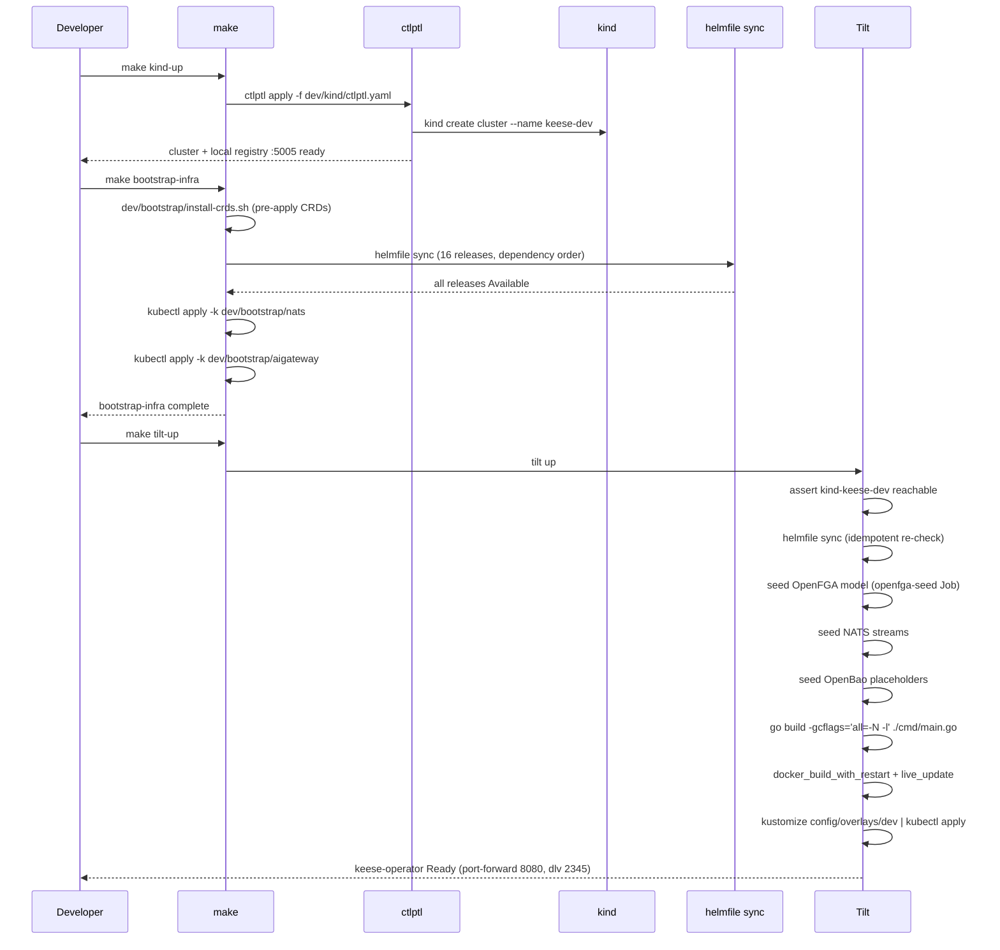
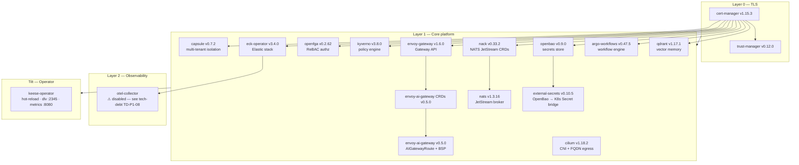

<!-- SPDX-License-Identifier: Apache-2.0 -->
<!-- Copyright (c) 2026 keese-ai -->

# Install locally on kind

Bring up a fully-functional keese environment on your laptop in three commands using kind, ctlptl, Helmfile, and Tilt.

!!! info "Audience"
    Platform operators evaluating keese, or contributors who want a live dev loop. **Prerequisites:** [prerequisites](prerequisites.md) — kind, ctlptl, Helmfile, Tilt, kubectl, and Docker (or Podman) must all be in `PATH`. A [Nix devshell](../development/dev-environment.md) provides all of them.

---

## What you will have when you are done

Three `make` targets stand up the complete evaluation stack:

| Step | Command | What it does |
|---|---|---|
| 1 | `make kind-up` | Creates the `keese-dev` kind cluster and wires a local image registry on `:5005` |
| 2 | `make bootstrap-infra` | Installs 16 Helm releases in dependency order (cert-manager → full stack) |
| 3 | `make tilt-up` | Hot-reloads the keese operator; seeds OpenFGA, NATS, and OpenBao |

After `make tilt-up` completes you have a working cluster ready for [your first workspace](first-workspace.md).

!!! note "Timing"
    `make kind-up bootstrap-infra` completes in ≤ 300 s on a modern laptop with a warm Docker layer cache. The first run (no cache) takes longer — typically 8–12 minutes.

---

## Bootstrap sequence

The diagram below shows what runs, in what order, and which step each component belongs to.



---

## What gets installed



!!! warning "otel-collector disabled"
    The `otel-collector` Helm release is commented out in
    [`dev/bootstrap/helmfile.yaml`](https://github.com/keese-ai/keese/blob/main/dev/bootstrap/helmfile.yaml)
    pending an upstream chart values fix (tracked as TD-P1-08). OTLP traces and APM metrics
    are not collected in local dev until this is re-enabled.

---

## Component reference

| Release | Namespace | Purpose |
|---|---|---|
| cilium | kube-system | CNI + DNS-aware FQDN egress NetworkPolicy |
| cert-manager | cert-manager | TLS issuance |
| trust-manager | cert-manager | Distributes CA bundles to consumer namespaces |
| capsule | capsule-system | Multi-tenant Tenant isolation |
| envoy-gateway | envoy-gateway-system | Gateway API implementation |
| envoy-ai-gateway | envoy-ai-gateway-system | `AIGatewayRoute`, `BackendSecurityPolicy` |
| openfga | openfga | ReBAC authorization store |
| kyverno | kyverno | Policy engine (`GuardrailBinding`) |
| nack | nats | NATS JetStream CRD controllers |
| nats | nats | JetStream messaging broker |
| eck-operator | elastic-system | ECK → Elasticsearch + Kibana + APM Server |
| openbao | openbao | Secrets store (auto-unsealed dev mode) |
| external-secrets | external-secrets | OpenBao → Kubernetes Secret bridge |
| argo-workflows | argo | Workflow execution engine |
| qdrant | qdrant | Vector memory backend |

---

## Step 1 — Create the kind cluster

```bash
make kind-up
```

This runs `ctlptl apply -f dev/kind/ctlptl.yaml`, which is idempotent — re-running it when the
cluster already exists is safe. ctlptl creates:

- A kind cluster named `keese-dev`
- A local OCI registry accessible inside the cluster on host port `5005` (auto-wired via containerd registry mirrors)

If ctlptl is not installed, the target falls back to `kind create cluster` directly using `dev/kind/kind-config.yaml`.

Verify:

```bash
kubectl cluster-info --context kind-keese-dev
# Kubernetes control plane is running at https://127.0.0.1:...
```

---

## Step 2 — Bootstrap the infra stack

```bash
make bootstrap-infra
```

Internally this runs:

1. `dev/bootstrap/install-crds.sh` — pre-applies chart-shipped CRDs so Helm releases that consume them do not race
2. `helmfile -f dev/bootstrap/helmfile.yaml sync` — installs all 16 releases in dependency order
3. `kubectl apply -k dev/bootstrap/nats` — creates the NATS JetStream `Stream` and `Consumer` CRs
4. `kubectl apply -k dev/bootstrap/aigateway` — applies the `AIGatewayRoute` for the Anthropic LLM path and waits for `Accepted` condition

!!! warning "OpenBao runs in dev mode"
    Local kind uses OpenBao with `server.dev.enabled: true` — auto-unsealed, in-memory storage,
    well-known root token `root`. **Do not use this overlay in production.** Production uses
    Shamir manual unseal (or cloud KMS auto-unseal) on PVC-backed storage.
    See `dev/bootstrap/values/openbao-prod.yaml.example`.

Check that the key deployments are Available:

```bash
kubectl -n cert-manager        get deploy cert-manager
kubectl -n capsule-system      get deploy capsule-controller-manager
kubectl -n envoy-gateway-system get deploy envoy-gateway
kubectl -n openfga             get deploy openfga
kubectl -n openbao             get deploy openbao
kubectl -n argo                get deploy argo-workflows-server
```

---

## Step 3 — Start Tilt

```bash
make tilt-up
# or directly: tilt up
```

Tilt opens the dev UI at `http://localhost:10350`. It drives:

| Tilt resource | What it does |
|---|---|
| `kind-ready` | Asserts `kubectl cluster-info` succeeds |
| `bootstrap-infra` | Idempotent Helmfile re-sync; re-runs only when `dev/bootstrap/` files change |
| `openfga-seed` | Applies the `openfga-seed` Kubernetes Job after infra is up |
| `openbao-seed` | Runs `scripts/dev/seed-openbao.sh`; writes `ANTHROPIC_API_KEY` from `.env.local` if set |
| `compile-manager` | `go build -gcflags='all=-N -l'` on every `cmd/`, `internal/`, `api/` change |
| `keese-operator` | `docker_build_with_restart` + `live_update` — syncs the rebuilt binary into the running pod; restarts it in ~5–12 s |

The operator exposes two port-forwards:

| Port | Purpose |
|---|---|
| `8080` | Health check (`/healthz`) and Prometheus metrics (`/metrics`) |
| `2345` | `dlv` remote debugger — attach with GoLand or VS Code (see [IDE setup](../guides/ide-debugging.md)) |

Wait for the operator to be Available:

```bash
kubectl -n keese-system wait deploy/keese-controller-manager \
  --for=condition=Available --timeout=180s
# deployment.apps/keese-controller-manager condition met
```

---

## Confirm the stack is healthy

```bash
# All keese-system pods Running
kubectl -n keese-system get pods

# CRDs installed (spot check)
kubectl get crd workspaces.keese.ai workspacesessions.keese.ai recipes.keese.ai

# OpenFGA reachable
kubectl -n openfga get deploy openfga -o jsonpath='{.status.readyReplicas}'

# NATS JetStream streams present
kubectl -n nats get streams.jetstream.nats.io
```

---

## Run the automated smoke test

`make e2e-smoke` runs the nine-phase smoke harness in `scripts/dev/e2e-smoke.sh`. It performs all three `make` steps above automatically (if the cluster is not yet up), then applies sample `Tenant`, `Workspace`, and `WorkspaceSession` CRs and asserts they reach their expected phases.

```bash
# Full run — leaves the cluster running for further exploration
make e2e-smoke

# Tear down automatically after smoke
bash scripts/dev/e2e-smoke.sh --no-keep
```

The harness exits 0 if every phase passes. Failing phase IDs are printed to stderr with a `kubectl describe` dump for diagnosis.

Phases:

| Phase | Asserts |
|---|---|
| 01 | `kind`, `kubectl`, `ctlptl`, `helmfile`, `tilt` are in PATH |
| 02 | Cluster nodes reach `Ready` |
| 03 | Bootstrap deployments reach `Available` |
| 04 | `keese-controller-manager` reaches `Available` |
| 05 | `OIDCProvider` CRs settle to `Active` or `Degraded` |
| 06 | Sample `Tenant` reaches `phase=Active` |
| 07 | Sample `Workspace` reaches `Provisioning` or `Running`; SA, ≥2 NetworkPolicies, and PVC exist |
| 08 | Sample `WorkspaceSession` reaches `phase=Active`; ≥1 Pod has label `keese.ai/session=<name>` |
| 09 | Teardown (unless `--keep`) |

You can resume a failed run from any phase:

```bash
bash scripts/dev/e2e-smoke.sh --phase=06
```

---

## Tear down

```bash
make tilt-down   # stop Tilt + remove operator from cluster
make kind-down   # delete the kind cluster entirely
```

To reset a single infra component without destroying the cluster:

```bash
helmfile -f dev/bootstrap/helmfile.yaml destroy --selector name=openfga
helmfile -f dev/bootstrap/helmfile.yaml sync     --selector name=openfga
```

To reseed all dev data (OpenFGA model, NATS streams, OpenBao secrets):

```bash
make kind-down && make kind-up bootstrap-infra tilt-up
```

---

## Troubleshooting

**`ctlptl apply` fails with "registry port already in use"**
Another process owns port 5005. Either stop it or change `spec.port` in `dev/kind/ctlptl.yaml` and restart Docker.

**`helmfile sync` hangs on `eck-operator`**
ECK takes 2–3 minutes on first install. Wait for the `elastic-system` namespace to report `deploy/eck-operator` Available before declaring it stuck.

**`openbao-seed` fails with "connection refused"**
OpenBao's pod is not yet Ready. Run `kubectl -n openbao get pods` and wait for `Running`, then trigger the Tilt resource manually in the UI.

**`keese-controller-manager` CrashLoopBackOff**
Check `kubectl -n keese-system logs deploy/keese-controller-manager`. The most common cause is a missing CRD — run `make manifests install` to re-apply CRDs.

**`otel-collector` missing**
This is expected. The release is temporarily disabled (TD-P1-08). Traces are not exported in local dev.

---

## Next steps

- [Your first workspace & session](first-workspace.md) — create a `Tenant`, `Workspace`, and `WorkspaceSession` by hand
- [Your first workflow](first-workflow.md) — run a multi-step `Recipe` via `Workflow`
- [Concepts: architecture](../concepts/architecture.md) — understand how the components fit together
- [Bootstrap a local cluster (kind + Tilt)](../guides/bootstrap-local.md) — deeper guide with troubleshooting for individual components
