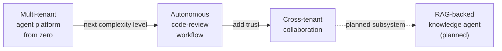

<!-- SPDX-License-Identifier: Apache-2.0 -->
<!-- Copyright (c) 2026 keese-ai -->

# Where to go next

You have deployed keese locally and run your first workspace — here is a map of every path forward, from deepening your understanding to building production platforms.

!!! info "Audience"
    All readers who have completed the getting-started sequence. **Prerequisites:** [Install locally on kind](install-kind.md) · [Your first workspace & session](first-workspace.md)

## Pick your path

The diagram below shows the four major branches of the documentation and when to take each one.

```mermaid
flowchart TD
    START([You finished the<br/>Getting Started sequence])

    START --> Q1{What do you<br/>want to do?}

    Q1 -->|Understand the system| CONCEPTS
    Q1 -->|Accomplish a task| GUIDES
    Q1 -->|Follow an end-to-end example| SCENARIOS
    Q1 -->|Contribute to the project| DEVELOPMENT

    subgraph CONCEPTS["📖 Concepts"]
        direction TB
        C1[Architecture overview]
        C2[Identity & zero-trust]
        C3[Workspaces & sessions]
        C4[Authorization — ReBAC/OpenFGA]
        C5[Egress & the AI Gateway]
        C6[Memory]
        C7[Agent runtimes]
    end

    subgraph GUIDES["🔧 Guides"]
        direction TB
        G1[Configure an agent runtime]
        G2[Configure memory backends]
        G3[Define guardrails]
        G4[Set token budgets]
        G5[Configure egress credentials]
        G6[Cloud deploy — OpenTofu]
    end

    subgraph SCENARIOS["🚀 Scenarios"]
        direction TB
        S1[Multi-tenant agent platform]
        S2[Autonomous code-review workflow]
        S3[RAG-backed knowledge agent]
        S4[Cross-tenant collaboration]
    end

    subgraph DEVELOPMENT["⚙ Development"]
        direction TB
        D1[Dev environment — Nix]
        D2[SDLC & design gate]
        D3[Testing strategy]
        D4[Contributing]
    end
```

---

## Deepen your understanding — Concepts

The Concepts section explains _why_ keese works the way it does. Start with the architecture overview if you are new to the system; jump to the specific topic if you already know what you are looking for.

| I want to understand … | Read |
|---|---|
| The big picture — operators, CRDs, control loops | [Architecture overview](../concepts/architecture.md) |
| Namespaces, tenants, and Capsule isolation | [Tenancy & namespaces](../concepts/tenancy.md) |
| How workspace and session objects relate | [Workspaces & sessions](../concepts/workspaces.md) |
| How identity works — projected SA tokens | [Identity & zero-trust](../concepts/identity-zero-trust.md) |
| How OpenFGA controls access | [Authorization (ReBAC / OpenFGA)](../concepts/authorization-rebac.md) |
| How egress flows through Envoy AI Gateway | [Egress & the AI Gateway](../concepts/egress-ai-gateway.md) |
| How upstream credentials stay out of agent pods | [Credential broker](../concepts/credential-broker.md) |
| Which agent runtimes are supported | [Agent runtimes (SPI)](../concepts/agent-runtimes.md) |
| SQLite vs Redis vs Qdrant memory | [Memory](../concepts/memory.md) |
| Vector search and RAG (planned) | [RAG & knowledge bases](../concepts/rag.md) *(designs current; zero controller code — planned)* |
| Argo Workflows integration | [Workflows & triggers](../concepts/workflows.md) |
| Content filtering and guardrails | [Guardrails](../concepts/guardrails.md) |
| Token budgets and spend tracking | [Token budgets & observability](../concepts/observability.md) |
| NATS transport and messaging | [Transports & messaging](../concepts/transports.md) |
| Recipes — composable agent definitions | [Recipes](../concepts/recipes.md) |
| Sharing agents across tenants | [Cross-tenant collaboration](../concepts/cross-tenant.md) |
| SIGTERM handling and graceful drain | [Process lifecycle & supervision](../concepts/lifecycle-supervision.md) |
| NetworkPolicy and fail-closed egress | [Network isolation](../concepts/network-isolation.md) |

---

## Accomplish a task — Guides

Guides are task-oriented: each one starts from a working cluster and ends with a specific thing configured or running. Most guides have `kubectl apply` examples you can copy directly.

| Task | Guide |
|---|---|
| Install via OLM on an existing cluster | [Install via OLM](../guides/install-olm.md) |
| Spin up a local kind cluster with Tilt hot-reload | [Bootstrap a local cluster](../guides/bootstrap-local.md) |
| Create a tenant namespace with Capsule | [Provision a tenant](../guides/provision-tenant.md) |
| Create a workspace and attach a session | [Create a workspace & attach a session](../guides/workspace-session.md) |
| Point a workspace at a different agent runtime | [Configure an agent runtime](../guides/configure-runtime.md) |
| Write and publish a recipe | [Write & distribute a recipe](../guides/recipes.md) |
| Switch memory backends (SQLite → Qdrant) | [Configure memory backends](../guides/memory-backends.md) |
| Ingest documents for RAG | [Set up RAG ingestion](../guides/rag-ingestion.md) |
| Block disallowed tool calls or content | [Define guardrails](../guides/guardrails.md) |
| Cap token spend per workspace or tenant | [Set token budgets](../guides/token-budgets.md) |
| Wire up Anthropic, OpenAI, or Bedrock credentials | [Configure egress credentials](../guides/egress-credentials.md) |
| Grant access across tenant boundaries | [Cross-tenant agreements](../guides/cross-tenant-agreements.md) |
| Deploy to AWS, GCP, or Azure with OpenTofu | [Cloud deploy (OpenTofu)](../guides/cloud-deploy.md) |
| Set up OTEL → Elastic APM tracing | [Observability setup (OTEL)](../guides/observability-setup.md) |
| Back up and restore OpenBao, OpenFGA, and NATS | [Backup & disaster recovery](../guides/backup-dr.md) |
| Enable or disable a feature flag | [Toggle feature gates](../guides/feature-gates.md) |
| Attach GoLand or VSCode with remote debugger | [IDE setup & debugging](../guides/ide-debugging.md) |

---

## Follow an end-to-end example — Scenarios

Scenarios walk through realistic use-cases from zero, combining concepts and guide steps into a narrative you can reproduce.

- **[Multi-tenant agent platform from zero](../scenarios/multi-tenant-platform.md)** — provision tenants, workspaces, and sessions for a fictional engineering team.
- **[Autonomous code-review workflow](../scenarios/code-review-workflow.md)** — trigger an Argo Workflow on a GitHub PR event and surface results as review comments.
- **[Cross-tenant collaboration](../scenarios/cross-tenant-collab.md)** — issue a `CrossTenantAgreement` and let a specialist agent serve two tenants safely.

### Coming soon

!!! warning "Planned — not yet implemented"
    The scenarios below cover subsystems that are design-complete but have no controller code on main yet. They are included for orientation only — you cannot run them against a real cluster today. Track progress in the [Roadmap](../development/roadmap.md).

- **[RAG-backed knowledge agent](../scenarios/rag-knowledge-agent.md)** — ingest a document corpus into Qdrant and wire it to a workspace session. The KnowledgeBase, DocumentSource, and IngestionRun CRDs (designs 28/28b/28c) have no controller implementation yet.

---

## Contribute to the project — Development

keese is early-stage alpha. The design gate opened on 2026-04-22; 18 reconcilers and 20 CRD kinds are now in place across three API groups. There is plenty of room to contribute.

| I want to … | Read |
|---|---|
| Understand the repo layout | [Repository map](../development/repo-map.md) |
| Set up the Nix dev shell | [Development environment (Nix)](../development/dev-environment.md) |
| Understand the design gate and SDLC | [SDLC & the design gate](../development/sdlc.md) |
| Run tests (envtest, kuttl, e2e) | [Testing strategy](../development/testing.md) |
| Understand CI/CD and release | [CI/CD pipeline](../development/cicd.md) |
| Build and sign OLM bundles | [Build & release (OLM + cosign)](../development/build-release.md) |
| Author or update diagrams | [Diagram authoring](../development/diagrams.md) |
| Run multi-agent worktrees | [Multi-agent worktree workflow](../development/multi-agent.md) |
| See what is built vs planned | [Roadmap](../development/roadmap.md) |
| Submit a PR | [Contributing](../development/contributing.md) |

---

## Reference

When you need a quick lookup rather than a tutorial:

- [API reference overview](../reference/api/index.md) — all three API groups at a glance.
- [API: keese.ai group](../reference/api/keese.md) — Workspace, WorkspaceSession, Recipe, Workflow, and more.
- [API: authz.keese.ai group](../reference/api/authz.md) — OIDCProvider, CrossTenantAgreement, GuardrailBinding.
- [API: policy.keese.ai group](../reference/api/policy.md) — TokenBudget and related policy kinds.
- [Make targets](../reference/make-targets.md) — every `make` target explained.
- [Feature gate catalog](../reference/feature-gate-catalog.md) — all feature flags and their states.
- [Metrics, events & conditions](../reference/metrics-events.md) — what to alert on.
- [Glossary](../reference/glossary.md) — terms used throughout the docs.

## See also

- [Getting Started index](index.md) — revisit any earlier step.
- [Concepts index](../concepts/index.md) — all concept pages in one place.
- [Guides index](../guides/index.md) — all how-to guides.
- [Scenarios index](../scenarios/index.md) — end-to-end worked examples.
