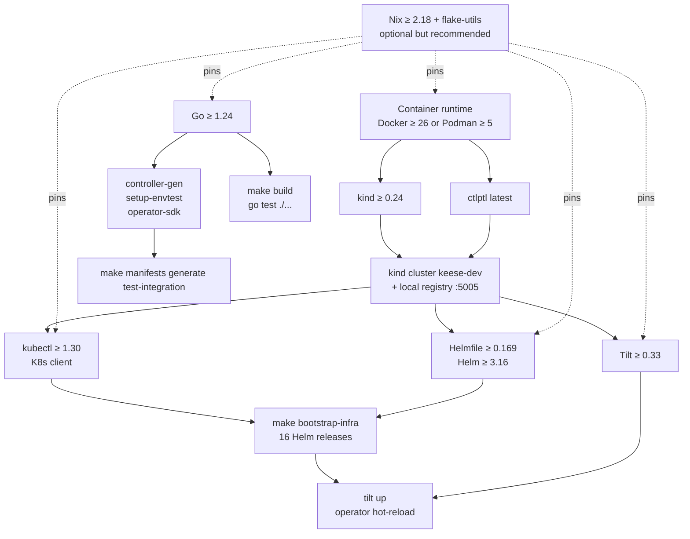

<!-- SPDX-License-Identifier: Apache-2.0 -->
<!-- Copyright (c) 2026 keese-ai -->

# Prerequisites

Install and verify every tool listed here before running `make kind-up` or following any other Getting Started guide.

!!! info "Audience"
    Platform operators and contributors setting up a local keese development environment. · **Prerequisites:** A POSIX shell (bash/zsh), internet access, and a container runtime (Docker or Podman).

---

## Tool dependency overview

The diagram below shows how the tools depend on each other. Start at the top and work down — later layers will not function if an earlier one is missing.



---

## Kubernetes version requirement

keese requires **Kubernetes 1.30 or newer** in any cluster you target (local or cloud). This is the release at which `ValidatingAdmissionPolicy` (VAP) reached GA — keese uses VAP for static-invariant enforcement in place of admission webhooks where CEL is sufficient (see `.claude/rules/04-kubernetes.md` §12).

The `Makefile` pins envtest and `kubeconform` to `K8S_VERSION ?= 1.30.x`:

```bash
# Confirm your client is ≥ 1.30
kubectl version --client=true -o json | jq -r .clientVersion.gitVersion
# Expected: v1.30.x or higher
```

---

## Option A — Nix devshell (recommended)

The Nix flake at [`flake.nix`](https://github.com/keese-ai/keese/blob/main/flake.nix) pins every tool to a reproducible version from `nixpkgs/nixos-25.05`. Using it eliminates version skew across contributors and CI.

### Install Nix

```bash
# macOS or Linux — installs Nix with flakes enabled
curl --proto '=https' --tlsv1.2 -sSf https://install.determinate.systems/nix | sh -s -- install
```

Verify:

```bash
nix --version
# nix (Nix) 2.18+
```

### Enter the devshell

```bash
cd /path/to/keese
nix develop
# Prints the keese dev shell banner and next-steps list
```

With [`direnv`](https://direnv.net/) (also included in the shell) you can make activation automatic:

```bash
echo "use flake" > .envrc
direnv allow
```

After entering the shell, `make version` should print non-missing values for all tools. A few packages are noted in `flake.nix` as "unverified nixpkgs naming" and fall back to `go install` paths — see the [Option B](#option-b-manual-install) table for those.

---

## Option B — Manual install

Install each tool individually at the versions shown. The Makefile's `version` target prints what is actually on your `PATH`.

```bash
make version
```

### Core tools

| Tool | Minimum version | Install reference |
|---|---|---|
| Go | 1.24 | [go.dev/dl](https://go.dev/dl/) |
| kubectl | 1.30 | [kubernetes.io/docs/tasks/tools](https://kubernetes.io/docs/tasks/tools/) |
| kind | 0.24 | [kind.sigs.k8s.io](https://kind.sigs.k8s.io/#installation) |
| ctlptl | latest | [github.com/tilt-dev/ctlptl](https://github.com/tilt-dev/ctlptl#install) |
| Tilt | 0.33 | [docs.tilt.dev](https://docs.tilt.dev/install.html) |
| Helm | 3.16 | [helm.sh/docs/intro/install](https://helm.sh/docs/intro/install/) |
| Helmfile | 0.169 | [github.com/helmfile/helmfile](https://github.com/helmfile/helmfile#installation) |
| kustomize | 5.x | [kubectl.docs.kubernetes.io/installation/kustomize](https://kubectl.docs.kubernetes.io/installation/kustomize/) |

### Go-based operator tooling

These are required to regenerate CRDs and run integration tests; they are installed via `go install`:

| Tool | Install command |
|---|---|
| controller-gen | `go install sigs.k8s.io/controller-tools/cmd/controller-gen@latest` |
| setup-envtest | `go install sigs.k8s.io/controller-runtime/tools/setup-envtest@latest` |
| operator-sdk | See [sdk.operatorframework.io/docs/installation](https://sdk.operatorframework.io/docs/installation/) |

### Supply-chain and lint tools

Required for pre-commit hooks and CI; already in the Nix shell:

| Tool | Purpose |
|---|---|
| cosign | Image signing / verification |
| syft | SBOM generation |
| trivy | Container and dependency CVE scan |
| golangci-lint | Go linting (pre-commit + CI) |
| govulncheck | Go vulnerability scan |
| gofumpt + goimports | Code formatting |
| pre-commit | Hook runner |
| commitizen | Conventional Commits helper |
| markdownlint-cli | Markdown lint |
| shellcheck + shfmt | Shell script lint and format |

---

## Container runtime

Both Docker and Podman work with kind. kind requires the daemon to be running before `make kind-up`.

```bash
# Docker: verify daemon is up
docker info --format '{{.ServerVersion}}'
# Expected: 26.x or newer

# Or Podman (rootless supported by kind ≥ 0.20)
podman info --format '{{.Version.Version}}'
```

!!! warning "Podman on macOS"
    kind on macOS with Podman requires the Podman machine to be started (`podman machine start`) and the socket set as the Docker host (`export DOCKER_HOST=unix://$HOME/.local/share/containers/podman/machine/qemu/podman.sock` or the equivalent path). Docker Desktop is simpler for most contributors.

---

## Anthropic API key (live LLM path)

The default agent runtime uses [goose](https://github.com/block/goose) with the Anthropic provider. Running a live `WorkspaceSession` requires an Anthropic API key.

```bash
cp .env.local.example .env.local
# Edit .env.local — fill in ANTHROPIC_API_KEY
```

The relevant lines in `.env.local.example`:

```bash
GOOSE_PROVIDER=anthropic
GOOSE_MODEL=claude-opus-4-7
ANTHROPIC_API_KEY=          # <-- required for live LLM calls
```

The seed script (`scripts/dev/seed-openbao.sh`) writes the key from `.env.local` into the in-cluster OpenBao instance at `keese/tenants/tenant-a/anthropic`. If the key is absent, placeholder values are written and the controller fills them later.

!!! note "Other providers"
    `GOOSE_PROVIDER` also accepts `openai`, `bedrock`, `ollama`, `databricks`, and `google`. Set the corresponding key variable in `.env.local`. See `.env.local.example` for the full list.

!!! danger "Never commit `.env.local`"
    `.env.local` is gitignored. Committing API keys is prohibited by `.claude/rules/02-security.md`. The `gitleaks` pre-commit hook will block the commit, but do not rely on it as the only safeguard.

---

## Host resource requirements

The local kind cluster (`dev/kind/kind-config.yaml`) creates one control-plane node and three workers, each with a shared containerd cache mount under `/tmp/keese-containerd-workerN`. `make bootstrap-infra` installs 16 Helm releases (cilium, cert-manager, trust-manager, Capsule, Envoy Gateway, envoy-ai-gateway-crds, Envoy AI Gateway, OpenFGA, Kyverno, NACK, NATS, ECK, OpenBao, External Secrets, Argo Workflows, and Qdrant). The OTEL Collector release is present in `dev/bootstrap/helmfile.yaml` but is disabled pending TD-P1-08.

Recommended minimums:

| Resource | Recommended |
|---|---|
| CPU | 8 cores (logical) |
| RAM | 16 GB |
| Disk (free under `/tmp`) | 20 GB |
| Network | Broadband (Docker pulls on first run) |

`make kind-up bootstrap-infra` should complete in ≤ 300 seconds on a modern laptop with a warm Docker layer cache (measured by `scripts/dev/time-bootstrap.sh`).

---

## Verify everything is in place

Run the Makefile's version checker after installing all tools:

```bash
make version
# go:             go1.24.x linux/arm64
# kubectl:        v1.30.x
# kustomize:      v5.x.x
# operator-sdk:   operator-sdk version: "v1.x.x" ...
# controller-gen: Version: v0.x.x
# helm:           v3.16.x+...
# helmfile:       helmfile version v0.169.x
# kind:           kind v0.24.x go1.24.x ...
# tilt:           v0.33.x, built ...
# tofu:           OpenTofu v1.x.x
```

All lines should show a version string, not `missing`.

---

## Next steps

- [Install locally on kind](./install-kind.md) — stand up the `keese-dev` cluster and install the operator.
- [Your first workspace & session](./first-workspace.md) — create a Workspace and attach a WorkspaceSession.
- [Bootstrap a local cluster (kind + Tilt)](../guides/bootstrap-local.md) — the complete Tilt-driven dev loop.
- [Development environment (Nix)](../development/dev-environment.md) — deeper Nix flake and direnv configuration.
