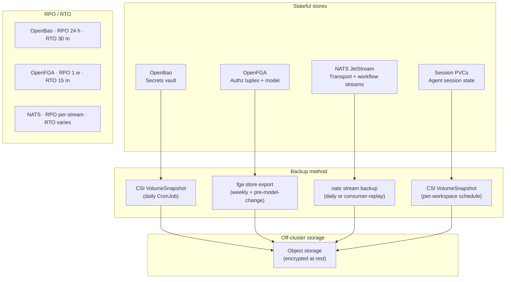

<!-- SPDX-License-Identifier: Apache-2.0 -->
<!-- Copyright (c) 2026 keese-ai -->

# Backup & disaster recovery

This guide explains how to back up and restore the three stateful stores that keese depends on — OpenBao (secrets), OpenFGA (authorization tuples), and NATS JetStream (messaging) — plus how to protect agent session PVCs with volume snapshots.

!!! info "Audience"
    Platform operators responsible for cluster reliability. **Prerequisites:** a running keese installation (see [Bootstrap a local cluster](bootstrap-local.md) or [Install via OLM](install-olm.md)), a CSI driver with snapshot support, and the `nats` and `fga` CLIs available.

---

## At a glance



## Summary matrix

| Component | RPO | RTO | Backup tool | Restore tool |
|---|---|---|---|---|
| OpenBao | 24 h | 30 m | CSI `VolumeSnapshot` | CSI restore + `bao operator unseal` |
| OpenFGA | 1 week | 15 m | `fga store export` | `fga store import` |
| NATS streams | per-stream policy | varies | `nats stream backup` | `nats stream restore` |
| Session PVCs | per-workspace schedule | varies | CSI `VolumeSnapshot` | CSI restore |

## Guiding principles

1. **Off-cluster custody.** Unseal keys, export files, and NATS backup archives belong in object storage, an HSM, or a cloud secrets manager — never as Kubernetes Secrets in the same cluster.
2. **Idempotent restore.** Every procedure is designed to be re-runnable. Always execute the verification step before declaring recovery complete.
3. **Test quarterly.** Run a full restore drill in a scratch `kind` cluster every quarter to keep the RTO estimates accurate.

---

## OpenBao — secrets vault

**RPO: 24 h · RTO: 30 m**

OpenBao holds every upstream credential that keese manages (LLM provider keys, database DSNs, vector-DB tokens). A missing or sealed vault prevents all egress immediately.

### Prerequisites

- CSI driver with snapshot support (e.g., AWS EBS CSI, GCP PD CSI).
- A `VolumeSnapshotClass` named `csi-snapclass` present in the cluster.
- Unseal key shares (3-of-5) stored off-cluster in a password manager, HSM, or cloud secrets manager.

### Backup — daily PVC snapshot

Apply via a CronJob or GitOps pipeline. Substitute the current date for `YYYYMMDD`:

```yaml
apiVersion: snapshot.storage.k8s.io/v1
kind: VolumeSnapshot
metadata:
  name: openbao-data-YYYYMMDD
  namespace: openbao
spec:
  volumeSnapshotClassName: csi-snapclass
  source:
    persistentVolumeClaimName: data-openbao-0
```

Verify the snapshot is ready within five minutes:

```bash
kubectl get volumesnapshot -n openbao
# STATUS column: readyToUse: true
```

### Restore

```bash
# 1. Scale down to prevent write conflicts
kubectl scale statefulset openbao -n openbao --replicas=0

# 2. Delete the existing PVC (data is preserved in the snapshot)
kubectl delete pvc data-openbao-0 -n openbao

# 3. Restore PVC from snapshot
kubectl apply -f - <<'EOF'
apiVersion: v1
kind: PersistentVolumeClaim
metadata:
  name: data-openbao-0
  namespace: openbao
spec:
  accessModes: [ReadWriteOnce]
  storageClassName: standard
  dataSource:
    name: openbao-data-<YYYYMMDD>
    kind: VolumeSnapshot
    apiGroup: snapshot.storage.k8s.io
  resources:
    requests:
      storage: 10Gi
EOF

# 4. Scale back up
kubectl scale statefulset openbao -n openbao --replicas=1

# 5. Unseal (3 of 5 key shares; retrieve from off-cluster store)
kubectl exec -n openbao openbao-0 -- bao operator unseal <key-1>
kubectl exec -n openbao openbao-0 -- bao operator unseal <key-2>
kubectl exec -n openbao openbao-0 -- bao operator unseal <key-3>

# 6. Verify — Sealed must be false
kubectl exec -n openbao openbao-0 -- bao status | grep Sealed
kubectl exec -n openbao openbao-0 -- \
  bao kv get keese/tenants/<tenant>/<provider>
```

### Cloud KMS auto-unseal (production)

In production, replace the file storage block in `dev/bootstrap/values/openbao-prod.yaml.example` with a KMS seal stanza (`seal "awskms"` / `seal "gcpckms"` / `seal "azurekeyvault"`). With auto-unseal, the restore procedure skips the manual `bao operator unseal` steps.

**KMS key rotation** — rotate yearly. After rotating:

```bash
# Confirm OpenBao rewrapped under the new key version
kubectl logs -n openbao openbao-0 | grep "re-wrap"

# Restart and confirm auto-unseal
kubectl rollout restart statefulset/openbao -n openbao
kubectl exec -n openbao openbao-0 -- bao status | grep Sealed
# Expected: Sealed: false
```

!!! warning "Most likely failure mode"
    KMS key deleted or IAM role detached — OpenBao starts sealed and every secret
    lookup fails immediately. Fix: re-grant IAM access and restart the pod. No
    snapshot restore is needed unless the underlying data is also lost.

---

## OpenFGA — authorization tuples

**RPO: 1 week · RTO: 15 m**

OpenFGA stores the ReBAC tuples that govern every authorization decision. Losing or corrupting these tuples causes all authz checks to fail closed (permission denied for all requests).

### Prerequisites

- OpenFGA CLI: `go install github.com/openfga/cli/cmd/fga@latest` (version ≥ 0.4).
- Environment variables:

```bash
export OPENFGA_API_URL=http://openfga.openfga.svc:8080
export OPENFGA_STORE_ID=$(kubectl get cm openfga-config -n keese-system \
  -o jsonpath='{.data.store_id}')
export OPENFGA_AUTHORIZATION_MODEL_ID=$(kubectl get cm openfga-config \
  -n keese-system \
  -o jsonpath='{.data.authorization_model_id}')
```

### Backup — weekly and before every model change

```bash
fga store export --store-id "$OPENFGA_STORE_ID" \
  --api-url "$OPENFGA_API_URL" \
  > "openfga-backup-$(date +%Y%m%d).json"
```

Store the JSON file off-cluster, encrypted at rest. Always take an extra backup immediately before applying any authorization model change.

### Restore

```bash
# 1. Create a fresh store (never reuse the old store ID)
NEW_STORE=$(fga store create \
  --name "keese-restored-$(date +%Y%m%d)" \
  --api-url "$OPENFGA_API_URL" | jq -r '.id')

# 2. Import tuples + model from the backup file
fga store import \
  --store-id "$NEW_STORE" \
  --api-url "$OPENFGA_API_URL" \
  --file openfga-backup-<YYYYMMDD>.json

# 3. Get the new authorization model ID
NEW_MODEL=$(fga model list \
  --store-id "$NEW_STORE" \
  --api-url "$OPENFGA_API_URL" | jq -r '.[0].id')

# 4. Update the ConfigMap mirror so keese controllers use the new store
kubectl patch cm openfga-config -n keese-system \
  --type merge \
  -p "{\"data\":{
    \"store_id\":\"$NEW_STORE\",
    \"authorization_model_id\":\"$NEW_MODEL\"
  }}"

# 5. Restart keese-authz to pick up the new store ID
kubectl rollout restart deployment/keese-authz -n keese-system
kubectl rollout status deployment/keese-authz -n keese-system
```

### Verification

```bash
# Read a known tuple to confirm the restored store is populated correctly.
# Requires a Tenant CR named 'smoke-tenant' to exist in the cluster.
fga tuple read \
  --store-id "$OPENFGA_STORE_ID" \
  --api-url "$OPENFGA_API_URL" \
  --object "tenant:smoke-tenant" \
  --relation admin
# Expected: returns the admin user tuple written by the tenant reconciler.
```

!!! note "Full authz smoke"
    A broader `make smoke-authz` target will be added once the keese-authz
    ext_authz service is integrated into the smoke harness. Until then, use
    the `fga tuple read` check above to confirm tuple visibility in the
    restored store.

!!! warning "Most likely failure mode"
    ConfigMap not updated after restore — `keese-authz` resolves the old store ID
    and every authz check returns `permission_denied`. Fix: re-apply step 4 above
    and restart the deployment.

!!! note "Planned automation"
    Automatically updating the `openfga-config` ConfigMap mirror after restore is
    tracked as a tech-debt follow-on (TD-P1-03). Until that lands, step 4 is manual.

---

## NATS JetStream — transport and workflow streams

**RPO: per-stream policy · RTO: varies**

NATS JetStream carries in-flight messages for `Transport` and `Workflow` resources. Stream backup is cost-effective only for low-volume transport streams; high-volume and ephemeral workflow streams rely on consumer replay and downstream idempotency instead.

### Prerequisites

- `nats` CLI — ships in the Nix devshell via `flake.nix`.

```bash
export NATS_URL=nats://nats.nats.svc:4222
```

Stream names follow the convention from [design 09](https://github.com/keese-ai/keese/blob/main/docs/designs/09-transport-crd.md):

- Transport streams: `keese.tenant.<t>.transport.<name>.*`
- Workflow streams: `keese.tenant.<t>.wf.<r>.*`

### Backup cadence

| Stream type | Recommended cadence | Rationale |
|---|---|---|
| Transport — low volume | Daily | Feasible; supports full message replay |
| Transport — high volume | Consumer replay only | Multi-GB backup exceeds RTO budget |
| Workflow streams | Consumer replay only | Controllers are idempotent (reconcile ≤ 3 times); backup cost not justified for ephemeral state |

For streams where backup is intentionally skipped, document the decision in the stream's `description` field.

### Backup

```bash
# List available streams
nats --server "$NATS_URL" stream list

# Back up a specific stream (creates a directory of segment files)
nats --server "$NATS_URL" stream backup \
  "keese.tenant.<t>.transport.<name>" \
  ./nats-backup/$(date +%Y%m%d)/keese.tenant.<t>.transport.<name>/
```

Move the backup directory to off-cluster object storage after the backup completes.

### Restore

```bash
nats --server "$NATS_URL" stream restore \
  "keese.tenant.<t>.transport.<name>" \
  ./nats-backup/<YYYYMMDD>/keese.tenant.<t>.transport.<name>/

# Verify message counts and sequence boundaries
nats --server "$NATS_URL" stream info "keese.tenant.<t>.transport.<name>"
nats --server "$NATS_URL" stream report
```

!!! warning "Most likely failure mode"
    Consumer sequence offsets are ahead of the restored stream sequence — consumers
    error with `sequence not found`. Fix: reset the consumer to the first available
    sequence.

    ```bash
    nats --server "$NATS_URL" consumer edit \
      "keese.tenant.<t>.transport.<name>" \
      <consumer-name> \
      --deliver-first
    ```

!!! note "Idempotency requirement"
    A restored stream may cause message replay. All keese Workflow controllers are
    required to be idempotent (they converge in ≤ 3 reconciles with no side-effect
    doubling on replay). Verify downstream idempotency before relying on consumer
    replay as a substitute for a stream backup.

---

## Session PVCs

Agent session state (goose SQLite databases, intermediate checkpoints) lives on PVCs mounted inside workspace pods. These PVCs follow the same CSI VolumeSnapshot pattern as OpenBao.

```yaml
apiVersion: snapshot.storage.k8s.io/v1
kind: VolumeSnapshot
metadata:
  name: session-<workspace>-YYYYMMDD
  namespace: <tenant-namespace>
spec:
  volumeSnapshotClassName: csi-snapclass
  source:
    persistentVolumeClaimName: session-<workspace>
```

Schedule these snapshots at a frequency that matches the acceptable loss window for your tenant. On SIGKILL, the operator checkpoints session state to the PVC before process exit (see [signal-handling rules](https://github.com/keese-ai/keese/blob/main/.claude/rules/06-signal-handling.md)); a one-hour snapshot cadence is generally sufficient for interactive workloads.

---

## DR drill checklist

Run this in a scratch `kind` cluster every quarter:

- [ ] Restore OpenBao from last VolumeSnapshot and unseal. Verify `bao kv get` returns expected keys.
- [ ] Restore OpenFGA from last weekly export. Update ConfigMap. Verify `make smoke-authz` passes.
- [ ] Restore at least one NATS transport stream. Verify message count matches source. Verify consumer advances without `sequence not found` errors.
- [ ] Record actual RTO for each component and compare against targets above.
- [ ] Update this page if any step is outdated.

---

## See also

- [Concepts: Identity & zero-trust](../concepts/identity-zero-trust.md) — why credentials must never live in agent pods
- [Concepts: Authorization (ReBAC / OpenFGA)](../concepts/authorization-rebac.md) — the tuple model that OpenFGA backup preserves
- [Concepts: Transports & messaging](../concepts/transports.md) — NATS stream naming and Transport CRD
- [Guides: Observability setup (OTEL)](observability-setup.md) — monitoring the health of stateful components
