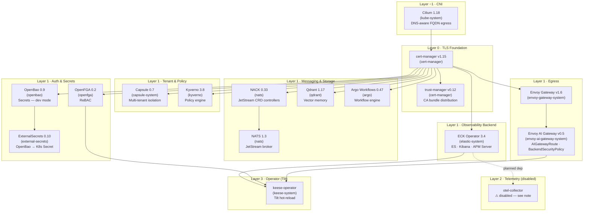
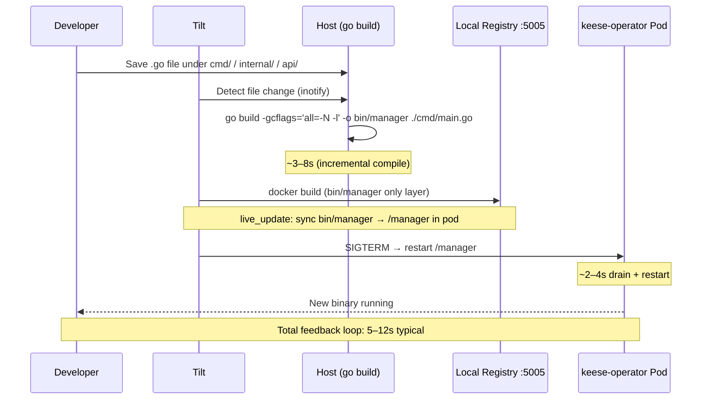

<!-- SPDX-License-Identifier: Apache-2.0 -->
<!-- Copyright (c) 2026 keese-ai -->

# Bootstrap a local cluster (kind + Tilt)

Stand up the full keese development stack on a local kind cluster, understand what each of the 16 Helm releases does, and get a live-reload operator loop running in under 5 minutes once your image cache is warm.

!!! info "Audience"
    Platform engineers and contributors running keese locally. · **Prerequisites:** [Prerequisites](../getting-started/prerequisites.md) · basic familiarity with `kubectl`, `helm`, and `kind`.

---

## How the stack is layered

The bootstrap installs 16 Helm releases across six conceptual layers, in dependency order enforced by `needs:` in [`dev/bootstrap/helmfile.yaml`](https://github.com/keese-ai/keese/blob/main/dev/bootstrap/helmfile.yaml).



!!! warning "OTEL collector disabled"
    The `otel-collector` release is commented out in `helmfile.yaml`. The upstream chart (v0.112.0) dropped its default `image.repository` value; a one-line values fix is tracked in `docs/plans/demo/tech-debt.md`. Operator traces and logs still emit — they just have no collector to receive them until this is re-enabled.

!!! warning "OpenBao runs in dev mode locally"
    `dev/bootstrap/values/openbao.yaml` sets `server.dev.enabled: true`, `devRootToken: "root"`, and `dataStorage.enabled: false`. The pod is auto-unsealed on every restart and all data lives **in memory**. Any pod restart wipes all secrets. Tilt's `openbao-seed` step re-populates `kv-v2` paths on every loop, so this is intentional for developer experience. **Do not use this mode in production.** See [Production unseal](#production-unseal) below.

---

## Prerequisites

| Tool | Version | Install |
|---|---|---|
| Docker or Podman | 24+ | [docs.docker.com](https://docs.docker.com/get-docker/) |
| kind | 0.23+ | `brew install kind` |
| ctlptl | any | `brew install tilt-dev/tap/ctlptl` |
| helm | 3.16+ | `brew install helm` |
| helmfile | 0.168+ | `brew install helmfile` |
| Tilt | 0.33+ | `brew install tilt-dev/tap/tilt` |
| kubectl | 1.30+ | `brew install kubectl` |

---

## Step 1 — Create the kind cluster

```bash
make kind-up
```

This runs `ctlptl apply -f dev/kind/ctlptl.yaml`, which creates:

- A kind cluster named **`keese-dev`** (1 control-plane + 3 workers).
- A local OCI registry on **host port 5005** wired into containerd's mirror config inside every node — so `docker push localhost:5005/…` is immediately pullable by pods.

The three workers are labelled for multi-tenant isolation:

| Node | Label | Purpose |
|---|---|---|
| worker-1 | `keese.ai/purpose=infra` | System infra (tainted `NoSchedule`) |
| worker-2 | `keese.ai/tenant=tenant-a` | Standard-tier tenant workloads |
| worker-3 | `keese.ai/tenant=tenant-b` | Isolated-tier tenant (tainted `NoSchedule`) |

Port mappings on worker-1 expose `80`, `443`, `8200` (OpenBao), `8080` (operator metrics), `9200` (Elasticsearch), `5601` (Kibana), and `4318` (OTLP) to `127.0.0.1`.

!!! note
    Cilium replaces kindnet as the CNI. `kind-config-demo.yaml` disables kindnet so Cilium can install cleanly. If you skip the ctlptl path and use a plain `kind create cluster`, ensure you pass `dev/kind/kind-config.yaml` with networking set correctly.

---

## Step 2 — Install the infra stack

```bash
make bootstrap-infra
```

`bootstrap-infra` does three things in order:

1. **Pre-apply chart-shipped CRDs** via `dev/bootstrap/install-crds.sh`.  
   Helm's CRD lifecycle installs CRDs only on first install and never upgrades them — a known footgun. The script runs `helm pull` + `kubectl apply --server-side --force-conflicts` for charts that ship CRDs in a `crds/` directory (currently Envoy Gateway). This ensures schema upgrades land correctly when chart versions bump.

2. **`helmfile sync`** — installs all 16 releases in dependency order.  
   Helmfile resolves the `needs:` graph and installs in topological order. With a warm Docker image cache this completes in ≤ 300 s on a modern laptop.

3. **Apply seeds** — NATS JetStream streams (`kubectl apply -k dev/bootstrap/nats`) and the Envoy AI Gateway Anthropic stack (`kubectl apply -k dev/bootstrap/aigateway`).

### Component matrix

| Release | Namespace | Chart version | Purpose |
|---|---|---|---|
| cilium | kube-system | 1.18.2 | CNI + FQDN egress policies + Hubble |
| cert-manager | cert-manager | v1.15.3 | TLS issuance (ACME / self-signed) |
| trust-manager | cert-manager | v0.12.0 | CA bundle distribution via `Bundle` CR |
| capsule | capsule-system | 0.7.2 | Multi-tenant `Tenant` isolation |
| envoy-gateway | envoy-gateway-system | v1.6.0 | Gateway API implementation |
| envoy-ai-gateway-crds | envoy-ai-gateway-system | v0.5.0 | `AIGatewayRoute`, `AIServiceBackend`, `BackendSecurityPolicy` CRDs |
| envoy-ai-gateway | envoy-ai-gateway-system | v0.5.0 | AI request routing + credential injection |
| openfga | openfga | 0.2.62 | ReBAC authorization engine |
| kyverno | kyverno | 3.8.0 | Policy engine (GuardrailBinding enforcement) |
| nack | nats | 0.33.2 | JetStream CRD controllers |
| nats | nats | 1.3.16 | JetStream messaging broker |
| eck-operator | elastic-system | 3.4.0 | ECK → Elasticsearch + Kibana + APM Server |
| openbao | openbao | 0.9.0 | Secrets store (**dev mode** — see warning above) |
| external-secrets | external-secrets | 0.10.5 | OpenBao → Kubernetes `Secret` bridge |
| argo-workflows | argo | 0.47.5 | Workflow execution engine |
| qdrant | qdrant | 1.17.1 | Vector memory backend |

!!! note "Version pins"
    Chart versions are pinned and verified as of 2026-05-06. Capsule is held at 0.7.2 (not 0.9.x) due to breaking changes in `Tenant.spec.ingressOptions`; ExternalSecrets is held at 0.10.5 because the upstream Helm index no longer publishes the 0.x series. Both are tracked in `docs/plans/demo/tech-debt.md`.

---

## Step 3 — Start Tilt

```bash
make tilt-up
# or directly: tilt up
```

Open the Tilt UI at [http://localhost:10350](http://localhost:10350).

### What Tilt manages

The Tiltfile is at [`Tiltfile`](https://github.com/keese-ai/keese/blob/main/Tiltfile) in the repo root. It drives five resource groups:

| Label | Resource | What it does |
|---|---|---|
| `preflight` | `kind-ready` | Asserts `kubectl cluster-info` succeeds |
| `infra` | `bootstrap-infra` | Watches `helmfile.yaml` + `values/` — re-syncs on changes |
| `seeds` | `openfga-seed` | Applies `dev/bootstrap/openfga/` kustomize after infra is up |
| `seeds` | `openbao-seed` | Runs `scripts/dev/seed-openbao.sh` — populates kv-v2 paths |
| `operator` | `compile-manager` | Rebuilds binary on any change under `cmd/`, `internal/`, `api/` |
| `operator` | `keese-operator` | `docker_build_with_restart` → `live_update` syncs binary into pod |

Port-forwards exposed by Tilt:

| Port | Destination |
|---|---|
| `2345` | dlv debugger (`keese-operator` pod) |
| `8080` | Health + metrics endpoint |

### Hot-reload cycle



The `live_update` directive in the Tiltfile syncs only `bin/manager` into the running container rather than doing a full image rebuild. Combined with the debug-symbol build (`-gcflags='all=-N -l'`), this gives a 5–12 s feedback loop and keeps the dlv debugger attach-able at `:2345`.

!!! tip "Attach a debugger"
    The binary is built with inlining disabled. In GoLand: **Run → Attach to Process → Remote → localhost:2345**. In VS Code, add a `Go: Connect to server` launch config pointing at `localhost:2345`. See [`guides/ide-debugging.md`](ide-debugging.md) for full configuration.

---

## Step 4 — Seed data

### OpenBao (automatic)

Tilt runs `scripts/dev/seed-openbao.sh` automatically after infra is up. The script authenticates with the well-known dev root token (`root`) at `http://localhost:8200` and writes placeholder kv-v2 paths for each configured tenant.

If `ANTHROPIC_API_KEY` is set in `.env.local`, the seed script writes the live key at `keese/tenants/tenant-a/anthropic`. Otherwise it writes an empty placeholder.

```bash
# To reseed manually:
export BAO_ADDR=http://localhost:8200
export BAO_TOKEN=root
scripts/dev/seed-openbao.sh
```

### OpenFGA (automatic)

The `openfga-seed` Job is applied by Tilt (`kubectl apply -k dev/bootstrap/openfga/`) after `bootstrap-infra` completes. To reseed manually:

```bash
kubectl delete job openfga-seed -n openfga --ignore-not-found
kubectl apply -k dev/bootstrap/openfga/
```

### NATS streams

NATS JetStream streams and consumers are applied by `make bootstrap-infra` and can be reapplied at any time:

```bash
kubectl apply -k dev/bootstrap/nats/
```

---

## Resetting the stack

### Reset everything

```bash
make kind-down && make kind-up bootstrap-infra tilt-up
```

With a warm Docker layer cache, `kind-up` + `bootstrap-infra` completes in ≤ 300 s. The `scripts/dev/time-bootstrap.sh` script measures this.

### Reset a single component

```bash
helmfile -f dev/bootstrap/helmfile.yaml destroy --selector name=openfga
helmfile -f dev/bootstrap/helmfile.yaml sync     --selector name=openfga
```

---

## Production unseal

!!! danger "Dev mode is not production-safe"
    The default `dev/bootstrap/values/openbao.yaml` uses `server.dev.enabled: true` with an in-memory store and a well-known root token. Any workload that can reach the OpenBao service can authenticate. Never deploy this configuration outside a local developer machine.

For production, copy the example overlay, point the seal stanza at your KMS, and init + unseal manually:

```bash
cp dev/bootstrap/values/openbao-prod.yaml.example \
   dev/bootstrap/values/openbao-prod.yaml   # gitignored

# Edit openbao-prod.yaml: set seal "awskms" / "gcpckms" / "azurekeyvault"

# First-time init — save the unseal keys and root token somewhere safe.
kubectl exec -n openbao openbao-0 -- bao operator init

# Shamir unseal (3 of 5 keys).
kubectl exec -n openbao openbao-0 -- bao operator unseal <key-1>
kubectl exec -n openbao openbao-0 -- bao operator unseal <key-2>
kubectl exec -n openbao openbao-0 -- bao operator unseal <key-3>

# Seed credentials once unsealed.
export BAO_ADDR=http://openbao.openbao.svc.cluster.local:8200
export BAO_TOKEN=<root-token>
scripts/dev/seed-openbao.sh
```

For HA production clusters, the prod-values example also documents `server.ha.enabled: true` with a 3-node Raft quorum and cloud KMS auto-unseal (`seal "awskms"` / `"gcpckms"` / `"azurekeyvault"`).

---

## Troubleshooting

| Symptom | Likely cause | Fix |
|---|---|---|
| `helmfile sync` fails with "no matches for kind" | Stale CRDs from a prior chart version | `dev/bootstrap/install-crds.sh` then re-run `make bootstrap-infra` |
| `openbao-seed` fails with "connection refused" | OpenBao pod not yet ready | Wait for `kubectl get pods -n openbao` to show `Running`, then re-trigger in Tilt UI |
| `keese-operator` crashloops after binary sync | Build artifact mismatch | `make build` on host to force a clean binary, then save any `.go` file to trigger Tilt |
| `cilium` not ready after kind-up | kindnet still running (wrong kind config) | Ensure you used `dev/kind/kind-config.yaml` which disables the default CNI |
| Port 8200 already in use | Another Vault/Bao process on host | Stop it or change `hostPort` in `kind-config.yaml` and re-create the cluster |

---

## See also

- [Prerequisites](../getting-started/prerequisites.md) — install tools before running these steps
- [Your first workspace & session](../getting-started/first-workspace.md) — what to do once the stack is running
- [Configure egress credentials](egress-credentials.md) — wire a real API key through OpenBao and BackendSecurityPolicy
- [Observability setup (OTEL)](observability-setup.md) — re-enable the OTEL collector once the values fix lands
