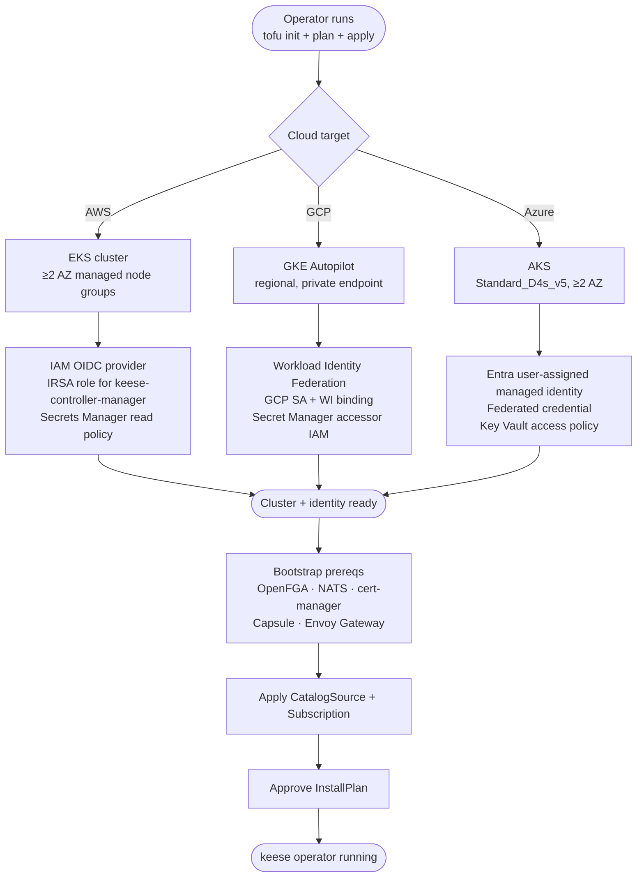

<!-- SPDX-License-Identifier: Apache-2.0 -->
<!-- Copyright (c) 2026 keese-ai -->

# Cloud deploy (OpenTofu)

Provision a production-grade managed Kubernetes cluster on AWS, GCP, or Azure using the keese OpenTofu modules, then install the keese operator via OLM.

!!! info "Audience"
    Platform engineers deploying keese to a cloud environment. · **Prerequisites:** [Bootstrap a local cluster (kind + Tilt)](bootstrap-local.md) for local development; [Install via OLM](install-olm.md) if you already have a cluster and only need the operator install steps.

## How it fits together

The OpenTofu modules live under `deploy/opentofu/{aws,gcp,azure}/`. Each module provisions three things: a managed Kubernetes cluster, cloud workload identity for the keese controller, and the minimal IAM surface to read upstream credentials from the cloud secret store. After `tofu apply` succeeds, you install the operator via OLM exactly as you would on any other cluster.



!!! warning "Planned — not yet fully exercised"
    The OpenTofu modules are authorable and pass `make tofu-validate`, but end-to-end cloud apply is not yet part of CI (the `cloud-apply` GitHub environment and `opentofu.yaml` workflow exist but are not wired to a live cloud account in the repo). Treat these modules as a solid starting point that you will run against your own account.

## Prerequisites

| Tool | Minimum | Install |
|---|---|---|
| OpenTofu | 1.7.0 | `nix develop` (included in flake) or `brew install opentofu` |
| Conftest | 0.49 | `nix develop` or `brew install conftest` |
| AWS CLI | 2.15 | AWS target only |
| gcloud | 469 | GCP target only |
| az CLI | 2.62 | Azure target only |
| kubectl | 1.30+ | All targets |
| OLM | 0.28+ | Installed on the cluster before the operator |

Use the Nix dev shell (`nix develop`) to get OpenTofu and Conftest at pinned versions without manual installs.

## Step 1 — Configure a remote state backend

Remote state is required. The `deny-local-backend.rego` Conftest policy blocks `tofu apply` if a local backend is detected.

Create a `backend.tf` file inside the target module directory. Do not commit real bucket names to git — `.gitignore` excludes `backend.tf` from the repo by convention.

=== "AWS (S3 + DynamoDB)"

    ```hcl
    # deploy/opentofu/aws/backend.tf  — do not commit
    terraform {
      backend "s3" {
        bucket         = "<your-state-bucket>"
        key            = "keese/<env>/terraform.tfstate"
        region         = "<region>"
        encrypt        = true
        kms_key_id     = "<kms-key-arn>"
        dynamodb_table = "<your-lock-table>"
      }
    }
    ```

    !!! note "Lock table bootstrap"
        The DynamoDB lock table must exist before `tofu init`. The table is not managed by the keese module (a commented-out resource in `aws/main.tf` shows how to add it if you want tofu to own the table lifecycle). Create it manually with `aws dynamodb create-table --table-name <lock-table> --billing-mode PAY_PER_REQUEST --attribute-definitions AttributeName=LockID,AttributeType=S --key-schema AttributeName=LockID,KeyType=HASH`.

=== "GCP (GCS + CMEK)"

    ```hcl
    # deploy/opentofu/gcp/backend.tf  — do not commit
    terraform {
      backend "gcs" {
        bucket = "<your-state-bucket>"
        prefix = "keese/<env>"
      }
    }
    ```

    GCS provides built-in object-versioning locking. Enable object versioning on the bucket before first use.

=== "Azure (Blob + lease)"

    ```hcl
    # deploy/opentofu/azure/backend.tf  — do not commit
    terraform {
      backend "azurerm" {
        resource_group_name  = "<rg-for-state>"
        storage_account_name = "<your-storage-account>"
        container_name       = "<your-container>"
        key                  = "keese/<env>/terraform.tfstate"
      }
    }
    ```

    Azure Blob uses built-in lease-based locking.

## Step 2 — Validate before planning

Always run the validation target before a plan. It runs `tofu fmt -check`, `tofu init -backend=false`, `tofu validate`, and `conftest test` across all three modules.

```bash
make tofu-validate
```

Expected output (abbreviated):

```
==> tofu fmt -check: aws ... ok
==> tofu validate: aws ... ok
==> tofu validate: gcp ... ok
==> tofu validate: azure ... ok
==> conftest test deploy/opentofu/ -p policy/opentofu/ ... PASS
```

Fix any policy failures before proceeding. The most common ones are:

- `deny-local-backend.rego` — you have a `backend "local"` block (or no backend configured yet).
- `require-encryption-at-rest.rego` — EKS `encryption_config`, GKE `database_encryption`, or AKS `disk_encryption_set_id` is missing.

## Step 3 — Plan

Run a read-only plan to review what will be created. This uses `-lock=false` because a real apply lock requires the state backend.

```bash
# Plan all three modules
make tofu-plan

# Or plan a single module
cd deploy/opentofu/aws
tofu init
tofu plan -out=tfplan
```

Review the plan carefully. Key resources created per cloud:

| Cloud | Key resources |
|---|---|
| AWS | VPC + private/public subnets, NAT gateways, EKS cluster, managed node group, IAM OIDC provider, IRSA role `<cluster>-keese-controller` |
| GCP | VPC + subnet with pod/service secondary ranges, GKE Autopilot cluster, GCP SA `<cluster>-keese-ctrl`, Workload Identity binding, Secret Manager accessor IAM |
| Azure | Resource group, VNet + AKS subnet, user-assigned managed identity `<cluster>-keese-ctrl`, AKS cluster, federated credential for `keese-system/keese-controller-manager` |

## Step 4 — Apply

Apply requires the `cloud-apply` GitHub Actions environment approval in CI. For local operator-driven deploys, run directly:

```bash
cd deploy/opentofu/aws   # or gcp / azure
tofu apply tfplan
```

When apply completes, configure kubectl:

=== "AWS"

    ```bash
    aws eks update-kubeconfig \
      --region <region> \
      --name <cluster_name> \
      --alias keese-prod
    kubectl config use-context keese-prod
    kubectl get nodes
    ```

=== "GCP"

    ```bash
    gcloud container clusters get-credentials <cluster_name> \
      --region <region> \
      --project <project_id>
    kubectl get nodes
    ```

=== "Azure"

    ```bash
    az aks get-credentials \
      --resource-group <cluster_name>-rg \
      --name <cluster_name> \
      --overwrite-existing
    kubectl get nodes
    ```

## Step 5 — Cloud identity binding

The modules wire the keese controller's Kubernetes ServiceAccount (`keese-system/keese-controller-manager`) to a cloud identity that can read upstream credentials from the cloud secret store. The binding mechanism differs per cloud:

| Cloud | Mechanism | Resource created |
|---|---|---|
| AWS | IRSA — IAM role annotated on the KSA | `aws_iam_role.keese_controller`; trust policy scopes to `system:serviceaccount:keese-system:keese-controller-manager` |
| GCP | Workload Identity Federation | `google_service_account_iam_member` binds GCP SA impersonation to `<project>.svc.id.goog[keese-system/keese-controller-manager]` |
| Azure | Entra Workload Identity | `azurerm_federated_identity_credential` binds user-assigned managed identity to the cluster OIDC issuer + KSA subject |

After apply, annotate the controller ServiceAccount so each cloud's mutating webhook injects the projected token:

=== "AWS"

    ```bash
    ROLE_ARN=$(tofu output -raw keese_controller_role_arn)
    kubectl annotate serviceaccount keese-controller-manager \
      -n keese-system \
      eks.amazonaws.com/role-arn="$ROLE_ARN"
    ```

=== "GCP"

    ```bash
    GCP_SA=$(tofu output -raw keese_controller_gcp_sa_email)
    kubectl annotate serviceaccount keese-controller-manager \
      -n keese-system \
      iam.gke.io/gcp-service-account="$GCP_SA"
    ```

=== "Azure"

    ```bash
    CLIENT_ID=$(tofu output -raw keese_controller_client_id)
    kubectl annotate serviceaccount keese-controller-manager \
      -n keese-system \
      azure.workload.identity/client-id="$CLIENT_ID"
    kubectl label serviceaccount keese-controller-manager \
      -n keese-system \
      azure.workload.identity/use=true
    ```

!!! note "Annotation timing"
    You will annotate the ServiceAccount again after OLM creates it during operator install (Step 7). These annotations are idempotent — running the commands a second time is safe.

## Step 6 — Bootstrap cluster prerequisites

The keese operator expects several in-cluster services to be present before it starts. Install them in the order below. For full detail on each service, follow the [Install via OLM](install-olm.md) guide which covers the same prereq tree.

```bash
# cert-manager
kubectl apply -f https://github.com/cert-manager/cert-manager/releases/latest/download/cert-manager.yaml
kubectl wait --for=condition=Available deployment/cert-manager-webhook -n cert-manager --timeout=120s

# Capsule
helm repo add projectcapsule https://projectcapsule.github.io/charts
helm upgrade --install capsule projectcapsule/capsule -n capsule-system --create-namespace

# Envoy Gateway
helm repo add envoy-gateway https://charts.envoyproxy.io
helm upgrade --install envoy-gateway envoy-gateway/gateway-helm \
  --namespace envoy-gateway-system --create-namespace

# OLM
curl -sL https://github.com/operator-framework/operator-lifecycle-manager/releases/latest/download/install.sh | bash -s latest

# OpenFGA
helm repo add openfga https://openfga.github.io/helm-charts
helm upgrade --install openfga openfga/openfga -n openfga --create-namespace

# Seed OpenFGA (idempotent)
kubectl apply -k https://github.com/keese-ai/keese/dev/bootstrap/openfga/seed
kubectl wait --for=condition=complete job/openfga-seed -n openfga --timeout=120s

# NATS JetStream (NACK)
helm repo add nats https://nats-io.github.io/k8s/helm/charts
helm upgrade --install nats nats/nats -n nats --create-namespace \
  --set config.jetstream.enabled=true
kubectl apply -f https://raw.githubusercontent.com/keese-ai/keese/main/dev/bootstrap/nats/streams.yaml
```

## Step 7 — Install the operator via OLM

With prerequisites in place, create the `CatalogSource` and `Subscription`. This is identical to the [Install via OLM](install-olm.md) guide; the abbreviated steps are here for convenience.

```yaml
# keese-catalogsource.yaml
apiVersion: operators.coreos.com/v1alpha1
kind: CatalogSource
metadata:
  name: keese-catalog
  namespace: olm
spec:
  sourceType: grpc
  image: ghcr.io/keese-ai/keese-catalog:latest   # pin to a digest in production
  displayName: keese
  publisher: keese-ai
  updateStrategy:
    registryPoll:
      interval: 10m
```

```yaml
# keese-subscription.yaml
apiVersion: operators.coreos.com/v1alpha1
kind: Subscription
metadata:
  name: keese
  namespace: operators
spec:
  channel: alpha
  name: keese
  source: keese-catalog
  sourceNamespace: olm
  installPlanApproval: Manual
  startingCSV: keese.v0.0.1
```

```bash
kubectl apply -f keese-catalogsource.yaml
kubectl apply -f keese-subscription.yaml

# Approve the InstallPlan (Manual mode)
PLAN=$(kubectl get installplan -n operators \
  -o jsonpath='{.items[?(@.spec.approved==false)].metadata.name}')
kubectl patch installplan "$PLAN" -n operators \
  --type merge --patch '{"spec":{"approved":true}}'

# Watch for Succeeded
kubectl get csv -n operators -w
```

Once the CSV reaches `Succeeded`, re-apply the cloud identity annotations from Step 5 — OLM will have re-created the ServiceAccount.

## Step 8 — Patch the prod image digest

!!! warning "Required before production use"
    The production Kustomize overlay (`config/overlays/prod/kustomization.yaml`) ships with a placeholder digest:

    ```
    ghcr.io/keese-ai/keese-operator@sha256:0000000000000000000000000000000000000000000000000000000000000000
    ```

    This placeholder is intentional — it prevents accidental `latest`-tag deploys before a signed image is published. You must replace it with the real digest after the first CI image publish.

After the release pipeline publishes and signs the operator image, retrieve and verify the digest:

```bash
# Verify the cosign signature (keyless OIDC)
cosign verify \
  --certificate-identity-regexp \
    'https://github.com/keese-ai/keese/.github/workflows/.*' \
  --certificate-oidc-issuer https://token.actions.githubusercontent.com \
  ghcr.io/keese-ai/keese-operator:v0.0.1

# Extract the digest
DIGEST=$(crane digest ghcr.io/keese-ai/keese-operator:v0.0.1)
echo "$DIGEST"
# sha256:<real-64-char-hex>
```

Then patch the overlay:

```bash
# In config/overlays/prod/kustomization.yaml, replace the placeholder value:
#   value: "ghcr.io/keese-ai/keese-operator@sha256:0000...0000"
# with the real digest returned above.
```

Commit the updated overlay as part of the release process. The comment block in `config/overlays/prod/kustomization.yaml` documents the full `cosign verify` command to rerun on each subsequent release.

## Conftest policy checks

All `tofu plan` runs (local and CI) must pass `conftest test`. The policies live in `policy/opentofu/`. The main rules enforced are:

| Policy file | Rule |
|---|---|
| `deny-local-backend.rego` | Blocks `backend "local"` — all state must be remote |
| `require-encryption-at-rest.rego` | EKS: `encryption_config.resources` includes `secrets`; GKE: `database_encryption.state == "ENCRYPTED"`; AKS: `disk_encryption_set_id` set |

Run them locally at any time:

```bash
make tofu-validate
```

CI runs `tofu plan` (read-only, GITHUB_TOKEN OIDC) on every PR. The `cloud-apply` GitHub Actions environment requires manual approval from `@keese-ai/infra-approvers` before `tofu apply` runs on merge.

## Verify the deployment

```bash
# Nodes healthy
kubectl get nodes

# Operator running
kubectl get deployment keese-controller-manager -n operators
# NAME                       READY   UP-TO-DATE   AVAILABLE
# keese-controller-manager   1/1     1            1

# All CRDs registered (expect 20)
kubectl get crds | grep -E '(keese\.ai|policy\.keese\.ai|authz\.keese\.ai)' | wc -l

# Smoke: minimal Tenant
kubectl apply -f - <<'EOF'
apiVersion: keese.ai/v1alpha1
kind: Tenant
metadata:
  name: smoke-tenant
spec:
  adminSubjects:
    - kind: User
      name: admin@example.com
EOF
kubectl wait tenant smoke-tenant --for=condition=Ready --timeout=60s
kubectl delete tenant smoke-tenant
```

## See also

- [Install via OLM](install-olm.md) — full OLM install reference including seed steps and upgrade procedures
- [Bootstrap a local cluster (kind + Tilt)](bootstrap-local.md) — local development path before cloud deploy
- [Provision a tenant](provision-tenant.md) — first steps after the operator is running
- [Configure egress credentials](egress-credentials.md) — wire upstream API keys through BackendSecurityPolicy after identity is in place
