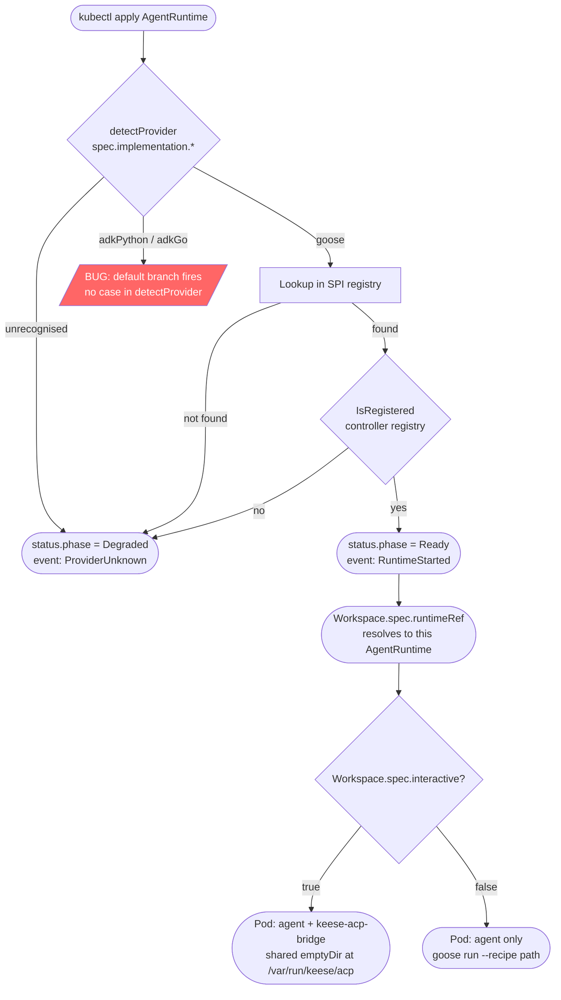
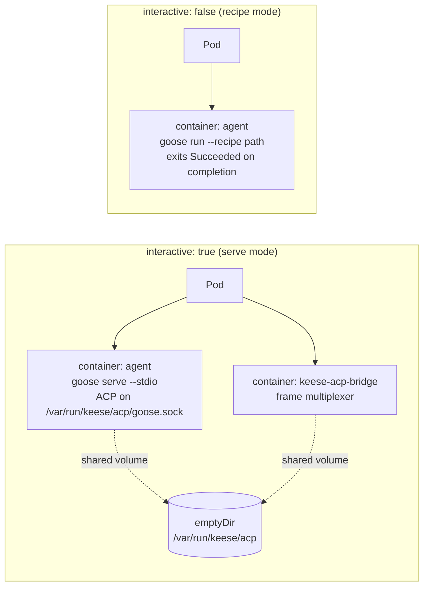

<!-- SPDX-License-Identifier: Apache-2.0 -->
<!-- Copyright (c) 2026 keese-ai -->

# Configure an agent runtime

`AgentRuntime` is a cluster-scoped CRD that registers a runtime provider with the
keese operator — think of it as a versioned, policy-carrying pod template that
`Workspace` objects reference by name.

!!! info "Audience"
    Agent developers and platform operators who need to register a runtime, set
    image versions, tune migration policy, and understand how a `Workspace`
    bootstraps from that runtime.
    **Prerequisites:** [Bootstrap a local cluster (kind + Tilt)](bootstrap-local.md) ·
    [Create a workspace & attach a session](workspace-session.md)

---

## How the operator selects and boots a runtime

When you create or update an `AgentRuntime`, the controller inspects
`spec.implementation` to detect the provider name, looks it up in the in-process
provider registry (populated by `init()` calls at operator startup), and
transitions the CR to `Ready` if the provider is registered.



!!! warning "adkPython and adkGo — planned, not usable today"
    The `detectProvider` function in
    [`internal/controller/keese/agentruntime_controller.go:182`](https://github.com/keese-ai/keese/blob/main/internal/controller/keese/agentruntime_controller.go#L182)
    handles `goose`, `claudeCode`, and `aider` only. Setting
    `spec.implementation.adkPython` or `spec.implementation.adkGo` causes
    the default branch to fire, which puts the `AgentRuntime` into `Degraded` phase
    with reason `ProviderUnknown`. Both ADK providers are registered in the SPI
    registry (E0 stubs with all capabilities false), but the controller cannot
    reach that check until the `detectProvider` bug is fixed. Use `goose` for
    all current work.

---

## The `AgentRuntime` API

`AgentRuntime` is cluster-scoped (`scope=Cluster`). One cluster may have multiple
`AgentRuntime` objects — for example, different goose image versions for different
tenant classes.

### Printer columns

```bash
kubectl get agentruntimes
# NAME          PHASE   PROVIDER  READY  AGE
# goose-prod    Ready   goose     True   3d
```

### `spec.implementation` — discriminated one-of

Exactly one field under `spec.implementation` must be set. A CEL `XValidation` on the
type enforces this at admission. The table below lists all supported values and their
current status.

| Field | Provider key | Status |
|---|---|---|
| `spec.implementation.goose` | `goose` | **Usable** — see below |
| `spec.implementation.claudeCode` | `claudeCode` | Stub — `IsRegistered` returns true but no pod logic |
| `spec.implementation.aider` | `aider` | Stub — `IsRegistered` returns true but no pod logic |
| `spec.implementation.adkPython` | `adkPython` | **Planned** — `detectProvider` bug causes Degraded |
| `spec.implementation.adkGo` | `adkGo` | **Planned** — `detectProvider` bug causes Degraded |

!!! warning "claudeCode and aider — stubs only"
    `claudeCode` and `aider` return `IsRegistered = true`, so an `AgentRuntime`
    selecting either provider will reach `Ready` phase. However, neither provider
    contains any pod template logic — no agent container will be launched, and any
    `Workspace` referencing such a runtime will produce an empty or non-functional
    pod. **Use `goose` for all current workloads.** These providers are listed for
    forward-compatibility only and must not be used in production until their pod
    templates are implemented.

---

## Defining a goose `AgentRuntime`

### Minimal example

```yaml
apiVersion: keese.ai/v1alpha1
kind: AgentRuntime
metadata:
  name: goose-default
spec:
  implementation:
    goose:
      image: ghcr.io/keese-ai/goose-runtime:1.0.5
```

Apply it and watch it converge:

```bash
kubectl apply -f goose-default.yaml
kubectl get agentruntime goose-default -w
# NAME           PHASE   PROVIDER  READY  AGE
# goose-default  Ready   goose     True   4s
```

### Fully populated example

```yaml
apiVersion: keese.ai/v1alpha1
kind: AgentRuntime
metadata:
  name: goose-prod
spec:
  implementation:
    goose:
      # Production: pin by digest (rule 05.12). Tags only in dev overlays.
      image: ghcr.io/keese-ai/goose-runtime@sha256:abc123...
      imageTag: "1.0.5"    # informational; admission validates against SupportedImageVersions

      migrationPolicy:
        severity: high       # critical|high|medium|low
        maxDeferral: 6h      # operator hard-caps critical at 1h regardless

      sidecars:
        acpBridge:
          image: ""          # empty = operator-embedded default digest (recommended)
```

---

## `spec.implementation.goose` reference

### `image` (required)

OCI reference for the goose runtime image. In production overlays and OLM CSVs this
**must** be digest-pinned — a CEL `XValidation` rule on the `AgentRuntime` CRD rejects
tag-only references in non-dev namespaces (the `adk-runtime-image-digest-pinned` VAP
covers ADK providers specifically; goose provider image-pin is enforced by the CRD
rule). In a local kind cluster a tag is acceptable.

### `imageTag` (optional)

Informational string; the controller validates it against
`internal/runtime/providers/goose/versions.go:SupportedImageVersions`. If the tag is
outside the supported semver range, admission rejects with reason
`ImageVersionUnsupported`.

### `migrationPolicy` (optional)

Controls how urgently a `Workspace` using this runtime must adopt a new image.

| `severity` | Default deferral cap | Notes |
|---|---|---|
| `critical` | 1 h | Hard-capped by controller; CVE-grade urgency |
| `high` | 6 h | Default for most production upgrades |
| `medium` | 24 h | Minor version or config changes |
| `low` | 168 h (7 d) | Non-functional metadata changes |

`maxDeferral` in the CR may shorten the cap; it cannot lengthen `critical` past 1 h.
When a deferral ceiling is breached, the controller force-drains the workspace and
emits a `RuntimeMigrationForceDrained` event.

`Idle` Workspaces hot-swap immediately on spec change. `Running` Workspaces emit
`RuntimeMigrationDeferred` and upgrade on their next drain+resume cycle.

### `sidecars.acpBridge.image` (optional)

Override the ACP bridge sidecar image. Leave empty to use the operator-embedded digest
(the strongly recommended default). Override only when you need to pin a different
bridge version independently of the operator.

The ACP bridge sidecar is injected **only** when `Workspace.spec.interactive: true`
(see pod topology below). Non-interactive, recipe-driven workspaces run a single
`agent` container.

---

## Pod topology

The `Workspace` controller builds the agent pod from the referenced `AgentRuntime`;
the topology depends on `Workspace.spec.interactive`.



Both topologies share the same security posture:

- No kubeconfig, no upstream API keys (rules 05.1, 05.2).
- Identity via projected ServiceAccount token, audience `keese-egress-<tenant>`, TTL ≤ 10 m (rule 05.3).
- `readOnlyRootFilesystem: true`; writes go to the workspace PVC at `/var/run/keese/session/` (rule 05.11).
- Fail-closed `NetworkPolicy`: egress only to the Envoy AI Gateway on 443 (rules 05.4, 05.5, 04.17).

---

## Referencing an `AgentRuntime` from a `Workspace`

```yaml
apiVersion: keese.ai/v1alpha1
kind: Workspace
metadata:
  name: my-workspace
  namespace: tenant-acme
spec:
  runtimeRef:
    name: goose-prod          # must exist as a cluster-scoped AgentRuntime
  tenantRef:
    name: acme
  interactive: false           # immutable after creation
  sessionMode: OnDemand
```

`spec.runtimeRef` is required. The workspace controller resolves it to a registered
provider; if the `AgentRuntime` is `Degraded` or `Incompatible` the workspace
stays `Pending` with condition `RuntimeAvailable: False`.

`spec.interactive` is **immutable after creation** (CEL `XValidation`). Changing the
runtime mode requires creating a new `Workspace` with `spec.resumeFrom` pointing to the
prior workspace's last checkpoint.

---

## `AgentRuntime` status fields

| Field | Meaning |
|---|---|
| `status.phase` | `Pending` · `Ready` · `Degraded` · `Incompatible` |
| `status.provider` | The resolved provider name (e.g. `goose`) |
| `status.observedGeneration` | `.metadata.generation` last reconciled |
| `status.conditions[Ready]` | Standard meta/v1 condition; `True` when provider is registered |

Check conditions for a detailed message:

```bash
kubectl get agentruntime goose-prod -o jsonpath='{.status.conditions}'
```

---

## goose `CapabilityMatrix`

The goose provider registers the following capabilities at compile time
([`internal/runtime/providers/goose/goose.go:53`](https://github.com/keese-ai/keese/blob/main/internal/runtime/providers/goose/goose.go#L53)).
These govern which SPI methods the workspace controller may call.

| Capability | Goose (current) |
|---|---|
| `SupportsACP` | true |
| `SupportsMCP` | true |
| `SupportsRecipes` | true |
| `SupportsInjectPrompt` | true |
| `SupportsResume` | true |
| `SupportsStreaming` | false |
| `SupportsSubAgents` | false |
| `SupportsSubAgentCleanup` | false |
| `SupportsCredentialRotation` | false |

`CleanupSubAgents`, `InvokeSubAgent`, and `StreamEvents` return `ErrUnsupported` today;
sub-agent dispatch (TD-P3-05) will flip those flags.

---

## Finalizer and deletion

The controller adds finalizer `finalizers.agentruntime.keese.ai/drain` on creation.
Deletion is blocked while any `RuntimeExtension` CR still references this
`AgentRuntime`. Once all references are cleared the finalizer is removed and the
resource deletes cleanly.

```bash
# See what is blocking deletion
kubectl get runtimeextensions --all-namespaces \
  -o jsonpath='{range .items[?(@.spec.runtimeRef.name=="goose-prod")]}{.metadata.namespace}/{.metadata.name}{"\n"}{end}'
```

---

## Troubleshooting

| Symptom | Likely cause | Resolution |
|---|---|---|
| `status.phase: Degraded`, reason `ProviderUnknown` | `spec.implementation` has no recognised field set, **or** `adkPython`/`adkGo` selected (detectProvider bug) | Use `goose` or a registered stub provider |
| `status.phase: Incompatible` | `imageTag` outside `SupportedImageVersions` range | Update to a supported image tag |
| Workspace stuck `Pending`, condition `RuntimeAvailable: False` | `AgentRuntime` is `Degraded` or `Incompatible` | Fix the runtime first |
| `RuntimeMigrationDeferred` events accumulating | Running workspace has not drained since image update | Wait for natural drain, or manually trigger drain via `kubectl delete pod` on the session pod |

---

## See also

- [Agent runtimes (SPI)](../concepts/agent-runtimes.md) — conceptual model, capability matrix, lifecycle
- [Workspaces & sessions](../concepts/workspaces.md) — how a Workspace drives the pod lifecycle
- [Create a workspace & attach a session](workspace-session.md) — step-by-step guide
- [Configure egress credentials](egress-credentials.md) — wire upstream model credentials for the gateway
