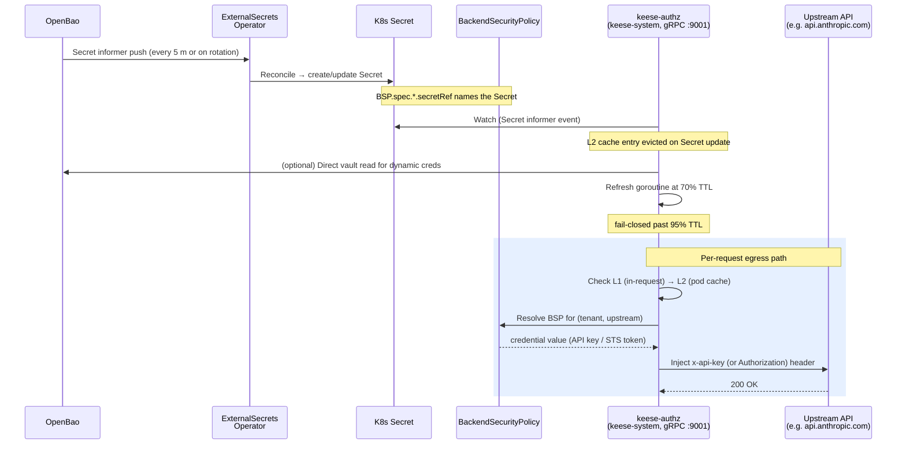
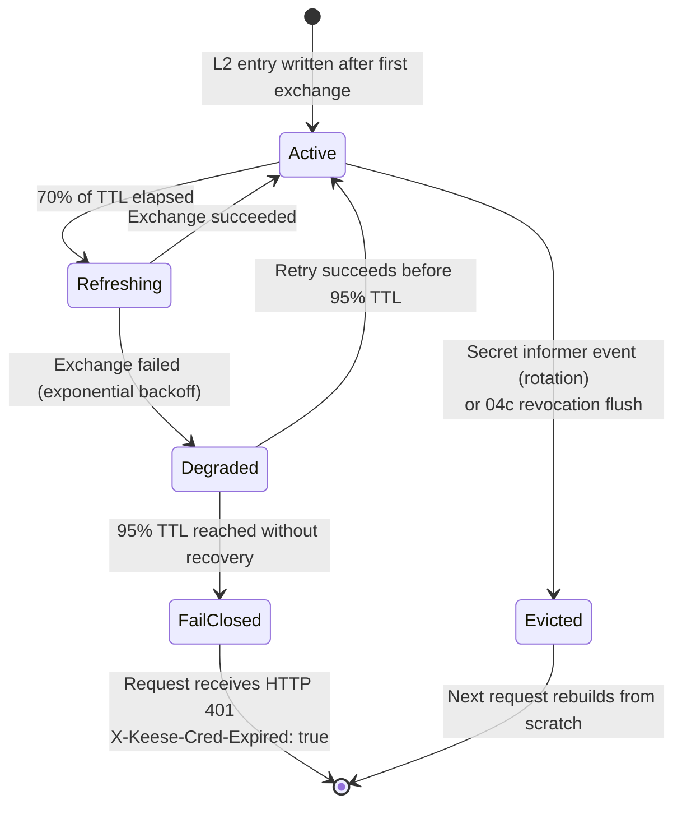

<!-- SPDX-License-Identifier: Apache-2.0 -->
<!-- Copyright (c) 2026 keese-ai -->

# Configure egress credentials

Wire an upstream LLM or tool into keese by storing its credential in OpenBao, bridging it to a Kubernetes Secret via ExternalSecrets, and attaching it to a `BackendSecurityPolicy` that the Envoy AI Gateway uses to inject the right header on every egress request.

!!! info "Audience"
    Platform operators provisioning upstream providers for one or more tenants.
    **Prerequisites:** [Bootstrap a local cluster](bootstrap-local.md) · [Provision a tenant](provision-tenant.md) · [Concepts: Credential broker](../concepts/credential-broker.md) · [Concepts: Egress & the AI Gateway](../concepts/egress-ai-gateway.md)

---

## How credential injection works

Agent pods carry **no upstream credentials whatsoever** — only a short-lived projected ServiceAccount token (audience `keese-egress-<tenant>`, TTL ≤ 10 m). When the agent makes an outbound LLM call, the request travels to the in-cluster Envoy AI Gateway. Envoy calls the `keese-authz` standalone Deployment (in `keese-system`, reachable at `keese-authz.keese-system.svc:9001`) via gRPC ext_authz. `keese-authz`:

1. Validates the SA token.
2. Calls OpenFGA to check `credential:C#can_use@service_account:SA` (and `tool#can_call`). Both must pass; either failure → 403.
3. Selects the matching `BackendSecurityPolicy` (BSP) for the upstream.
4. Injects the upstream credential (API key, STS-exchanged AWS creds, etc.) into the outbound request headers.
5. Forwards to the upstream over TLS.

The credential broker ([design 17](https://github.com/keese-ai/keese/blob/main/docs/designs/17-credential-broker.md)) maintains a per-pod L2 cache keyed by `(tenant-audience, upstream-role)`, refreshing proactively at 70% of TTL and failing closed past 95%.



---

## BSP precedence

The gateway resolves credentials in this order — first match wins:

1. **Workspace-scoped BSP** — referenced by `Workspace.spec.backendPolicyRefs[]`. Highest privilege; set by a workspace admin.
2. **Tenant default** — BSPs referenced by `Tenant.spec.credentialPoolRef`, resolved by the credential broker.
3. **Cluster default** — operator-managed BSPs in `keese-system`. Requires `keese.ai/allow-cluster-credential=true` on the target namespace. Not recommended for production.
4. **No match → deny** — ext_authz returns 403 `{"error":"NoBackendCredential","upstream":"<host>"}`. There is no implicit allow.

---

## Provider stacks

| Provider | Auth type | Status |
|---|---|---|
| Anthropic (`api.anthropic.com`) | Static API key (`x-api-key`) | Live — `AnthropicAPIKey` BSP type |
| AWS Bedrock | OIDC-STS (`AssumeRoleWithWebIdentity`) | Stub — manifests exist; IAM prerequisites required |
| Google Vertex AI | GCP Workload Identity Federation | Stub — design only |
| Azure OpenAI | Azure Entra OIDC federated credential | Stub — design only |

!!! warning "Planned — not yet implemented"
    AWS Bedrock, Vertex AI, and Azure OpenAI stacks exist as bootstrap YAML stubs.
    The Envoy AI Gateway extProc `AWSCredentials` BSP type is wired in the Bedrock
    manifest but the end-to-end OIDC-STS exchange and the GCP/Azure equivalents
    have not been validated against a live cluster. Do not use them in production.

---

## Wiring Anthropic (live)

This is the only fully validated provider stack. It uses AI Gateway v0.4's native `AnthropicAPIKey` BSP type, which injects `x-api-key` directly — no Lua header rewrite needed.

!!! note "Historical context — Lua filter removed"
    Earlier builds (v0.2.x) used an `EnvoyExtensionPolicy` Lua filter to copy
    `Authorization: Bearer <key>` → `x-api-key` because the v0.2 BSP only supported
    the OpenAI-style Authorization header.  v0.4 added a native `AnthropicAPIKey` type
    that injects `x-api-key` via extProc.  The Lua filter has been removed — keeping it
    alongside the v0.4 BSP would shadow extProc and cause 401 errors from Anthropic.

### Step 1 — Store the key in OpenBao

```bash
# Authenticate to the in-cluster OpenBao instance first.
# In local kind: bao login -method=kubernetes role=keese-bootstrap
bao kv put -mount=keese \
  tenants/tenant-a/anthropic \
  api_key=$ANTHROPIC_API_KEY
```

OpenBao path: `keese/tenants/<tenant>/anthropic`, field: `api_key`.

### Step 2 — Apply the bootstrap stack

The full stack lives at
[`dev/bootstrap/aigateway/anthropic-llm-stack.yaml`](https://github.com/keese-ai/keese/blob/main/dev/bootstrap/aigateway/anthropic-llm-stack.yaml).
It creates nine resources in `keese-system`:

| Resource | Kind | Purpose |
|---|---|---|
| `anthropic-api-key` | `ExternalSecret` | Pulls `api_key` from OpenBao every 5 m into a K8s Secret |
| `keese-aigateway` | `Gateway` | TLS listener on 443; accepts egress from all namespaces |
| `keese-aigw-selfsigned` | `Issuer` | Self-signed cert-manager Issuer used to sign the gateway serving cert |
| `aigw-server-tls` | `Certificate` | Serving cert (self-signed for dev; swap for a real issuer in prod) |
| `anthropic` | `Backend` | FQDN endpoint pointing at `api.anthropic.com:443` |
| `anthropic-tls` | `BackendTLSPolicy` | Upstream TLS validation using `public-ca-bundle` ConfigMap |
| `anthropic` | `AIServiceBackend` | Wraps the Backend; declares `schema: Anthropic` |
| `anthropic-bsp` | `BackendSecurityPolicy` | Injects `x-api-key` from the synced Secret |
| `anthropic` | `AIGatewayRoute` | Routes `x-ai-eg-model: claude-*` headers to this backend |

```bash
kubectl apply -f dev/bootstrap/aigateway/anthropic-llm-stack.yaml
```

Wait for the ExternalSecret to sync:

```bash
kubectl -n keese-system get externalsecret anthropic-api-key
# NAME                STORE          REFRESH INTERVAL   STATUS   READY
# anthropic-api-key   keese-openbao  5m                 SecretSynced  True
```

### Step 3 — Verify BSP is ready

```bash
kubectl -n keese-system get backendSecurityPolicy anthropic-bsp -o jsonpath='{.status.conditions}'
```

`Ready=True` confirms the gateway has picked up the credential. A `MissingReferenceGrant` condition means the `keese-credentials` namespace lacks a `ReferenceGrant` to the gateway namespace — create one or ensure the ExternalSecret target is in `keese-system`.

### Step 4 — Confirm model routing

The `AIGatewayRoute` matches on `x-ai-eg-model` header values:

```yaml
matches:
  - headers:
      - name: x-ai-eg-model
        value: claude-opus-4-7
        type: Exact
  - headers:
      - name: x-ai-eg-model
        value: claude-sonnet-4-6
        type: Exact
  - headers:
      - name: x-ai-eg-model
        value: claude-haiku-4-5
        type: Exact
```

Agent runtimes set this header automatically when selecting a model. To add more Claude models, patch the `AIGatewayRoute` with additional match entries.

---

## Wiring AWS Bedrock (stub)

!!! warning "Planned — not yet implemented"
    The manifest at
    [`dev/bootstrap/aigateway/aws-bedrock-stack.yaml`](https://github.com/keese-ai/keese/blob/main/dev/bootstrap/aigateway/aws-bedrock-stack.yaml)
    is present but not activated by default.  The `AWSCredentials` BSP type (OIDC-STS)
    is wired; the end-to-end flow has not been validated.  Treat this as a template.

The Bedrock stack uses OIDC-STS — no static AWS keys are stored anywhere. The gateway calls `sts:AssumeRoleWithWebIdentity` on each request (subject to L2 caching), using the agent's projected SA token.

Prerequisites before applying:

1. An IAM role with a trust policy constraining `aud=keese-egress-<tenant>` and `sub=system:serviceaccount:<ns>:<sa>` (see [design 04b-ii](https://github.com/keese-ai/keese/blob/main/docs/designs/04b-ii-oidc-trust.md)).
2. OpenBao path `keese/tenants/<tenant>/credentials/bedrock` populated with `role_arn` and `region`.

```bash
# Populate OpenBao
bao kv put -mount=keese \
  tenants/demo-tenant/credentials/bedrock \
  role_arn=arn:aws:iam::<account>:role/keese-<tenant>-bedrock \
  region=us-east-1

# Uncomment in dev/bootstrap/aigateway/kustomization.yaml, then:
kubectl apply -f dev/bootstrap/aigateway/aws-bedrock-stack.yaml
```

The `BackendSecurityPolicy` for Bedrock:

```yaml
apiVersion: aigateway.envoyproxy.io/v1alpha1
kind: BackendSecurityPolicy
metadata:
  name: aws-bedrock-bsp
  namespace: keese-system
spec:
  type: AWSCredentials
  awsCredentials:
    region: us-east-1
    credentialsFile:
      secretRef:
        name: bedrock-credentials   # synced by ExternalSecret
  targetRefs:
    - group: aigateway.envoyproxy.io
      kind: AIServiceBackend
      name: aws-bedrock
```

---

## Credential rotation and caching



Key properties:

- **Drain-safe rotation**: the broker does not revoke an old credential until `max(remaining_old_TTL, 0.70 × new_TTL)` has elapsed. In-flight requests complete with the old key; new requests pick up the refreshed one.
- **Fail-closed at 95% TTL**: if a background refresh fails continuously, the gateway returns `HTTP 401` with `X-Keese-Cred-Expired: true` rather than serving a potentially expired credential.
- **Revocation flush**: a NATS KV push (design 04c) atomically evicts all L2 entries for a workspace within < 1 s across all gateway pods.

Force a cache flush without restarting the gateway:

```bash
kubectl -n keese-system annotate backendSecurityPolicy anthropic-bsp \
  keese.ai/flush-all-credentials=$(date +%s%3N)
```

---

## Failure modes and remediation

| Symptom | Likely cause | Remediation |
|---|---|---|
| `403 NoBackendCredential` | No BSP matches `(tenant, upstream)` | Check BSP `targetRefs`; verify `Workspace.spec.backendPolicyRefs` |
| BSP `Ready=False` + `MissingReferenceGrant` event | ExternalSecret target namespace ≠ gateway namespace without a `ReferenceGrant` | Create `ReferenceGrant` or move ExternalSecret target to `keese-system` |
| ExternalSecret `SecretSyncError` | OpenBao unreachable or path missing | Confirm `bao kv get` returns the expected path; check `ClusterSecretStore` |
| `401 X-Keese-Cred-Expired: true` | Broker failed to refresh before 95% TTL | Check OpenBao availability; force ESO sync: `kubectl annotate externalsecret anthropic-api-key force-sync=$(date +%s%3N) -n keese-system` |
| `401 "x-api-key header is required"` from Anthropic | Lua `EnvoyExtensionPolicy` shadowing the v0.4 BSP extProc | Remove any `EnvoyExtensionPolicy` named `anthropic-header-rewrite` |
| `filter_chain_not_found` TLS error | Gateway listener hostname mismatch | Check cert SANs cover both the cluster Service name and any ExternalName alias |

---

## Security invariants

- **No upstream keys in agent pods.** Rule 05.2 — enforced by NetworkPolicy and the absence of any `env`/`envFrom` referencing upstream secrets on agent pod specs.
- **Secrets as projected files, never env vars.** Rule 05.7 — `envFrom.secretRef` is forbidden on all keese-managed pods.
- **Fail-closed.** Missing BSP, expired credential, or revoked workspace all result in denial. There is no implicit allow.
- **Production contexts blocked.** `kubectl` calls targeting `prod-*` / `*production*` contexts are denied in `.claude/settings.json`. Use OLM + CI for production credential rollout.

---

## See also

- [Concepts: Credential broker](../concepts/credential-broker.md) — three-tier cache, 70%/95% TTL semantics, pool state machine
- [Concepts: Egress & the AI Gateway](../concepts/egress-ai-gateway.md) — ext_authz flow, BSP attachment, OpenFGA integration
- [Concepts: Identity & zero-trust](../concepts/identity-zero-trust.md) — why agent pods carry no credentials
- [Guide: Configure an agent runtime](configure-runtime.md) — how the runtime selects a model and emits `x-ai-eg-model`
