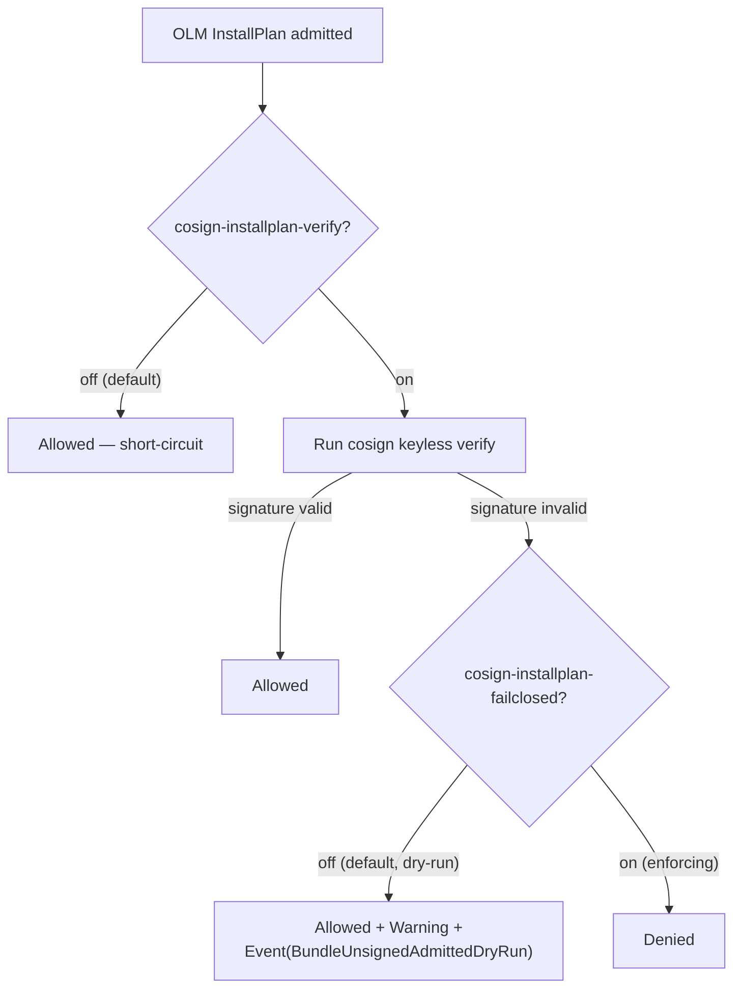

<!-- SPDX-License-Identifier: Apache-2.0 -->
<!-- Copyright (c) 2026 keese-ai -->

# Toggle feature gates

keese ships opinionated runtime behaviours — cosign supply-chain
verification, ext_authz enforcement, OTEL export, recipe signing — behind
named, staged feature gates so you can flip them per-cluster without
rebuilding images.

!!! info "Audience"
    Cluster operators managing a keese installation.
    **Prerequisites:** [Install via OLM](install-olm.md) · `kubectl` configured
    against the target cluster · `jq` on `PATH`.

---

## How feature gates work

Every gate is a `FeatureGate` cluster-scoped custom resource in the
`policy.keese.ai/v1alpha1` API group.  The `FeatureGateController` watches
these CRs and projects the resolved `{name → bool}` map into a single
`keese-system/keese-features` ConfigMap under the key `gates.json`.  Every
keese binary mounts that ConfigMap as a projected volume at
`/etc/keese/features/gates.json`, watches it with `fsnotify`, and hot-reloads
an `atomic.Value[map[string]bool]` behind an
[OpenFeature Go SDK](https://openfeature.dev) in-process provider.  Reads are
lock-free; propagation from CR patch to binary observation typically takes
under two seconds.

```mermaid
sequenceDiagram
    actor Operator
    participant CR as FeatureGate CR<br/>(policy.keese.ai)
    participant Ctrl as FeatureGateController
    participant CM as ConfigMap<br/>keese-system/keese-features
    participant Vol as Projected volume<br/>/etc/keese/features/gates.json
    participant Gates as Gates.Enabled()<br/>(atomic load)

    Operator->>CR: kubectl patch spec.override=true
    CR-->>Ctrl: Generation+1 reconcile event
    Ctrl->>Ctrl: effective = override ?? defaultFor(stage)
    Ctrl->>CM: SSA patch gates.json {name:bool,...}
    Ctrl->>CR: status.effective, lastTransitionTime
    CM-->>Vol: kubelet re-projects volume (symlink swap)
    Vol-->>Gates: fsnotify CREATE/RENAME → debounce 500ms → loadOnce()
    Gates-->>Gates: applySnapshot() → atomic.Store(merged map)
    Note over Gates: All subsequent Enabled() calls<br/>see the new value; no pod restart needed.
    Ctrl-->>Operator: Event(Reason=FeatureGateTransition, gate=…, from=…, to=…)
```

### Stage semantics

| Stage | Default | Constraint |
|---|---|---|
| `alpha` | **off** | May change or be removed; no upgrade compat guarantee |
| `beta` | **on** | Stable shape; backwards-compatible flips allowed |
| `ga` | unconditional | Code path has no guard; CR is kept for one minor release at `deprecated` |
| `deprecated` | frozen (reads emit `Warning` event) | CR and const removed next minor release |

`spec.override` is forbidden on `ga` and `deprecated` gates — the API server
rejects the write via a CEL `XValidation` on the CRD
([`api/policy/v1alpha1/featuregate_types.go:28`](https://github.com/keese-ai/keese/blob/main/api/policy/v1alpha1/featuregate_types.go#L28)).

---

## Listing current gates

```bash
make featuregate-list
```

Expected output (truncated):

```
NAME                                 STAGE        DEFAULT   OVERRIDE  EFFECTIVE RESTART OWNERS
cosign-installplan-verify            alpha        false     —         false     false   keese-cosign-webhook
cosign-installplan-failclosed        alpha        false     —         false     false   keese-cosign-webhook
```

Column reference:

| Column | Source |
|---|---|
| `NAME` | `metadata.name` of the FeatureGate CR |
| `STAGE` | `spec.stage` |
| `DEFAULT` | stage-derived: `alpha` → false, `beta`/`ga` → true |
| `OVERRIDE` | `spec.override` (null shown as `—`) |
| `EFFECTIVE` | `status.effective` — the value currently projected into gates.json |
| `RESTART` | `spec.restartRequired` — whether a pod restart is needed for the flip to take effect |
| `OWNERS` | `spec.owners` — which binaries consume this gate |

For JSON output (useful for scripting):

```bash
make featuregate-list -- --json | jq '.items[] | {name:.metadata.name, effective:.status.effective}'
```

Or query the CRD directly:

```bash
kubectl get featuregates.policy.keese.ai -o wide
```

---

## Diffing a candidate seed

Before applying a new or modified gate manifest to the cluster, validate it
with a server-side diff:

```bash
make featuregate-diff NEW=config/featuregates/cosign-installplan-verify.yaml
```

Under the hood this runs `kubectl diff -f <file>`, which performs a dry-run
server-side apply and shows what would change.  Use this before any
`kubectl patch` or `kubectl apply` against a gate CR to confirm the delta is
what you expect.

---

## Patching an alpha gate override

Alpha gates default to **off**.  To enable one on a running cluster, patch
`spec.override`:

```bash
kubectl patch featuregate cosign-installplan-verify \
  --type=merge \
  --patch='{"spec":{"override":true}}'
```

To revert to the stage default (remove the override):

```bash
kubectl patch featuregate cosign-installplan-verify \
  --type=json \
  --patch='[{"op":"remove","path":"/spec/override"}]'
```

Verify the projection converged:

```bash
kubectl get featuregate cosign-installplan-verify \
  -o jsonpath='{.status.effective}'
# true
```

The controller updates `status.effective` after the reconcile.  If it stays
stale after 30 seconds, check
[drift alerts](#observability-drift-detection) below.

---

## Understanding `restartRequired`

Most gate flips propagate without a pod restart because the binary watches the
projected volume and reloads the in-memory map atomically.  However, some
behaviours cannot change mid-process (webhook re-registration, leader election
config, listener port selection).  Those gates set `spec.restartRequired:
true`.

When the controller detects that a gate with `restartRequired: true`
transitions its effective value, it:

1. Sets the `RestartRequired` condition to `True` on the FeatureGate status.
2. Emits a Kubernetes `Event` with `reason: RestartRequired` on the FeatureGate
   object.
3. Increments the `keese_featuregate_restart_required_pending` counter (metric is **planned — not yet emitted** in this alpha build).

**It does not auto-restart the affected pods.** Per signal-handling rule 06,
process lifecycle is under operator control; keese never evicts pods on your
behalf.

To action the restart:

```bash
# Roll the deployment whose binary owns the gate
kubectl rollout restart deployment -n keese-system keese-cosign-webhook
```

After the rollout completes, confirm the pending condition clears:

```bash
kubectl get featuregate cosign-installplan-verify \
  -o jsonpath='{.status.conditions[?(@.type=="RestartRequired")].status}'
# False
```

---

## Worked example: the cosign verification gates

The two cosign gates shipped with keese illustrate a graduated rollout
pattern — log-only first, then enforcing.

### Gate catalog

| Gate | Stage | Default | `restartRequired` |
|---|---|---|---|
| `cosign-installplan-verify` | alpha | off | no |
| `cosign-installplan-failclosed` | alpha | off | no |

Seed CRs live at
[`config/featuregates/cosign-installplan-verify.yaml`](https://github.com/keese-ai/keese/blob/main/config/featuregates/cosign-installplan-verify.yaml)
and
[`config/featuregates/cosign-installplan-failclosed.yaml`](https://github.com/keese-ai/keese/blob/main/config/featuregates/cosign-installplan-failclosed.yaml).

### How the gates interact



### Step 1 — log-only mode

Enable verification but leave `failclosed` off.  Unsigned images are admitted
with a warning so you can audit your environment without blocking installs.

```bash
kubectl patch featuregate cosign-installplan-verify \
  --type=merge --patch='{"spec":{"override":true}}'
```

Watch for dry-run events:

```bash
kubectl get events -n keese-system \
  --field-selector reason=BundleUnsignedAdmittedDryRun
```

### Step 2 — enforcing mode

Once you are confident all images in your OLM catalog carry valid cosign
signatures, flip `failclosed`:

```bash
kubectl patch featuregate cosign-installplan-failclosed \
  --type=merge --patch='{"spec":{"override":true}}'
```

From this point on, any OLM InstallPlan referencing an unsigned keese image
is **denied** at admission.

!!! warning "Air-gapped clusters"
    If your cluster cannot reach the public Sigstore TUF mirror
    (`tuf.sigstore.dev`), cosign verification will fail for every image.
    Either configure an internal Sigstore mirror or leave
    `cosign-installplan-verify` off until the mirror is in place.

!!! warning "Planned — not yet implemented"
    The `FeatureGateController` reconciler is scaffolded; the cosign
    ValidatingWebhook binary (`keese-cosign-webhook`) is in active
    development.  The gates exist and the projection pipeline is
    implemented, but end-to-end enforcement is not yet wired in this
    alpha build.

---

## Observability & drift detection

The feature gate subsystem exposes two Prometheus metrics:

| Metric | Labels | Description |
|---|---|---|
| `keese_featuregate_eval_total` | `gate`, `value`, `binary` | Counter — every call to `Enabled()` |
| `keese_featuregate_state` | `gate` | Gauge — current effective value (0=off, 1=on) |

!!! note "Planned metric: drift histogram"
    `keese_featuregate_drift_seconds` (lag from CR Generation change to binary observation)
    is **planned — not yet emitted** in this alpha build.

**Checking for projection drift.**  Because the drift histogram is not yet emitted,
use the following interim check to confirm a gate value has propagated:

```bash
# Compare status.effective against the value inside the projected ConfigMap
kubectl get featuregate cosign-installplan-verify \
  -o jsonpath='{.status.effective}'
kubectl get configmap -n keese-system keese-features \
  -o jsonpath='{.data.gates\.json}' | jq '."cosign-installplan-verify"'
```

If these differ after 30 seconds, force a re-reconcile:

```bash
kubectl annotate featuregate cosign-installplan-verify \
  keese.ai/poke="$(date --iso-8601=seconds)" --overwrite
```

To confirm a binary is reading a gate (rolling consumer window):

```bash
kubectl get featuregate cosign-installplan-verify \
  -o jsonpath='{.status.consumers}'
# ["keese-cosign-webhook"]
```

---

## Failure modes and recovery

| Failure | Detection | Recovery |
|---|---|---|
| CM projection lags > 30s | Manual comparison of `status.effective` vs ConfigMap (see above) | Annotate gate CR to force re-reconcile (above) |
| Operator down — no new projections | Consumers serve last-good from memory; alert on CM age | Restart operator pod; consumers continue on stale but safe values |
| Consumer pod missing volume mount | Pod stays `NotReady`; gates fall back to stage default | Fix Deployment volume spec; roll pod |
| `override` set on `ga`/`deprecated` gate | CRD XValidation rejects immediately | Remove the `override` field |

---

## See also

- [concepts/feature-gates.md](../concepts/feature-gates.md) — how the gate pipeline works end-to-end
- [reference/feature-gate-catalog.md](../reference/feature-gate-catalog.md) — all gate IDs, stages, and owners
- [guides/observability-setup.md](observability-setup.md) — configure Prometheus scraping for gate metrics
- [reference/api/policy.md](../reference/api/policy.md) — `FeatureGate` CRD field reference
