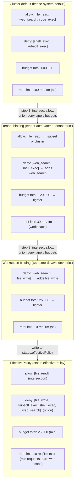

<!-- SPDX-License-Identifier: Apache-2.0 -->
<!-- Copyright (c) 2026 keese-ai -->

# Define guardrails

A `GuardrailBinding` composes MCP tool allow/deny lists, token budgets, rate limits, Kyverno policy references, and recipe hooks into a single object that enforces a **strictest-wins** merge across Cluster, Tenant, and Workspace scopes.

!!! info "Audience"
    Tenant-admins configuring workspace-level guardrails · **Prerequisites:** [Tenancy & namespaces](../concepts/tenancy.md) · [Guardrails concept](../concepts/guardrails.md) · a cluster with keese installed and at least one Tenant provisioned (see [Provision a tenant](provision-tenant.md))

## How the merge lattice works

Every workspace receives an `EffectivePolicy` computed by merging up to three bindings in order from broadest to narrowest:

1. **Cluster default** (`keese-system/default`) — installed automatically by the operator; sets the platform-wide ceiling.
2. **Tenant binding** — created by a tenant-admin in the tenant namespace; may only tighten, never loosen.
3. **Workspace binding** — created by a workspace-admin in the workspace namespace; may only tighten further.

The merge rules are implemented in [`internal/controller/authz/guardrail_merge.go`](https://github.com/keese-ai/keese/blob/main/internal/controller/authz/guardrail_merge.go):

| Field | Merge rule |
|---|---|
| `tools.allow` | **Intersection** — only tools present in every binding are allowed |
| `tools.deny` | **Union** — a tool denied in any binding is denied everywhere |
| `tokenBudget.{input,output,total}` | **min()** across all bindings; `0` means "no limit" and does not tighten |
| `rateLimit.requests` | **min(requests)** per `(window, scope)` tuple; narrower scope wins on tie |
| `recipeHooks[]` | **Union** — hooks from all bindings run |
| `kyverno[].policyRef` | **Union** — all named Kyverno ClusterPolicies apply |

The computed result lands in `status.effectivePolicy`. The `keese-authz` ext_authz service reads **only** this field — never raw `spec` fields.

### Merge lattice: worked example

The flowchart below traces a concrete three-binding merge for a workspace in the `tenant-acme` tenant.



## Role model

Three RBAC roles govern who can create bindings at each scope tier:

| Role | Can write in | Restriction |
|---|---|---|
| `keese-guardrail-cluster-admin` | `keese-system` | Creates/updates the `default` binding |
| `keese-tenant-admin` | tenant namespace | May only tighten the cluster default |
| `keese-workspace-admin` | workspace namespace | May only tighten tenant + cluster defaults |

Tenant-admins may **read** the `default` binding (`keese-system/default`) but cannot write it. A `ClusterRoleBinding` scoped to `system:serviceaccounts:<tenant-ns>` is provisioned automatically per `Tenant` CR.

## Step 1 — understand the cluster default

Before creating any binding, inspect the cluster default to know the platform-wide ceiling:

```bash
kubectl get guardrailbinding default -n keese-system -o yaml
```

Pay attention to `spec.tools.allow` (if set) and `spec.tokenBudget.total`. Your tenant and workspace bindings cannot exceed these values.

## Step 2 — create a tenant-scope binding

The tenant binding lives in your tenant namespace and references the cluster default via `spec.inherit`.

```yaml
# tenant-acme/acme-tenant-policy.yaml
apiVersion: authz.keese.ai/v1alpha1
kind: GuardrailBinding
metadata:
  name: acme-tenant-policy
  namespace: tenant-acme
  labels:
    keese.ai/binding-scope: tenant
spec:
  inherit:
    - name: default
      namespace: keese-system
  tools:
    deny: [web_search]      # adds to parent deny — tightens only
  tokenBudget:
    total: 200000           # tighter than cluster default of 600 000
```

Apply it:

```bash
kubectl apply -f tenant-acme/acme-tenant-policy.yaml
```

Wait for the binding to reach `Ready`:

```bash
kubectl wait guardrailbinding acme-tenant-policy \
  -n tenant-acme \
  --for=condition=Ready \
  --timeout=30s
```

!!! warning "Planned — not yet implemented"
    A ValidatingAdmissionPolicy (VAP) to enforce strictest-wins at admission is planned but not yet shipped. Currently, widening is caught by the controller after the fact and reflected in status conditions (`MergeConflict` event). The five VAPs in `config/vap/` cover other invariants (image-digest pinning, break-glass annotation, embedding-dim immutability, regional-sensitivity, SQLite single-consumer). When the guardrail admission VAP ships, the rejection reason will be `WeakenRejected`.

## Step 3 — create a workspace-scope binding

The workspace binding lives in the workspace namespace and inherits from the tenant binding.

```yaml
# ws-acme-dev/ws-dev-policy.yaml
apiVersion: authz.keese.ai/v1alpha1
kind: GuardrailBinding
metadata:
  name: ws-dev-policy
  namespace: ws-acme-dev
  labels:
    keese.ai/binding-scope: workspace
spec:
  inherit:
    - name: acme-tenant-policy
      namespace: tenant-acme
  tools:
    deny: [file_write]      # adds file_write on top of tenant deny — valid
    rateLimit:
      requests: 10
      window: "1m"
      scope: sa             # per-service-account — narrowest scope
  tokenBudget:
    total: 50000            # tighter than tenant — valid
```

```bash
kubectl apply -f ws-acme-dev/ws-dev-policy.yaml
```

### Full workspace binding with Envoy projection

To push the effective policy to an Envoy `SecurityPolicy`, add `spec.envoy.securityPolicyRef`:

```yaml
apiVersion: authz.keese.ai/v1alpha1
kind: GuardrailBinding
metadata:
  name: ws-dev-strict
  namespace: ws-acme-dev
  labels:
    keese.ai/binding-scope: workspace
spec:
  inherit:
    - name: acme-tenant-strict
      namespace: tenant-acme
  tools:
    deny: [web_search, file_write]
    rateLimit:
      requests: 10
      window: "1m"
      scope: sa
  envoy:
    securityPolicyRef:
      name: ws-dev-egress-policy
      namespace: keese-gateway
  tokenBudget:
    input: 20000
    output: 5000
    total: 25000
```

The guardrail controller SSA-applies the referenced `SecurityPolicy` using `fieldOwner: keese-guardrailbinding-controller`. If the `SecurityPolicy` does not exist yet, the controller creates it; if it already exists, only the fields owned by the controller are updated.

## Step 4 — read the EffectivePolicy

Once the workspace binding reaches `Ready`, the computed merged policy is in `status.effectivePolicy`:

```bash
kubectl get guardrailbinding ws-dev-policy \
  -n ws-acme-dev \
  -o jsonpath='{.status.effectivePolicy}' | jq .
```

Expected output (for the minimal workspace example above inheriting `acme-tenant-policy`):

```json
{
  "tools": {
    "deny": ["file_write", "kubectl_exec", "shell_exec", "web_search"],
    "rateLimit": {
      "requests": 10,
      "window": "1m",
      "scope": "sa"
    }
  },
  "tokenBudget": {
    "input": 0,
    "output": 0,
    "total": 50000
  },
  "observedGeneration": 1
}
```

Fields with value `0` mean "no limit set at this level" — the effective total is the tightest non-zero value across all bindings. The `observedGeneration` field is used by the TOCTOU VAP guard to reject reads of stale status.

## Adding recipe hooks

Recipe hooks fire before or after every MCP tool call, or on error. They must reference an in-cluster `Service` — direct URLs are rejected by a CRD `XValidation` CEL rule (zero-trust rule 05.4; no separate VAP).

```yaml
spec:
  recipeHooks:
    - event: beforeToolCall
      serviceRef:
        name: audit-webhook
        namespace: keese-guardrail-hooks
        port: 8443
        path: /before-tool-call
    - event: onError
      serviceRef:
        name: pagerduty-proxy
        namespace: tenant-acme-infra
        port: 8443
        path: /alert
```

!!! note "Hook union semantics"
    Hooks are unioned across the scope chain. If the cluster default defines a `beforeToolCall` hook and the workspace binding defines an `onError` hook, **both** run. You cannot suppress a hook defined at a broader scope from a narrower binding.

!!! warning "External targets require an in-cluster proxy"
    To call an external service (PagerDuty, Slack, etc.) from a hook, create an in-cluster proxy `Service` that routes through the Envoy AI Gateway. Direct external URLs in `serviceRef` are invalid — the `port` field accepts only in-cluster `Service` ports.

## Kyverno policy composition

List Kyverno `ClusterPolicy` names in `spec.kyverno[].policyRef`. The guardrail controller does not create these policies — you must install them separately. If a referenced policy is absent, the binding enters `Degraded` with event `PolicyRefNotFound`; the workspace is still allowed to run but the policy is skipped.

```yaml
spec:
  kyverno:
    - policyRef: acme-data-residency
    - policyRef: acme-pii-filter
```

## Observability

### Status conditions

```bash
kubectl get guardrailbinding ws-dev-policy -n ws-acme-dev \
  -o jsonpath='{.status.conditions}' | jq .
```

Two conditions are tracked:

| Condition | Meaning |
|---|---|
| `Ready` | Effective policy computed and written to status |
| `ParentReadable` | All `spec.inherit[]` parent bindings are readable by the controller |

### Metrics

!!! warning "Planned — not yet implemented"
    The guardrail controller does not yet register Prometheus metrics. Metrics (e.g., `keese_guardrail_reconcile_duration_seconds`, `merge_errors_total`, `stale_parent_rejections_total`) are planned for a future iteration. To monitor guardrail health today, use status conditions and controller events (see below).

### Events

Notable events emitted on the `GuardrailBinding` object:

| Reason | When |
|---|---|
| `DefaultBindingReadForbidden` | Controller cannot read `keese-system/default` |
| `MergeConflict` | A binding attempts to widen the parent policy (caught controller-side; no admission VAP exists yet) |
| `WeakenRejected` | Planned: a guardrail admission VAP will block an admission that would loosen a parent constraint (not yet shipped — see `config/vap/` which ships 5 unrelated VAPs) |
| `PolicyRefNotFound` | A `spec.kyverno[].policyRef` names a non-existent ClusterPolicy |

## Failure modes

| Condition | Behavior | Recovery |
|---|---|---|
| Default binding missing | Workspace enters `Degraded`, event `DefaultBindingReadForbidden` | Re-apply `config/manager/default-guardrailbinding.yaml` |
| `StaleParentStatus` rejections spike | CRD XValidation returns 422; callers retry; controller catches up within one reconcile (~100–500 ms) | Check controller events and `Ready` condition transitions |
| Referenced Kyverno policy absent | Binding `Degraded`, event `PolicyRefNotFound`; workspace runs but policy skipped | Create missing `ClusterPolicy` |
| Reconcile Lease not released (crash) | Lease expires (30 s TTL); next leader re-acquires | Automatic; check controller status conditions and logs |

## Dry-run testing

Before applying changes to a live cluster, run the merge-lattice unit tests directly against the controller package:

```bash
go test ./internal/controller/authz/... -run TestMerge -v
```

## See also

- [Guardrails concept](../concepts/guardrails.md) — architectural overview and threat model
- [Authorization (ReBAC / OpenFGA)](../concepts/authorization-rebac.md) — how `tool#allowed_in@workspace` tuples are written
- [Set token budgets](token-budgets.md) — dedicated guide for the `TokenBudget` side of the policy
- [Configure egress credentials](egress-credentials.md) — how the Envoy SecurityPolicy projection interacts with credential injection
