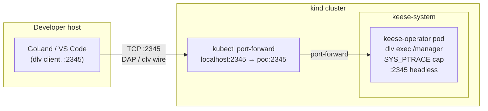

<!-- SPDX-License-Identifier: Apache-2.0 -->
<!-- Copyright (c) 2026 keese-ai -->

# IDE setup & debugging

Configure GoLand or VS Code for keese, attach a `dlv` debugger to the running operator in kind, and connect an ACP client to a live agent session — all without leaving your editor.

!!! info "Audience"
    Contributors developing or debugging the keese operator and agent runtimes. · **Prerequisites:** [Bootstrap a local cluster](bootstrap-local.md) · Go 1.24+ · `dlv` installed locally (`go install github.com/go-delve/delve/cmd/dlv@latest`).

---

## Overview

There are three debugging flows:

| Flow | What you debug | Tool |
|---|---|---|
| **A — Operator (dlv)** | Reconciler logic, webhook handlers | `dlv` remote attach via port-forward |
| **B — Agent session (ACP)** | Live agent conversation / tool calls | `kubectl-keese attach` → ACP protocol |
| **C — Python recipe extensions (debugpy)** | goose Python extensions inside the agent pod | `debugpy` remote attach |

All three are pre-wired by `make ide-config`, which stamps IDE config files into `.idea/` (GoLand) and `.vscode/` (VS Code) from the templates in `dev/ide/`.

!!! warning "Planned — not yet implemented"
    `kubectl-keese` (Flow B) and `keesectl auth login` are specified in
    [design 19](https://github.com/keese-ai/keese/blob/main/docs/designs/19-ide-and-debugging.md)
    but not yet shipped. Flow A (dlv attach) and `make ide-config` are implemented and
    work today. Flow C (debugpy) is specified but the debug agent image is not yet published.

---

## Step 1 — Stamp IDE configs

```bash
make ide-config
```

This is idempotent — it uses `rsync` to copy templates from `dev/ide/goland/` and
`dev/ide/vscode/` into `.idea/` and `.vscode/` respectively. Existing files are not
overwritten, so local overrides persist across runs.

After running, you will have:

- `.idea/runConfigurations/dlv-operator.run.xml` — GoLand "Go Remote" run configuration
- `.idea/runConfigurations/debugpy-agent.run.xml` — GoLand Python Remote (debugpy) config
- `.vscode/launch.json` — VS Code Go Remote + Python Remote launch configs
- `.vscode/settings.json` — stub `keese.acpWorkspace` setting

---

## Flow A — dlv attach to the operator

### How it works

The Tiltfile always builds the manager binary with `-gcflags='all=-N -l'` (no inlining,
no optimisation) and the `config/overlays/dev` Kustomize overlay opens container port
`2345` on the operator Deployment. Tilt also configures a port-forward from localhost:2345
to the pod automatically (see the `port_forwards` entry in the
[Tiltfile](https://github.com/keese-ai/keese/blob/main/Tiltfile#L99)).

The debug Deployment patch adds `capabilities.add: [SYS_PTRACE]` to the operator
container. `privileged: true` is **not** set — this satisfies zero-trust rule 05.11.
The patch is Kustomize-overlaid in `config/overlays/dev/kustomization.yaml` and never
reaches non-dev clusters.



### Start the debug loop

```bash
# 1. Start the full local stack (port-forward is handled automatically by Tilt)
tilt up

# 2. Verify the operator pod is running and port 2345 is reachable
kubectl get pods -n keese-system
kubectl port-forward -n keese-system deploy/keese-controller-manager 2345:2345 &
```

!!! note
    When Tilt manages the port-forward (the `port_forwards` entry in the Tiltfile), you do
    not need the manual `kubectl port-forward` command above. The manual form is provided
    as a fallback if you run the operator outside Tilt.

### GoLand

1. Open **Run → Edit Configurations**.
2. Select the pre-stamped **dlv-operator** configuration (Go Remote, host `localhost`, port `2345`).
3. Click **Debug** (Shift+F9). GoLand connects to the headless `dlv` process inside the pod.
4. Set breakpoints anywhere under `internal/controller/` or `api/`.

The run config sets source root to `$PROJECT_DIR` so breakpoints resolve correctly even
though the binary runs inside the container at `/manager`.

### VS Code

1. Open the **Run and Debug** panel (`Ctrl+Shift+D`).
2. Select **Go Remote (dlv operator)** from the launch configuration dropdown.
3. Press **F5**. The `substitutePath` entry in `.vscode/launch.json` maps the in-container
   `/ko-app/manager` root back to `${workspaceFolder}`.

### Detach without killing the process

Both GoLand and VS Code send a detach request when you stop the debug session. `dlv`
honours this and leaves the manager running. To fully stop, delete the port-forward
process or run `tilt down`.

---

## Flow B — ACP attach to agent sessions

!!! warning "Planned — not yet implemented"
    `kubectl-keese attach` and `keesectl auth login` are specified but not yet shipped.
    The `WorkspaceSession` CRD and controller are implemented; the CLI bridge is not.

Once the CLI is available, the attach flow will work as follows:

1. Authenticate: `keesectl auth login` exchanges your OIDC credentials for a short-lived
   JWT (TTL ≤ 10 minutes, auto-refreshed). Credentials are stored in
   `~/.keese/credentials.json`.
2. Attach: `kubectl-keese attach <workspace>` creates or reuses a `WorkspaceSession` CR
   and multiplexes ACP frames over `kubectl exec` — no new ports, no NetworkPolicy change.

Common session management commands:

| Intent | Command |
|---|---|
| Start or reuse the default session | `kubectl-keese attach <workspace>` |
| Start a named session | `kubectl-keese attach <workspace> --session=work-2` |
| List your sessions | `kubectl-keese sessions list <workspace>` |
| Terminate a named session | `kubectl-keese sessions delete <workspace> --session=work-2` |

Session lifecycle phases are tracked in `WorkspaceSession.status.phase`:
`Pending → Attaching → Active → Draining → Terminating`.

### Inspect a session directly with kubectl

While `kubectl-keese` is not yet available, you can inspect `WorkspaceSession` resources
directly:

```bash
# List all sessions in a namespace
kubectl get workspacesessions -n <tenant-ns>

# Describe a specific session
kubectl describe workspacesession <name> -n <tenant-ns>
```

Key status fields to watch:

| Field | Meaning |
|---|---|
| `status.phase` | Current lifecycle phase |
| `status.attachedClientCount` | Number of connected ACP clients |
| `status.attachedAt` | When the first client connected |
| `status.lastActivityAt` | Most recent ACP frame exchange |
| `status.podRef.name` | Backing Pod name |

---

## Flow C — debugpy for Python recipe extensions

!!! warning "Planned — not yet implemented"
    The debug agent image with `debugpy` pre-installed is not yet published.

When available, set `KEESE_DEBUGPY_PORT=5678` in the Tiltfile debug resource and run:

```bash
kubectl port-forward -n <tenant-ns> pod/<agent-pod> 5678:5678
```

Then attach using the **Python Remote (debugpy)** configuration in your IDE (pre-stamped
by `make ide-config`). GoLand's `goose --debug` flag emits verbose MCP-frame logging to
the structured OTEL log pipeline independently of debugpy.

---

## Workspace status debugging (no special tooling)

Even before attaching a debugger you can get a lot of signal from `kubectl describe`:

```bash
kubectl describe workspace <name> -n <tenant-ns>
```

Look for:

- `Status.Phase` — current lifecycle phase of the Workspace
- `Status.Conditions` — `Ready`, `AgentRunning`, `RecipeApplied` conditions with
  `lastTransitionTime` and `message`
- `Status.ObservedGeneration` vs `metadata.generation` — if they differ, the controller
  has not yet reconciled the latest spec change
- Events — controller events use typed reasons from
  [`internal/controller/keese/workspace/events.go`](https://github.com/keese-ai/keese/blob/main/internal/controller/keese/workspace/events.go)

```bash
# Stream controller logs while reproducing a bug
kubectl logs -n keese-system deploy/keese-controller-manager -f --since=5m
```

---

## Troubleshooting

| Symptom | Likely cause | Fix |
|---|---|---|
| `dlv` connection refused on port 2345 | Port-forward not running or pod restarting | Check `tilt up` output; verify `kubectl get pod -n keese-system` shows the manager pod as Running |
| Breakpoints not hit | Binary built with optimisations | Confirm Tiltfile uses `-gcflags='all=-N -l'` (it does by default in `compile-manager`) |
| Source not found in IDE | Source path mismatch | GoLand: verify source root is `$PROJECT_DIR`; VS Code: check `substitutePath` in `.vscode/launch.json` |
| `dlv: could not attach` | Missing `SYS_PTRACE` capability | Verify you are using the `config/overlays/dev` Kustomize overlay, not a production overlay |
| Session stuck in `Attaching` | Bridge sidecar not yet running | Check `kubectl describe workspacesession <name>` events; the pod backing the session must be `Running` |
| ACP version mismatch | Stale `kubectl-keese` binary | Upgrade `kubectl-keese` to match the bridge sidecar semver reported in the `UNSUPPORTED_VERSION` error |
| NetworkPolicy blocks port 2345 | Dev overlay NetworkPolicy | The dev overlay adds an explicit egress rule for port 2345/TCP from the `dev` namespace to `keese-system`; confirm the overlay is applied |

---

## See also

- [Bootstrap a local cluster (kind + Tilt)](bootstrap-local.md)
- [Create a workspace & attach a session](workspace-session.md)
- [Configure an agent runtime](configure-runtime.md)
- [Development environment (Nix)](../development/dev-environment.md)
