<!-- SPDX-License-Identifier: Apache-2.0 -->
<!-- Copyright (c) 2026 keese-ai -->

# Guides

Task-oriented how-to pages for everyone working with keese — from installing the operator
to writing your first agent recipe.

!!! info "Audience"
    All keese users. Tasks are grouped by role: **platform operator** (cluster-level install
    and operations), **tenant admin** (governance and provisioning within a cluster), and
    **agent developer** (workspaces, runtimes, recipes, memory, and workflows). · **Prerequisites:**
    [Concepts in 5 minutes](../getting-started/concepts-in-5-minutes.md) ·
    [Prerequisites](../getting-started/prerequisites.md)

---

## How to use this section

Each guide is self-contained. Read the role table below to find the right starting point,
then follow the "Next steps" links at the end of each guide to build from there.

```mermaid
flowchart TD
    A[/"You are..."/]

    A --> B["Platform Operator<br/>(cluster admin)"]
    A --> C["Tenant Admin<br/>(namespace owner)"]
    A --> D["Agent Developer<br/>(builder)"]

    B --> B1["Install via OLM"]
    B --> B2["Bootstrap a local cluster<br/>(kind + Tilt)"]
    B --> B3["Cloud deploy (OpenTofu)"]
    B --> B4["Backup & disaster recovery"]
    B --> B5["Observability setup (OTEL)"]
    B --> B6["Build & release"]

    C --> C1["Provision a tenant"]
    C --> C2["Configure egress credentials"]
    C --> C3["Cross-tenant agreements"]
    C --> C4["Set token budgets"]
    C --> C5["Define guardrails"]
    C --> C6["Toggle feature gates"]

    D --> D1["Create a workspace & session"]
    D --> D2["Configure an agent runtime"]
    D --> D3["Write & distribute a recipe"]
    D --> D4["Configure memory backends"]
    D --> D5["Set up RAG ingestion"]
    D --> D6["IDE setup & debugging"]

    style B fill:#1565c0,color:#fff,stroke:#1565c0
    style C fill:#6a1b9a,color:#fff,stroke:#6a1b9a
    style D fill:#1b5e20,color:#fff,stroke:#1b5e20
    style B1 fill:#1e88e5,color:#fff,stroke:#1e88e5
    style B2 fill:#1e88e5,color:#fff,stroke:#1e88e5
    style B3 fill:#1e88e5,color:#fff,stroke:#1e88e5
    style B4 fill:#1e88e5,color:#fff,stroke:#1e88e5
    style B5 fill:#1e88e5,color:#fff,stroke:#1e88e5
    style B6 fill:#1e88e5,color:#fff,stroke:#1e88e5
    style C1 fill:#8e24aa,color:#fff,stroke:#8e24aa
    style C2 fill:#8e24aa,color:#fff,stroke:#8e24aa
    style C3 fill:#8e24aa,color:#fff,stroke:#8e24aa
    style C4 fill:#8e24aa,color:#fff,stroke:#8e24aa
    style C5 fill:#8e24aa,color:#fff,stroke:#8e24aa
    style C6 fill:#8e24aa,color:#fff,stroke:#8e24aa
    style D1 fill:#43a047,color:#fff,stroke:#43a047
    style D2 fill:#43a047,color:#fff,stroke:#43a047
    style D3 fill:#43a047,color:#fff,stroke:#43a047
    style D4 fill:#43a047,color:#fff,stroke:#43a047
    style D5 fill:#43a047,color:#fff,stroke:#43a047
    style D6 fill:#43a047,color:#fff,stroke:#43a047
```

---

## Platform Operator

Cluster-level installation, infrastructure bootstrap, and ongoing operations.

| Guide | What it covers |
|---|---|
| [Install via OLM](install-olm.md) | Install keese from the OLM catalog; verify the CSV and CRDs are healthy |
| [Bootstrap a local cluster (kind + Tilt)](bootstrap-local.md) | `make kind-up` → `make bootstrap-infra` → `make tilt-up`; hot-reload the operator against a kind cluster |
| [Cloud deploy (OpenTofu)](cloud-deploy.md) | Provision cloud infra with the OpenTofu modules under `deploy/opentofu/` (AWS, GCP, Azure) |
| [Backup & disaster recovery](backup-dr.md) | Snapshot and restore OpenBao, OpenFGA, NATS JetStream, and PostgreSQL |
| [Observability setup (OTEL)](observability-setup.md) | Wire the OpenTelemetry collector to Elastic APM; set log and trace retention |

---

## Tenant Admin

Namespace-scoped governance: create tenants, set policies, and control what agents can do.

| Guide | What it covers |
|---|---|
| [Provision a tenant](provision-tenant.md) | Create a Capsule `Tenant`, bind an OIDC provider, assign namespace quotas |
| [Configure egress credentials](egress-credentials.md) | Create `BackendSecurityPolicy` entries in OpenBao; allow specific LLM backends for a tenant |
| [Cross-tenant agreements](cross-tenant-agreements.md) | Author a `CrossTenantAgreement` to let two tenants share a recipe or tool without sharing credentials |
| [Set token budgets](token-budgets.md) | Define `TokenBudget` objects that cap LLM spend per workspace or tenant per rolling window |
| [Define guardrails](guardrails.md) | Write a `GuardrailBinding` that attaches content and tool-use policies to a workspace |
| [Toggle feature gates](feature-gates.md) | Enable or disable capabilities at cluster or namespace scope using `FeatureGate` objects |

---

## Agent Developer

Day-to-day usage: build and run agent workloads.

| Guide | What it covers |
|---|---|
| [Create a workspace & attach a session](workspace-session.md) | Create a `Workspace`, start a `WorkspaceSession`, and verify the agent pod is running |
| [Configure an agent runtime](configure-runtime.md) | Choose and configure an `AgentRuntime` (goose today; ADK Python / Go planned) |
| [Write & distribute a recipe](recipes.md) | Author a `Recipe` manifest, version it, and attach it to a workspace |
| [Configure memory backends](memory-backends.md) | Pick a backend for the `Memory` CRD (SQLite, Redis, Qdrant, pgvector, Neo4j, Mem0, Zep) |
| [Set up RAG ingestion](rag-ingestion.md) | Ingest documents into a vector store and wire the knowledge base to an agent |
| [IDE setup & debugging](ide-debugging.md) | Attach GoLand or VS Code to a running controller or agent pod; use `kubectl debug` |

---

## Recommended starting paths

!!! tip "New to keese? Start here."
    1. [Concepts in 5 minutes](../getting-started/concepts-in-5-minutes.md) — understand the
       architecture in one read.
    2. [Bootstrap a local cluster](bootstrap-local.md) — get a working kind + Tilt environment.
    3. [Provision a tenant](provision-tenant.md) — create the namespace boundary.
    4. [Create a workspace & attach a session](workspace-session.md) — run your first agent.

!!! note "Production path"
    Skip `bootstrap-local.md` and go directly to [Install via OLM](install-olm.md) →
    [Cloud deploy (OpenTofu)](cloud-deploy.md) → [Observability setup](observability-setup.md).
    Harden with [token budgets](token-budgets.md), [guardrails](guardrails.md), and
    [egress credentials](egress-credentials.md) before sending real traffic.

---

## Next steps

- [Getting Started](../getting-started/index.md) — the hands-on tutorial from zero to first workflow.
- [Concepts](../concepts/index.md) — understand _why_ keese works the way it does before diving into advanced guides.
- [API reference](../reference/api/index.md) — full CRD schemas for the `keese.ai`, `authz.keese.ai`, and `policy.keese.ai` groups.
- [Scenarios](../scenarios/index.md) — end-to-end walkthroughs that string multiple guides together into a complete use case.
