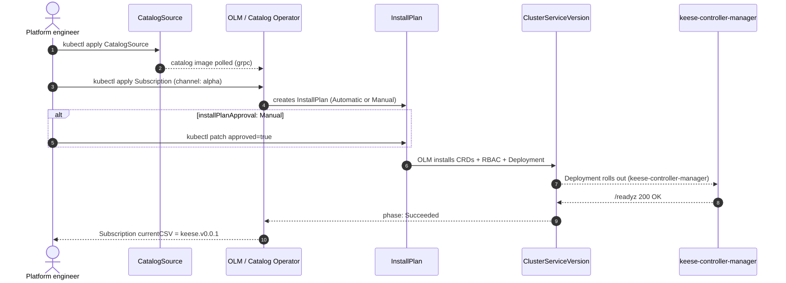
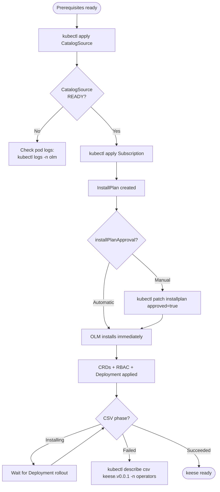

<!-- SPDX-License-Identifier: Apache-2.0 -->
<!-- Copyright (c) 2026 keese-ai -->

# Install via OLM

Install the keese operator into any Kubernetes cluster that already has Operator Lifecycle Manager running by pointing OLM at the keese File-Based Catalog (FBC) image and creating a Subscription.

!!! info "Audience"
    Platform engineers installing keese into a shared or staging cluster. · **Prerequisites:** [Bootstrap a local cluster (kind + Tilt)](bootstrap-local.md) covers the dev path; this page covers OLM-only installs on existing clusters.

## Overview

OLM manages the full lifecycle: discovery via a `CatalogSource`, version selection via a `Subscription`, automated or manual approval via an `InstallPlan`, and steady-state via the `ClusterServiceVersion` (CSV). The sequence below shows what OLM does after you apply the two resources in this guide.



## Prerequisites

Install these components before applying the `CatalogSource`. All of them are declared as OLM GVK dependencies in the keese bundle (see [`docs/designs/14b-olm-dependencies.md`](https://github.com/keese-ai/keese/blob/main/docs/designs/14b-olm-dependencies.md)).

| Component | Minimum version | Notes |
|---|---|---|
| Kubernetes | 1.30.0 | `minKubeVersion` set in the CSV |
| OLM | 0.28+ | Provides `operators.coreos.com` API group |
| cert-manager | 1.14+ | Required for webhook CA injection |
| Capsule | 0.7+ | Namespace/tenant isolation |
| Envoy Gateway | 1.2+ | Egress AI Gateway; `gateway.envoyproxy.io` CRDs |
| NATS JetStream | 2.10+ (NACK) | `jetstream.nats.io` CRDs; see [NATS streams](#step-2-seed-nats-streams) |
| OpenFGA | 1.5+ | ReBAC store; see [Seed the OpenFGA store](#step-1-seed-the-openfga-store) |

!!! warning "Alpha maturity"
    keese `v0.0.1` ships on the `alpha` channel. The `stable` and `candidate` channels defined in [`docs/designs/14a-olm-channels-upgrades.md`](https://github.com/keese-ai/keese/blob/main/docs/designs/14a-olm-channels-upgrades.md) are reserved for future releases once the operator reaches a soak period. Do not run `alpha` in production without understanding the alpha-maturity caveats.

## Step 1 — Seed the OpenFGA store

keese's authorization pipeline (ReBAC) requires an OpenFGA store to be seeded with the authorization model before the operator starts. Without the store ID and model ID, the controller cannot write tuples on behalf of tenants.

Apply the seed manifests from the repo:

```bash
kubectl apply -k https://github.com/keese-ai/keese/dev/bootstrap/openfga/seed
```

The seed Job (`dev/bootstrap/openfga/seed.yaml`) is idempotent: it checks the `openfga-config` ConfigMap in the `openfga` namespace before creating a new store. It patches two ConfigMaps — one in `openfga`, one mirrored in `keese-system` — with the resolved `store_id` and `authorization_model_id`. Wait for the Job to complete:

```bash
kubectl wait --for=condition=complete job/openfga-seed -n openfga --timeout=120s
```

Verify the IDs are populated:

```bash
kubectl get configmap openfga-config -n keese-system \
  -o jsonpath='{.data.store_id}{"\n"}{.data.authorization_model_id}{"\n"}'
# <store-id>
# <model-id>
```

!!! danger "Empty store_id blocks the operator"
    If `store_id` is empty the keese operator will fail to reconcile any tenant or workspace. Confirm the seed Job completed successfully before proceeding.

## Step 2 — Seed NATS streams

The NATS JetStream `AGENT_MSG` stream and `workflow-runner` consumer must exist before the operator starts, because the Workflow and WorkflowRun reconcilers expect them. The stream definition lives in `dev/bootstrap/nats/streams.yaml` (subjects `agent.>` and `workspace.*.msg.>`, 24h retention, 1 GiB cap).

```bash
kubectl apply -f https://raw.githubusercontent.com/keese-ai/keese/main/dev/bootstrap/nats/streams.yaml
```

Wait for the stream to become ready:

```bash
kubectl get stream agent-msg -n nats
# NAME        READY   AGE
# agent-msg   True    30s
```

## Step 3 — Create the CatalogSource

The `CatalogSource` tells OLM where to pull the File-Based Catalog image that describes all available keese bundle versions. Replace `<catalog-image>` with the digest-pinned image reference published by the keese release pipeline (see [build-release](../development/build-release.md) for how catalog images are produced and signed).

```yaml
apiVersion: operators.coreos.com/v1alpha1
kind: CatalogSource
metadata:
  name: keese-catalog
  namespace: olm
spec:
  sourceType: grpc
  image: ghcr.io/keese-ai/keese-catalog:latest   # pin to a digest in production
  displayName: keese
  publisher: keese-ai
  updateStrategy:
    registryPoll:
      interval: 10m
```

```bash
kubectl apply -f keese-catalogsource.yaml
```

Wait for the CatalogSource to become ready:

```bash
kubectl get catalogsource keese-catalog -n olm
# NAME            DISPLAY   TYPE   PUBLISHER   AGE   READY
# keese-catalog   keese     grpc   keese-ai    45s   True
```

!!! warning "Catalog image not yet published"
    As of v0.0.1 the FBC catalog image pipeline is not yet wired into the release workflow. Until it is, use the local catalog built by `make catalog-build catalog-push` or the [kind + Tilt bootstrap path](bootstrap-local.md) instead.

## Step 4 — Create the Subscription

The `Subscription` pins the channel and the install-plan approval mode. The only available channel right now is `alpha` (declared in `bundle/metadata/annotations.yaml`).

```yaml
apiVersion: operators.coreos.com/v1alpha1
kind: Subscription
metadata:
  name: keese
  namespace: operators
spec:
  channel: alpha
  name: keese
  source: keese-catalog
  sourceNamespace: olm
  installPlanApproval: Manual   # change to Automatic for dev clusters
  startingCSV: keese.v0.0.1
```

```bash
kubectl apply -f keese-subscription.yaml
```

!!! tip "InstallPlanApproval choices"
    Use `Manual` on shared or staging clusters so you can review CRD diffs before each upgrade. Use `Automatic` only on ephemeral dev clusters. The `stable` channel (not yet promoted) will require `Manual` by design — see [`docs/designs/14a-olm-channels-upgrades.md` §1](https://github.com/keese-ai/keese/blob/main/docs/designs/14a-olm-channels-upgrades.md).

## Step 5 — Approve the InstallPlan

With `Manual` approval, OLM creates an `InstallPlan` but waits for your explicit approval.

Find and approve the InstallPlan:

```bash
# Find the pending plan
PLAN=$(kubectl get installplan -n operators \
  -o jsonpath='{.items[?(@.spec.approved==false)].metadata.name}')
echo "Approving: $PLAN"

# Review what will be installed
kubectl get installplan "$PLAN" -n operators -o yaml | grep -A5 clusterServiceVersionNames

# Approve
kubectl patch installplan "$PLAN" -n operators \
  --type merge \
  --patch '{"spec":{"approved":true}}'
```

## Step 6 — Watch the CSV reach Succeeded

OLM installs the CRDs, ClusterRole/ClusterRoleBinding, ServiceAccount, and finally the `keese-controller-manager` Deployment. Track progress:

```bash
kubectl get csv -n operators -w
# NAME            DISPLAY   VERSION   REPLACES   PHASE
# keese.v0.0.1   keese     0.0.1                Installing
# keese.v0.0.1   keese     0.0.1                Succeeded
```

Confirm the operator pod is running:

```bash
kubectl get pods -n operators -l control-plane=controller-manager
# NAME                                      READY   STATUS    RESTARTS   AGE
# keese-controller-manager-<id>            1/1     Running   0          60s
```

The full install sequence looks like this, end to end:



## Verify the install

```bash
# All keese CRDs present (expect 20)
kubectl get crds | grep -E '(keese\.ai|policy\.keese\.ai|authz\.keese\.ai)' | wc -l

# Operator healthy
kubectl get deployment keese-controller-manager -n operators
# NAME                       READY   UP-TO-DATE   AVAILABLE
# keese-controller-manager   1/1     1            1

# Smoke: create a minimal Tenant
kubectl apply -f - <<'EOF'
apiVersion: keese.ai/v1alpha1
kind: Tenant
metadata:
  name: smoke-tenant
spec:
  adminSubjects:
    - kind: User
      name: admin@example.com
EOF
kubectl wait tenant smoke-tenant --for=condition=Ready --timeout=30s
kubectl delete tenant smoke-tenant
```

## Upgrade

When a new CSV is published on the `alpha` channel:

1. OLM detects it via the catalog poll interval (10m default).
2. A new `InstallPlan` is created. With `Manual` approval, it waits for your `kubectl patch`.
3. Review the CRD diff against the previous CSV before approving — OLM updates CRDs in-place.
4. Approve and watch the new CSV reach `Succeeded`.

For rollback instructions and the `skipRange` hotfix process, see [`docs/designs/14a-olm-channels-upgrades.md` §5–6](https://github.com/keese-ai/keese/blob/main/docs/designs/14a-olm-channels-upgrades.md).

## Uninstall

```bash
kubectl delete subscription keese -n operators
kubectl delete csv keese.v0.0.1 -n operators
kubectl delete catalogsource keese-catalog -n olm

# Remove CRDs (destructive — deletes all keese custom resources)
kubectl get crds -o name | grep -E '(keese\.ai|policy\.keese\.ai|authz\.keese\.ai)' \
  | xargs kubectl delete
```

!!! danger "CRD deletion is irreversible"
    Deleting the CRDs removes all `Workspace`, `WorkspaceSession`, `Tenant`, `Memory`, and related objects cluster-wide. Back up critical resources before running the uninstall commands above.

## See also

- [Bootstrap a local cluster (kind + Tilt)](bootstrap-local.md) — the fastest path for development and testing
- [Provision a tenant](provision-tenant.md) — first steps after the operator is running
- [Build & release (OLM + cosign)](../development/build-release.md) — how bundle and catalog images are produced
- [Concepts: Architecture overview](../concepts/architecture.md) — understand what the operator manages
