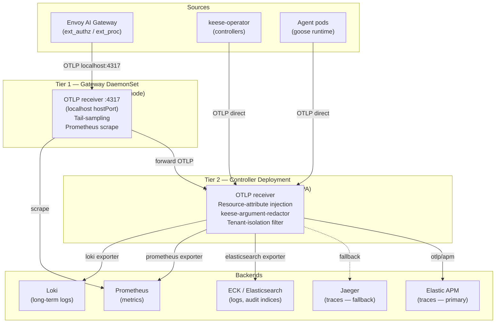

<!-- SPDX-License-Identifier: Apache-2.0 -->
<!-- Copyright (c) 2026 keese-ai -->

# Observability setup (OTEL)

Stand up the OpenTelemetry pipeline that routes traces, logs, and metrics from every keese component to Elastic APM and ECK, and learn which metrics feed the token-accounting and authorization layers.

!!! info "Audience"
    Platform operators bootstrapping or troubleshooting the keese observability stack.
    **Prerequisites:** [Bootstrap a local cluster (kind + Tilt)](bootstrap-local.md) ·
    [concepts/observability](../concepts/observability.md)

---

## Pipeline overview

keese uses a **two-tier OpenTelemetry Collector** topology (design
[`10a`](https://github.com/keese-ai/keese/blob/main/docs/designs/10a-otel-topology.md)).
Every component — the operator controllers, Envoy AI Gateway, `keese-authz`, and
agent runtime pods — emits OTLP telemetry. Tier 1 receives spans from gateway-collocated
pods on the same node; Tier 2 aggregates everything, applies tenant isolation, and fans
out to long-term backends.



!!! warning "Collector release currently disabled"
    The Helmfile release block for `otel-collector` is **commented out** in
    [`dev/bootstrap/helmfile.yaml`](https://github.com/keese-ai/keese/blob/main/dev/bootstrap/helmfile.yaml)
    (lines 267–274). The reason: the upstream chart `0.112.0` dropped the default value
    for `image.repository`; the chart fails to render without an explicit value.
    **ECK is installed, but the collector bridge to it is offline.**
    Traces, logs, and metrics do not flow in the current dev cluster.
    See [re-enabling the collector](#re-enabling-the-collector) below.

---

## Tier 1 — Gateway DaemonSet

**Name:** `keese-otel-gateway` | **Namespace:** `observability`

One pod runs per node. Envoy AI Gateway and `keese-authz` pods emit OTLP to
`localhost:4317` via the DaemonSet `hostPort`. Co-location is a correctness
requirement for tail sampling — cross-node span assembly produces split traces.

Configured resources: 1 vCPU / 2 Gi request; 2 vCPU / 4 Gi limit.

Pipelines:

| Pipeline | Processors | Exporters |
|---|---|---|
| `traces` | `memory_limiter`, `resource`, `tail_sampling`, `batch` | forward OTLP → Tier 2 |
| `metrics` | `memory_limiter`, `resource`, `batch` | Prometheus |
| `logs` | `memory_limiter`, `resource`, `batch` | Elasticsearch + Loki |

### Tail-sampling policy

```yaml
tail_sampling:
  decision_wait: 10s
  num_traces: 50000      # prod; 10 000 for Tier 2 controller tier
  policies:
    - name: sample-errors
      type: status_code
      status_code: { status_codes: [ERROR] }
    - name: probabilistic-sample
      type: probabilistic
      probabilistic: { sampling_percentage: 1 }   # prod; 10% in dev
```

All error spans, slow spans (p95 > 2× SLO), and budget-exhausted / force-revoke spans
are kept at 100%. Normal traffic is probabilistically sampled. Buffer evicts oldest
traces on overflow before accepting new ones.

---

## Tier 2 — Controller Deployment

**Name:** `keese-otel-controller` | **Service:** `keese-otel-controller.keese-system.svc.cluster.local:4317`

Three replicas with HPA on memory utilization (80%) and PDB `minAvailable: 2`.
This is the aggregation point for all sources that are not Envoy-collocated:
operator controllers, agent pods, and Tier 1 forwarders.

Tier 2 adds three processing steps not present in Tier 1:

1. **Resource-attribute injection** — stamps `keese.tenant`, `keese.workspace`, `keese.sa`
   from the `x-keese-tenant` / `x-keese-workspace` headers that `ext_authz` places on
   every span.
2. **`keese-argument-redactor` processor** — when a span name is `keese.mcp.tool_call`
   and the owning tenant has `spec.auditArgumentsRedacted: true`, forwards the
   `mcp.arguments` field to a Presidio sidecar; replaces it with
   `mcp.arguments.redacted`. If Presidio is unavailable, the attribute is dropped
   entirely (rule 05.10 — no tokens or request bodies ever reach logs).
3. **Tenant-isolation filter** — any span still missing `keese.tenant` after injection
   is routed to `keese-discard-*` indices; counter
   `keese_otel_discard_total{reason="missing_tenant"}` increments and a
   `MissingTenantAttribute` warning is logged.

### Mandatory resource attributes

Every span that leaves Tier 2 carries:

| Attribute | Source |
|---|---|
| `service.name` | Binary constant: `keese-operator`, `keese-authz`, `goose-runtime` |
| `service.version` | Semver via `ldflags -X` |
| `service.instance.id` / `k8s.pod.uid` | Downward API |
| `k8s.namespace.name` / `k8s.pod.name` | Downward API |
| `keese.tenant` | Tier 2 processor from `x-keese-tenant` |
| `keese.workspace` | Tier 2 processor from `x-keese-workspace` (workspace pods only) |
| `keese.sa` | `ksa-<workspace-uid>` from SA name (workspace pods only) |
| `deployment.environment` | ConfigMap `keese-otel-env` key `env` |

---

## Fan-out destinations

| Destination | Pipeline | Index / stream | Retention |
|---|---|---|---|
| Elastic APM | Traces (Tier 2, primary) | — | 30-day hot, 90-day warm |
| Jaeger | Traces (Tier 2, fallback) | — | 7-day |
| ES `keese-openfga-audit-*` | Logs (Tier 1+2) | ILM | 30-day |
| ES `keese-revocation-audit-*` | Logs (Tier 1+2) | ILM | 30-day |
| ES `keese-mcp-audit-*` | Logs (Tier 2) | ILM | 30-day |
| ES `keese-workspace-audit-*` | Logs (Tier 2) | ILM | 30-day |
| ES `keese-discard-*` | Logs (Tier 2, discards) | ILM | 7-day |
| Loki `{job=keese-*}` | Logs (Tier 1+2) | object storage | ≥ 1 year |
| Prometheus | Metrics (Tier 1+2) | — | 30-day |

Kibana surfaces one Space per tenant; the Tenant controller writes the ES role
`keese-tenant-<T>-viewer` via SSA (`fieldOwner: keese-tenant-controller`), granting
`read` on `keese-*-audit-*` with document-level security
`{"term":{"keese.tenant":"<T>"}}`.

### APM fallback chain

Primary exporter: `otlp/apm` → `keese-apm-apm-http.elastic-system.svc.cluster.local:8200`.
Bearer token sourced from OpenBao path `kv/keese/system/apm-token` via ExternalSecret.

Fallback triggers when `otelcol_exporter_send_failed_spans_total{exporter="apm"} > 0`
for 30 consecutive seconds, or APM liveness returns non-200 for 3 checks:

1. Jaeger `jaeger-collector.elastic-system.svc:14268` (if deployed)
2. Debug exporter (dev only)
3. Drop with counter `keese_otel_traces_dropped_total{reason="no_exporter"}` and
   event `APMExportDegraded`

Recovery: 5 minutes of clean APM exports restores the primary. Override any step with
annotation `keese.ai/force-exporter=apm|jaeger|debug` on the collector ConfigMap.

---

## Token-accounting metrics

Prometheus is the authoritative store for token consumption. The Envoy AI Gateway
token-cost filter writes:

```
keese_token_budget_consumed_total{tenant, workspace, model, direction}
```

`direction` is `input` or `output`. This counter reaches Prometheus through the Tier 1
metrics pipeline. The `TokenBudget` controller queries it every 10 seconds via
`sum(increase(keese_token_budget_consumed_total{...}[<windowDuration>]))`.

See [concepts/observability](../concepts/observability.md) for the full accounting
model, and [guides/token-budgets.md](token-budgets.md) for step-by-step setup.

---

## OIDCProvider controller metrics

The `OIDCProvider` controller in `authz.keese.ai` emits these Prometheus counters and
histograms (registered via `promauto` at
[`internal/controller/authz/oidcprovider_controller.go`](https://github.com/keese-ai/keese/blob/main/internal/controller/authz/oidcprovider_controller.go)):

| Metric | Type | Labels | Meaning |
|---|---|---|---|
| `keese_oidc_template_eval_errors_total` | Counter | `provider, template, reason` | Template parse failures (subject or audience template) |
| `keese_oidc_audience_template_eval_total` | Counter | `provider, template, result` | Audience template evaluation outcomes |
| `keese_oidc_token_rotation_seconds` | Histogram | `provider, template` | Observed token rotation durations |
| `keese_gateway_jwks_fetch_failures_total` | Counter | `provider` | JWKS endpoint probe failures |
| `keese_oidc_cache_invalidations_total` | Counter | `provider, trigger` | Cache-flush signals sent to gateway pods |

The JWKS endpoint is re-probed every 5 minutes regardless of spec changes
(`requeueJWKSInterval`). A `JWKSReachable` condition is maintained independently of the
`Ready` condition; template validity and JWKS reachability are decoupled.

!!! note "keese-authz emits no Prometheus metrics"
    These counters are registered in the operator binary's Prometheus registry
    (controller-runtime exposes the registry on the operator `metrics-bind-address` port,
    default `:8080`). The `keese-authz` ext_authz binary (`cmd/keese-authz/`) runs as a
    separate gRPC Deployment on `:9001` but has `BindAddress='0'` (metrics endpoint
    disabled); it emits audit log entries only. The `authz.keese.ai` controllers
    (`OIDCProvider`, `CrossTenantAgreement`) do not emit OTEL spans; their observability
    is limited to Kubernetes events and controller-runtime structured logs.

---

## Deriving keese-authz allow/deny rates

`keese-authz` emits no Prometheus counters (`BindAddress='0'` disables the metrics
endpoint per `cmd/keese-authz/main.go`). Allow and deny rates must be derived from its
structured audit log. The ext_authz process logs one structured entry per decision with
fields `(tuple, SA, host, decision, upstream_status)` — never tokens or request bodies
(rule 05.10).

Query pattern against the `keese-openfga-audit-*` Elasticsearch index:

```json
{
  "aggs": {
    "by_tenant": {
      "terms": { "field": "keese.tenant" },
      "aggs": {
        "allow": {
          "filter": { "term": { "decision": "allow" } }
        },
        "deny": {
          "filter": { "term": { "decision": "deny" } }
        }
      }
    }
  },
  "query": {
    "range": { "@timestamp": { "gte": "now-1h" } }
  }
}
```

In Kibana, use the `keese-openfga-audit-*` data view (one per tenant Space) and the
`decision` field to build a Lens visualization. The `keese_otel_discard_total` counter
gives a cross-check: discards with `reason="missing_tenant"` indicate spans that escaped
the tenant filter and should be investigated.

---

## Re-enabling the collector

The Helmfile release block is ready to restore. Follow these steps once the
`image.repository` issue is resolved:

**1. Edit the Helmfile to uncomment the release.**

In `dev/bootstrap/helmfile.yaml`, replace the commented block (lines 267–274) with:

```yaml
- name: otel-collector
  namespace: observability
  createNamespace: true
  chart: open-telemetry/opentelemetry-collector
  version: 0.112.0
  needs: [elastic-system/eck-operator]
  values:
    - values/otel-collector.yaml
```

**2. Add the required `image.repository` key to the values file.**

```yaml
# dev/bootstrap/values/otel-collector.yaml (add at top level)
image:
  repository: otel/opentelemetry-collector-k8s
```

**3. Populate the required secrets.**

The values file references two environment variables that the Helm chart passes to the
collector as Kubernetes Secret env vars:

```bash
# Obtain the ECK elastic password
ELASTIC_PASSWORD=$(kubectl get secret keese-es-es-elastic-user \
  -n elastic-system -o jsonpath='{.data.elastic}' | base64 -d)

# Obtain the APM token from OpenBao (seed it first if absent)
APM_TOKEN=$(vault kv get -field=token kv/keese/system/apm-token)
```

Create a Kubernetes Secret in the `observability` namespace:

```yaml
apiVersion: v1
kind: Secret
metadata:
  name: otel-collector-credentials
  namespace: observability
stringData:
  ELASTIC_PASSWORD: "<value from above>"
  APM_TOKEN: "<value from above>"
```

Reference this Secret from the collector Deployment by adding to the Helm values:

```yaml
extraEnvs:
  - name: ELASTIC_PASSWORD
    valueFrom:
      secretKeyRef:
        name: otel-collector-credentials
        key: ELASTIC_PASSWORD
  - name: APM_TOKEN
    valueFrom:
      secretKeyRef:
        name: otel-collector-credentials
        key: APM_TOKEN
```

**4. Sync and verify.**

```bash
helmfile -f dev/bootstrap/helmfile.yaml sync --selector name=otel-collector

# Confirm the collector pod is running
kubectl get pods -n observability

# Send a test span via grpcurl or the otelcol debug exporter
kubectl logs -n observability -l app.kubernetes.io/name=opentelemetry-collector \
  --tail=50 | grep -E "ScopeSpans|ResourceSpans"
```

**5. Verify Prometheus scrape.**

```bash
# Port-forward Prometheus (if installed via kube-prometheus-stack)
kubectl port-forward svc/prometheus-operated 9090 -n monitoring

# Check for keese_token_budget_consumed_total
curl -s 'localhost:9090/api/v1/query?query=keese_token_budget_consumed_total' \
  | jq '.data.result | length'
```

---

## Failure modes

| Failure | Detection | Mitigation |
|---|---|---|
| APM exporter down | `otelcol_exporter_send_failed_spans_total{exporter="apm"} > 0` for 30 s | Fallback chain; `APMExportDegraded` event |
| Tier 1 pod crash | Node-level trace gap | DaemonSet self-heals; brief gap is acceptable |
| Tier 2 pod crash | Span drops | PDB `minAvailable: 2` + HPA; OTLP SDK retries with backoff |
| Presidio crash | `keese_otel_redactor_unavailable_total` increments | Drop `mcp.arguments` entirely; `AuditRedactionUnavailable` event; spans still exported |
| Tail-buffer overflow | `tail_sampling_cache_size` metric | Evict oldest traces; alert `OTELTailBufferFull`; scale Tier 1 |
| Span missing `keese.tenant` | `keese_otel_discard_total{reason="missing_tenant"}` | Route to `keese-discard-*`; ops review required |
| SIGKILL before flush | Span loss | Audit spans use SDK `ForceFlush` + `Shutdown` on SIGTERM; SIGKILL loss is documented and accepted |
| JWKS fetch failure | `keese_gateway_jwks_fetch_failures_total` counter; `JWKSReachable=False` condition | Provider remains Active; JWKS re-probed every 5 minutes |

---

## Rollback

The collector ConfigMap `otel-collector-config` is patched via SSA
(`fieldOwner: keese-otel-controller`). To roll back a pipeline change:

```bash
# Revert the helmfile.lock pin
git revert <commit-sha>

# Re-apply the bootstrap
make bootstrap-infra

# Override the exporter for emergency debugging
kubectl annotate configmap otel-collector-config \
  -n observability \
  keese.ai/force-exporter=debug
```

A rolling restart picks up the reverted ConfigMap within one reconcile.

---

## See also

- [concepts/observability](../concepts/observability.md) — token accounting model, OTEL topology reference, failure table
- [guides/token-budgets.md](token-budgets.md) — create a `TokenBudget`, verify consumption, test exhaustion
- [guides/bootstrap-local.md](bootstrap-local.md) — full local cluster setup including ECK
- [reference/metrics-events.md](../reference/metrics-events.md) — complete metric and event catalog
